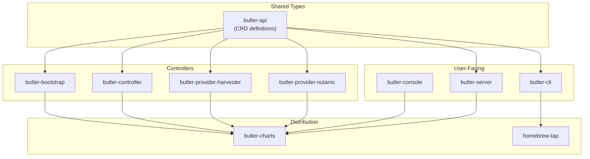

# Butler Components

This document provides the authoritative registry of all repositories in the Butler ecosystem.

## Table of Contents

- [Core Components](#core-components)
- [Infrastructure Providers](#infrastructure-providers)
- [Distribution](#distribution)
- [Status Definitions](#status-definitions)
- [Dependency Graph](#dependency-graph)
- [Container Images](#container-images)
- [Adding New Components](#adding-new-components)

---

## Core Components

| Component | Repository | Purpose | Language | Maintainer | Status |
|-----------|------------|---------|----------|------------|--------|
| Butler API | [butler-api](https://github.com/butlerdotdev/butler-api) | Shared CRD type definitions (v1alpha1) | Go | @core-maintainers | Stable |
| Butler Controller | [butler-controller](https://github.com/butlerdotdev/butler-controller) | TenantCluster, Team, ManagementAddon reconciliation | Go | @core-maintainers | Stable |
| Butler Bootstrap | [butler-bootstrap](https://github.com/butlerdotdev/butler-bootstrap) | Management cluster bootstrap via KIND orchestration | Go | @core-maintainers | Stable |
| Butler CLI | [butler-cli](https://github.com/butlerdotdev/butler-cli) | `butleradm` (operators) and `butlerctl` (users) | Go | @core-maintainers | Stable |
| Butler Console | [butler-console](https://github.com/butlerdotdev/butler-console) | Web UI frontend (React + TypeScript + Vite) | TypeScript | @console-maintainers | Beta |
| Butler Server | [butler-server](https://github.com/butlerdotdev/butler-server) | Console backend API (Go + Chi + WebSocket) | Go | @console-maintainers | Beta |
| Butler Charts | [butler-charts](https://github.com/butlerdotdev/butler-charts) | Helm charts for all Butler components | Helm | @core-maintainers | Stable |

---

## Infrastructure Providers

| Provider | Repository | Infrastructure | CAPI Provider | Maintainer | Status |
|----------|------------|----------------|---------------|------------|--------|
| Harvester | [butler-provider-harvester](https://github.com/butlerdotdev/butler-provider-harvester) | Harvester HCI | KubeVirt (capk) | @provider-maintainers | Stable |
| Nutanix | [butler-provider-nutanix](https://github.com/butlerdotdev/butler-provider-nutanix) | Nutanix AHV | CAPX v1.4.0 | @provider-maintainers | Stable |
| Proxmox | butler-provider-proxmox | Proxmox VE | TBD | @provider-maintainers | Planned |

---

## Distribution

| Component | Repository | Purpose | Maintainer | Status |
|-----------|------------|---------|------------|--------|
| Homebrew Tap | [homebrew-tap](https://github.com/butlerdotdev/homebrew-tap) | macOS/Linux CLI installation | @core-maintainers | Stable |
| Chocolatey | [chocolatey](https://community.chocolatey.org/packages/butler-cli) | Windows CLI installation | @core-maintainers | Stable |
---

## Status Definitions

| Status | Definition |
|--------|------------|
| **Stable** | Production-ready. Follows semantic versioning. Breaking changes require major version bump. |
| **Beta** | Feature-complete. May have breaking changes in minor versions. Suitable for non-critical use. |
| **Alpha** | Experimental. Breaking changes expected. Not recommended for production. |
| **Planned** | Not yet implemented. Design phase or roadmap item. |

---

## Dependency Graph

---

## Container Images

All images are published to GitHub Container Registry (GHCR):

| Image | Repository | Multi-arch |
|-------|------------|------------|
| `ghcr.io/butlerdotdev/butler-bootstrap` | butler-bootstrap | amd64, arm64 |
| `ghcr.io/butlerdotdev/butler-controller` | butler-controller | amd64, arm64 |
| `ghcr.io/butlerdotdev/butler-server` | butler-server | amd64, arm64 |
| `ghcr.io/butlerdotdev/butler-console` | butler-console | amd64, arm64 |
| `ghcr.io/butlerdotdev/butler-provider-harvester` | butler-provider-harvester | amd64, arm64 |
| `ghcr.io/butlerdotdev/butler-provider-nutanix` | butler-provider-nutanix | amd64, arm64 |

### Helm Charts (OCI)

Charts are published as OCI artifacts:

| Chart | OCI URL | Source |
|-------|---------|--------|
| butler-crds | `oci://ghcr.io/butlerdotdev/charts/butler-crds` | [source](https://github.com/butlerdotdev/butler-charts/tree/main/charts/butler-crds) |
| butler-controller | `oci://ghcr.io/butlerdotdev/charts/butler-controller` | [source](https://github.com/butlerdotdev/butler-charts/tree/main/charts/butler-controller) |
| butler-bootstrap | `oci://ghcr.io/butlerdotdev/charts/butler-bootstrap` | [source](https://github.com/butlerdotdev/butler-charts/tree/main/charts/butler-bootstrap) |
| butler-console | `oci://ghcr.io/butlerdotdev/charts/butler-console` | [source](https://github.com/butlerdotdev/butler-charts/tree/main/charts/butler-console) |
| butler-addons | `oci://ghcr.io/butlerdotdev/charts/butler-addons` | [source](https://github.com/butlerdotdev/butler-charts/tree/main/charts/butler-addons) |
| butler-provider-harvester | `oci://ghcr.io/butlerdotdev/charts/butler-provider-harvester` | [source](https://github.com/butlerdotdev/butler-charts/tree/main/charts/butler-provider-harvester) |
| butler-provider-nutanix | `oci://ghcr.io/butlerdotdev/charts/butler-provider-nutanix` | [source](https://github.com/butlerdotdev/butler-charts/tree/main/charts/butler-provider-nutanix) |

---

## Core CRDs

All CRDs are defined in `butler-api` and distributed via the `butler-crds` Helm chart:

### Bootstrap CRDs

| CRD | API Group | Scope | Purpose |
|-----|-----------|-------|---------|
| `ClusterBootstrap` | butler.butlerlabs.dev | Namespaced | Management cluster lifecycle |
| `MachineRequest` | butler.butlerlabs.dev | Namespaced | VM provisioning requests |
| `ProviderConfig` | butler.butlerlabs.dev | Namespaced | Infrastructure credentials |

### Platform CRDs

| CRD | API Group | Scope | Purpose |
|-----|-----------|-------|---------|
| `ButlerConfig` | butler.butlerlabs.dev | Cluster | Platform configuration singleton |
| `Team` | butler.butlerlabs.dev | Cluster | Multi-tenant team isolation |
| `User` | butler.butlerlabs.dev | Cluster | User accounts (local + SSO) |
| `TenantCluster` | butler.butlerlabs.dev | Namespaced | Tenant cluster lifecycle |
| `TenantAddon` | butler.butlerlabs.dev | Namespaced | Per-cluster addon installation |
| `ManagementAddon` | butler.butlerlabs.dev | Cluster | Management cluster components |
| `AddonDefinition` | butler.butlerlabs.dev | Cluster | Addon catalog entries |
| `IdentityProvider` | butler.butlerlabs.dev | Cluster | SSO/OIDC configuration |

---

## Adding New Components

To add a new component to the Butler ecosystem:

1. **Create the repository** following Butler conventions:
   - Apache 2.0 license
   - DCO sign-off required
   - Standard GitHub templates
   - CI/CD via GitHub Actions

2. **Open a PR to this repo** updating:
   - This file (`COMPONENTS.md`)
   - `ecosystem.yaml` (machine-readable registry)
   - Relevant documentation in `docs/`

3. **Core maintainers review** for:
   - Naming conventions
   - CI/CD setup
   - Documentation standards
   - License compliance
   - Architectural fit

4. **Merge and announce** in release notes

See [CONTRIBUTING.md](CONTRIBUTING.md) for detailed contribution guidelines.
