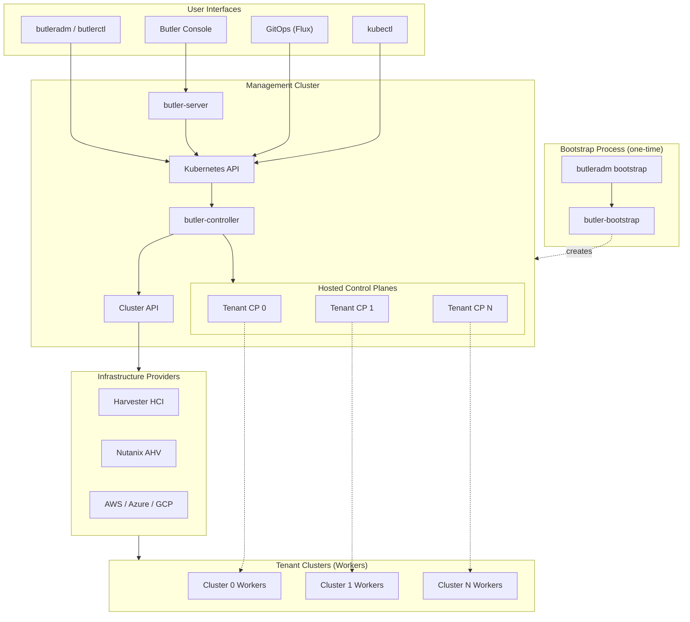

# Butler

<p align="center">
  
</p>

<p align="center">
  <strong>Kubernetes as a Service multi-cluster management platform</strong>
</p>

<p align="center">
  <a href="https://github.com/butlerdotdev/butler-controller/releases"></a>
  <a href="https://github.com/butlerdotdev/butler-cli/releases"></a>
  <a href="https://github.com/butlerdotdev/butler/blob/main/LICENSE"></a>
  <a href="https://github.com/butlerdotdev/butler/stargazers"></a>
</p>

---

## Table of Contents

- [What is Butler?](#what-is-butler)
- [Key Features](#key-features)
- [Architecture](#architecture)
- [Quick Start](#quick-start)
- [Components](#components)
- [Documentation](#documentation)
- [Contributing](#contributing)
- [Community](#community)
- [License](#license)

---

## What is Butler?

Butler is an open-source Kubernetes as a Service multi-cluster management platform that enables organizations to provision and manage tenant clusters across any infrastructure, whether on-premises or cloud. Built by [Butler Labs](https://butlerlabs.dev), Butler takes a Kubernetes-native approach using CRDs and operators rather than custom APIs and databases.

**Target Users:**
- **Homelabbers** learning Kubernetes with reduced infrastructure overhead
- **Platform Engineers** building Internal Developer Platforms (IDPs)
- **Series B+ startups** needing Kubernetes-as-a-Service without dedicated platform teams
- **Mid-market enterprises** (50-500 engineers) modernizing infrastructure
- **Large enterprises** driving containerization and hybrid multi cloud initiatives
- **Edge deployments** running lightweight clusters at remote sites

**Butler vs. Alternatives:**

| Feature | Butler | Rancher | Managed K8s (EKS/GKE/AKS) |
|---------|--------|---------|---------------------------|
| Architecture | CRDs + Operators | Custom API + Database | Proprietary |
| Control Planes | Hosted by default (Kamaji) | Dedicated VMs | Managed |
| On-Premises | Yes (first-class) | Yes | No (cloud-only) |
| GitOps Native | Yes (built-in) | Partial (add-on) | Partial (add-on) |
| Vendor Lock-in | None | Low | High |

---

## Key Features

- **Kubernetes-Native**: CRDs and operators, same resources whether using CLI, Console, or kubectl
- **Hosted Control Planes**: Lightweight tenant clusters via [Kamaji](https://kamaji.clastix.io/), control plane pods instead of dedicated VMs
- **Multi-Provider**: Harvester HCI, Nutanix AHV, Proxmox VE (planned), AWS/Azure/GCP (roadmap)
- **Multi-Tenant**: Team-based isolation with role-based access (admin/operator/viewer)
- **Addon Ecosystem**: Cilium, MetalLB, Longhorn, cert-manager, Traefik, and more
- **GitOps-First**: Native Flux integration, ArgoCD support planned
- **Web Console**: Real-time cluster management with WebSocket updates and in-browser terminal
- **Single-Node Support**: Edge deployments and development environments

---

## Architecture



### How It Works

1. **Bootstrap**: `butleradm bootstrap` creates a management cluster on your infrastructure using a temporary KIND cluster for orchestration
2. **Provision**: Create `TenantCluster` CRs via CLI, Console, or GitOps. butler-controller reconciles them into CAPI resources
3. **Host**: Kamaji runs tenant control planes as pods in the management cluster (no dedicated VMs needed)
4. **Connect**: Workers join via CAPI providers (Harvester/Nutanix/etc.)
5. **Extend**: Install addons (CNI, storage, ingress) automatically or on-demand

---

## Quick Start

### Prerequisites

- Docker (for bootstrap)
- kubectl
- Infrastructure access (Harvester, Nutanix, or other supported provider)

### Install CLI

<details>
<summary><strong>macOS / Linux (Homebrew)</strong></summary>

```bash
brew install butlerdotdev/tap/butler
```

</details>

<details>
<summary><strong>Windows (Chocolatey)</strong></summary>

```bash
choco install butler
```

</details>

<details>
<summary><strong>Direct Download</strong></summary>

```bash
VERSION=$(curl -s https://api.github.com/repos/butlerdotdev/butler-cli/releases/latest | grep '"tag_name"' | cut -d'"' -f4 | tr -d 'v')
curl -sL "https://github.com/butlerdotdev/butler-cli/releases/download/v${VERSION}/butler_${VERSION}_$(uname -s | tr '[:upper:]' '[:lower:]')_$(uname -m | sed 's/x86_64/amd64/').tar.gz" | tar xz
sudo mv butleradm butlerctl /usr/local/bin/
```

</details>

### Bootstrap Management Cluster

Create a bootstrap configuration file for your infrastructure:

<details>
<summary><strong>Harvester (HA Cluster)</strong></summary>

```yaml
# bootstrap-harvester.yaml
provider: harvester
cluster:
  name: butler-mgmt
  controlPlane:
    replicas: 3
    cpu: 2
    memoryMB: 4096
    diskGB: 40
  workers:
    replicas: 3
    cpu: 4
    memoryMB: 8192
    diskGB: 50
    extraDisks:
      - sizeGB: 50
network:
  podCIDR: 10.244.0.0/16
  serviceCIDR: 10.96.0.0/12
  vip: 10.40.0.201
  loadBalancerPool:
    start: 10.40.0.210
    end: 10.40.0.220
talos:
  version: v1.12.1
  schematic: dc7b152cb3ea99b821fcb7340ce7168313ce393d663740b791c36f6e95fc8586
addons:
  cni:
    type: cilium
  storage:
    type: longhorn
  loadBalancer:
    type: metallb
    addressPool: 10.40.0.210-10.40.0.220
  gitOps:
    type: flux
  capi:
    enabled: true
    version: v1.9.4
  butlerController:
    enabled: true
    version: latest
    image: ghcr.io/butlerdotdev/butler-controller
  console:
    enabled: true
    version: "0.1.0"
    ingress:
      enabled: true
      host: butler.example.local
      className: traefik
      tls: false
providerConfig:
  harvester:
    kubeconfigPath: ~/.butler/harvester-kubeconfig
    namespace: default
    networkName: default/vlan40-workloads
    imageName: default/talos-1.12
```

</details>

<details>
<summary><strong>Harvester (Single-Node)</strong></summary>

```yaml
# bootstrap-single-node.yaml
provider: harvester
cluster:
  name: butler-dev
  topology: single-node
  controlPlane:
    replicas: 1
    cpu: 4
    memoryMB: 8192
    diskGB: 50
    extraDisks:
      - sizeGB: 50
network:
  podCIDR: 10.244.0.0/16
  serviceCIDR: 10.96.0.0/12
  vip: 10.40.0.200
  loadBalancerPool:
    start: 10.40.0.221
    end: 10.40.0.230
talos:
  version: v1.12.1
  schematic: dc7b152cb3ea99b821fcb7340ce7168313ce393d663740b791c36f6e95fc8586
addons:
  cni:
    type: cilium
  storage:
    type: longhorn
  loadBalancer:
    type: metallb
    addressPool: 10.40.0.221-10.40.0.230
  gitOps:
    type: flux
  capi:
    enabled: true
    version: v1.9.4
  butlerController:
    enabled: true
    version: latest
    image: ghcr.io/butlerdotdev/butler-controller
  console:
    enabled: true
    version: "0.1.0"
    ingress:
      enabled: true
      host: butler.dev.local
      className: traefik
      tls: false
providerConfig:
  harvester:
    kubeconfigPath: ~/.butler/harvester-kubeconfig
    namespace: default
    networkName: default/vlan40-workloads
    imageName: default/talos-1.12
```

</details>

<details>

<summary><strong>Nutanix</strong></summary>

```yaml
# bootstrap-nutanix.yaml
provider: nutanix
cluster:
  name: butler-mgmt
  controlPlane:
    replicas: 3
    cpu: 4
    memoryMB: 8192
    diskGB: 50
  workers:
    replicas: 2
    cpu: 8
    memoryMB: 8192
    diskGB: 100
    extraDisks:
      - sizeGB: 200
network:
  podCIDR: 10.244.0.0/16
  serviceCIDR: 10.96.0.0/12
  vip: 10.127.14.29
  loadBalancerPool:
    start: 10.127.14.30
    end: 10.127.14.50
talos:
  version: v1.12.1
  schematic: dc7b152cb3ea99b821fcb7340ce7168313ce393d663740b791c36f6e95fc8586
addons:
  cni:
    type: cilium
  storage:
    type: longhorn
  loadBalancer:
    type: metallb
    addressPool: 10.127.14.30-10.127.14.50
  gitOps:
    type: flux
  capi:
    enabled: true
    version: v1.9.4
  butlerController:
    enabled: true
    version: latest
    image: ghcr.io/butlerdotdev/butler-controller
providerConfig:
  nutanix:
    endpoint: https://prism-central.example.com
    port: 9440
    username: ""
    password: ""
    insecure: true
    clusterUUID: "your-cluster-uuid"
    subnetUUID: "your-subnet-uuid"
    imageUUID: "your-talos-image-uuid"
```

</details>

```bash
# Bootstrap the management cluster
butleradm bootstrap --config bootstrap-harvester.yaml
```

### Access Butler Console

After bootstrap completes, your credentials are displayed:
```
Cluster credentials saved to:
  Kubeconfig:   ~/.butler/<cluster-name>-kubeconfig
  Talosconfig:  ~/.butler/<cluster-name>-talosconfig

Butler Console:
  URL: http://butler.example.local
  Username: admin
  Password: Run the following command to retrieve:
    kubectl get secret butler-console-admin -n butler-system -o jsonpath='{.data.admin-password}' | base64 -d && echo
```

Set your kubeconfig and retrieve the admin password:
```bash
export KUBECONFIG=~/.butler/<cluster-name>-kubeconfig
kubectl get secret butler-console-admin -n butler-system -o jsonpath='{.data.admin-password}' | base64 -d && echo
```

Add the console hostname to your local hosts file (use the Traefik LoadBalancer IP from your MetalLB pool):

<details>
<summary><strong>macOS / Linux</strong></summary>

```bash
echo "10.40.0.210 butler.example.local" | sudo tee -a /etc/hosts
```

</details>

<details>
<summary><strong>Windows (Run as Administrator)</strong></summary>

```powershell
Add-Content -Path C:\Windows\System32\drivers\etc\hosts -Value "10.40.0.210 butler.example.local"
```

</details>

### Create Your First Tenant Cluster

You can create tenant clusters via the Butler Console, CLI, or directly with kubectl:

<details>
<summary><strong>Butler Console</strong></summary>

1. Navigate to your Butler Console URL (e.g., `http://butler.example.local`)
2. Log in with the admin credentials
3. Click **Create Cluster**
4. Fill in the cluster details and submit

</details>

<details>
<summary><strong>CLI</strong></summary>

```bash
butlerctl cluster create my-app \
  --workers 3 \
  --kubernetes-version 1.30.2 \
  --worker-cpu 4 \
  --worker-memory 8Gi \
  --worker-disk 50Gi
```

</details>

<details>
<summary><strong>kubectl (TenantCluster CR)</strong></summary>

```yaml
apiVersion: butler.butlerlabs.dev/v1alpha1
kind: TenantCluster
metadata:
  name: my-app
  namespace: default
spec:
  kubernetesVersion: "1.30.2"
  controlPlane:
    type: hosted
  workers:
    replicas: 3
    machineTemplate:
      cpu: 4
      memory: 8Gi
      disk: 50Gi
```

```bash
kubectl apply -f tenant-cluster.yaml
```

</details>

```bash
# Get kubeconfig for your new cluster
butlerctl cluster kubeconfig my-app > my-app-kubeconfig.yaml
export KUBECONFIG=my-app-kubeconfig.yaml
kubectl get nodes
```

**[Full Getting Started Guide](docs/getting-started/)**

---

## Components

Butler is composed of multiple repositories, each with a specific responsibility:

### Core Components

| Component | Repository | Description | Status |
|-----------|------------|-------------|--------|
| **Butler API** | [butler-api](https://github.com/butlerdotdev/butler-api) | Shared CRD type definitions (v1alpha1) | Stable |
| **Butler Controller** | [butler-controller](https://github.com/butlerdotdev/butler-controller) | TenantCluster and ManagementAddon reconciliation | Stable |
| **Butler Bootstrap** | [butler-bootstrap](https://github.com/butlerdotdev/butler-bootstrap) | Management cluster bootstrap controller | Stable |
| **Butler CLI** | [butler-cli](https://github.com/butlerdotdev/butler-cli) | `butleradm` and `butlerctl` tools | Stable |
| **Butler Console** | [butler-console](https://github.com/butlerdotdev/butler-console) | Web UI (React + TypeScript) | Beta |
| **Butler Server** | [butler-server](https://github.com/butlerdotdev/butler-server) | Console backend API (Go + Chi) | Beta |
| **Butler Charts** | [butler-charts](https://github.com/butlerdotdev/butler-charts) | Helm charts for all components | Stable |

### Infrastructure Providers

| Provider | Repository | Infrastructure | Status |
|----------|------------|----------------|--------|
| **Harvester** | [butler-provider-harvester](https://github.com/butlerdotdev/butler-provider-harvester) | Harvester HCI (KubeVirt) | Stable |
| **Nutanix** | [butler-provider-nutanix](https://github.com/butlerdotdev/butler-provider-nutanix) | Nutanix AHV (CAPX) | Stable |
| **Proxmox** | butler-provider-proxmox | Proxmox VE | Planned |
| **VMware** | butler-provider-vsphere | vSphere (CAPV) | Planned |
| **OpenStack** | butler-provider-openstack | OpenStack (CAPO) | Planned |
| **AWS** | butler-provider-aws | Amazon EC2 (CAPA) | Planned |
| **Azure** | butler-provider-azure | Azure VMs (CAPZ) | Planned |
| **GCP** | butler-provider-gcp | Google Compute (CAPG) | Planned |

**[Full Component Registry](COMPONENTS.md)**

---

## Documentation

| Section | Description |
|---------|-------------|
| [Overview & Concepts](docs/overview/) | What Butler is and core terminology |
| [Architecture](docs/architecture/) | System design, data flows, component interactions |
| [Getting Started](docs/getting-started/) | Installation and first cluster guides |
| [Operations Guide](docs/operations/) | Upgrades, backup/restore, monitoring |
| [Provider Guides](docs/providers/) | Infrastructure-specific setup |
| [Contributing](docs/contributing/) | Development setup and contribution process |

---

## Contributing

We welcome contributions! Butler is built in the open and follows CNCF-aligned governance.

**Quick Links:**
- [Contributing Guide](CONTRIBUTING.md)
- [Development Setup](docs/contributing/development-setup.md)
- [Good First Issues](https://github.com/search?q=org%3Abutlerdotdev+label%3A%22good+first+issue%22+state%3Aopen)
- [Design Proposals](design/proposals/)

**Where to Contribute:**
- Found a bug? Open an issue in the relevant component repo
- Have an idea? Start a discussion or open a design proposal
- Docs improvement? PRs welcome in this repo
- Code contribution? See [COMPONENTS.md](COMPONENTS.md) for repo ownership

---

## Community

- **GitHub Discussions**: [butlerdotdev/butler/discussions](https://github.com/butlerdotdev/butler/discussions)
- **Discord**: [discord community](https://discord.gg/cAzWG9qz3K)
- **Issue Tracker**: Component-specific issues in each repo; cross-cutting issues here
- **Adopters**: [See who's using Butler](community/adopters.md)

---

## License

Butler is licensed under the [Apache License 2.0](LICENSE).

Copyright 2025-2026 Butler Labs LLC.

---

<p align="center">
  
  <br/>
  <em>Built by <a href="https://butlerlabs.dev">Butler Labs</a></em>
</p>
