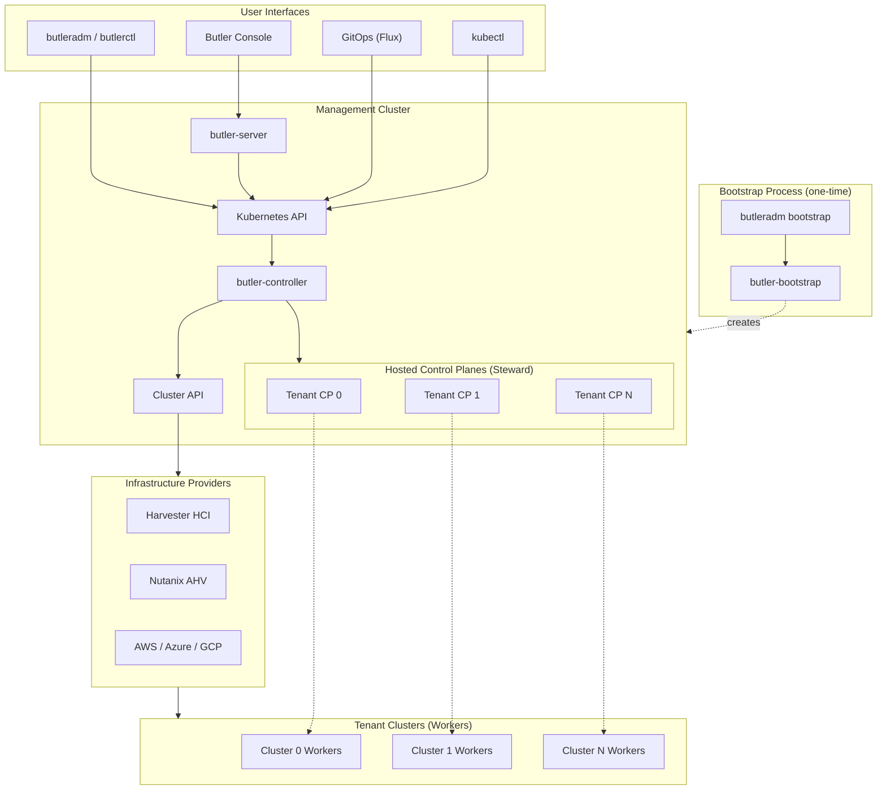
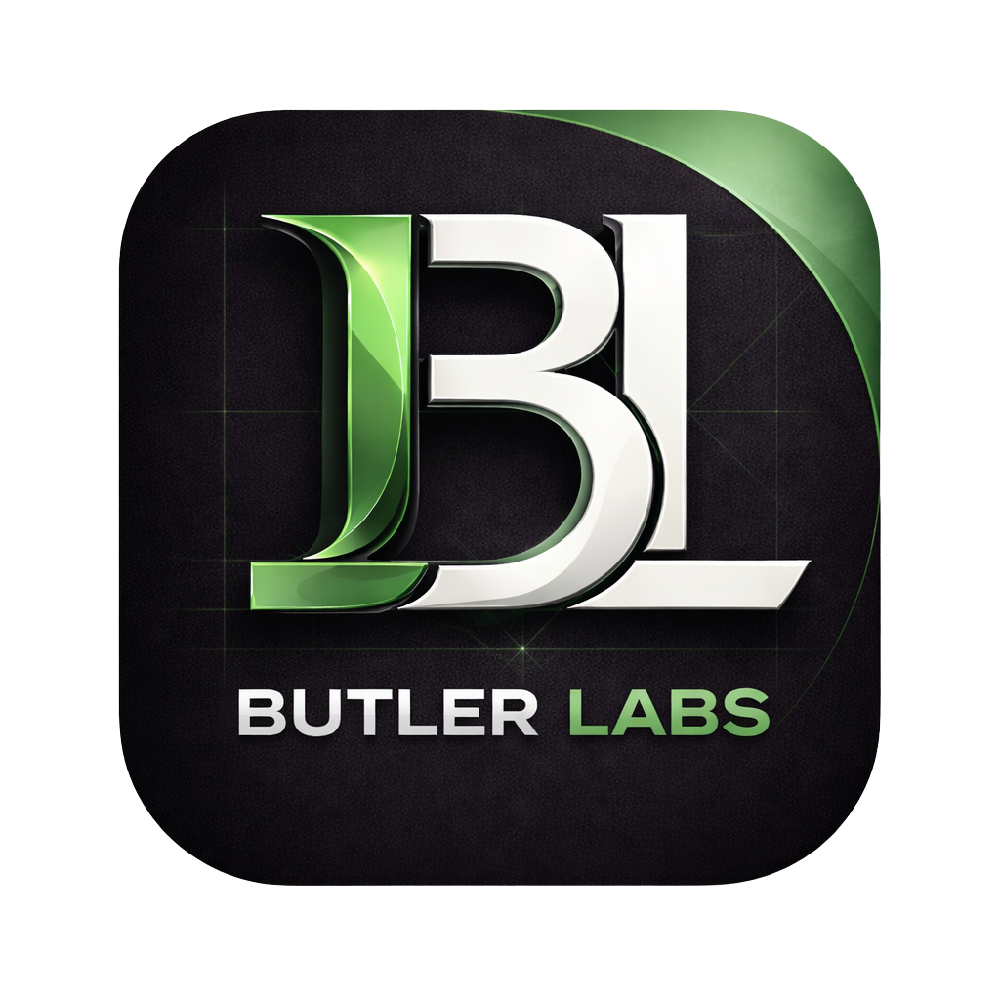

<p align="center">
  
</p>

<h1 align="center">Butler</h1>

<p align="center">
  <strong>Open source Kubernetes-as-a-Service platform for on-premises and hybrid cloud</strong>
</p>

<p align="center">
  Provision production-grade tenant clusters in minutes, not months.<br/>
  CRDs and operators. Hosted control planes. Enterprise networking. Zero vendor lock-in.
</p>

<p align="center">
  <a href="https://github.com/butlerdotdev/butler-cli/releases"></a>
  <a href="https://github.com/butlerdotdev/butler-controller/actions/workflows/ci.yaml"></a>
  <a href="https://goreportcard.com/report/github.com/butlerdotdev/butler-controller"></a>
  <a href="https://github.com/butlerdotdev/butler/blob/main/LICENSE"></a>
  <a href="https://discord.gg/cAzWG9qz3K"></a>
  <a href="https://github.com/butlerdotdev/butler/stargazers"></a>
</p>

<p align="center">
  <a href="#quick-start">Quick Start</a> &middot;
  <a href="https://docs.butlerlabs.dev">Documentation</a> &middot;
  <a href="https://discord.gg/cAzWG9qz3K">Discord</a> &middot;
  <a href="https://butlerlabs.dev">Website</a>
</p>

---

## What is Butler?

Butler is an open source Kubernetes-as-a-Service platform that lets you provision and manage tenant clusters across on-premises and cloud infrastructure. One management cluster runs [Steward](https://github.com/butlerdotdev/steward) for hosted control planes, [Cluster API](https://cluster-api.sigs.k8s.io/) for machine lifecycle, and a full web console for operations. Everything is a CRD. Everything is GitOps-compatible.

Built by [Butler Labs](https://butlerlabs.dev) to solve the problem we kept seeing: organizations spending 12-18 months building internal Kubernetes platforms from scratch. Butler compresses that to weeks.

### Who is Butler for?

- **Platform teams** building Internal Developer Platforms without starting from zero
- **Startups** that need Kubernetes-as-a-Service without the headcount of a dedicated platform org
- **Enterprises** running on-premises infrastructure (Harvester, Nutanix, Proxmox) who need multi-tenant Kubernetes
- **Homelabbers** who want production-grade Kubernetes management on their own hardware
- **Edge deployments** running lightweight single-node clusters at remote sites

### How is Butler different?

| | Butler | Rancher | Managed K8s (EKS/GKE/AKS) |
|---|--------|---------|---------------------------|
| **Architecture** | CRDs + Operators | Custom API + Database | Proprietary |
| **Control Planes** | Hosted as Pods ([Steward](https://github.com/butlerdotdev/steward)) | Dedicated VMs | Managed |
| **On-Premises** | First-class | Supported | No |
| **IPAM** | Built-in (NetworkPool CRDs) | None | Cloud-native |
| **GitOps** | Native (Flux/Argo) | Add-on | Add-on |
| **Multi-Tenancy** | Teams + RBAC + Quotas + OIDC | Projects | IAM |
| **Lock-in** | None (Apache 2.0) | Low | High |

---

## Key Features

### Cluster Provisioning
- **Hosted Control Planes**: Tenant API servers, controller-managers, and schedulers run as Pods via [Steward](https://github.com/butlerdotdev/steward). No dedicated VMs for control planes.
- **Multi-Provider**: Harvester HCI and Nutanix AHV today. Proxmox VE and cloud providers (AWS, Azure, GCP) in progress.
- **Talos Linux**: Immutable, secure, API-driven OS for all cluster nodes.
- **Single-Node to HA**: Same workflow whether deploying a dev cluster or a production HA setup.

### Enterprise Networking
- **Built-in IPAM**: NetworkPool CRDs manage IP address allocation. No external IPAM system required.
- **Elastic Load Balancers**: Automatic MetalLB address pool allocation and growth per tenant cluster.
- **Multi-Pool Failover**: Configure multiple network pools with priority-based failover.

### Multi-Tenancy
- **Team Isolation**: Each team gets a namespace, RBAC policies, and resource quotas.
- **OIDC Group Sync**: Map identity provider groups to Butler teams automatically.
- **Resource Quotas**: CPU, memory, storage, cluster count, and node count limits per team.

### Operations
- **Web Console**: Real-time cluster management with WebSocket updates and in-browser terminal access.
- **GitOps-First**: Native Flux and ArgoCD integration. Every resource is a CRD, every change is declarative.
- **Addon Ecosystem**: Cilium, MetalLB, Longhorn, cert-manager, Traefik installed automatically or on-demand.
- **CLI Tools**: `butleradm` for platform operators, `butlerctl` for tenant users.

### Developer Experience
- **Kubernetes-Native**: Same resources whether using CLI, Console, or `kubectl`. No proprietary API.
- **Cloud Development Environments**: [Chambers](https://github.com/butlerdotdev/butler-portal) provides SSH-accessible dev environments with editor integrations and workspace templates on Butler infrastructure.

---

## Supported Infrastructure

| Provider | Type | Status | Kubernetes Versions |
|----------|------|--------|---------------------|
| **Harvester HCI** | On-Premises | Stable | 1.28 - 1.31 |
| **Nutanix AHV** | On-Premises | Stable | 1.28 - 1.31 |
| **Proxmox VE** | On-Premises | In Progress | - |
| **GCP** | Cloud | Beta | 1.28 - 1.31 |
| **AWS** | Cloud | In Progress | - |
| **Azure** | Cloud | In Progress | - |

See [Provider Guides](docs/providers/) for detailed setup instructions.

---

## Project Status

Butler is in **active development** and running in production. Current API version is `v1alpha1`.

| Component | Status | Production Ready | Notes |
|-----------|--------|------------------|-------|
| **Steward** (hosted control planes) | Stable | Yes | Powers all tenant clusters |
| **Harvester Provider** | Stable | Yes | Production deployments |
| **butleradm bootstrap** | Stable | Yes | Proven bootstrap workflow |
| **TenantCluster CRD** | Alpha | Yes (with caveats) | API may change in minor versions |
| **Team / Multi-Tenancy** | Alpha | Yes | Fully functional |
| **NetworkPool / IPAM** | Alpha | Yes | Enterprise networking |
| **Nutanix Provider** | Stable | Yes | Production ready |
| **butlerctl CLI** | Beta | Yes | Core commands stable |
| **Butler Console** | Beta | No | Under active development |

**What the statuses mean:**
- **Stable**: Breaking changes require major version bump with migration guide
- **Beta**: Breaking changes may occur in minor versions with deprecation notice
- **Alpha**: Breaking changes expected; plan for upgrade paths

---

## Architecture


```mermaid
flowchart TB
    subgraph Interfaces["User Interfaces"]
        CLI["butleradm / butlerctl"]
        Console["Butler Console"]
        GitOps["GitOps (Flux)"]
        Kubectl["kubectl"]
    end
    
    subgraph Bootstrap["Bootstrap Process (one-time)"]
        ButlerAdm["butleradm bootstrap"]
        BootstrapCtrl["butler-bootstrap"]
    end
    
    subgraph MC["Management Cluster"]
        API["Kubernetes API"]
        Server["butler-server"]
        Controller["butler-controller"]
        CAPI["Cluster API"]
        subgraph HostedCP["Hosted Control Planes (Steward)"]
            TCP0["Tenant CP 0"]
            TCP1["Tenant CP 1"]
            TCPN["Tenant CP N"]
        end
    end
    
    subgraph Providers["Infrastructure Providers"]
        Harvester["Harvester HCI"]
        Nutanix["Nutanix AHV"]
        Cloud["AWS / Azure / GCP"]
    end
    
    subgraph Workers["Tenant Clusters (Workers)"]
        TW0["Cluster 0 Workers"]
        TW1["Cluster 1 Workers"]
        TWN["Cluster N Workers"]
    end
    
    ButlerAdm --> BootstrapCtrl
    BootstrapCtrl -.->|creates| MC
    
    CLI --> API
    Console --> Server
    Server --> API
    GitOps --> API
    Kubectl --> API
    
    API --> Controller
    Controller --> HostedCP
    Controller --> CAPI
    
    CAPI --> Providers
    Providers --> Workers
    
    TCP0 -.-> TW0
    TCP1 -.-> TW1
    TCPN -.-> TWN
```

### How It Works

1. **Bootstrap**: `butleradm bootstrap` creates a management cluster on your infrastructure using a temporary KIND cluster for orchestration
2. **Provision**: Create `TenantCluster` CRs via CLI, Console, or GitOps. butler-controller reconciles them into CAPI resources
3. **Host**: Steward runs tenant control planes as pods in the management cluster (no dedicated VMs needed)
4. **Connect**: Workers join via CAPI providers (Harvester/Nutanix/etc.)
5. **Extend**: Install addons (CNI, storage, ingress) automatically or on-demand

---

## Quick Start

### Prerequisites

- Docker (for bootstrap)
- kubectl
- Infrastructure access (Harvester, Nutanix, or other supported provider)

### Install CLI

<details>
<summary><strong>macOS / Linux (Homebrew)</strong></summary>

```bash
brew install butlerdotdev/tap/butler
```

</details>

<details>
<summary><strong>Windows (Chocolatey)</strong></summary>

```bash
choco install butler-cli --version=0.1.2
```

</details>

<details>
<summary><strong>Direct Download</strong></summary>

```bash
VERSION=$(curl -s https://api.github.com/repos/butlerdotdev/butler-cli/releases/latest | grep '"tag_name"' | cut -d'"' -f4 | tr -d 'v')
curl -sL "https://github.com/butlerdotdev/butler-cli/releases/download/v${VERSION}/butler_${VERSION}_$(uname -s | tr '[:upper:]' '[:lower:]')_$(uname -m | sed 's/x86_64/amd64/').tar.gz" | tar xz
sudo mv butleradm butlerctl /usr/local/bin/
```

</details>

### Bootstrap Management Cluster

Create a bootstrap configuration file for your infrastructure:

<details>
<summary><strong>Harvester (HA Cluster)</strong></summary>

```yaml
# bootstrap-harvester.yaml
provider: harvester
cluster:
  name: butler-mgmt
  controlPlane:
    replicas: 3
    cpu: 2
    memoryMB: 4096
    diskGB: 40
  workers:
    replicas: 3
    cpu: 4
    memoryMB: 8192
    diskGB: 50
    extraDisks:
      - sizeGB: 50
network:
  podCIDR: 10.244.0.0/16
  serviceCIDR: 10.96.0.0/12
  vip: 10.40.0.201
  loadBalancerPool:
    start: 10.40.0.210
    end: 10.40.0.220
talos:
  version: v1.12.1
  schematic: dc7b152cb3ea99b821fcb7340ce7168313ce393d663740b791c36f6e95fc8586
addons:
  cni:
    type: cilium
  storage:
    type: longhorn
  loadBalancer:
    type: metallb
    addressPool: 10.40.0.210-10.40.0.220
  gitOps:
    type: flux
  capi:
    enabled: true
    version: v1.9.4
  butlerController:
    enabled: true
    version: latest
    image: ghcr.io/butlerdotdev/butler-controller
  console:
    enabled: true
    version: "0.1.0"
    ingress:
      enabled: true
      host: butler.example.local
      className: traefik
      tls: false
providerConfig:
  harvester:
    kubeconfigPath: ~/.butler/harvester-kubeconfig
    namespace: default
    networkName: default/vlan40-workloads
    imageName: default/talos-1.12
```

</details>

<details>
<summary><strong>Harvester (Single-Node)</strong></summary>

```yaml
# bootstrap-single-node.yaml
provider: harvester
cluster:
  name: butler-dev
  topology: single-node
  controlPlane:
    replicas: 1
    cpu: 4
    memoryMB: 8192
    diskGB: 50
    extraDisks:
      - sizeGB: 50
network:
  podCIDR: 10.244.0.0/16
  serviceCIDR: 10.96.0.0/12
  vip: 10.40.0.200
  loadBalancerPool:
    start: 10.40.0.221
    end: 10.40.0.230
talos:
  version: v1.12.1
  schematic: dc7b152cb3ea99b821fcb7340ce7168313ce393d663740b791c36f6e95fc8586
addons:
  cni:
    type: cilium
  storage:
    type: longhorn
  loadBalancer:
    type: metallb
    addressPool: 10.40.0.221-10.40.0.230
  gitOps:
    type: flux
  capi:
    enabled: true
    version: v1.9.4
  butlerController:
    enabled: true
    version: latest
    image: ghcr.io/butlerdotdev/butler-controller
  console:
    enabled: true
    version: "0.1.0"
    ingress:
      enabled: true
      host: butler.dev.local
      className: traefik
      tls: false
providerConfig:
  harvester:
    kubeconfigPath: ~/.butler/harvester-kubeconfig
    namespace: default
    networkName: default/vlan40-workloads
    imageName: default/talos-1.12
```

</details>

<details>

<summary><strong>Nutanix</strong></summary>

```yaml
# bootstrap-nutanix.yaml
provider: nutanix
cluster:
  name: butler-mgmt
  controlPlane:
    replicas: 3
    cpu: 4
    memoryMB: 8192
    diskGB: 50
  workers:
    replicas: 2
    cpu: 8
    memoryMB: 8192
    diskGB: 100
    extraDisks:
      - sizeGB: 200
network:
  podCIDR: 10.244.0.0/16
  serviceCIDR: 10.96.0.0/12
  vip: 10.127.14.29
  loadBalancerPool:
    start: 10.127.14.30
    end: 10.127.14.50
talos:
  version: v1.12.1
  schematic: dc7b152cb3ea99b821fcb7340ce7168313ce393d663740b791c36f6e95fc8586
addons:
  cni:
    type: cilium
  storage:
    type: longhorn
  loadBalancer:
    type: metallb
    addressPool: 10.127.14.30-10.127.14.50
  gitOps:
    type: flux
  capi:
    enabled: true
    version: v1.9.4
  butlerController:
    enabled: true
    version: latest
    image: ghcr.io/butlerdotdev/butler-controller
providerConfig:
  nutanix:
    endpoint: https://prism-central.example.com
    port: 9440
    username: ""
    password: ""
    insecure: true
    clusterUUID: "your-cluster-uuid"
    subnetUUID: "your-subnet-uuid"
    imageUUID: "your-talos-image-uuid"
```

</details>

```bash
# Bootstrap the management cluster
butleradm bootstrap --config bootstrap-harvester.yaml
```

### Access Butler Console

After bootstrap completes, your credentials are displayed:
```
Cluster credentials saved to:
  Kubeconfig:   ~/.butler/<cluster-name>-kubeconfig
  Talosconfig:  ~/.butler/<cluster-name>-talosconfig

Butler Console:
  URL: http://butler.example.local
  Username: admin
  Password: Run the following command to retrieve:
    kubectl get secret butler-console-admin -n butler-system -o jsonpath='{.data.admin-password}' | base64 -d && echo
```

Set your kubeconfig and retrieve the admin password:
```bash
export KUBECONFIG=~/.butler/<cluster-name>-kubeconfig
kubectl get secret butler-console-admin -n butler-system -o jsonpath='{.data.admin-password}' | base64 -d && echo
```

Add the console hostname to your local hosts file (use the Traefik LoadBalancer IP from your MetalLB pool):

<details>
<summary><strong>macOS / Linux</strong></summary>

```bash
echo "10.40.0.210 butler.example.local" | sudo tee -a /etc/hosts
```

</details>

<details>
<summary><strong>Windows (Run as Administrator)</strong></summary>

```powershell
Add-Content -Path C:\Windows\System32\drivers\etc\hosts -Value "10.40.0.210 butler.example.local"
```

</details>

### Create Your First Tenant Cluster

You can create tenant clusters via the Butler Console, CLI, or directly with kubectl:

<details>
<summary><strong>Butler Console</strong></summary>

1. Navigate to your Butler Console URL (e.g., `http://butler.example.local`)
2. Log in with the admin credentials
3. Click **Create Cluster**
4. Fill in the cluster details and submit

</details>

<details>
<summary><strong>CLI</strong></summary>

```bash
butlerctl cluster create my-app \
  --workers 3 \
  --k8s-version v1.30.2 \
  --cpu 4 \
  --memory 8Gi \
  --disk 50Gi
```

</details>

<details>
<summary><strong>kubectl (TenantCluster CR)</strong></summary>

```yaml
apiVersion: butler.butlerlabs.dev/v1alpha1
kind: TenantCluster
metadata:
  name: my-app
  namespace: default
spec:
  kubernetesVersion: "v1.30.2"
  controlPlane:
    replicas: 1
  workers:
    replicas: 3
    machineTemplate:
      cpu: 4
      memory: 8Gi
      diskSize: 50Gi
```

```bash
kubectl apply -f tenant-cluster.yaml
```

</details>

```bash
# Get kubeconfig for your new cluster
butlerctl cluster kubeconfig my-app > my-app-kubeconfig.yaml
export KUBECONFIG=my-app-kubeconfig.yaml
kubectl get nodes
```

**[Full Getting Started Guide](docs/getting-started/)**

---

## Components

Butler is composed of multiple repositories, each with a specific responsibility:

### Core Components

| Component | Repository | Description | Status |
|-----------|------------|-------------|--------|
| **Butler API** | [butler-api](https://github.com/butlerdotdev/butler-api) | Shared CRD type definitions (v1alpha1) | Stable |
| **Butler Controller** | [butler-controller](https://github.com/butlerdotdev/butler-controller) | TenantCluster and ManagementAddon reconciliation | Stable |
| **Butler Bootstrap** | [butler-bootstrap](https://github.com/butlerdotdev/butler-bootstrap) | Management cluster bootstrap controller | Stable |
| **Butler CLI** | [butler-cli](https://github.com/butlerdotdev/butler-cli) | `butleradm` and `butlerctl` tools | Stable |
| **Butler Console** | [butler-console](https://github.com/butlerdotdev/butler-console) | Web UI (React + TypeScript) | Beta |
| **Butler Server** | [butler-server](https://github.com/butlerdotdev/butler-server) | Console backend API (Go + Chi) | Beta |
| **Butler Charts** | [butler-charts](https://github.com/butlerdotdev/butler-charts) | Helm charts for all components | Stable |

### Hosted Control Planes

| Component | Repository | Description | Status |
|-----------|------------|-------------|--------|
| **Steward** | [steward](https://github.com/butlerdotdev/steward) | Hosted control plane operator. Runs tenant API servers as Pods. | Stable |
| **CAPI Steward** | [capi-steward](https://github.com/butlerdotdev/cluster-api-control-plane-provider-steward) | Cluster API control plane provider for Steward | Stable |

### Infrastructure Providers

| Provider | Repository | Infrastructure | Status |
|----------|------------|----------------|--------|
| **Harvester** | [butler-provider-harvester](https://github.com/butlerdotdev/butler-provider-harvester) | Harvester HCI (KubeVirt) | Stable |
| **Nutanix** | [butler-provider-nutanix](https://github.com/butlerdotdev/butler-provider-nutanix) | Nutanix AHV (CAPX) | Stable |
| **Proxmox** | [butler-provider-proxmox](https://github.com/butlerdotdev/butler-provider-proxmox) | Proxmox VE | In Progress |
| **AWS** | butler-provider-aws | Amazon EC2 (CAPA) | In Progress |
| **Azure** | butler-provider-azure | Azure VMs (CAPZ) | In Progress |
| **GCP** | butler-provider-gcp | Google Compute (CAPG) | In Progress |

### Ecosystem

| Component | Repository | Description | Status |
|-----------|------------|-------------|--------|
| **Butler Portal** | [butler-portal](https://github.com/butlerdotdev/butler-portal) | Internal Developer Platform (Backstage-based) with Chambers, Keeper, and Herald | Beta |
| **Image Factory** | [butler-image-factory](https://github.com/butlerdotdev/butler-image-factory) | OS image factory for Talos and Kairos images | Beta |
| **Documentation** | [butlerlabs-docs](https://github.com/butlerdotdev/butlerlabs-docs) | Documentation site ([docs.butlerlabs.dev](https://docs.butlerlabs.dev)) | Stable |

**[Full Component Registry](COMPONENTS.md)**

---

## Documentation

**[docs.butlerlabs.dev](https://docs.butlerlabs.dev)**

| Guide | What you'll learn |
|-------|-------------------|
| [Overview & Concepts](docs/overview/) | What Butler is, how it works, core terminology |
| [Architecture](docs/architecture/) | System design, data flows, component interactions |
| [Getting Started](docs/getting-started/) | Installation, bootstrap, first tenant cluster |
| [Provider Guides](docs/providers/) | Infrastructure-specific setup (Harvester, Nutanix) |
| [Operations](docs/operations/) | Upgrades, backup/restore, monitoring |
| [Steward Docs](https://docs.butlerlabs.dev/steward) | Hosted control plane operator |
| [Contributing](docs/contributing/) | Development setup, PR process |

---

## Contributing

Butler is built in the open. We welcome contributions of all kinds.

- **[Contributing Guide](CONTRIBUTING.md)**
- **[Good First Issues](https://github.com/search?q=org%3Abutlerdotdev+label%3A%22good+first+issue%22+state%3Aopen)**
- **[Design Proposals](design/proposals/)**
- **[COMPONENTS.md](COMPONENTS.md)**: Find which repo owns what

---

## Community

- **[Discord](https://discord.gg/cAzWG9qz3K)**: Chat with the team and other users
- **[GitHub Discussions](https://github.com/butlerdotdev/butler/discussions)**: Questions, ideas, RFCs
- **[Adopters](community/adopters.md)**: Organizations using Butler
- **[Security Policy](SECURITY.md)**: Report vulnerabilities privately, never as public issues

---

## Butler Ecosystem

Butler is part of a platform engineering toolset built by [Butler Labs](https://butlerlabs.dev):

| Project | Description | Status |
|---------|-------------|--------|
| **[Butler](https://github.com/butlerdotdev/butler)** | Kubernetes-as-a-Service platform (this project) | Stable |
| **[Steward](https://github.com/butlerdotdev/steward)** | Hosted control plane operator. Runs tenant API servers as Pods with pluggable backends (etcd, PostgreSQL, MySQL, NATS). Community-governed, targeting CNCF Sandbox. | Stable |
| **[Butler Portal](https://github.com/butlerdotdev/butler-portal)** | Internal Developer Platform built on Backstage. Includes **Chambers** (cloud dev environments), **Keeper** (governed IaC registry), and **Herald** (telemetry pipeline builder). | Beta |

---

## Built With

Built on top of these open source projects:

[Kubernetes](https://kubernetes.io/) | [Cluster API](https://cluster-api.sigs.k8s.io/) | [Talos Linux](https://www.talos.dev/) | [Cilium](https://cilium.io/) | [Flux](https://fluxcd.io/) | [Longhorn](https://longhorn.io/) | [Harvester](https://harvesterhci.io/) | [MetalLB](https://metallb.universe.tf/) | [cert-manager](https://cert-manager.io/)

Butler's hosted control planes are powered by [Steward](https://github.com/butlerdotdev/steward), a community-governed operator originally forked from [Kamaji](https://github.com/clastix/kamaji).

---

## License

[Apache License 2.0](LICENSE). Copyright 2025-2026 Butler Labs LLC.

---

<p align="center">
  <a href="https://butlerlabs.dev"></a>
  <br/><br/>
  <em>Built by <a href="https://butlerlabs.dev">Butler Labs</a></em>
</p>
