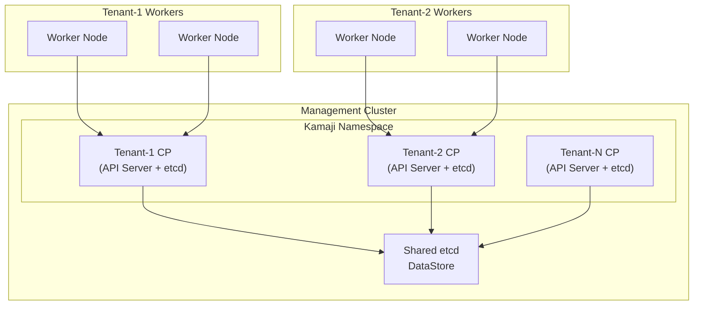

# ADR-0006: Hosted Control Planes by Default

## Status

Accepted

## Context

Kubernetes clusters traditionally require dedicated control plane nodes, typically 3 VMs for high availability. For organizations running many clusters, this creates significant overhead:

| Clusters | Traditional CP VMs | Resources (16GB RAM each) |
|----------|-------------------|---------------------------|
| 10 | 30 | 480 GB RAM |
| 50 | 150 | 2.4 TB RAM |
| 100 | 300 | 4.8 TB RAM |

Butler needed to decide the default control plane architecture:

1. **Standalone**: Dedicated control plane VMs per cluster
2. **Hosted**: Control planes run as pods in the management cluster

## Decision

Butler uses **hosted control planes by default** via [Steward](https://github.com/butlerdotdev/steward), our community-governed fork of Kamaji.

### How It Works



Each tenant cluster's control plane runs as pods:
- kube-apiserver
- kube-controller-manager
- kube-scheduler

etcd is either per-tenant or shared via Kamaji DataStore.

### Exposure

Tenant control planes are exposed via LoadBalancer services (MetalLB) on unique IPs.

## Consequences

### Positive

- **Resource efficiency**: 10x reduction in control plane resources
- **Faster provisioning**: Seconds vs. minutes for CP
- **Simplified operations**: No CP VM management
- **Centralized etcd**: Easier backup/restore
- **Lower cost**: Significant infrastructure savings

### Negative

- **Management cluster criticality**: If MC fails, all tenant CPs fail
- **Resource contention**: Noisy neighbors possible
- **Complexity**: Kamaji adds operational complexity
- **Network dependency**: Workers must reach MC network

### Neutral

- Different troubleshooting patterns
- etcd backup is centralized vs. per-cluster
- Scaling management cluster more important

## Configuration

### Hosted (Default)

```yaml
apiVersion: butler.butlerlabs.dev/v1alpha1
kind: TenantCluster
spec:
  controlPlane:
    type: hosted
```

### Standalone (Optional)

```yaml
apiVersion: butler.butlerlabs.dev/v1alpha1
kind: TenantCluster
spec:
  controlPlane:
    type: standalone
    replicas: 3
    machineTemplate:
      cpu: 4
      memory: 8Gi
```

## Alternatives Considered

### Alternative 1: Standalone by Default

Traditional dedicated CP VMs.

**Why rejected:**
- Significantly higher resource consumption
- Slower provisioning
- More operational overhead
- Goes against modern multi-tenancy patterns

### Alternative 2: vCluster

Use [vCluster](https://www.vcluster.com/) for virtualized clusters.

**Why rejected:**
- Less isolation than Kamaji
- Syncer complexity
- Not true separate clusters
- May revisit for specific use cases

### Alternative 3: k3s/k0s Embedded

Lightweight distributions with embedded etcd.

**Why rejected:**
- Still requires dedicated VMs
- Different Kubernetes distribution
- Compatibility concerns

## References

- [Kamaji](https://kamaji.clastix.io/)
- [Cluster API Kamaji Provider](https://github.com/clastix/cluster-api-control-plane-provider-kamaji)
- [Multi-tenancy SIG](https://github.com/kubernetes-sigs/multi-tenancy)
