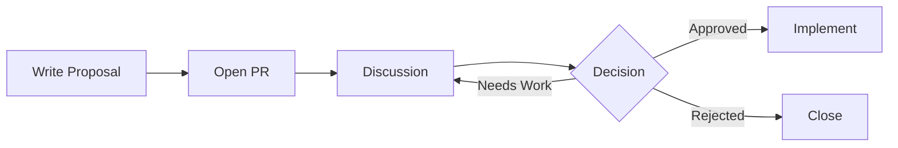

# Design Proposals

This directory contains design proposals for significant Butler changes.

## When to Write a Proposal

Write a design proposal when:

- Adding a new CRD or significant API changes
- Architectural changes affecting multiple components
- Adding a new component to the ecosystem
- Changes to build, test, or release processes
- Breaking changes to existing functionality

You do NOT need a proposal for:

- Bug fixes
- Documentation improvements
- Minor feature additions
- Refactoring that doesn't change behavior

## Proposal Process



### 1. Write the Proposal

Copy the template and fill in all sections:

```bash
cp NNNN-template.md NNNN-my-feature.md
```

### 2. Open a Pull Request

- Set status to `Proposed`
- Add the `design` label
- Request reviews from relevant maintainers

### 3. Discussion Period

- Minimum 1 week for minor proposals
- Minimum 2 weeks for major architectural changes
- Discuss in PR comments or community meetings

### 4. Decision

Core maintainers decide based on:

- Technical merit
- Alignment with project goals
- Community feedback
- Maintenance burden

### 5. Implementation

After approval:

- Update status to `Accepted`
- Create implementation issues
- Reference the proposal in PRs

## Proposal Status

| Status | Meaning |
|--------|---------|
| `Proposed` | Under discussion |
| `Accepted` | Approved for implementation |
| `Rejected` | Not approved |
| `Implemented` | Code merged |
| `Withdrawn` | Author withdrew |

## Active Proposals

*No active proposals at this time.*

## Accepted Proposals

| Number | Title | Status |
|--------|-------|--------|
| *Coming soon* | | |

## Rejected Proposals

| Number | Title | Reason |
|--------|-------|--------|
| *None yet* | | |

## Template

See [NNNN-template.md](NNNN-template.md) for the proposal template.
