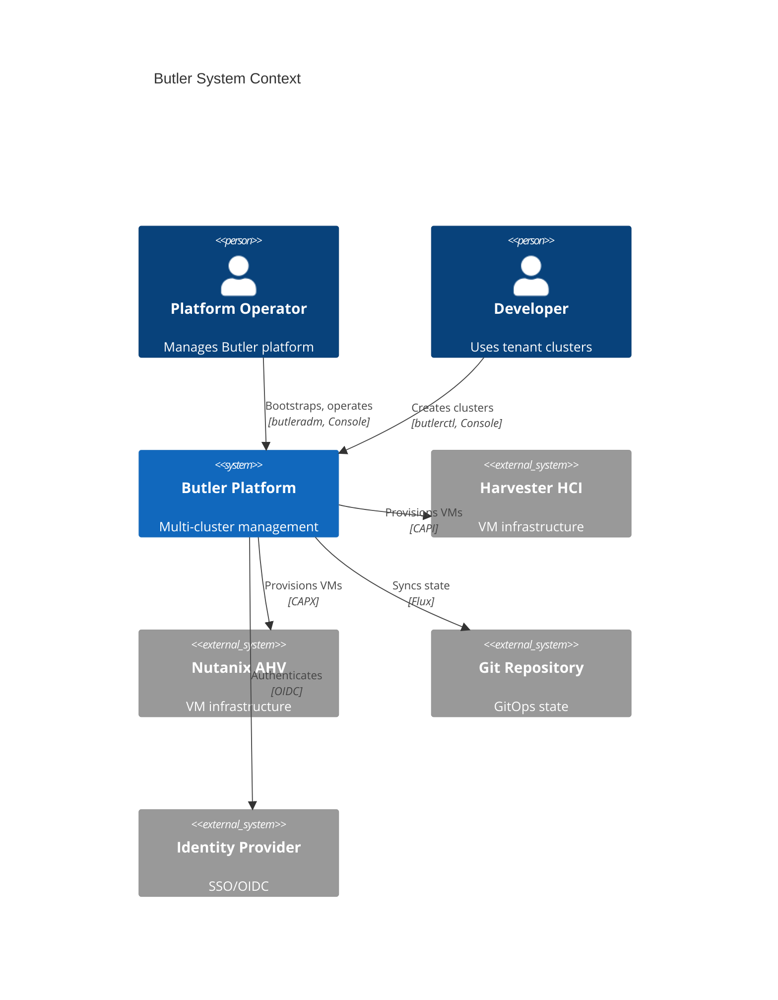
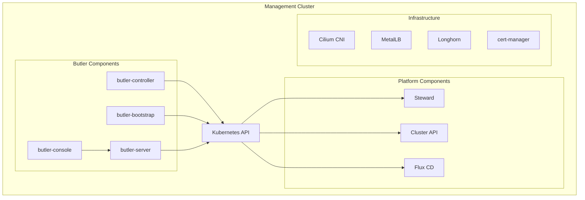

# Butler Architecture

This section documents Butler's technical architecture, including system design, component interactions, and data flows.

## Table of Contents

- [System Overview](#system-overview)
- [Components](#components)
- [Key Flows](#key-flows)
- [Detailed Documentation](#detailed-documentation)

---

## System Overview

Butler is a Kubernetes-native platform built on CRDs and operators. All state is stored in Kubernetes, enabling GitOps workflows and standard Kubernetes tooling.

---

## Components

### Management Cluster Components

| Component | Purpose | Repository |
|-----------|---------|------------|
| butler-controller | Reconciles TenantCluster, Team, ManagementAddon | [butler-controller](https://github.com/butlerdotdev/butler-controller) |
| butler-bootstrap | Reconciles ClusterBootstrap, MachineRequest | [butler-bootstrap](https://github.com/butlerdotdev/butler-bootstrap) |
| butler-server | REST API and WebSocket for Console | [butler-server](https://github.com/butlerdotdev/butler-server) |
| butler-console | Web UI (React) | [butler-console](https://github.com/butlerdotdev/butler-console) |
| Steward | Hosts tenant control planes as pods | [steward](https://github.com/butlerdotdev/steward) |
| Cluster API | Manages cluster infrastructure | External |

### Tenant Cluster Components

Each tenant cluster includes:

| Component | Purpose |
|-----------|---------|
| Cilium | CNI networking |
| MetalLB | LoadBalancer services |
| Longhorn | Distributed block storage (optional) |
| cert-manager | TLS certificate management |
| Traefik | Ingress controller (optional) |

---

## Key Flows

### Bootstrap Flow

Creates a management cluster from scratch:

1. User runs `butleradm bootstrap`
2. CLI creates temporary KIND cluster
3. Deploy bootstrap and provider controllers
4. Create ClusterBootstrap CR
5. Controller provisions VMs via provider
6. Install Talos Linux and bootstrap Kubernetes
7. Install platform addons
8. Save kubeconfig, delete KIND

[Detailed bootstrap flow](bootstrap-flow.md)

### Tenant Cluster Creation

Creates a new tenant cluster:

1. User creates TenantCluster CR
2. Controller creates StewardControlPlane (hosted CP)
3. Controller creates CAPI Cluster and MachineDeployment
4. CAPI provisions worker VMs
5. Workers bootstrap and join cluster
6. Controller installs platform addons
7. Cluster marked as Running

[Detailed tenant lifecycle](tenant-lifecycle.md)

### Addon Installation

Installs an addon on a cluster:

1. User creates TenantAddon CR
2. Controller retrieves AddonDefinition
3. Controller gets tenant cluster kubeconfig
4. Controller installs Helm chart
5. Addon marked as Installed

[Detailed addon system](addon-system.md)

---

## Detailed Documentation

| Document | Description |
|----------|-------------|
| [Bootstrap Flow](bootstrap-flow.md) | Management cluster creation process |
| [Tenant Lifecycle](tenant-lifecycle.md) | Tenant cluster provisioning and management |
| [Addon System](addon-system.md) | Addon catalog and installation |
| [Multi-Tenancy](multi-tenancy.md) | Teams, RBAC, and isolation |
| [Networking](networking.md) | Network architecture and configuration |
| [Security Model](security-model.md) | Authentication, authorization, and secrets |

---

## Design Decisions

Architectural decisions are documented as ADRs in [design/adr/](../../design/adr/).

Key decisions:

| ADR | Decision |
|-----|----------|
| [ADR-0002](../../design/adr/ADR-0002-dual-cli.md) | Separate CLIs for operators (butleradm) and users (butlerctl) |
| [ADR-0003](../../design/adr/ADR-0003-crds-as-api.md) | CRDs as the API contract |
| [ADR-0004](../../design/adr/ADR-0004-multi-repo.md) | Multi-repository architecture |
| [ADR-0006](../../design/adr/ADR-0006-hosted-control-planes.md) | Hosted control planes by default |
