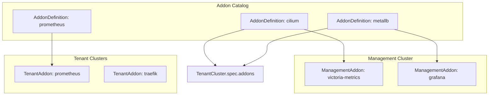
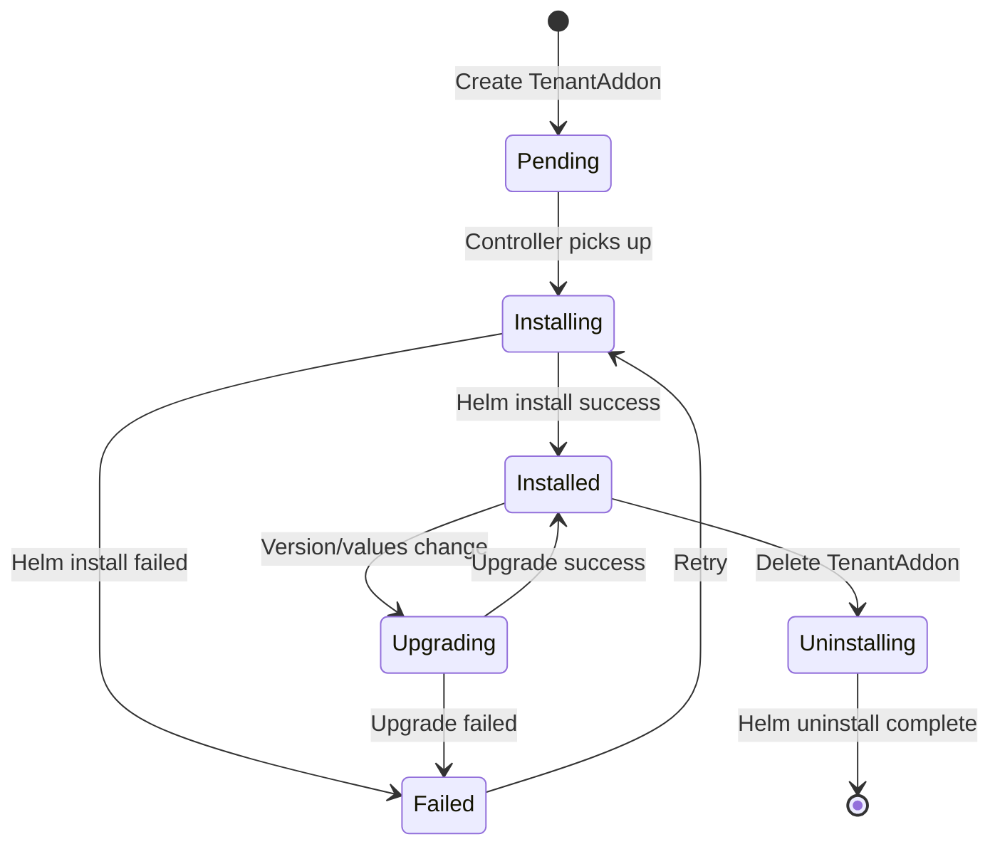
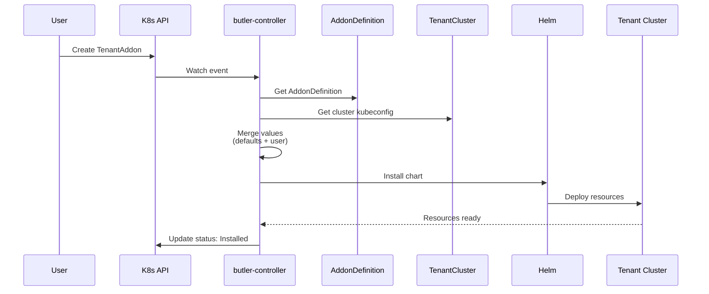

# Addon System

This document describes Butler's addon management system for extending cluster functionality.

## Table of Contents

- [Overview](#overview)
- [Addon Types](#addon-types)
- [AddonDefinition](#addondefinition)
- [TenantAddon](#tenantaddon)
- [ManagementAddon](#managementaddon)
- [Built-in Addons](#built-in-addons)
- [Custom Addons](#custom-addons)

---

## Overview

Butler's addon system provides a declarative way to install and manage applications on both management and tenant clusters. Addons are Helm charts wrapped with Butler metadata and lifecycle management.



## Addon Types

### Platform Addons

Required for cluster operation. Installed automatically during cluster creation.

| Addon | Purpose | Removable |
|-------|---------|-----------|
| Cilium | CNI networking | No |
| MetalLB | LoadBalancer services | No* |
| kube-vip | Control plane HA | No |

*Required for on-premises deployments

### Optional Addons

Can be installed/removed by users.

| Category | Examples |
|----------|----------|
| Storage | Longhorn, OpenEBS |
| Ingress | Traefik, nginx-ingress |
| Certificates | cert-manager |
| Monitoring | Prometheus, Victoria Metrics |
| Logging | Loki, Fluentbit |

## AddonDefinition

AddonDefinitions are cluster-scoped resources that define available addons.

```yaml
apiVersion: butler.butlerlabs.dev/v1alpha1
kind: AddonDefinition
metadata:
  name: cilium
spec:
  displayName: "Cilium"
  description: "eBPF-based networking, observability, and security"
  category: networking
  platform: true  # Required for cluster operation
  
  chart:
    repository: https://helm.cilium.io
    name: cilium
    defaultVersion: "1.17.0"
    
  # Default values applied to all installations
  defaultValues:
    operator:
      replicas: 1
    hubble:
      enabled: true
      relay:
        enabled: true
        
  # Values that can be overridden by users
  configurableValues:
    - path: hubble.enabled
      description: "Enable Hubble observability"
      type: boolean
    - path: operator.replicas
      description: "Number of operator replicas"
      type: integer
      
  # Dependencies on other addons
  dependencies: []
  
  # Incompatible addons
  conflicts:
    - calico
    - flannel
```

### AddonDefinition Fields

| Field | Description |
|-------|-------------|
| `displayName` | Human-readable name |
| `description` | Addon description |
| `category` | Category (networking, storage, monitoring, etc.) |
| `platform` | If true, required for cluster operation |
| `chart` | Helm chart details |
| `defaultValues` | Default Helm values |
| `configurableValues` | User-overridable values |
| `dependencies` | Required addons |
| `conflicts` | Incompatible addons |

## TenantAddon

TenantAddons represent addon installations on tenant clusters.

```yaml
apiVersion: butler.butlerlabs.dev/v1alpha1
kind: TenantAddon
metadata:
  name: my-cluster-prometheus
  namespace: team-a
spec:
  clusterRef:
    name: my-cluster
  addon: prometheus
  version: "25.0.0"
  values:
    server:
      retention: 30d
    alertmanager:
      enabled: true
```

### Lifecycle



### Installation Flow



## ManagementAddon

ManagementAddons install addons on the management cluster itself.

```yaml
apiVersion: butler.butlerlabs.dev/v1alpha1
kind: ManagementAddon
metadata:
  name: victoria-metrics
spec:
  addon: victoria-metrics
  version: "0.25.0"
  values:
    server:
      retentionPeriod: 90d
```

ManagementAddons are cluster-scoped and managed by platform administrators.

## Built-in Addons

Butler ships with these AddonDefinitions:

### Networking

| Addon | Description | Default Version |
|-------|-------------|-----------------|
| cilium | eBPF-based CNI with Hubble | 1.17.0 |
| metallb | LoadBalancer for bare metal | 0.14.9 |

### Storage

| Addon | Description | Default Version |
|-------|-------------|-----------------|
| longhorn | Distributed block storage | 1.7.2 |

### Certificates

| Addon | Description | Default Version |
|-------|-------------|-----------------|
| cert-manager | Certificate management | 1.16.2 |

### Ingress

| Addon | Description | Default Version |
|-------|-------------|-----------------|
| traefik | Ingress controller | 34.3.0 |

### Monitoring

| Addon | Description | Default Version |
|-------|-------------|-----------------|
| prometheus | Monitoring and alerting | 25.0.0 |
| victoria-metrics | Long-term metrics storage | 0.25.0 |

## Custom Addons

Organizations can add custom AddonDefinitions for internal applications.

### Creating a Custom Addon

```yaml
apiVersion: butler.butlerlabs.dev/v1alpha1
kind: AddonDefinition
metadata:
  name: internal-app
spec:
  displayName: "Internal Application"
  description: "Company internal application"
  category: application
  
  chart:
    repository: https://charts.internal.company.com
    name: internal-app
    defaultVersion: "2.1.0"
    
  defaultValues:
    replicaCount: 2
    
  configurableValues:
    - path: replicaCount
      description: "Number of replicas"
      type: integer
      minimum: 1
      maximum: 10
```

### Private Helm Repositories

For private repositories, create a Secret:

```yaml
apiVersion: v1
kind: Secret
metadata:
  name: internal-helm-repo
  namespace: butler-system
type: Opaque
stringData:
  username: helm-user
  password: secret-password
```

Reference in AddonDefinition:

```yaml
spec:
  chart:
    repository: https://charts.internal.company.com
    credentialsRef:
      name: internal-helm-repo
      namespace: butler-system
```

## See Also

- [Tenant Lifecycle](tenant-lifecycle.md) - How addons are installed during cluster creation
- [Getting Started](../getting-started/) - Install your first addon
