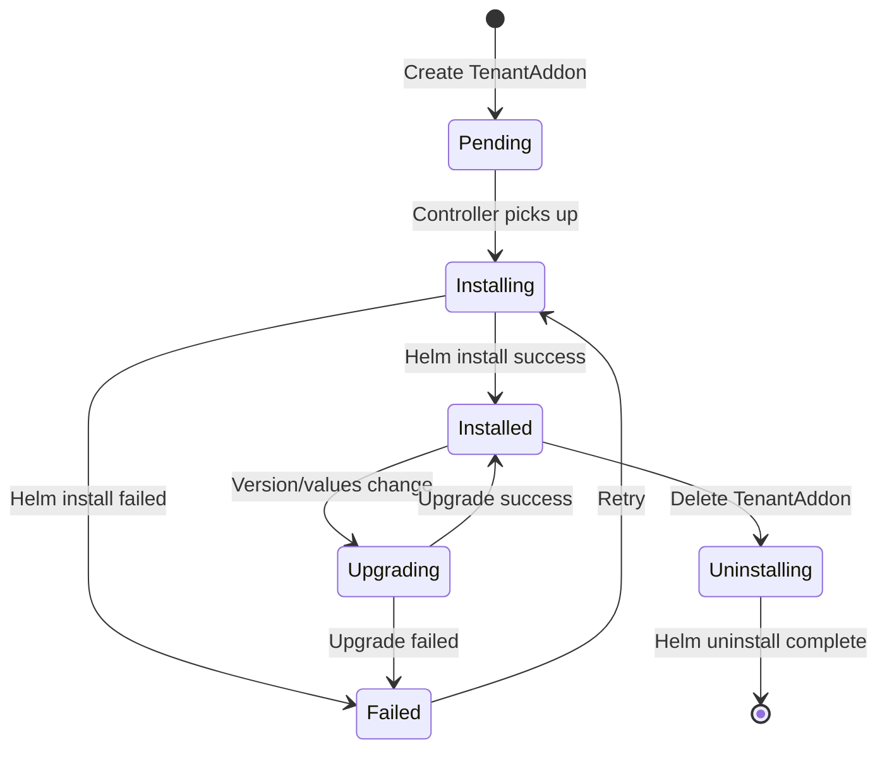
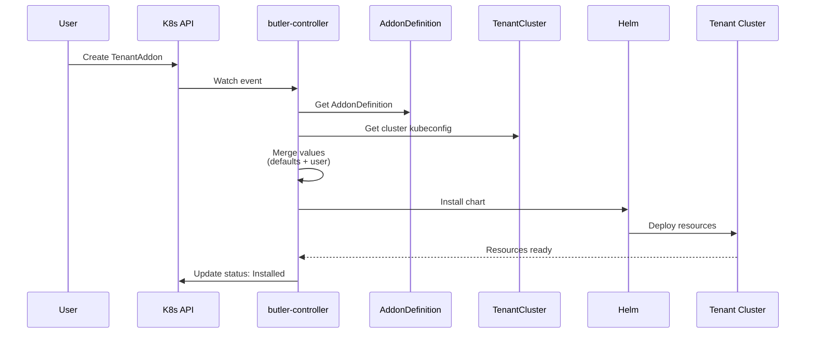

# Addon System

This document covers addon lifecycle management, installation flows, and custom addon creation. For an introduction to addon types and the three addon CRDs, see [Concepts: Addons](../concepts/addons.md).

## AddonDefinition

AddonDefinitions are cluster-scoped resources that define available addons.

```yaml
apiVersion: butler.butlerlabs.dev/v1alpha1
kind: AddonDefinition
metadata:
  name: cilium
spec:
  displayName: "Cilium"
  description: "eBPF-based networking, observability, and security"
  category: cni
  platform: true
  tier: infrastructure
  icon: "🔌"
  iconData: "PHN2ZyB4bWxucz0i..."  # base64-encoded SVG

  chart:
    repository: https://helm.cilium.io
    name: cilium
    defaultVersion: "1.17.0"

  defaults:
    namespace: kube-system
    values:
      operator:
        replicas: 1
      hubble:
        enabled: true
        relay:
          enabled: true

  dependsOn: []

  links:
    documentation: https://docs.cilium.io
    source: https://github.com/cilium/cilium
    homepage: https://cilium.io
```

### AddonDefinition Fields

| Field | Type | Description |
|-------|------|-------------|
| `displayName` | string | Human-readable name shown in the Console |
| `description` | string | What the addon does (max 512 characters) |
| `category` | enum | Grouping for catalog display (see [categories](#categories)) |
| `platform` | boolean | If true, installed during cluster creation and cannot be removed via UI |
| `tier` | enum | `infrastructure` or `apps` -- controls GitOps export placement (see [Tier Classification](#tier-classification)) |
| `icon` | string | Emoji fallback icon (max 8 characters) |
| `iconData` | string | Base64-encoded SVG logo (see [Icon Resolution](#icon-resolution)) |
| `chart` | object | Helm chart repository, name, and default version |
| `defaults` | object | Installation defaults: namespace, release name, timeout, Helm values |
| `dependsOn` | array | Addon names that must be installed first |
| `links` | object | URLs for documentation, homepage, and source code |
| `maintainer` | object | Maintainer name and email |

### Categories

| Category | Description |
|----------|-------------|
| `cni` | Container networking interface |
| `loadbalancer` | LoadBalancer service implementations |
| `storage` | Persistent volume provisioners |
| `certmanager` | Certificate management |
| `ingress` | Ingress controllers |
| `observability` | Monitoring, logging, and tracing |
| `backup` | Cluster backup and disaster recovery |
| `gitops` | GitOps continuous delivery |
| `security` | Secrets management and policy |
| `dns` | External DNS management |
| `database` | Database operators |
| `messaging` | Message brokers and event streaming |
| `service-mesh` | Service mesh and traffic management |
| `other` | Uncategorized addons |

### Tier Classification

Every addon belongs to one of two tiers:

**infrastructure** -- Foundational cluster services that other workloads depend on. Networking, storage, certificate management, secrets operators, and service meshes fall here. When Butler exports a cluster configuration to a GitOps repository, infrastructure addons are placed in a separate directory so they can be applied before application workloads.

**apps** -- Application-level tools that run on top of infrastructure. Monitoring dashboards, log aggregators, backup tools, and message brokers fall here. These are deployed after infrastructure addons in GitOps exports.

If `tier` is not set explicitly, Butler infers it:

- Platform addons (`platform: true`) default to `infrastructure`
- All other addons default to `apps`

You can override the inferred tier. For example, Prometheus Operator and Flux are not platform addons but are classified as `infrastructure` because other workloads depend on their CRDs.

### Icon Resolution

Butler Console renders addon icons using a three-step fallback chain:

1. **`iconData`** -- If present, decoded as an SVG image and rendered inline. This is the preferred approach for product logos.
2. **`icon`** -- If `iconData` is empty, the `icon` field is rendered as text (typically an emoji like `🔒`).
3. **Fallback** -- If neither field is set, Butler displays a generic package icon (📦).

The `iconData` field accepts a base64-encoded SVG. To encode an SVG file:

```bash
# Linux
base64 -w 0 logo.svg

# macOS
base64 -i logo.svg | tr -d '\n'
```

The encoded string goes directly into `spec.iconData` -- do not include a `data:` URI prefix. Maximum length is 131,072 characters.

## TenantAddon

TenantAddons represent addon installations on tenant clusters.

```yaml
apiVersion: butler.butlerlabs.dev/v1alpha1
kind: TenantAddon
metadata:
  name: my-cluster-prometheus
  namespace: team-a
spec:
  clusterRef:
    name: my-cluster
  addon: prometheus-operator
  version: "72.6.2"
  values:
    server:
      retention: 30d
    alertmanager:
      enabled: true
```

### Lifecycle


```mermaid
stateDiagram-v2
    [*] --> Pending: Create TenantAddon
    Pending --> Installing: Controller picks up
    Installing --> Installed: Helm install success
    Installing --> Failed: Helm install failed

    Installed --> Upgrading: Version/values change
    Upgrading --> Installed: Upgrade success
    Upgrading --> Failed: Upgrade failed

    Installed --> Uninstalling: Delete TenantAddon
    Uninstalling --> [*]: Helm uninstall complete

    Failed --> Installing: Retry
```

### Installation Flow


```mermaid
sequenceDiagram
    participant User
    participant API as K8s API
    participant Controller as butler-controller
    participant AD as AddonDefinition
    participant TC as TenantCluster
    participant Helm
    participant Tenant as Tenant Cluster

    User->>API: Create TenantAddon
    API->>Controller: Watch event

    Controller->>AD: Get AddonDefinition
    Controller->>TC: Get cluster kubeconfig

    Controller->>Controller: Merge values<br/>(defaults + user)
    Controller->>Helm: Install chart
    Helm->>Tenant: Deploy resources

    Tenant-->>Controller: Resources ready
    Controller->>API: Update status: Installed
```

## ManagementAddon

ManagementAddons install addons on the management cluster itself.

```yaml
apiVersion: butler.butlerlabs.dev/v1alpha1
kind: ManagementAddon
metadata:
  name: victoria-metrics
spec:
  addon: victoria-metrics
  version: "0.25.0"
  values:
    server:
      retentionPeriod: 90d
```

ManagementAddons are cluster-scoped and managed by platform administrators.

## Built-in Addons

Butler ships with 27 AddonDefinitions across two tiers.

### Platform Addons

Platform addons are installed automatically during cluster creation and cannot be removed through the Console.

| Addon | Display Name | Category | Description |
|-------|-------------|----------|-------------|
| cilium | Cilium | cni | eBPF-based networking with Hubble observability |
| metallb | MetalLB | loadbalancer | LoadBalancer services for bare-metal clusters |
| cert-manager | cert-manager | certmanager | X.509 certificate management |
| longhorn | Longhorn | storage | Distributed block storage |
| traefik | Traefik | ingress | Ingress controller and reverse proxy |
| metrics-server | Metrics Server | observability | Cluster resource metrics for HPA and `kubectl top` |

### Infrastructure-Tier Optional Addons

These are not installed automatically but are classified as infrastructure because other workloads may depend on their CRDs or services.

| Addon | Display Name | Category | Description |
|-------|-------------|----------|-------------|
| cnpg | CloudNativePG | database | PostgreSQL operator with automated failover |
| external-dns | ExternalDNS | dns | Synchronize Kubernetes Services/Ingresses with DNS providers |
| external-secrets | External Secrets Operator | security | Sync secrets from external stores (Vault, AWS SSM, etc.) |
| flux | Flux CD | gitops | GitOps continuous delivery for Kubernetes |
| istio | Istio | service-mesh | Service mesh with traffic management and mTLS |
| linkerd | Linkerd | service-mesh | Lightweight service mesh focused on simplicity |
| prometheus-operator | Prometheus Operator | observability | Monitoring stack operator with ServiceMonitor CRDs |
| sealed-secrets | Sealed Secrets | security | Encrypt secrets for safe storage in Git |

### Application-Tier Optional Addons

Application-level tools that run on top of infrastructure.

| Addon | Display Name | Category | Description |
|-------|-------------|----------|-------------|
| argocd | Argo CD | gitops | Declarative GitOps continuous delivery |
| jaeger | Jaeger | observability | Distributed tracing backend |
| loki | Grafana Loki | observability | Log aggregation with label-based indexing |
| nats | NATS | messaging | Cloud-native messaging system |
| otel-collector | OpenTelemetry Collector | observability | Vendor-agnostic telemetry data pipeline |
| rabbitmq | RabbitMQ | messaging | Message broker with AMQP support |
| redis | Redis | database | In-memory data store and cache |
| tempo | Grafana Tempo | observability | Distributed tracing with object storage backend |
| vector-agent | Vector Agent | observability | Node-level log and metrics collector |
| vector-aggregator | Vector Aggregator | observability | Centralized log processing and routing |
| velero | Velero | backup | Cluster backup, restore, and migration |
| victoria-logs | Victoria Logs | observability | Log management with VictoriaMetrics |
| victoria-metrics | Victoria Metrics | observability | Long-term metrics storage compatible with Prometheus |

## Custom Addons

Organizations can add custom AddonDefinitions for internal applications.

### Creating a Custom Addon

```yaml
apiVersion: butler.butlerlabs.dev/v1alpha1
kind: AddonDefinition
metadata:
  name: internal-app
spec:
  displayName: "Internal Application"
  description: "Company-specific deployment platform"
  category: other
  tier: apps
  iconData: "PHN2ZyB4bWxucz0i..."  # base64-encoded company logo

  chart:
    repository: https://charts.internal.company.com
    name: internal-app
    defaultVersion: "2.1.0"

  defaults:
    namespace: internal
    createNamespace: true
    timeout: "15m"
    values:
      replicaCount: 2

  links:
    documentation: https://wiki.internal.company.com/internal-app
```

To create a custom addon with an icon, encode your SVG logo:

```bash
# Encode the SVG
ICON=$(base64 -i logo.svg | tr -d '\n')

# Create the AddonDefinition (via Console or kubectl)
kubectl apply -f - <<EOF
apiVersion: butler.butlerlabs.dev/v1alpha1
kind: AddonDefinition
metadata:
  name: my-tool
spec:
  displayName: "My Tool"
  description: "Internal monitoring dashboard"
  category: observability
  tier: apps
  iconData: "$ICON"
  chart:
    repository: https://charts.company.com
    name: my-tool
    defaultVersion: "1.0.0"
EOF
```

### Private Helm Repositories

For private repositories, create a Secret:

```yaml
apiVersion: v1
kind: Secret
metadata:
  name: internal-helm-repo
  namespace: butler-system
type: Opaque
stringData:
  username: helm-user
  password: secret-password
```

Reference in AddonDefinition:

```yaml
spec:
  chart:
    repository: https://charts.internal.company.com
    credentialsRef:
      name: internal-helm-repo
      namespace: butler-system
```

## See Also

- [Concepts: Addons](../concepts/addons.md) -- Addon types and CRD overview
- [AddonDefinition CRD Reference](../reference/crds/addondefinition.md) -- Full field specification
- [Addon Catalog Operations](../operations/addon-catalog.md) -- Using the Console addon catalog
- [Tenant Lifecycle](tenant-lifecycle.md) -- How addons are installed during cluster creation
