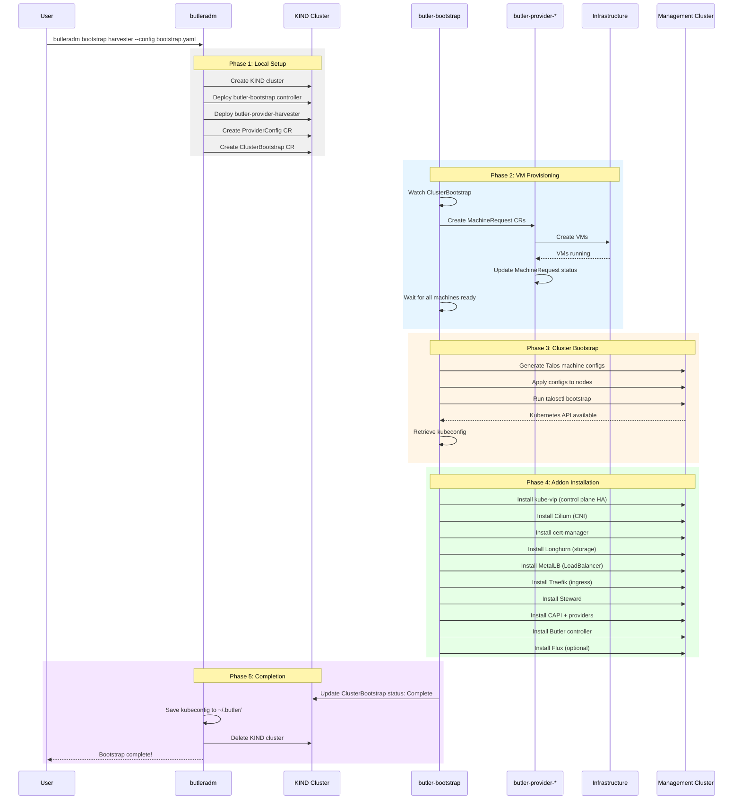
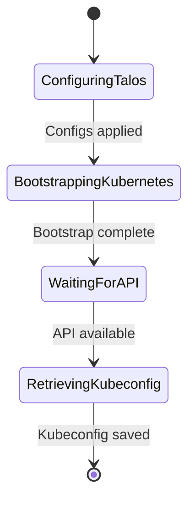

# Bootstrap Flow

This document describes how Butler bootstraps a management cluster from scratch.

## Overview

Bootstrapping creates a new Butler management cluster on your infrastructure. The process uses a temporary [KIND](https://kind.sigs.k8s.io/) cluster to orchestrate the bootstrap, then cleans up after completion.

## Prerequisites

- Docker installed on the bootstrap machine
- Infrastructure credentials (Harvester kubeconfig, Nutanix credentials, etc.)
- Network connectivity to the infrastructure
- IP addresses allocated for the management cluster

## Bootstrap Sequence



## Phases in Detail

### Phase 1: Local Setup

The CLI creates a temporary KIND cluster and deploys controllers:

```bash
# What happens internally
kind create cluster --name butler-bootstrap

# Deploy controllers
kubectl apply -f embedded-manifests/butler-bootstrap.yaml
kubectl apply -f embedded-manifests/butler-provider-harvester.yaml

# Create configuration CRs
kubectl apply -f provider-config.yaml
kubectl apply -f cluster-bootstrap.yaml
```

**Why KIND?**
- Provides a standard Kubernetes API for controllers
- Watch-based reconciliation instead of polling scripts
- Clean separation between orchestration and infrastructure
- Can pause/resume by preserving KIND cluster

### Phase 2: VM Provisioning

The bootstrap controller creates MachineRequest CRs, and the provider controller provisions VMs:

```yaml
apiVersion: butler.butlerlabs.dev/v1alpha1
kind: MachineRequest
metadata:
  name: butler-mgmt-cp-0
spec:
  role: controlplane
  providerConfigRef:
    name: harvester-config
  resources:
    cpu: 4
    memory: 16Gi
    disk: 100Gi
```

**Machine Roles:**
- `controlplane`: Control plane nodes (3 for HA, 1 for single-node)
- `worker`: Worker nodes (optional for management cluster)

### Phase 3: Cluster Bootstrap

Once VMs are running, Talos Linux is configured:

1. **Generate configs**: Create machine configs for each node
2. **Apply configs**: Push configs to nodes via Talos API
3. **Bootstrap**: Initialize etcd and Kubernetes
4. **Retrieve kubeconfig**: Get admin credentials



### Phase 4: Addon Installation

Platform addons are installed in dependency order:

| Order | Addon | Purpose | Depends On |
|-------|-------|---------|------------|
| 1 | kube-vip | Control plane VIP | None |
| 2 | Cilium | CNI with kube-proxy replacement | kube-vip |
| 3 | cert-manager | TLS certificates | Cilium |
| 4 | Longhorn | Distributed storage | cert-manager |
| 5 | MetalLB | LoadBalancer services | Cilium |
| 6 | Traefik | Ingress controller | MetalLB |
| 7 | Steward | Hosted control planes | cert-manager |
| 8 | CAPI | Cluster lifecycle | Steward |
| 9 | Butler Controller | Platform controller | CAPI |
| 10 | Flux | GitOps (optional) | Butler Controller |

### Phase 5: Completion

1. ClusterBootstrap status updated to `Complete`
2. Kubeconfig saved to `~/.butler/<cluster-name>-kubeconfig`
3. KIND cluster deleted
4. Summary printed to user

## Configuration

### ClusterBootstrap Spec

```yaml
apiVersion: butler.butlerlabs.dev/v1alpha1
kind: ClusterBootstrap
metadata:
  name: butler-mgmt
  namespace: butler-system
spec:
  provider: harvester  # or nutanix
  
  cluster:
    name: butler-mgmt
    controlPlaneEndpoint: 10.40.0.200
    kubernetesVersion: "v1.31.0"
    topology: ha  # ha (3 CP nodes) or single-node
    
    controlPlane:
      replicas: 3
      machineTemplate:
        cpu: 4
        memory: 16Gi
        diskSize: 100Gi

    workers:
      replicas: 3
      machineTemplate:
        cpu: 8
        memory: 32Gi
        diskSize: 200Gi

  networking:
    podCIDR: 10.244.0.0/16
    serviceCIDR: 10.96.0.0/12
    
  platform:
    cni: cilium
    storage: longhorn
    loadBalancer: metallb
    metalLBPool: 10.40.0.200-10.40.0.250
    
  gitops:
    enabled: true
    provider: flux
    repository: https://github.com/myorg/butler-mgmt-live
    branch: main
    path: clusters/butler-mgmt
    
  providerConfig:
    harvester:
      credentialsRef:
        name: harvester-kubeconfig
      namespace: default
      networkName: default/workloads
      imageName: default/talos-1.9
```

### Topology Options

| Topology | Control Planes | Workers | Use Case |
|----------|---------------|---------|----------|
| `ha` | 3 | 0-N | Production |
| `single-node` | 1 (schedulable) | 0 | Edge, dev, testing |

## Troubleshooting

### Common Issues

**VMs not provisioning:**
- Check provider credentials
- Verify network connectivity
- Check MachineRequest status: `kubectl get machinerequest -A`

**Talos bootstrap failing:**
- Verify control plane endpoint IP is correct
- Check Talos API connectivity
- Review Talos logs: `talosctl logs -n <node-ip>`

**Addon installation failing:**
- Check Helm release status
- Verify storage class availability (for stateful addons)
- Check pod logs in addon namespace

### Debug Mode

Use `--verbose` for detailed output:

```bash
butleradm bootstrap harvester --config bootstrap.yaml --verbose
```

### Preserving KIND Cluster

Use `--keep-kind` to preserve the bootstrap cluster for debugging:

```bash
butleradm bootstrap harvester --config bootstrap.yaml --keep-kind
```

Then inspect:

```bash
kubectl --context kind-butler-bootstrap get clusterbootstrap -A
kubectl --context kind-butler-bootstrap get machinerequest -A
```

## See Also

- [Getting Started](../getting-started/) - Quick start guide
- [Tenant Lifecycle](tenant-lifecycle.md) - How tenant clusters are created
- [Provider Guides](../providers/) - Infrastructure-specific setup
