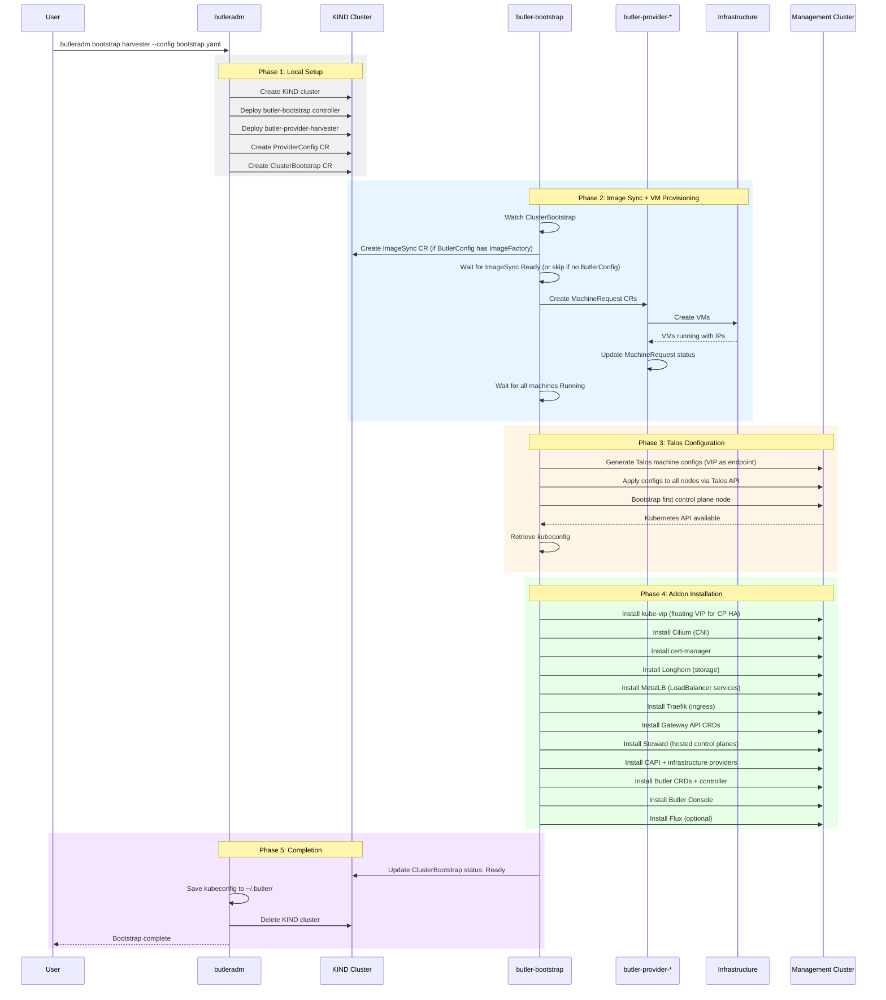
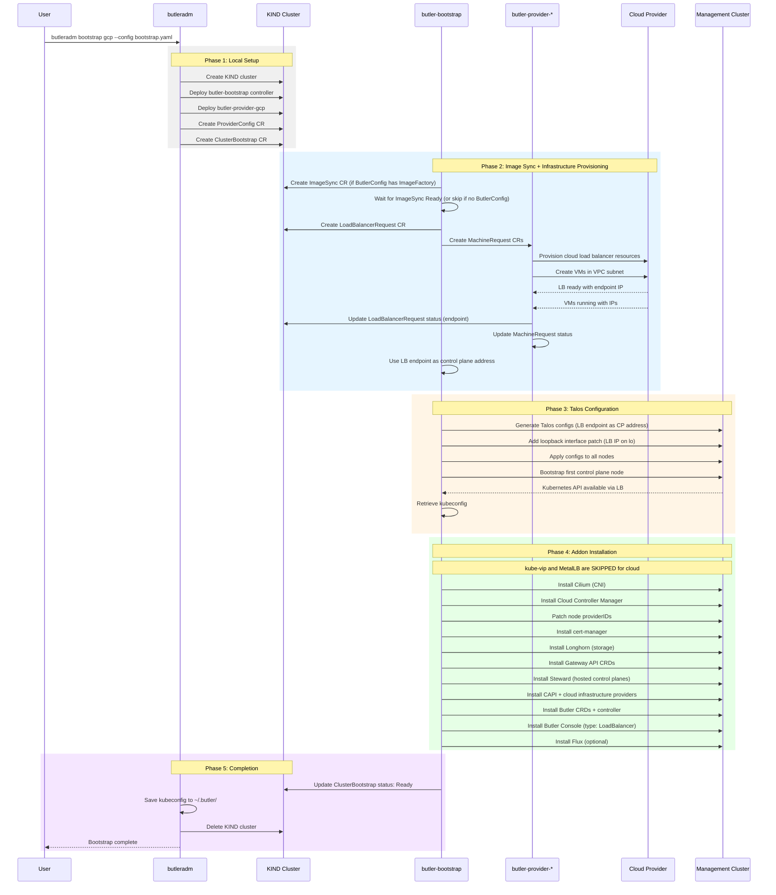

# Bootstrap Flow

This document describes how Butler bootstraps a management cluster from scratch, covering both on-prem and cloud provider paths.

## Overview

The bootstrap process creates a Butler management cluster from scratch. A temporary [KIND](https://kind.sigs.k8s.io/) cluster orchestrates the bootstrap, then is deleted on completion.

Two deployment models:

- **On-prem** (Harvester, Nutanix, Proxmox): Uses kube-vip for control plane HA with a floating virtual IP. MetalLB provides LoadBalancer services.
- **Cloud** (GCP, AWS, Azure): Uses a cloud-native L4 load balancer for control plane HA. Cloud load balancers handle services natively.

## Prerequisites

### Common

- Docker installed on the bootstrap machine
- `butleradm` CLI installed
- Network connectivity from the bootstrap machine to the infrastructure
- A Talos factory schematic ID for the boot image

### On-Prem

- Infrastructure credentials (Harvester kubeconfig, Nutanix Prism credentials, Proxmox API token)
- A static VIP address for the control plane endpoint (not in use by any other service)
- An IP range for MetalLB LoadBalancer services (must not overlap with the VIP)
- A VM image (Talos Linux) uploaded to the infrastructure

### Cloud

- Cloud credentials with compute and networking permissions
- A VPC/VNet with a subnet for cluster nodes
- Firewall rules allowing inter-node traffic: TCP 6443, 50000-50001, 2379-2380, 10250, 4240 and UDP 8472 (Cilium VXLAN)
- A VM image (Talos Linux) available in the target region

## On-Prem Bootstrap Sequence


```mermaid
sequenceDiagram
    participant User
    participant CLI as butleradm
    participant KIND as KIND Cluster
    participant Bootstrap as butler-bootstrap
    participant Provider as butler-provider-*
    participant Infra as Infrastructure
    participant MC as Management Cluster

    User->>CLI: butleradm bootstrap harvester --config bootstrap.yaml

    rect rgb(240, 240, 240)
        Note over CLI,KIND: Phase 1: Local Setup
        CLI->>KIND: Create KIND cluster
        CLI->>KIND: Deploy butler-bootstrap controller
        CLI->>KIND: Deploy butler-provider-harvester
        CLI->>KIND: Create ProviderConfig CR
        CLI->>KIND: Create ClusterBootstrap CR
    end

    rect rgb(230, 245, 255)
        Note over Bootstrap,Infra: Phase 2: Image Sync + VM Provisioning
        Bootstrap->>Bootstrap: Watch ClusterBootstrap
        Bootstrap->>KIND: Create ImageSync CR (if ButlerConfig has ImageFactory)
        Bootstrap->>Bootstrap: Wait for ImageSync Ready (or skip if no ButlerConfig)
        Bootstrap->>Provider: Create MachineRequest CRs
        Provider->>Infra: Create VMs
        Infra-->>Provider: VMs running with IPs
        Provider->>Provider: Update MachineRequest status
        Bootstrap->>Bootstrap: Wait for all machines Running
    end

    rect rgb(255, 245, 230)
        Note over Bootstrap,MC: Phase 3: Talos Configuration
        Bootstrap->>MC: Generate Talos machine configs (VIP as endpoint)
        Bootstrap->>MC: Apply configs to all nodes via Talos API
        Bootstrap->>MC: Bootstrap first control plane node
        MC-->>Bootstrap: Kubernetes API available
        Bootstrap->>Bootstrap: Retrieve kubeconfig
    end

    rect rgb(230, 255, 230)
        Note over Bootstrap,MC: Phase 4: Addon Installation
        Bootstrap->>MC: Install kube-vip (floating VIP for CP HA)
        Bootstrap->>MC: Install Cilium (CNI)
        Bootstrap->>MC: Install cert-manager
        Bootstrap->>MC: Install Longhorn (storage)
        Bootstrap->>MC: Install MetalLB (LoadBalancer services)
        Bootstrap->>MC: Install Traefik (ingress)
        Bootstrap->>MC: Install Gateway API CRDs
        Bootstrap->>MC: Install Steward (hosted control planes)
        Bootstrap->>MC: Install CAPI + infrastructure providers
        Bootstrap->>MC: Install Butler CRDs + controller
        Bootstrap->>MC: Install Butler Console
        Bootstrap->>MC: Install Flux (optional)
    end

    rect rgb(245, 230, 255)
        Note over CLI,KIND: Phase 5: Completion
        Bootstrap->>KIND: Update ClusterBootstrap status: Ready
        CLI->>CLI: Save kubeconfig to ~/.butler/
        CLI->>KIND: Delete KIND cluster
        CLI-->>User: Bootstrap complete
    end
```

## Cloud Bootstrap Sequence

Cloud bootstrap differs from on-prem in how the control plane endpoint is established. Instead of a floating VIP, a cloud-native L4 load balancer fronts the control plane nodes.


```mermaid
sequenceDiagram
    participant User
    participant CLI as butleradm
    participant KIND as KIND Cluster
    participant Bootstrap as butler-bootstrap
    participant Provider as butler-provider-*
    participant Cloud as Cloud Provider
    participant MC as Management Cluster

    User->>CLI: butleradm bootstrap gcp --config bootstrap.yaml

    rect rgb(240, 240, 240)
        Note over CLI,KIND: Phase 1: Local Setup
        CLI->>KIND: Create KIND cluster
        CLI->>KIND: Deploy butler-bootstrap controller
        CLI->>KIND: Deploy butler-provider-gcp
        CLI->>KIND: Create ProviderConfig CR
        CLI->>KIND: Create ClusterBootstrap CR
    end

    rect rgb(230, 245, 255)
        Note over Bootstrap,Cloud: Phase 2: Image Sync + Infrastructure Provisioning
        Bootstrap->>KIND: Create ImageSync CR (if ButlerConfig has ImageFactory)
        Bootstrap->>Bootstrap: Wait for ImageSync Ready (or skip if no ButlerConfig)
        Bootstrap->>KIND: Create LoadBalancerRequest CR
        Bootstrap->>Provider: Create MachineRequest CRs
        Provider->>Cloud: Provision cloud load balancer resources
        Provider->>Cloud: Create VMs in VPC subnet
        Cloud-->>Provider: LB ready with endpoint IP
        Cloud-->>Provider: VMs running with IPs
        Provider->>KIND: Update LoadBalancerRequest status (endpoint)
        Provider->>Provider: Update MachineRequest status
        Bootstrap->>Bootstrap: Use LB endpoint as control plane address
    end

    rect rgb(255, 245, 230)
        Note over Bootstrap,MC: Phase 3: Talos Configuration
        Bootstrap->>MC: Generate Talos configs (LB endpoint as CP address)
        Bootstrap->>MC: Add loopback interface patch (LB IP on lo)
        Bootstrap->>MC: Apply configs to all nodes
        Bootstrap->>MC: Bootstrap first control plane node
        MC-->>Bootstrap: Kubernetes API available via LB
        Bootstrap->>Bootstrap: Retrieve kubeconfig
    end

    rect rgb(230, 255, 230)
        Note over Bootstrap,MC: Phase 4: Addon Installation
        Note over Bootstrap,MC: kube-vip and MetalLB are SKIPPED for cloud
        Bootstrap->>MC: Install Cilium (CNI)
        Bootstrap->>MC: Install Cloud Controller Manager
        Bootstrap->>MC: Patch node providerIDs
        Bootstrap->>MC: Install cert-manager
        Bootstrap->>MC: Install Longhorn (storage)
        Bootstrap->>MC: Install Gateway API CRDs
        Bootstrap->>MC: Install Steward (hosted control planes)
        Bootstrap->>MC: Install CAPI + cloud infrastructure providers
        Bootstrap->>MC: Install Butler CRDs + controller
        Bootstrap->>MC: Install Butler Console (type: LoadBalancer)
        Bootstrap->>MC: Install Flux (optional)
    end

    rect rgb(245, 230, 255)
        Note over CLI,KIND: Phase 5: Completion
        Bootstrap->>KIND: Update ClusterBootstrap status: Ready
        CLI->>CLI: Save kubeconfig to ~/.butler/
        CLI->>KIND: Delete KIND cluster
        CLI-->>User: Bootstrap complete
    end
```

### Loopback Interface Patch

Cloud passthrough load balancers (GCP forwarding rules, AWS NLBs, Azure Standard LBs) deliver packets with the original destination IP unchanged. The kube-apiserver binds to `0.0.0.0:6443` but the kernel drops packets destined for an IP that is not assigned to any local interface.

To solve this, the bootstrap controller adds a Talos config patch that assigns the LB IP to the loopback interface on each control plane node:

```yaml
machine:
  network:
    interfaces:
      - interface: lo
        addresses:
          - 35.194.52.218/32  # The LB's external IP
```

This allows the kernel to accept packets routed through the load balancer and deliver them to kube-apiserver.

## Phases in Detail

### Phase 1: Local Setup

The CLI creates a temporary KIND cluster and deploys controllers:

```bash
butleradm bootstrap harvester --config bootstrap.yaml
```

Internally:
1. Creates a KIND cluster named `butler-bootstrap`
2. Deploys the butler-bootstrap controller
3. Deploys the appropriate provider controller (butler-provider-harvester, butler-provider-gcp, etc.)
4. Creates the ProviderConfig CR with infrastructure credentials
5. Creates the ClusterBootstrap CR that triggers reconciliation

**Why KIND?**
- Provides a standard Kubernetes API for controller-runtime
- Watch-based reconciliation instead of polling scripts
- Clean separation between orchestration and infrastructure
- Can preserve for debugging with `--skip-cleanup`

### Phase 2: Image Sync + VM Provisioning

The bootstrap controller calls `reconcileImageSync()` before creating VMs. When a `ButlerConfig` with `spec.imageFactory.url` exists in the KIND cluster, this step creates an `ImageSync` CR that downloads the Talos image from Butler Image Factory and uploads it to the infrastructure provider. ImageSync uses deduplication labels (`schematic-id`, `image-version`, `image-arch`, `provider-config`) so multiple bootstraps reuse a single synced image. The controller blocks until ImageSync reaches `Ready` before proceeding.

When no ButlerConfig exists in KIND (current default for `butleradm bootstrap`), ImageSync is skipped and images must be pre-uploaded to the provider. See each provider guide for image upload steps. Adding `ButlerConfig` creation to the bootstrap CLI is planned, which will make ImageSync the default path.

The bootstrap controller then creates MachineRequest CRs for each node defined in the ClusterBootstrap spec. The provider controller watches these resources, creates VMs, and reports IP addresses.

```yaml
apiVersion: butler.butlerlabs.dev/v1alpha1
kind: MachineRequest
metadata:
  name: butler-mgmt-cp-0
  namespace: butler-system
spec:
  providerRef:
    name: harvester-prod
    namespace: butler-system
  machineName: butler-mgmt-cp-0
  role: control-plane
  cpu: 4
  memoryMB: 16384
  diskGB: 100
```

For cloud providers, the controller also creates a LoadBalancerRequest after all VMs have IPs. The provider controller provisions the cloud load balancer and reports its endpoint.

### Phase 3: Talos Configuration

Once all VMs are running (and for cloud, the LB endpoint is ready):

1. **Generate configs**: Create Talos machine configs with the control plane endpoint
   - On-prem: endpoint is the VIP address from `network.vip`
   - Cloud: endpoint is the LB IP from `LoadBalancerRequest.status.endpoint`
2. **Apply configs**: Push configs to all nodes via Talos API (insecure mode, pre-bootstrap)
3. **Bootstrap**: Initialize etcd and Kubernetes on the first control plane node
4. **Retrieve kubeconfig**: Get admin credentials for the new cluster

### Phase 4: Addon Installation

Platform addons are installed in dependency order. The set of addons differs between on-prem and cloud:

| Step | Addon | On-Prem | Cloud | Purpose |
|------|-------|---------|-------|---------|
| 1 | kube-vip | Yes | Skip | Floating VIP for control plane HA. Cloud uses LB instead. |
| 2 | Cilium | Yes | Yes | CNI with kube-proxy replacement |
| 2.5 | Cloud Controller Manager | Skip | Yes | AWS: Helm chart. GCP: embedded DaemonSet. Azure: embedded Deployment. Runs in service-controller-only mode. |
| 2.6 | providerID patching | Skip | Yes | Patches `spec.providerID` on each node via kubectl. Required for CCM LB target registration. |
| 3 | cert-manager | Yes | Yes | TLS certificate automation |
| 4 | Longhorn | Yes | Yes | Distributed persistent storage. Replica count matches topology. |
| 5 | MetalLB | If pool set | Skip | LoadBalancer service implementation. Uses `network.loadBalancerPool` config. |
| 6 | Traefik | Yes | Skip | Ingress controller. Cloud uses CCM for LB services directly. |
| 7a | Gateway API CRDs | Yes | Yes | Gateway API custom resource definitions |
| 7b | Steward | Yes | Yes | Hosted tenant control planes |
| 8 | CAPI + providers | If enabled | If enabled | Cluster API for tenant worker lifecycle |
| 9 | Flux | If enabled | If enabled | GitOps controller |
| 9.5 | Butler CRDs | Yes | Yes | Butler custom resource definitions |
| 9.6 | ProviderConfig | Yes | Yes | Copies provider config from KIND to management cluster |
| 9.7 | Butler Addons | Yes | Yes | AddonDefinition catalog |
| 10 | Butler controller | Yes | Yes | Platform reconciliation controller |
| 11 | Butler | Yes | Yes | ButlerConfig and supporting resources |
| 11.5 | ButlerConfig exposure | Yes | Yes | Exposes ButlerConfig to management cluster |
| 12 | Butler Console | Optional | Optional | Web UI. On-prem: Ingress via Traefik. Cloud: `type: LoadBalancer` with cloud LB. |
| 12.5 | Azure LB backend pool | Skip | Azure only | Workaround for CCM v1.31 `vmType=standard` bug that doesn't auto-populate LB backend pools. Adds nodes to backend pool via Azure REST API. |

### Phase 5: Completion

1. ClusterBootstrap status updated to `Ready`
2. Kubeconfig saved to `~/.butler/<cluster-name>-kubeconfig`
3. Talosconfig saved to `~/.butler/<cluster-name>-talosconfig`
4. KIND cluster deleted (unless `--skip-cleanup` was passed)
5. Summary printed to the terminal

## Cloud Resources by Provider

Each cloud provider controller creates different resources to implement the L4 passthrough load balancer:

| Provider | Resources Created |
|----------|-------------------|
| GCP | Regional static IP, legacy HTTP health check, target pool, forwarding rule |
| AWS | Network Load Balancer (NLB), target group (TCP), listener on port 6443 |
| Azure | Public IP, Standard Load Balancer, health probe, load balancing rule, backend pool |

All providers use TCP passthrough. The kube-apiserver handles TLS directly.

## Topology Options

| Topology | Control Planes | Workers | kube-vip | Storage Replicas | Use Case |
|----------|---------------|---------|----------|-----------------|----------|
| `ha` | 3 (recommended) | 1+ | Yes (on-prem) | 3 | Production |
| `single-node` | 1 (schedulable) | 0 | Skipped | 1 | Dev, testing, edge |

Single-node topology skips kube-vip (no HA needed with one node), forces Longhorn replica count to 1, and skips the pivoting phase.

## Troubleshooting

### Common Issues

**VMs not provisioning:**
- Check provider credentials in the ProviderConfig Secret
- Verify network connectivity from KIND to the infrastructure API
- Check MachineRequest status: `kubectl get mr -n butler-system`
- Review provider controller logs: `kubectl logs -n butler-system deploy/butler-provider-*`

**Talos bootstrap failing:**
- Verify control plane endpoint is reachable from nodes
- Check Talos API connectivity: `talosctl --nodes <ip> version --insecure`
- Review Talos logs: `talosctl --nodes <ip> logs -f`

**Addon installation failing:**
- Check Helm release status on the management cluster
- Verify CNI is healthy before checking later addons (everything depends on Cilium)
- Check pod logs in the addon's namespace

**Cloud LB not provisioning:**
- Check LoadBalancerRequest status: `kubectl get lbr -n butler-system`
- Verify cloud API permissions (compute admin or equivalent)
- Check quota limits (static IPs, forwarding rules, NLBs)
- Review provider controller logs for API errors

**Cloud LB health check failures:**
- Verify firewall rules allow TCP 6443 from health check source ranges
- GCP health checks come from `130.211.0.0/22` and `35.191.0.0/16`
- AWS NLB health checks come from within the VPC
- Confirm kube-apiserver is listening on port 6443

### Cloud-Specific Failure Modes

**CCM deadlock (all cloud providers):**
Setting `--cloud-provider=external` on the kubelet adds an `node.cloudprovider.kubernetes.io/uninitialized` taint that blocks ALL pods until the CCM removes it. But the CCM is itself a pod, creating a deadlock. Butler avoids this by NOT setting the flag. The CCM runs in service-controller-only mode (handles `type: LoadBalancer` services) and does not manage node lifecycle. The providerID is patched directly via kubectl in step 2.6.

**Azure public IP quota exceeded:**
Standard Public IPs default to 3 per region on restricted and free-tier subscriptions. Single-node needs 2 PIPs (1 VM + 1 console LB). HA needs 6 (5 VMs + 1 LB). If you see `PublicIPCountLimitReached` in the provider logs, request a quota increase through the Azure portal under Subscription > Usage + quotas. Self-service quota increase via `az quota create` may fail on restricted subscriptions.

**Azure CCM backend pool empty:**
Azure CCM v1.31 with `vmType=standard` does not auto-populate LB backend pools. The initial backend sync runs before any LoadBalancer services exist, and no subsequent sync is triggered when the console service is created. Butler handles this automatically in step 12.5 by calling the Azure REST API to add each node's NIC to the backend pool. If step 12.5 fails, check the bootstrap controller logs for Azure REST API errors.

**GCP CCM nodeipam crash:**
The GCP CCM logs `error running controllers: the AllocateNodeCIDRs is not enabled` when the nodeipam controller tries to allocate pod CIDRs. This is expected because Cilium manages pod IPAM. Butler's embedded CCM manifest includes `--controllers=*,-nodeipam --allocate-node-cidrs=false` to disable the nodeipam controller.

**GCP CCM network tags missing:**
The GCP CCM logs `no node tags supplied...Abort creating firewall rule` when creating LoadBalancer service firewall rules. The CCM needs network tags on instances to scope rules. Butler's provider controller tags instances with the cluster name, and the CCM `cloud-config` includes `node-tags = <clusterName>`.

**providerID not set on nodes:**
Since the CCM runs in service-controller-only mode (no `--cloud-provider=external` flag on kubelet), it does not manage node lifecycle or set `spec.providerID`. The bootstrap controller patches providerIDs directly in step 2.6 using the format specific to each provider (e.g., `aws:///<zone>/<instance-id>`, `gce://<project>/<zone>/<instance>`, `azure:///subscriptions/...`). Without providerIDs, the CCM cannot map Kubernetes nodes to cloud instances for LB target registration.

**MetalLB ARP not working on cloud networks:**
Cloud networks (AWS VPC, GCP VPC, Azure VNet) do not forward L2 ARP broadcasts. kube-vip and MetalLB both rely on ARP to claim IP addresses. Butler automatically skips kube-vip and MetalLB for cloud providers, using a cloud load balancer for the control plane endpoint and the CCM for LoadBalancer services.

**Corporate proxy / Zscaler blocking KIND connectivity:**
The KIND bootstrap cluster runs inside a Docker container and may not have access to corporate DNS servers or Zscaler-proxied infrastructure endpoints (Harvester, Nutanix Prism Central). For Nutanix, use the `hostAliases` field in the provider config to inject `/etc/hosts` entries into the KIND container. For other providers, add entries to the Docker host's `/etc/hosts` or configure Docker's DNS settings.

### Preserving KIND Cluster

Use `--skip-cleanup` to preserve the bootstrap cluster for debugging:

```bash
butleradm bootstrap harvester --config bootstrap.yaml --skip-cleanup
```

Then inspect:

```bash
kubectl --context kind-butler-bootstrap get cb -n butler-system
kubectl --context kind-butler-bootstrap get mr -n butler-system
kubectl --context kind-butler-bootstrap get lbr -n butler-system  # cloud only
```

### Dry Run

Use `--dry-run` to validate the config and see what resources would be created without executing:

```bash
butleradm bootstrap gcp --config bootstrap.yaml --dry-run
```

## See Also

- [ClusterBootstrap CRD](../reference/crds/clusterbootstrap.md) - full spec reference
- [LoadBalancerRequest CRD](../reference/crds/loadbalancerrequest.md) - cloud LB provisioning
- [MachineRequest CRD](../reference/crds/machinerequest.md) - VM provisioning interface
- [Provider Guides](../getting-started/) -- Per-provider setup and configuration
