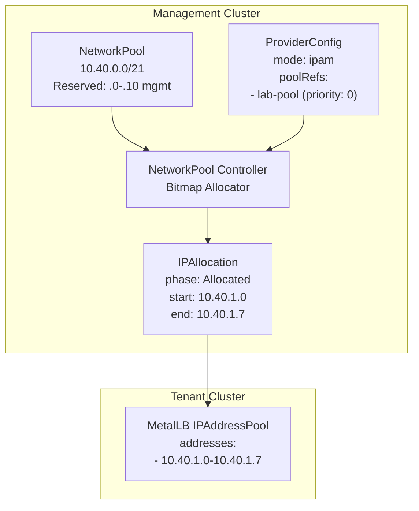
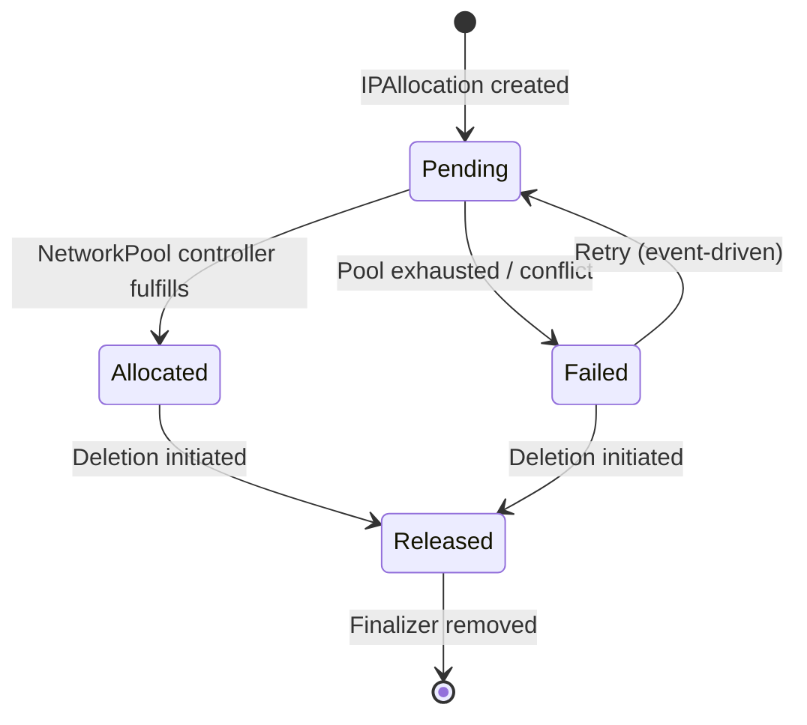
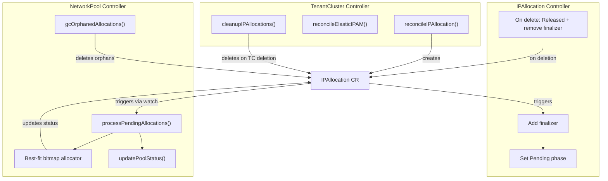
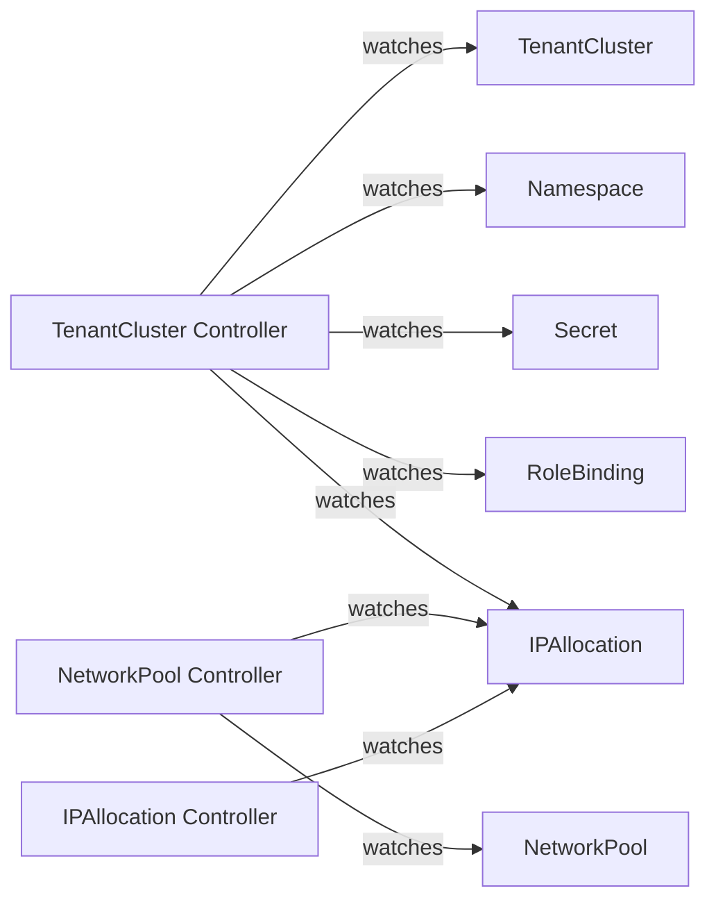
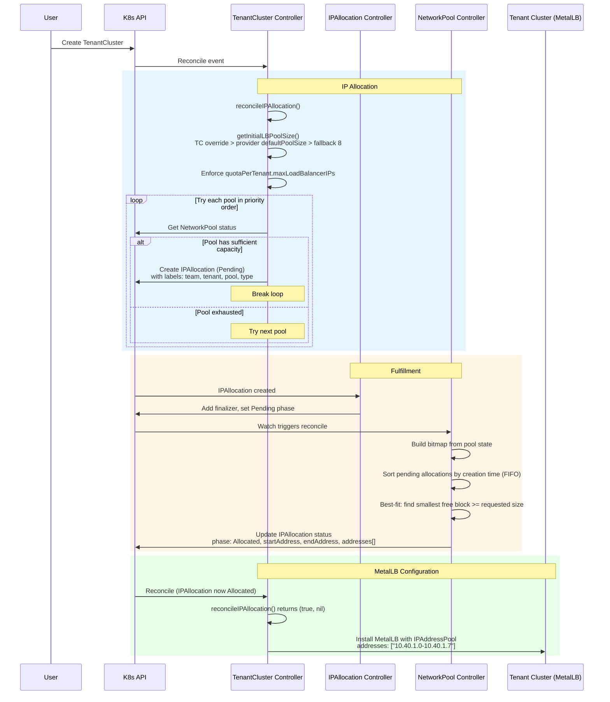
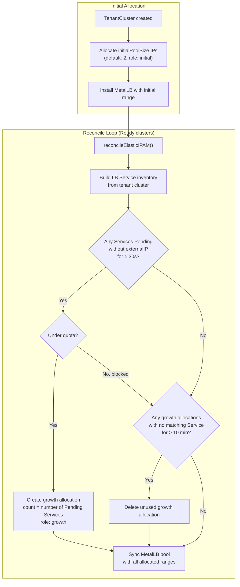
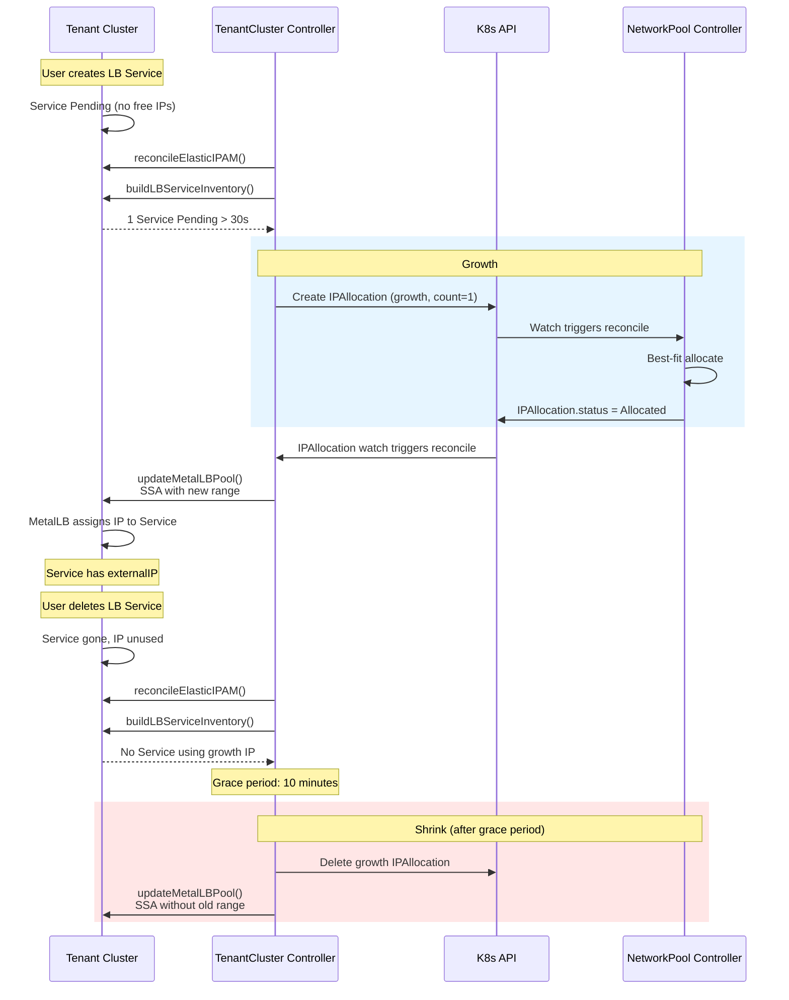
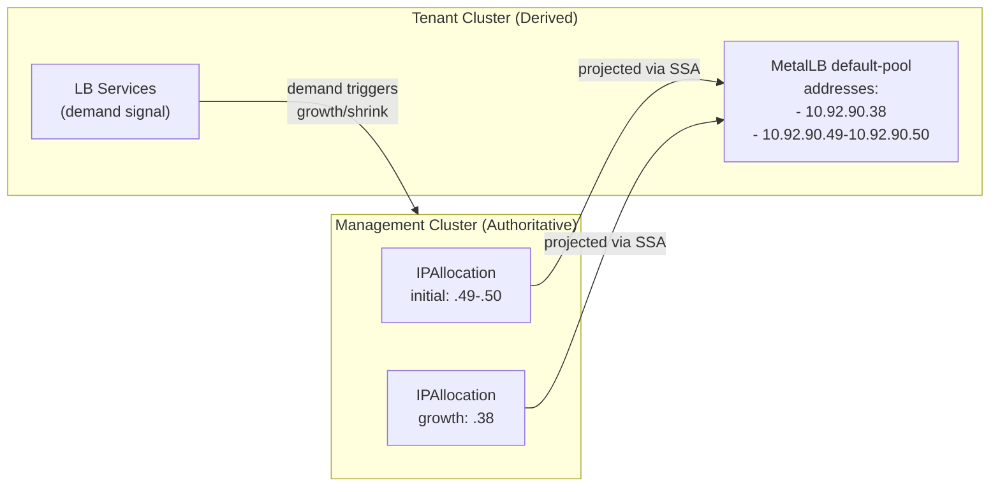
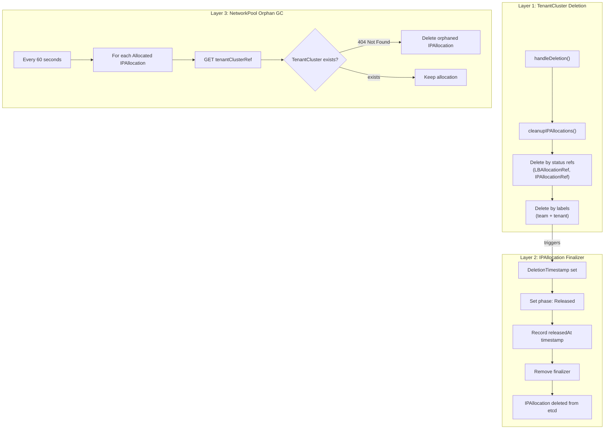

# IPAM Internals

This document covers the implementation of Butler's IP Address Management subsystem: the bitmap allocator, controller interactions, demand-driven elastic allocation, and garbage collection. For a user-facing introduction to IPAM concepts, see [Concepts: Networking](../concepts/networking.md).

The subsystem consists of three CRDs and four cooperating controllers:



Key design principles:

- **Single allocator**: The NetworkPool controller is the sole writer of IPAllocation status. This eliminates race conditions without distributed locking.
- **Demand-driven allocation**: Elastic growth fires when tenant LB Services are Pending without an IP. Shrink fires when allocated IPs have no matching Service for a sustained grace period. No speculative arithmetic.
- **Best-fit allocation**: The bitmap allocator selects the smallest free block that satisfies each request, reducing fragmentation over the pool's lifetime.
- **Management authoritative**: IPAllocation CRs on the management cluster are the desired state. MetalLB pools on tenants are projections. Drift is corrected on every sync.
- **Three-layer cleanup**: TenantCluster deletion, IPAllocation finalizers, and orphan garbage collection ensure IP addresses are always returned to the pool.
- **Cloud-native bypass**: Cloud providers skip the entire IPAM subsystem. When `spec.network.mode` is `cloud`, the TenantCluster controller returns early and the cloud provider's native LoadBalancer handles IP assignment.

## CRD Resources

### NetworkPool

A **NetworkPool** defines a block of IP addresses available for allocation to tenant clusters. It is a namespaced resource (typically created in `butler-system`) that tracks capacity, fragmentation, and allocation count.

**API Group**: `butler.butlerlabs.dev/v1alpha1`
**Scope**: Namespaced
**Short Name**: `np`

```yaml
apiVersion: butler.butlerlabs.dev/v1alpha1
kind: NetworkPool
metadata:
  name: lab-pool
  namespace: butler-system
spec:
  # The full CIDR block owned by this pool
  cidr: "10.40.0.0/21"

  # Ranges excluded from tenant allocation (e.g., management cluster, gateways)
  reserved:
    - cidr: "10.40.0.0/28"
      description: "Management cluster nodes and VIP"
    - cidr: "10.40.0.16/28"
      description: "Management cluster MetalLB pool"

  # Optional: constrain tenant allocations to a subset of the CIDR
  tenantAllocation:
    start: "10.40.1.0"
    end: "10.40.7.254"
    defaults:
      nodesPerTenant: 5    # Default node IPs per tenant (if IPAllocation.spec.count is unset)
      lbPoolPerTenant: 8   # Default LB IPs per tenant (if IPAllocation.spec.count is unset)
```

#### NetworkPool Status

The status is computed by the NetworkPool controller on every reconciliation cycle:

```yaml
status:
  totalIPs: 1774          # Usable IPs (total minus reserved)
  allocatedIPs: 48        # IPs assigned to active IPAllocations
  availableIPs: 1726      # totalIPs - allocatedIPs
  allocationCount: 6      # Number of active IPAllocations
  fragmentationPercent: 12 # 0 = contiguous free space, 100 = maximally fragmented
  largestFreeBlock: 1680  # Largest contiguous block available
  observedGeneration: 2
  conditions:
    - type: Ready
      status: "True"
      reason: Ready
      message: "1726/1774 IPs available (6 allocations)"
    - type: CapacityWarning
      status: "False"
      reason: UtilizationBelowThreshold
      message: "Pool utilization is 3% (48/1774 IPs)"
    - type: CapacityCritical
      status: "False"
      reason: UtilizationBelowThreshold
      message: "Pool utilization is 3% (48/1774 IPs)"
    - type: CapacityExhausted
      status: "False"
      reason: UtilizationBelowThreshold
      message: "Pool utilization is 3% (48/1774 IPs)"
```

#### Spec Fields

| Field | Type | Description |
|-------|------|-------------|
| `spec.cidr` | string | CIDR notation for the pool's address space (e.g., `10.40.0.0/21`) |
| `spec.reserved[]` | array | Ranges excluded from allocation |
| `spec.reserved[].cidr` | string | Reserved range in CIDR notation |
| `spec.reserved[].description` | string | Human-readable reason for the reservation |
| `spec.tenantAllocation` | object | Optional: constrains tenant allocations to a sub-range |
| `spec.tenantAllocation.start` | string | First allocatable IP |
| `spec.tenantAllocation.end` | string | Last allocatable IP |
| `spec.tenantAllocation.defaults.nodesPerTenant` | int32 | Default node IP count per tenant (default: 5) |
| `spec.tenantAllocation.defaults.lbPoolPerTenant` | int32 | Default LB IP count per tenant (default: 8) |

#### Status Fields

| Field | Type | Description |
|-------|------|-------------|
| `status.totalIPs` | int32 | Total usable IPs (excludes reserved) |
| `status.allocatedIPs` | int32 | IPs currently allocated |
| `status.availableIPs` | int32 | IPs available for new allocations |
| `status.allocationCount` | int32 | Number of active IPAllocations |
| `status.fragmentationPercent` | int32 | Free space fragmentation (0-100) |
| `status.largestFreeBlock` | int32 | Size of largest contiguous free block |
| `status.conditions[]` | []Condition | Standard Kubernetes conditions (see [Capacity Conditions](#capacity-conditions)) |
| `status.observedGeneration` | int64 | Last observed generation |

### IPAllocation

An **IPAllocation** represents a request for (and eventual assignment of) a contiguous block of IP addresses from a NetworkPool. It is created by the TenantCluster controller and fulfilled by the NetworkPool controller.

**API Group**: `butler.butlerlabs.dev/v1alpha1`
**Scope**: Namespaced
**Short Name**: `ipa`

```yaml
apiVersion: butler.butlerlabs.dev/v1alpha1
kind: IPAllocation
metadata:
  name: team-platform-prod-cluster-lb
  namespace: butler-system
  labels:
    butler.butlerlabs.dev/team: team-platform
    butler.butlerlabs.dev/tenant: prod-cluster
    butler.butlerlabs.dev/network-pool: lab-pool
    butler.butlerlabs.dev/allocation-type: loadbalancer
    butler.butlerlabs.dev/allocation-role: initial
spec:
  poolRef:
    name: lab-pool
  tenantClusterRef:
    name: prod-cluster
    namespace: team-platform
  type: loadbalancer    # "nodes" or "loadbalancer"
  count: 8              # Optional; defaults to pool's tenantAllocation.defaults
```

#### IPAllocation with Pinned Range

For cases where a specific IP range is required (for example, to preserve stable addresses across recreation):

```yaml
apiVersion: butler.butlerlabs.dev/v1alpha1
kind: IPAllocation
metadata:
  name: team-platform-prod-cluster-lb
  namespace: butler-system
spec:
  poolRef:
    name: lab-pool
  tenantClusterRef:
    name: prod-cluster
    namespace: team-platform
  type: loadbalancer
  pinnedRange:
    startAddress: "10.40.2.0"
    endAddress: "10.40.2.7"
```

#### IPAllocation Lifecycle



| Phase | Description |
|-------|-------------|
| `Pending` | Created by TenantCluster controller, awaiting fulfillment |
| `Allocated` | NetworkPool controller assigned an IP range |
| `Failed` | Allocation could not be fulfilled (pool exhausted, conflict) |
| `Released` | Deletion in progress; audit timestamp recorded |

#### Spec Fields

| Field | Type | Description |
|-------|------|-------------|
| `spec.poolRef` | LocalObjectReference | Name of the NetworkPool to allocate from |
| `spec.tenantClusterRef` | NamespacedObjectReference | The TenantCluster this allocation serves |
| `spec.type` | string | `nodes` or `loadbalancer` |
| `spec.count` | *int32 | Number of IPs requested (min: 1, optional) |
| `spec.pinnedRange` | object | Request a specific range instead of best-fit |
| `spec.pinnedRange.startAddress` | string | First IP of the pinned range |
| `spec.pinnedRange.endAddress` | string | Last IP of the pinned range |

#### Status Fields

| Field | Type | Description |
|-------|------|-------------|
| `status.phase` | string | Current lifecycle phase |
| `status.cidr` | string | Allocated range in CIDR or `start-end` format |
| `status.startAddress` | string | First IP in the allocated range |
| `status.endAddress` | string | Last IP in the allocated range |
| `status.addresses[]` | []string | All individual IPs in the allocated range |
| `status.allocatedCount` | int32 | Number of IPs allocated |
| `status.allocatedAt` | *Time | Timestamp of allocation |
| `status.allocatedBy` | string | Controller that performed the allocation |
| `status.releasedAt` | *Time | Timestamp of release (audit trail) |
| `status.conditions[]` | []Condition | Standard Kubernetes conditions |

### ProviderConfig Network Configuration

The ProviderConfig's `spec.network` section configures IPAM behavior for all tenant clusters using that provider.

```yaml
apiVersion: butler.butlerlabs.dev/v1alpha1
kind: ProviderConfig
metadata:
  name: harvester-prod
  namespace: butler-system
spec:
  provider: harvester
  credentialsRef:
    name: harvester-kubeconfig

  network:
    # Networking mode: "ipam" for Butler-managed, "cloud" for provider-native
    mode: ipam

    # Ordered list of NetworkPools (lower priority = tried first)
    poolRefs:
      - name: lab-pool-primary
        priority: 0
      - name: lab-pool-secondary
        priority: 10

    # Layer 2/3 network settings for provisioned VMs
    subnet: "10.40.0.0/21"
    gateway: "10.40.0.1"
    dnsServers:
      - "10.40.0.2"
      - "10.40.0.3"

    # LoadBalancer allocation configuration
    loadBalancer:
      defaultPoolSize: 8         # Static mode: IPs per tenant (default: 8)
      allocationMode: static     # "static" or "elastic" (default: static)
      initialPoolSize: 2         # Elastic mode: starting IPs (default: 2)
      growthIncrement: 2         # Elastic mode: IPs added per growth event (default: 2)

    # Per-tenant IP limits
    quotaPerTenant:
      maxNodeIPs: 20
      maxLoadBalancerIPs: 32
```

#### Network Field Reference

| Field | Type | Default | Description |
|-------|------|---------|-------------|
| `mode` | string | `cloud` | `ipam` for Butler-managed IPAM, `cloud` for provider-native |
| `poolRefs[]` | array | - | Ordered list of NetworkPool references |
| `poolRefs[].name` | string | - | NetworkPool name |
| `poolRefs[].priority` | int32 | 0 | Lower value = higher priority |
| `subnet` | string | - | Network subnet for VM provisioning |
| `gateway` | string | - | Default gateway |
| `dnsServers[]` | []string | - | DNS server addresses |
| `loadBalancer.defaultPoolSize` | int32 | 8 | IPs allocated per tenant in static mode |
| `loadBalancer.allocationMode` | string | `static` | `static` (fixed) or `elastic` (auto-scaling) |
| `loadBalancer.initialPoolSize` | int32 | 2 | Starting IPs per tenant in elastic mode |
| `loadBalancer.growthIncrement` | int32 | 2 | IPs added per elastic growth event |
| `quotaPerTenant.maxNodeIPs` | *int32 | - | Maximum node IPs per tenant (unset = unlimited) |
| `quotaPerTenant.maxLoadBalancerIPs` | *int32 | - | Maximum LB IPs per tenant (unset = unlimited) |

---

## Controllers

Four controllers cooperate to manage IP allocation:

| Controller | Package | Responsibility |
|------------|---------|----------------|
| **NetworkPool** | `internal/controller/networkpool/` | Sole allocator. Processes Pending IPAllocations using best-fit bitmap. Computes pool status. Runs orphan GC. |
| **IPAllocation** | `internal/controller/ipallocation/` | Thin lifecycle. Adds finalizer, sets initial Pending phase. On deletion: sets Released phase with timestamp, removes finalizer. |
| **TenantCluster** | `internal/controller/tenantcluster/` | Creates IPAllocations during provisioning. Runs demand-driven elastic IPAM on Ready clusters. Syncs MetalLB pools. Cleans up allocations on deletion. |
| **ProviderConfig** | `internal/controller/providerconfig/` | Validates pool availability for IPAM mode. Estimates tenant capacity from available IPs. |

### Controller Interaction



### Watch Relationships

The TenantCluster controller watches IPAllocation resources in addition to its primary resources. When an IPAllocation transitions from Pending to Allocated, the watch triggers a TenantCluster reconcile within seconds, rather than waiting for the timer-based requeue.



### Reconciliation Intervals

| Controller | Normal Requeue | Special Cases |
|------------|---------------|---------------|
| NetworkPool | 60 seconds | 5 seconds after processing pending allocations or GC |
| IPAllocation (Pending) | 15 seconds | Backstop; primary fulfillment is event-driven |
| IPAllocation (Failed) | 30 seconds | Backstop retry |
| IPAllocation (Allocated) | 5 minutes | Health check |
| TenantCluster (non-Ready) | 30 seconds | - |
| TenantCluster (Ready, < 1h old) | 1 minute | Elastic IPAM runs on each reconcile |
| TenantCluster (Ready, 1-24h old) | 5 minutes | - |
| TenantCluster (Ready, > 24h old) | 15 minutes | - |

---

## Allocation Flow

### Static IPAM

Static IPAM allocates a fixed number of LoadBalancer IPs when a TenantCluster is created. The allocation size does not change for the lifetime of the cluster.



**Step-by-step**:

1. A TenantCluster CR is created. The TenantCluster controller calls `reconcileIPAllocation()`.
2. The controller checks `ProviderConfig.spec.network.mode`. If not `ipam`, it returns immediately.
3. `getInitialLBPoolSize()` determines the allocation size using this precedence:
   - TenantCluster `spec.networking.lbPoolSize` override
   - ProviderConfig `spec.network.loadBalancer.defaultPoolSize`
   - Fallback: 8
4. The count is clamped to `quotaPerTenant.maxLoadBalancerIPs` if set.
5. The controller iterates through `spec.network.poolRefs` in priority order (lower value = higher priority).
6. For each pool, it checks `pool.status.availableIPs >= lbCount`. On the first pool with capacity, it creates an IPAllocation with standard labels.
7. The IPAllocation controller adds a finalizer and sets the phase to `Pending`.
8. The IPAllocation creation triggers the NetworkPool controller via a watch. The NetworkPool controller builds a bitmap, sorts pending allocations by creation timestamp (FIFO), and runs the best-fit allocator.
9. On success, the IPAllocation status is updated with the allocated range. On failure (pool exhausted), the phase is set to `Failed`.
10. On the next TenantCluster reconcile, `reconcileIPAllocation()` sees the Allocated phase and returns `(true, nil)`. The controller then installs MetalLB on the tenant cluster with the allocated address range.

### Elastic IPAM (Demand-Driven)

Elastic IPAM starts with a small initial allocation and grows or shrinks based on observed LoadBalancer Service demand on the tenant cluster. Growth fires when a Service is stuck Pending without an IP. Shrink fires when allocated IPs have no matching Service for a sustained grace period.



**Configuration**:

```yaml
spec:
  network:
    mode: ipam
    loadBalancer:
      allocationMode: elastic
      initialPoolSize: 2       # Start with 2 IPs
      growthIncrement: 1       # Add 1 IP per growth event
    quotaPerTenant:
      maxLoadBalancerIPs: 8    # Hard cap
```

#### Demand-driven growth

Growth is triggered by observed demand on the tenant cluster, not by arithmetic projections.

On each reconcile of a Ready cluster with elastic IPAM enabled:

1. `reconcileElasticIPAM()` lists all LB IPAllocations for the tenant.
2. It connects to the tenant cluster and builds a Service inventory: all Services of type LoadBalancer, their external IPs, and their age.
3. If any Service has been Pending without an externalIP for longer than 30 seconds, growth fires.
4. **Batch assessment**: The controller counts all Pending Services at once and creates enough growth allocations to cover all of them. If three Services are Pending, growth creates allocations for all three rather than handling one per reconcile cycle.
5. Each growth allocation is quota-checked (`totalAllocated + growthIncrement <= maxLoadBalancerIPs`) and capacity-checked against the pool.
6. Growth allocations are labeled `allocation-role: growth` and named `{namespace}-{name}-lb-{N}`.

The 30-second age threshold prevents the controller from racing with MetalLB. When a Service is first created, MetalLB may take a few seconds to assign an IP from the existing pool. The controller waits to confirm that MetalLB has no free IPs before triggering growth.

**Measured timing**: In production, a Pending Service triggers a growth allocation within one reconcile cycle. End-to-end, from Service creation to IP assignment, measured at 37 seconds: the controller detects the Pending Service, creates the growth IPAllocation, the NetworkPool controller fulfills it, MetalLB is updated with the new range, and MetalLB assigns the IP.

#### Demand-driven shrink

Shrink releases growth allocations whose IPs are not in use by any tenant LB Service.

1. For each growth allocation: check whether any IP in the allocation's range matches an externalIP on a tenant LB Service.
2. If no Service is using any IP from the allocation, and the allocation has been in this unused state for longer than the 10-minute grace period, the allocation is deleted.
3. `updateMetalLBPool()` then syncs the MetalLB pool on the tenant to reflect the reduced address set.

Shrink protections:

- **Initial allocations are never shrunk.** The allocation labeled `allocation-role: initial` is always preserved regardless of usage.
- **Pinned allocations are never shrunk.** Any allocation with a `spec.pinnedRange` is preserved regardless of role label or Service usage.
- **Grace period prevents thrashing.** A growth allocation must have no matching Service for 10 continuous minutes before it is eligible for release. Transient Service restarts do not trigger shrink.

**Measured timing**: After test Services were deleted, growth allocations were released at the 9-minute mark (the allocations were 37 seconds old when the Services were deleted, so the total age crossed the 10-minute threshold at ~9m23s, caught on the next reconcile).

#### MetalLB multi-range support

When elastic IPAM produces multiple allocations, the tenant cluster's MetalLB `IPAddressPool` contains multiple entries:

```yaml
apiVersion: metallb.io/v1beta1
kind: IPAddressPool
metadata:
  name: default-pool
  namespace: metallb-system
spec:
  addresses:
    - "10.40.1.0-10.40.1.1"    # Initial allocation
    - "10.40.1.8-10.40.1.8"    # Growth allocation
```

The MetalLB sync uses server-side apply with the `butler-controller/ipam` field manager, which overwrites any manual edits to `default-pool` on the tenant cluster. Operators who need custom MetalLB pools should create additional IPAddressPool resources with different names.

#### End-to-end demand-driven sequence



### Cloud Provider Bypass

When a ProviderConfig uses `mode: cloud` (the default), the entire IPAM subsystem is bypassed:

- `reconcileIPAllocation()` returns `(true, nil)` immediately.
- `isElasticIPAM()` returns `false`.
- No NetworkPool, IPAllocation, or MetalLB resources are created.
- The cloud provider's native LoadBalancer implementation handles IP assignment.

This means cloud-hosted Butler deployments (AWS, Azure, GCP) use the cloud's existing LoadBalancer controllers with no additional configuration.

---

## Design Evolution

Butler's IPAM originally used speculative arithmetic to decide when to grow and shrink elastic allocations. The controller computed `availableIPs = totalAllocated - platformServiceCount - tenantServiceCount` and triggered growth when `availableIPs < 1` or shrink when `availableIPs >= growthIncrement`.

This approach had a stable oscillation bug. With `growthIncrement=1` and all allocated IPs in use (e.g., 2 IPs allocated, 1 platform LB + 1 tenant LB), `availableIPs = 0` triggered growth. After the growth allocation was fulfilled, `availableIPs = 1`, which equaled `growthIncrement`, so shrink triggered. After shrink, `availableIPs = 0` again. This cycle repeated every reconcile interval (1-15 minutes depending on cluster age), creating continuous IPAllocation churn on 5 of 8 production tenant clusters.

The fix was to replace speculative arithmetic with observed demand. Growth now fires only when a real LB Service is stuck Pending without an IP. Shrink fires only when allocated IPs have no matching Service for a sustained period. The speculative computation was removed entirely.

The demand-driven approach eliminates the oscillation because there is no arithmetic equilibrium to destabilize. Growth requires a concrete signal (Pending Service), and shrink requires sustained absence of demand (no matching Service for 10 minutes). At rest, with no Pending Services and all allocated IPs either in use or within the grace period, the controller takes no action.

For the full design rationale, see [ADR-016: Demand-Driven IPAM](https://github.com/butlerdotdev/butler-controller/blob/main/docs/architecture/ADR-016-demand-driven-ipam.md).

---

## Authority Model

IPAllocation CRs on the management cluster are the desired state for IP ranges. MetalLB IPAddressPools on tenant clusters are projections of that state. If they disagree, the controller corrects the tenant to match management.



**Management writes, tenant reads.** The management cluster decides which IPs to allocate, from which pool, subject to which quotas. The tenant cluster tells management "I need IPs" (via a Pending Service); management decides which IPs and tells the tenant (via MetalLB pool update).

**Drift correction.** On every MetalLB sync, the controller computes the expected pool state from IPAllocations and applies it to the tenant via server-side apply with `Force: true`. If the tenant pool has been manually edited, the edit is overwritten. This happens automatically on every elastic IPAM reconcile.

Operators who need custom MetalLB pools on a tenant should create additional IPAddressPool resources with different names. Do not modify `default-pool` directly; the controller will revert the change.

---

## Best-Fit Bitmap Allocator

The allocator lives in `internal/ipam/allocator.go` and is a pure-function library with no Kubernetes dependencies. The NetworkPool controller is the sole caller.

### How It Works

1. **BuildBitmap**: Creates a boolean array representing the allocatable IP range. Each element corresponds to one IP address. `true` = used (reserved or allocated), `false` = free.

2. **findFreeBlocks**: Scans the bitmap linearly to find all contiguous runs of `false` values. Returns a list of `FreeBlock{StartOffset, EndOffset, Size}`.

3. **AllocateRange** (best-fit): Iterates through free blocks and selects the smallest block that can satisfy the requested count. Allocates from the start of the selected block.

4. **AllocatePinnedRange**: Validates that the requested start-end range falls within the allocatable range, then checks every bit in the bitmap to confirm no overlap with reserved or existing allocations.

5. **ComputeFragmentation**: Calculates `1 - (largestFreeBlock / totalFreeIPs)` as a percentage. A single contiguous free block yields 0% fragmentation. Many small scattered blocks approach 100%.

### Why Best-Fit

Best-fit allocation minimizes fragmentation over time compared to first-fit or next-fit strategies. By selecting the tightest-fitting free block, it preserves larger contiguous blocks for future allocations that may need them. This is important for long-lived pools where clusters are created and deleted repeatedly.

### Constraints

- **IPv4 only**: The allocator uses `uint32` arithmetic for IP addresses.
- **Maximum pool size**: 1,048,576 IPs (~1M, a /12 CIDR). Pools larger than this are rejected to prevent excessive memory usage.
- **Maximum enumeration**: `EnumerateIPs()` caps at 65,536 IPs per range to avoid generating oversized `status.addresses[]` arrays.

### Data Structures

```go
// PoolState decouples the allocator from Kubernetes types.
type PoolState struct {
    AllocatableStart string          // First IP available for allocation
    AllocatableEnd   string          // Last IP available for allocation
    ReservedCIDRs    []string        // CIDRs excluded from allocation
    ExistingAllocs   []AllocatedRange // Currently allocated ranges
}

// AllocationResult contains the result of a successful allocation.
type AllocationResult struct {
    Start     string   // First IP in allocated range
    End       string   // Last IP in allocated range
    CIDR      string   // CIDR notation if power-of-2 aligned, otherwise "start-end"
    Addresses []string // All individual IPs
    Count     int32    // Number of IPs allocated
}
```

### CIDR Formatting

The allocator formats the result as CIDR notation when the allocated range is power-of-2 aligned (e.g., `10.40.1.0/29` for 8 IPs starting at a /29 boundary). Otherwise, it uses `start-end` format (e.g., `10.40.1.3-10.40.1.10`). This affects `status.cidr` on the IPAllocation but does not change the allocated addresses.

---

## Cleanup and Garbage Collection

Butler uses a three-layer cleanup strategy to ensure IP addresses are always returned to the pool, even under failure conditions.



### Layer 1: TenantCluster Deletion

When a TenantCluster is deleted, `handleDeletion()` calls `cleanupIPAllocations()`. This uses two strategies to find all associated allocations:

1. **Status references**: Deletes the IPAllocations pointed to by `tc.Status.LBAllocationRef` and `tc.Status.IPAllocationRef`. This catches the primary allocation.

2. **Label-based discovery**: Lists all IPAllocations in `butler-system` matching `butler.butlerlabs.dev/team={namespace}` and `butler.butlerlabs.dev/tenant={name}`. This catches elastic growth allocations that are not tracked in the TenantCluster status.

A deduplication map prevents double-deletion of allocations found by both methods.

### Layer 2: IPAllocation Finalizer

Every IPAllocation has a finalizer (`butler.butlerlabs.dev/ipallocation`). When deletion is initiated:

1. The IPAllocation controller detects `DeletionTimestamp` is set.
2. It records the current time as `status.releasedAt` for audit purposes.
3. It sets the phase to `Released`.
4. It removes the finalizer, allowing Kubernetes to complete the deletion.

The `releasedAt` timestamp creates an audit trail: you can see when an IP range was released even after the allocation object is gone (if you capture the Released status update in logs or events).

### Layer 3: NetworkPool Orphan GC

The NetworkPool controller runs orphan garbage collection on every reconcile cycle (every 60 seconds). For each `Allocated` IPAllocation referencing this pool:

1. It reads `spec.tenantClusterRef.{name, namespace}`.
2. It attempts to GET the referenced TenantCluster.
3. If the TenantCluster returns 404 (Not Found), the allocation is orphaned and is deleted.

This is a safety net for edge cases where:
- The TenantCluster was force-deleted (finalizer removed manually).
- The TenantCluster's namespace was deleted before cleanup could run.
- A bug in the TenantCluster controller skipped `cleanupIPAllocations()`.

:::tip
Orphan GC only processes `Allocated` IPAllocations. Pending and Failed allocations are transient states handled by the normal allocation flow.
:::

---

## Labels and Discovery

All IPAllocations are labeled for efficient querying and cleanup:

| Label | Value | Purpose |
|-------|-------|---------|
| `butler.butlerlabs.dev/team` | Team namespace (e.g., `team-platform`) | Filter allocations by team |
| `butler.butlerlabs.dev/tenant` | TenantCluster name (e.g., `prod-cluster`) | Filter allocations by cluster |
| `butler.butlerlabs.dev/network-pool` | NetworkPool name (e.g., `lab-pool`) | Track which pool an allocation came from |
| `butler.butlerlabs.dev/allocation-type` | `loadbalancer` or `nodes` | Distinguish allocation purpose |
| `butler.butlerlabs.dev/allocation-role` | `initial` or `growth` | Distinguish the initial allocation from elastic growth allocations |

The `allocation-role` label determines shrink eligibility. Only allocations labeled `growth` are candidates for demand-driven shrink. The `initial` allocation is always preserved. During migration from older controller versions, the controller infers the role from the allocation name: the allocation matching `{team}-{tenant}-lb` is labeled `initial`, allocations matching `{team}-{tenant}-lb-{N}` are labeled `growth`, and allocations with a `spec.pinnedRange` or unrecognized names are labeled `initial` for safety.

The NetworkPool controller uses a field indexer on `spec.poolRef.name` for efficient listing of all IPAllocations referencing a given pool. This avoids full-list scans on every reconciliation.

---

## Quotas and Capacity Planning

### Per-Tenant Quotas

ProviderConfig enforces per-tenant IP limits:

```yaml
spec:
  network:
    quotaPerTenant:
      maxNodeIPs: 20
      maxLoadBalancerIPs: 32
```

Quota enforcement points:

1. **Initial allocation**: `reconcileIPAllocation()` clamps the requested count to `maxLoadBalancerIPs`.
2. **Elastic growth**: `reconcileElasticIPAM()` checks `totalAllocated + growthIncrement <= maxLoadBalancerIPs` before creating a growth allocation.

If the quota is reached, the controller logs a message and skips the growth. The cluster continues to operate with its current allocation.

### Pool Capacity Estimation

The ProviderConfig controller estimates how many tenant clusters a provider can support:

```
estimatedTenants = availableIPs / (nodesPerTenant + lbPerTenant)
```

This estimate is exposed in the ProviderConfig status, enabling capacity planning.

### Capacity Conditions

The NetworkPool controller maintains three always-present conditions on every NetworkPool. These conditions follow the standard `metav1.Condition` pattern and are queryable via `kubectl`, ArgoCD health checks, Flux kstatus, and butler-console.

| Condition | Threshold | Meaning |
|-----------|-----------|---------|
| `CapacityWarning` | 70% utilization | Pool is filling. Plan expansion. |
| `CapacityCritical` | 85% utilization | Pool is near capacity. Expansion is urgent. |
| `CapacityExhausted` | 95% utilization | Pool is effectively full. New allocations will likely fail. |

Each condition is `True` when utilization is at or above the threshold, `False` otherwise. The `lastTransitionTime` records when the condition last changed state, so operators can see how long a pool has been above a threshold.

```bash
# Check capacity conditions on all pools
kubectl get networkpool -n butler-system -o custom-columns=\
'NAME:.metadata.name,WARN:.status.conditions[?(@.type=="CapacityWarning")].status,CRIT:.status.conditions[?(@.type=="CapacityCritical")].status,EXHAUSTED:.status.conditions[?(@.type=="CapacityExhausted")].status'
```

### Capacity Events

The NetworkPool controller emits Kubernetes events at utilization thresholds:

| Utilization | Event Reason | Description |
|-------------|-------------|-------------|
| >= 70% | `PoolCapacityWarning` | Pool filling up |
| >= 85% | `PoolCapacityCritical` | Pool near capacity |
| >= 95% | `PoolCapacityExhausted` | Pool effectively full |
| Drops below threshold | `PoolCapacityRecovered` | Utilization returned below a threshold |

Events are rate-limited to one per 10 minutes per tier per pool. This prevents event spam on pools that sit above a threshold for extended periods.

```bash
kubectl get events -n butler-system --field-selector reason=PoolCapacityWarning
```

---

## Observability

### CRD Status Fields and Conditions

The primary observability mechanism for IPAM is CRD status. Every pool's utilization, fragmentation, and capacity tier is available via `kubectl`:

```bash
# Pool capacity overview
kubectl get networkpool -n butler-system

# Detailed pool status
kubectl describe networkpool -n butler-system <pool-name>

# Allocations for a specific tenant
kubectl get ipallocation -n butler-system \
  -l butler.butlerlabs.dev/tenant=my-cluster

# All growth allocations across all tenants
kubectl get ipallocation -n butler-system \
  -l butler.butlerlabs.dev/allocation-role=growth

# Allocation details
kubectl get ipallocation -n butler-system <name> -o yaml

# Which pools a provider uses
kubectl get providerconfig <name> -n butler-system \
  -o jsonpath='{.spec.network.poolRefs[*].name}'

# Pool events (capacity transitions, allocations, GC)
kubectl get events -n butler-system \
  --field-selector involvedObject.kind=NetworkPool

# Check MetalLB pool on a tenant cluster (for drift verification)
kubectl --kubeconfig <tenant-kubeconfig> \
  get ipaddresspool -n metallb-system default-pool -o yaml
```

### Integration with External Monitoring

Butler's IPAM signals through standard Kubernetes mechanisms: CRD status conditions, events, and status fields. Operators connect these to whatever monitoring stack they run:

- **ArgoCD / Flux**: Capacity conditions (`CapacityWarning`, `CapacityCritical`, `CapacityExhausted`) are standard Kubernetes conditions. ArgoCD health checks and Flux kstatus interpret them natively.
- **Event exporters**: Tools like kube-eventer or fluentd can capture capacity events for long-term storage beyond the API server's event TTL (default 1 hour).
- **Custom scripts**: CRD status fields (`allocatedIPs`, `availableIPs`, `fragmentationPercent`) are machine-readable via `kubectl -o json` or client-go.

:::note
Butler core does not ship Prometheus metrics endpoints, PrometheusRules, ServiceMonitors, or Grafana dashboards for IPAM. An optional `butler-ipam-metrics` addon for operators using prometheus-operator is planned as future work.
:::

---

## Examples

### Single Pool, Static IPAM

A simple setup with one pool and static allocation for an on-premises Harvester environment.

```yaml
---
apiVersion: butler.butlerlabs.dev/v1alpha1
kind: NetworkPool
metadata:
  name: lab-pool
  namespace: butler-system
spec:
  cidr: "10.40.0.0/22"
  reserved:
    - cidr: "10.40.0.0/28"
      description: "Management cluster control plane and VIP"
    - cidr: "10.40.0.16/28"
      description: "Management cluster MetalLB pool"
  tenantAllocation:
    start: "10.40.1.0"
    end: "10.40.3.254"
    defaults:
      nodesPerTenant: 5
      lbPoolPerTenant: 8
---
apiVersion: butler.butlerlabs.dev/v1alpha1
kind: ProviderConfig
metadata:
  name: harvester-lab
  namespace: butler-system
spec:
  provider: harvester
  credentialsRef:
    name: harvester-kubeconfig
  network:
    mode: ipam
    poolRefs:
      - name: lab-pool
        priority: 0
    subnet: "10.40.0.0/22"
    gateway: "10.40.0.1"
    dnsServers:
      - "10.40.0.2"
    loadBalancer:
      defaultPoolSize: 8
      allocationMode: static
```

With this configuration, each new TenantCluster receives 8 LoadBalancer IPs from the `lab-pool`. The pool has 766 usable IPs in the tenant allocation range (10.40.1.0 - 10.40.3.254), supporting approximately 58 tenants at 13 IPs each (5 nodes + 8 LB).

### Multi-Pool with Priority Failover

Two pools with priority-based failover. When the primary pool is exhausted, allocations automatically fall through to the secondary pool.

```yaml
---
apiVersion: butler.butlerlabs.dev/v1alpha1
kind: NetworkPool
metadata:
  name: prod-pool-primary
  namespace: butler-system
spec:
  cidr: "10.40.0.0/22"
  reserved:
    - cidr: "10.40.0.0/26"
      description: "Infrastructure services"
  tenantAllocation:
    start: "10.40.0.64"
    end: "10.40.3.254"
---
apiVersion: butler.butlerlabs.dev/v1alpha1
kind: NetworkPool
metadata:
  name: prod-pool-secondary
  namespace: butler-system
spec:
  cidr: "10.40.4.0/22"
  tenantAllocation:
    start: "10.40.4.0"
    end: "10.40.7.254"
---
apiVersion: butler.butlerlabs.dev/v1alpha1
kind: ProviderConfig
metadata:
  name: harvester-prod
  namespace: butler-system
spec:
  provider: harvester
  credentialsRef:
    name: harvester-kubeconfig
  network:
    mode: ipam
    poolRefs:
      - name: prod-pool-primary
        priority: 0      # Tried first
      - name: prod-pool-secondary
        priority: 10     # Fallback
    loadBalancer:
      defaultPoolSize: 8
      allocationMode: static
    quotaPerTenant:
      maxNodeIPs: 20
      maxLoadBalancerIPs: 32
```

### Elastic IPAM with Demand-Driven Scaling

Elastic mode for environments where most tenants need few LoadBalancer IPs but some may need many.

```yaml
---
apiVersion: butler.butlerlabs.dev/v1alpha1
kind: ProviderConfig
metadata:
  name: nutanix-elastic
  namespace: butler-system
spec:
  provider: nutanix
  credentialsRef:
    name: nutanix-creds
  network:
    mode: ipam
    poolRefs:
      - name: underlay-pool
        priority: 0
    loadBalancer:
      allocationMode: elastic
      initialPoolSize: 2       # Start with 2 IPs
      growthIncrement: 1       # Grow by 1 when needed
    quotaPerTenant:
      maxLoadBalancerIPs: 8    # Hard cap prevents runaway growth
```

With this configuration, a new TenantCluster starts with 2 LB IPs. In practice, Traefik (the platform ingress) uses 1 IP on bootstrap, leaving 1 IP as headroom. When a workload creates a LB Service that consumes the headroom IP and another Service goes Pending, the controller detects the Pending Service and allocates 1 more IP. If that Service is later deleted and its IP goes unused for 10 minutes, the growth allocation is released.

A production deployment with 8 tenants on this configuration shows that 5 of 8 tenants use both initial IPs at 100% (running both Traefik and a workload LB Service), while 3 tenants run at 50% utilization (Traefik only, second IP idle).

### Pinned Range for Stable Addresses

When a tenant cluster requires specific IP addresses (for example, DNS records that cannot be changed):

```yaml
apiVersion: butler.butlerlabs.dev/v1alpha1
kind: IPAllocation
metadata:
  name: team-platform-api-lb
  namespace: butler-system
  labels:
    butler.butlerlabs.dev/team: team-platform
    butler.butlerlabs.dev/tenant: api-prod
    butler.butlerlabs.dev/network-pool: lab-pool
    butler.butlerlabs.dev/allocation-type: loadbalancer
spec:
  poolRef:
    name: lab-pool
  tenantClusterRef:
    name: api-prod
    namespace: team-platform
  type: loadbalancer
  pinnedRange:
    startAddress: "10.40.2.0"
    endAddress: "10.40.2.7"
```

The NetworkPool controller validates that the pinned range is within the pool, does not overlap reserved ranges, and does not conflict with existing allocations. If validation passes, the range is allocated exactly as requested.

Pinned allocations are protected from demand-driven shrink regardless of their role label. Even if no tenant LB Service uses the IPs in a pinned range, the controller preserves the allocation.

:::warning
Pinned ranges bypass best-fit allocation. If the requested range is in the middle of a large free block, it splits the block into two smaller ones, increasing fragmentation.
:::

---

## Troubleshooting

### IPAllocation Stuck in Pending

**Symptoms**: IPAllocation shows `phase: Pending` for more than 60 seconds.

**Diagnosis**:

```bash
# Check the IPAllocation status
kubectl get ipallocation -n butler-system <name> -o yaml

# Check if the referenced pool exists and has capacity
kubectl get networkpool -n butler-system <pool-name>

# Check controller logs
kubectl logs -n butler-system -l app.kubernetes.io/name=butler-controller --tail=50
```

**Common causes**:

1. **Pool exhausted**: `availableIPs` on the pool is less than the requested count. Expand the pool or add a secondary pool to the ProviderConfig.
2. **Fragmentation**: Available IPs exist but no contiguous block is large enough. Check `fragmentationPercent` and `largestFreeBlock` in pool status.
3. **Controller not running**: Verify the butler-controller pod is healthy.

### IPAllocation in Failed State

**Symptoms**: IPAllocation shows `phase: Failed` with a condition message.

**Diagnosis**:

```bash
kubectl get ipallocation -n butler-system <name> \
  -o jsonpath='{.status.conditions[?(@.type=="Ready")].message}'
```

**Common causes**:

1. **Pool exhausted**: The condition message will contain "no contiguous block available". Add capacity.
2. **Pinned range conflict**: A pinned range overlaps with a reserved CIDR or existing allocation. Check `kubectl get ipallocation -n butler-system -o wide` for overlapping ranges.
3. **Invalid CIDR**: The pool's CIDR is malformed. Check pool validation conditions.

Failed allocations are retried by both the NetworkPool controller (event-driven, treats Failed as Pending) and the IPAllocation controller (backstop, every 30 seconds).

### Growth Allocation Not Firing

**Symptoms**: A tenant LB Service is stuck Pending but no growth IPAllocation appears.

**Diagnosis**:

```bash
# Confirm the Service is type LoadBalancer and has no externalIP
kubectl --kubeconfig <tenant-kubeconfig> get service -n <namespace> <name> -o yaml

# Check the TenantCluster's elastic IPAM configuration
kubectl get providerconfig <name> -n butler-system \
  -o jsonpath='{.spec.network.loadBalancer}'

# Check allocation count against quota
kubectl get ipallocation -n butler-system \
  -l butler.butlerlabs.dev/tenant=<cluster-name> \
  -o custom-columns='NAME:.metadata.name,COUNT:.spec.count,PHASE:.status.phase'

kubectl get providerconfig <name> -n butler-system \
  -o jsonpath='{.spec.network.quotaPerTenant.maxLoadBalancerIPs}'
```

**Common causes**:

1. **Static allocation mode**: Elastic growth only runs when `loadBalancer.allocationMode` is `elastic`. Static mode allocates once at creation and does not grow.
2. **Quota reached**: Total allocated IPs equal `maxLoadBalancerIPs`. The controller logs "quota would be exceeded" and skips growth.
3. **Service too new**: The controller waits 30 seconds after Service creation before treating it as a growth signal, to avoid racing with MetalLB assignment from existing free IPs.
4. **Tenant API unreachable**: If the controller cannot reach the tenant cluster's API server, it skips elastic IPAM for that tenant. Check controller logs for connection errors.
5. **Reconcile interval**: For a mature cluster (>24h old), the reconcile interval is 15 minutes. The worst case for detecting a Pending Service is the full interval. The IPAllocation watch accelerates follow-up reconciles after a growth allocation is fulfilled.

### Unexpected Shrink

**Symptoms**: A growth IPAllocation was deleted and the MetalLB pool shrank.

**Diagnosis**:

```bash
# Check controller logs for shrink events
kubectl logs -n butler-system -l app.kubernetes.io/name=butler-controller --tail=100 \
  | grep -i shrink

# Check remaining allocations
kubectl get ipallocation -n butler-system \
  -l butler.butlerlabs.dev/tenant=<cluster-name> \
  -o custom-columns='NAME:.metadata.name,ROLE:.metadata.labels.butler\.butlerlabs\.dev/allocation-role,PHASE:.status.phase'
```

**Common causes**:

1. **Service deleted**: The LB Service using the growth allocation's IP was deleted. After 10 minutes with no matching Service, the allocation is released. This is normal operation.
2. **MetalLB assigned a different IP**: If MetalLB assigned an IP from a different allocation's range (e.g., from the initial allocation's headroom), the growth allocation's IP may appear unused even though a Service exists. The controller checks the specific IP range of each growth allocation against actual Service IPs.

Shrink never touches the initial allocation or allocations with a `spec.pinnedRange`. If an unexpected shrink occurred, check whether the deleted allocation was labeled `growth` and lacked a pinned range.

### Orphaned Allocations

**Symptoms**: IPAllocations exist for TenantClusters that no longer exist.

**Resolution**: The NetworkPool controller's orphan GC runs every 60 seconds and automatically detects and deletes orphaned allocations. If you need to force cleanup:

```bash
# List allocations for a deleted cluster
kubectl get ipallocation -n butler-system \
  -l butler.butlerlabs.dev/tenant=deleted-cluster

# Manual deletion (if GC is not running)
kubectl delete ipallocation -n butler-system \
  -l butler.butlerlabs.dev/tenant=deleted-cluster
```

### NetworkPool Cannot Be Deleted

**Symptoms**: NetworkPool stuck in terminating state.

**Cause**: The pool has active IPAllocations. The finalizer blocks deletion until all allocations are Released.

```bash
# Check active allocations
kubectl get ipallocation -n butler-system \
  -l butler.butlerlabs.dev/network-pool=<pool-name>

# Delete the TenantClusters using this pool, or wait for their cleanup
```

### MetalLB Pool Drift

**Symptoms**: The MetalLB `default-pool` on a tenant cluster does not match the management-side IPAllocations.

The controller detects and corrects drift automatically. On every elastic IPAM reconcile, the controller computes the expected pool state from IPAllocations and applies it via server-side apply. Manual edits to `default-pool` are overwritten within one reconcile cycle.

If drift persists, check:

```bash
# Compare management-side allocations with tenant-side pool
kubectl get ipallocation -n butler-system \
  -l butler.butlerlabs.dev/tenant=<cluster-name>,butler.butlerlabs.dev/allocation-type=loadbalancer

kubectl --kubeconfig <tenant-kubeconfig> \
  get ipaddresspool -n metallb-system default-pool -o jsonpath='{.spec.addresses}'
```

If the ranges do not match, the controller will correct it on the next reconcile. If the tenant API server is unreachable, the sync is retried with exponential backoff on subsequent reconciles.

---

## See Also

- [Concepts: Networking](../concepts/networking.md) -- IPAM modes, NetworkPool overview, elastic scaling
- [Operations: IPAM](../operations/ipam.md) -- Capacity planning, bootstrap timing, operational procedures
- [Tenant Lifecycle](tenant-lifecycle.md) -- How tenant clusters are provisioned and managed
- [Addon System](addon-system.md) -- MetalLB installation as a platform addon
- [Bootstrap Flow](bootstrap-flow.md) -- Management cluster MetalLB setup
- [ADR-016: Demand-Driven IPAM](https://github.com/butlerdotdev/butler-controller/blob/main/docs/architecture/ADR-016-demand-driven-ipam.md) -- Design rationale
