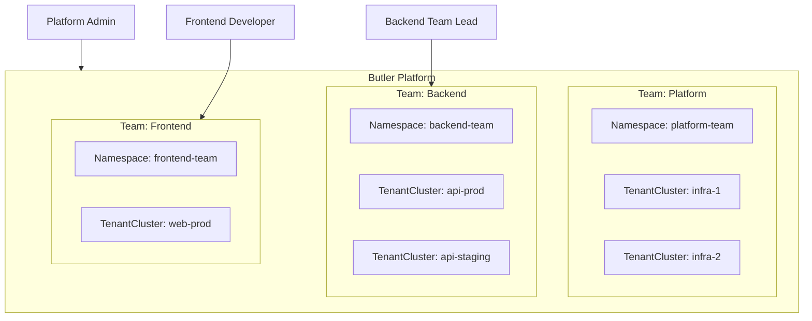
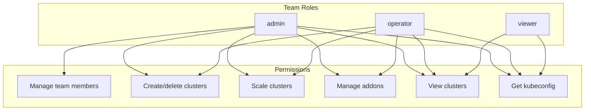

# Multi-Tenancy Architecture

This document describes Butler's multi-tenancy model for isolating teams and their resources.

## Table of Contents

- [Overview](#overview)
- [Team Resource](#team-resource)
- [Multi-Tenancy Modes](#multi-tenancy-modes)
- [RBAC Model](#rbac-model)
- [Resource Isolation](#resource-isolation)
- [Platform Administrators](#platform-administrators)

---

## Overview

Butler provides multi-tenancy through Teams, which are logical isolation boundaries that group users and resources. Teams enable organizations to:

- Isolate clusters and addons by team
- Delegate administration to team leads
- Apply quotas and defaults per team
- Audit access by team



## Team Resource

```yaml
apiVersion: butler.butlerlabs.dev/v1alpha1
kind: Team
metadata:
  name: backend-team
spec:
  displayName: "Backend Engineering"
  description: "API and services team"
  
  # User access
  access:
    users:
      - name: alice@example.com
        role: admin
      - name: bob@example.com
        role: operator
      - name: charlie@example.com
        role: viewer
    groups:
      - name: backend-engineers
        role: operator
        
  # Resource defaults for new clusters
  defaults:
    kubernetesVersion: "v1.30.0"
    workers:
      replicas: 3
      machineTemplate:
        cpu: 4
        memory: 8Gi
        
  # Resource quotas
  quotas:
    maxClusters: 10
    maxWorkersPerCluster: 20
    maxTotalWorkers: 100
```

### Team Fields

| Field | Description |
|-------|-------------|
| `displayName` | Human-readable team name |
| `description` | Team description |
| `access.users` | Individual user permissions |
| `access.groups` | Group-based permissions (from IdP) |
| `defaults` | Default values for new clusters |
| `quotas` | Resource limits for the team |

## Multi-Tenancy Modes

Butler supports three multi-tenancy modes configured in ButlerConfig:

```yaml
apiVersion: butler.butlerlabs.dev/v1alpha1
kind: ButlerConfig
metadata:
  name: butler
spec:
  multiTenancy:
    mode: Enforced  # enforced, optional, or disabled
```

### Mode Comparison

| Mode | Team Required | Use Case |
|------|---------------|----------|
| `enforced` | Yes | Enterprise with strict isolation |
| `optional` | No | Gradual adoption |
| `disabled` | No | Single team or simple setup |

### Enforced Mode

- All TenantClusters must belong to a team namespace
- Users can only access their team's resources
- Platform admins can access everything

### Optional Mode

- Teams available but not required
- Resources without a team are globally accessible
- Useful for migration to multi-tenancy

### Disabled Mode

- No team isolation
- All authenticated users see all resources
- Suitable for small deployments

## RBAC Model

### Team Roles



| Permission | admin | operator | viewer |
|------------|-------|----------|--------|
| Manage team members | Yes | No | No |
| Create/delete clusters | Yes | Yes | No |
| Scale clusters | Yes | Yes | No |
| Manage addons | Yes | Yes | No |
| View clusters | Yes | Yes | Yes |
| Get kubeconfig | Yes | Yes | Yes |

### Kubernetes RBAC Integration

Butler creates Kubernetes RBAC resources for each team:

```yaml
# Namespace for team resources
apiVersion: v1
kind: Namespace
metadata:
  name: backend-team
  labels:
    butler.butlerlabs.dev/team: backend-team
---
# RoleBinding for team admins
apiVersion: rbac.authorization.k8s.io/v1
kind: RoleBinding
metadata:
  name: team-admin
  namespace: backend-team
roleRef:
  apiGroup: rbac.authorization.k8s.io
  kind: ClusterRole
  name: butler-team-admin
subjects:
  - kind: User
    name: alice@example.com
---
# RoleBinding for team operators
apiVersion: rbac.authorization.k8s.io/v1
kind: RoleBinding
metadata:
  name: team-operator
  namespace: backend-team
roleRef:
  apiGroup: rbac.authorization.k8s.io
  kind: ClusterRole
  name: butler-team-operator
subjects:
  - kind: User
    name: bob@example.com
```

## Resource Isolation

### Namespace-Based Isolation

Each team gets a dedicated namespace:

```
backend-team/
├── TenantCluster/api-prod
├── TenantCluster/api-staging
├── TenantAddon/api-prod-monitoring
└── Secret/kubeconfigs
```

### Cross-Team Access

By default, teams cannot access each other's resources. Platform admins can grant cross-team access via:

```yaml
spec:
  access:
    crossTeamAccess:
      - team: platform-team
        role: viewer  # Can view but not modify
```

### Cluster Kubeconfig Isolation

Tenant cluster kubeconfigs are stored as Secrets in the team namespace:

```yaml
apiVersion: v1
kind: Secret
metadata:
  name: api-prod-kubeconfig
  namespace: backend-team
type: Opaque
data:
  kubeconfig: <base64-encoded>
```

Only users with team access can retrieve kubeconfigs.

## Platform Administrators

Platform admins have full access regardless of team membership.

### Identifying Platform Admins

**Method 1: Platform Team Convention**

Users in `platform-team` are automatically platform admins:

```yaml
apiVersion: butler.butlerlabs.dev/v1alpha1
kind: Team
metadata:
  name: platform-team
spec:
  displayName: "Platform Engineering"
  access:
    users:
      - name: platformadmin@example.com
        role: admin
```

**Method 2: User Annotation (Planned)**

```yaml
apiVersion: butler.butlerlabs.dev/v1alpha1
kind: User
metadata:
  name: user-admin
spec:
  email: admin@example.com
  platformAdmin: true
```

### Platform Admin Capabilities

| Capability | Team User | Platform Admin |
|------------|-----------|----------------|
| View all teams | No | Yes |
| Access any cluster | No | Yes |
| Manage platform config | No | Yes |
| Create teams | No | Yes |
| View management cluster | No | Yes |
| Manage ManagementAddons | No | Yes |

## See Also

- [Security Model](security-model.md) - Authentication and authorization
- [Getting Started](../getting-started/) - Create your first team
