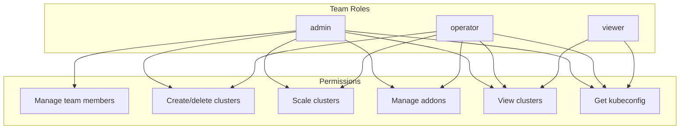

# Multi-Tenancy Implementation

This document covers the Kubernetes RBAC mapping, namespace isolation, and platform administrator implementation that support Butler's multi-tenancy model. For an introduction to Teams, roles, and multi-tenancy modes, see [Concepts: Multi-Tenancy](../concepts/multi-tenancy.md).

## RBAC Model

### Team Roles


```mermaid
flowchart TD
    subgraph Roles["Team Roles"]
        Admin["admin"]
        Operator["operator"]
        Viewer["viewer"]
    end

    subgraph Permissions["Permissions"]
        P1["Manage team members"]
        P2["Create/delete clusters"]
        P3["Scale clusters"]
        P4["Manage addons"]
        P5["View clusters"]
        P6["Get kubeconfig"]
    end

    Admin --> P1
    Admin --> P2
    Admin --> P3
    Admin --> P4
    Admin --> P5
    Admin --> P6

    Operator --> P2
    Operator --> P3
    Operator --> P4
    Operator --> P5
    Operator --> P6

    Viewer --> P5
    Viewer --> P6
```

| Permission | admin | operator | viewer |
|------------|-------|----------|--------|
| Manage team members | Yes | No | No |
| Create/delete clusters | Yes | Yes | No |
| Scale clusters | Yes | Yes | No |
| Manage addons | Yes | Yes | No |
| View clusters | Yes | Yes | Yes |
| Get kubeconfig | Yes | Yes | Yes |

### Kubernetes RBAC Integration

Butler creates Kubernetes RBAC resources for each team:

```yaml
# Namespace for team resources
apiVersion: v1
kind: Namespace
metadata:
  name: backend-team
  labels:
    butler.butlerlabs.dev/team: backend-team
---
# RoleBinding for team admins
apiVersion: rbac.authorization.k8s.io/v1
kind: RoleBinding
metadata:
  name: team-admin
  namespace: backend-team
roleRef:
  apiGroup: rbac.authorization.k8s.io
  kind: ClusterRole
  name: butler-team-admin
subjects:
  - kind: User
    name: alice@example.com
---
# RoleBinding for team operators
apiVersion: rbac.authorization.k8s.io/v1
kind: RoleBinding
metadata:
  name: team-operator
  namespace: backend-team
roleRef:
  apiGroup: rbac.authorization.k8s.io
  kind: ClusterRole
  name: butler-team-operator
subjects:
  - kind: User
    name: bob@example.com
```

## Resource Isolation

### Namespace-Based Isolation

Each team gets a dedicated namespace:

```
backend-team/
├── TenantCluster/api-prod
├── TenantCluster/api-staging
├── TenantAddon/api-prod-monitoring
└── Secret/kubeconfigs
```

### Cross-Team Access

By default, teams cannot access each other's resources. Platform admins have full access to all teams. Cross-team visibility for non-admin users is not currently supported but is planned for a future release.

### Cluster Kubeconfig Isolation

Tenant cluster kubeconfigs are stored as Secrets in the team namespace:

```yaml
apiVersion: v1
kind: Secret
metadata:
  name: api-prod-kubeconfig
  namespace: backend-team
type: Opaque
data:
  kubeconfig: <base64-encoded>
```

Only users with team access can retrieve kubeconfigs.

## Platform Administrators

Platform admins have full access regardless of team membership.

### Identifying Platform Admins

**Method 1: Platform Team Convention**

Users in `platform-team` are automatically platform admins:

```yaml
apiVersion: butler.butlerlabs.dev/v1alpha1
kind: Team
metadata:
  name: platform-team
spec:
  displayName: "Platform Engineering"
  access:
    users:
      - name: platformadmin@example.com
        role: admin
```

**Method 2: User Annotation (Planned)**

```yaml
apiVersion: butler.butlerlabs.dev/v1alpha1
kind: User
metadata:
  name: user-admin
spec:
  email: admin@example.com
  platformAdmin: true
```

### Platform Admin Capabilities

| Capability | Team User | Platform Admin |
|------------|-----------|----------------|
| View all teams | No | Yes |
| Access any cluster | No | Yes |
| Manage platform config | No | Yes |
| Create teams | No | Yes |
| View management cluster | No | Yes |
| Manage ManagementAddons | No | Yes |

## See Also

- [Concepts: Multi-Tenancy](../concepts/multi-tenancy.md) -- Teams, roles, and multi-tenancy modes
- [Getting Started](../getting-started/) -- Create your first team
