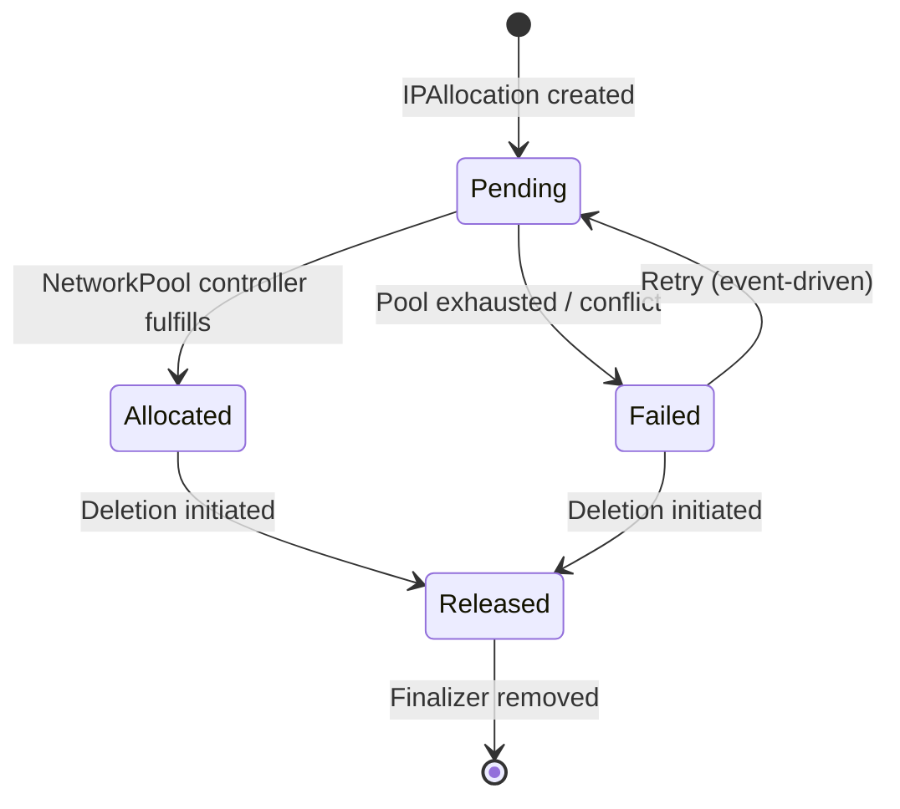
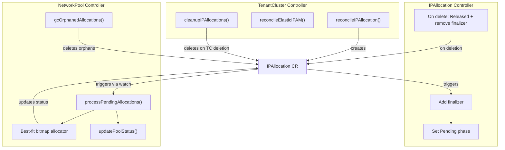
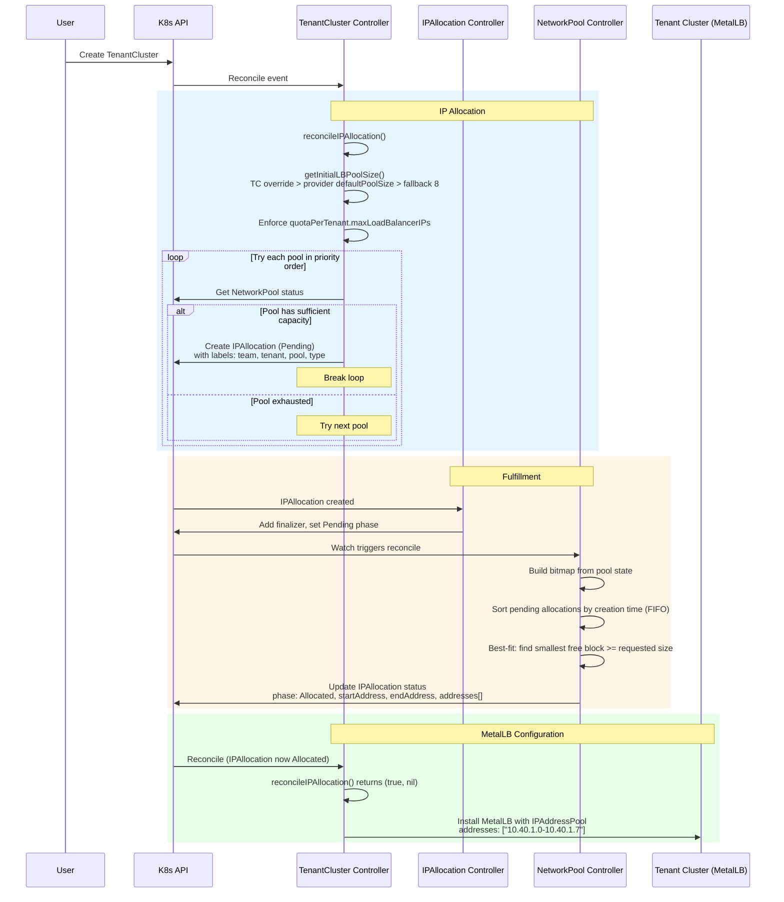
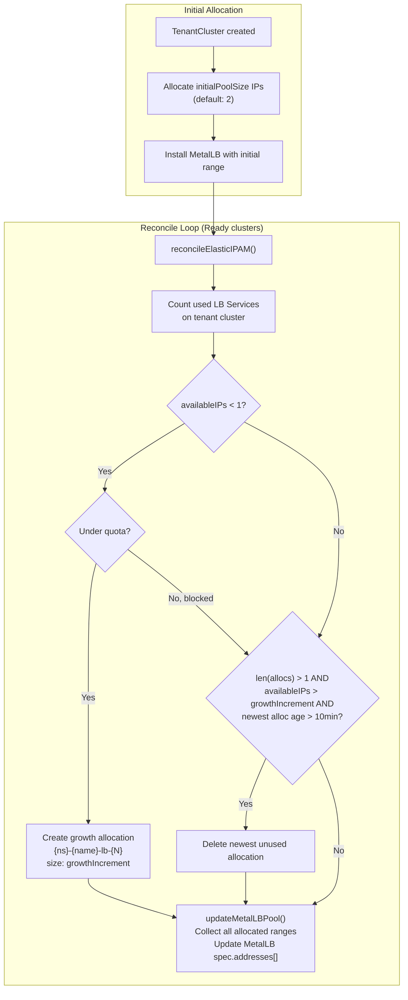
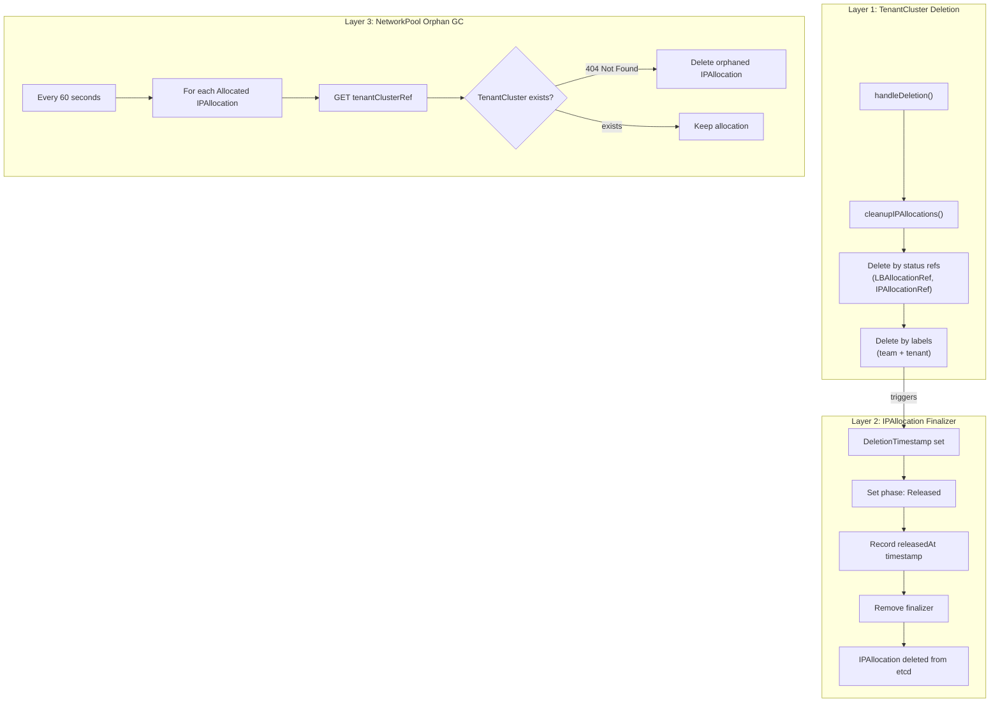

# Networking Architecture

This document describes Butler's networking subsystem, including IP Address Management (IPAM), network pool allocation, elastic scaling, and integration with MetalLB on tenant clusters.

## Table of Contents

- [Overview](#overview)
- [Networking Modes](#networking-modes)
- [CRD Resources](#crd-resources)
  - [NetworkPool](#networkpool)
  - [IPAllocation](#ipallocation)
  - [ProviderConfig Network Configuration](#providerconfig-network-configuration)
- [Controllers](#controllers)
- [Allocation Flow](#allocation-flow)
  - [Static IPAM](#static-ipam)
  - [Elastic IPAM](#elastic-ipam)
  - [Cloud Provider Bypass](#cloud-provider-bypass)
- [Best-Fit Bitmap Allocator](#best-fit-bitmap-allocator)
- [Cleanup and Garbage Collection](#cleanup-and-garbage-collection)
- [Labels and Discovery](#labels-and-discovery)
- [Quotas and Capacity Planning](#quotas-and-capacity-planning)
- [Observability](#observability)
- [Examples](#examples)
- [Troubleshooting](#troubleshooting)

---

## Overview

Butler's networking subsystem provides automated IP address management for on-premises tenant clusters. When tenant clusters run on bare-metal or hyperconverged infrastructure (Harvester, Nutanix, Proxmox), there is no cloud provider to assign LoadBalancer IPs. Butler fills this gap with a CRD-driven IPAM system that allocates contiguous IP ranges from administrator-defined pools and configures MetalLB on each tenant cluster.

The subsystem consists of three CRDs and four cooperating controllers:

```
                    ┌──────────────────────────────────────────────────┐
                    │              Management Cluster                  │
                    │                                                  │
                    │   ┌─────────────┐    ┌────────────────────────┐  │
                    │   │ NetworkPool │    │ ProviderConfig         │  │
                    │   │ 10.40.0.0/21│    │ mode: ipam             │  │
                    │   │             │    │ poolRefs:              │  │
                    │   │  Reserved:  │    │   - name: lab-pool     │  │
                    │   │  .0-.10 mgmt│    │     priority: 0        │  │
                    │   └──────┬──────┘    └────────────┬───────────┘  │
                    │          │                        │              │
                    │          ▼                        │              │
                    │   ┌─────────────┐                │              │
                    │   │ NetworkPool │◄───────────────┘              │
                    │   │ Controller  │                               │
                    │   │             │                               │
                    │   │ Bitmap      │   ┌─────────────────────┐     │
                    │   │ Allocator   │──▶│ IPAllocation         │     │
                    │   └─────────────┘   │ phase: Allocated     │     │
                    │                     │ start: 10.40.1.0     │     │
                    │                     │ end:   10.40.1.7     │     │
                    │                     └──────────┬──────────┘     │
                    │                                │                │
                    └────────────────────────────────┼────────────────┘
                                                     │
                                                     ▼
                    ┌──────────────────────────────────────────────────┐
                    │              Tenant Cluster                      │
                    │                                                  │
                    │   ┌──────────────────────────┐                  │
                    │   │ MetalLB IPAddressPool     │                  │
                    │   │ addresses:                │                  │
                    │   │   - 10.40.1.0-10.40.1.7  │                  │
                    │   └──────────────────────────┘                  │
                    │                                                  │
                    └──────────────────────────────────────────────────┘
```

Key design principles:

- **Single allocator**: The NetworkPool controller is the sole writer of IPAllocation status. This eliminates race conditions without distributed locking.
- **Best-fit allocation**: The bitmap allocator selects the smallest free block that satisfies each request, reducing fragmentation over the pool's lifetime.
- **Three-layer cleanup**: TenantCluster deletion, IPAllocation finalizers, and orphan garbage collection ensure IP addresses are always returned to the pool.
- **Cloud-native bypass**: Cloud providers skip the entire IPAM subsystem. When `spec.network.mode` is `cloud`, the TenantCluster controller returns early and the cloud provider's native LoadBalancer handles IP assignment.

---

## Networking Modes

Butler supports two networking modes, configured per ProviderConfig:

| Mode | IPAM Active | MetalLB Installed | Use Case |
|------|-------------|-------------------|----------|
| `ipam` | Yes | Yes | On-premises: Harvester, Nutanix, Proxmox |
| `cloud` | No | No | Cloud providers with native LoadBalancers |

The mode is set on the ProviderConfig:

```yaml
apiVersion: butler.butlerlabs.dev/v1alpha1
kind: ProviderConfig
metadata:
  name: harvester-prod
  namespace: butler-system
spec:
  provider: harvester
  network:
    mode: ipam  # or "cloud"
```

When mode is `cloud` (the default), the TenantCluster controller's `reconcileIPAllocation()` returns immediately with `(true, nil)`, and `isElasticIPAM()` returns `false`. No NetworkPool, IPAllocation, or MetalLB resources are created.

---

## CRD Resources

### NetworkPool

A **NetworkPool** defines a block of IP addresses available for allocation to tenant clusters. It is a namespaced resource (typically created in `butler-system`) that tracks capacity, fragmentation, and allocation count.

**API Group**: `butler.butlerlabs.dev/v1alpha1`
**Scope**: Namespaced
**Short Name**: `np`

```yaml
apiVersion: butler.butlerlabs.dev/v1alpha1
kind: NetworkPool
metadata:
  name: lab-pool
  namespace: butler-system
spec:
  # The full CIDR block owned by this pool
  cidr: "10.40.0.0/21"

  # Ranges excluded from tenant allocation (e.g., management cluster, gateways)
  reserved:
    - cidr: "10.40.0.0/28"
      description: "Management cluster nodes and VIP"
    - cidr: "10.40.0.16/28"
      description: "Management cluster MetalLB pool"

  # Optional: constrain tenant allocations to a subset of the CIDR
  tenantAllocation:
    start: "10.40.1.0"
    end: "10.40.7.254"
    defaults:
      nodesPerTenant: 5    # Default node IPs per tenant (if IPAllocation.spec.count is unset)
      lbPoolPerTenant: 8   # Default LB IPs per tenant (if IPAllocation.spec.count is unset)
```

#### NetworkPool Status

The status is computed by the NetworkPool controller on every reconciliation cycle:

```yaml
status:
  totalIPs: 1774          # Usable IPs (total minus reserved)
  allocatedIPs: 48        # IPs assigned to active IPAllocations
  availableIPs: 1726      # totalIPs - allocatedIPs
  allocationCount: 6      # Number of active IPAllocations
  fragmentationPercent: 12 # 0 = contiguous free space, 100 = maximally fragmented
  largestFreeBlock: 1680  # Largest contiguous block available
  observedGeneration: 2
  conditions:
    - type: Ready
      status: "True"
      reason: Ready
      message: "1726/1774 IPs available (6 allocations)"
```

#### Spec Fields

| Field | Type | Description |
|-------|------|-------------|
| `spec.cidr` | string | CIDR notation for the pool's address space (e.g., `10.40.0.0/21`) |
| `spec.reserved[]` | array | Ranges excluded from allocation |
| `spec.reserved[].cidr` | string | Reserved range in CIDR notation |
| `spec.reserved[].description` | string | Human-readable reason for the reservation |
| `spec.tenantAllocation` | object | Optional: constrains tenant allocations to a sub-range |
| `spec.tenantAllocation.start` | string | First allocatable IP |
| `spec.tenantAllocation.end` | string | Last allocatable IP |
| `spec.tenantAllocation.defaults.nodesPerTenant` | int32 | Default node IP count per tenant (default: 5) |
| `spec.tenantAllocation.defaults.lbPoolPerTenant` | int32 | Default LB IP count per tenant (default: 8) |

#### Status Fields

| Field | Type | Description |
|-------|------|-------------|
| `status.totalIPs` | int32 | Total usable IPs (excludes reserved) |
| `status.allocatedIPs` | int32 | IPs currently allocated |
| `status.availableIPs` | int32 | IPs available for new allocations |
| `status.allocationCount` | int32 | Number of active IPAllocations |
| `status.fragmentationPercent` | int32 | Free space fragmentation (0-100) |
| `status.largestFreeBlock` | int32 | Size of largest contiguous free block |
| `status.conditions[]` | []Condition | Standard Kubernetes conditions |
| `status.observedGeneration` | int64 | Last observed generation |

### IPAllocation

An **IPAllocation** represents a request for (and eventual assignment of) a contiguous block of IP addresses from a NetworkPool. It is created by the TenantCluster controller and fulfilled by the NetworkPool controller.

**API Group**: `butler.butlerlabs.dev/v1alpha1`
**Scope**: Namespaced
**Short Name**: `ipa`

```yaml
apiVersion: butler.butlerlabs.dev/v1alpha1
kind: IPAllocation
metadata:
  name: team-platform-prod-cluster-lb
  namespace: butler-system
  labels:
    butler.butlerlabs.dev/team: team-platform
    butler.butlerlabs.dev/tenant: prod-cluster
    butler.butlerlabs.dev/network-pool: lab-pool
    butler.butlerlabs.dev/allocation-type: loadbalancer
spec:
  poolRef:
    name: lab-pool
  tenantClusterRef:
    name: prod-cluster
    namespace: team-platform
  type: loadbalancer    # "nodes" or "loadbalancer"
  count: 8              # Optional; defaults to pool's tenantAllocation.defaults
```

#### IPAllocation with Pinned Range

For cases where a specific IP range is required (for example, to preserve stable addresses across recreation):

```yaml
apiVersion: butler.butlerlabs.dev/v1alpha1
kind: IPAllocation
metadata:
  name: team-platform-prod-cluster-lb
  namespace: butler-system
spec:
  poolRef:
    name: lab-pool
  tenantClusterRef:
    name: prod-cluster
    namespace: team-platform
  type: loadbalancer
  pinnedRange:
    startAddress: "10.40.2.0"
    endAddress: "10.40.2.7"
```

#### IPAllocation Lifecycle



| Phase | Description |
|-------|-------------|
| `Pending` | Created by TenantCluster controller, awaiting fulfillment |
| `Allocated` | NetworkPool controller assigned an IP range |
| `Failed` | Allocation could not be fulfilled (pool exhausted, conflict) |
| `Released` | Deletion in progress; audit timestamp recorded |

#### Spec Fields

| Field | Type | Description |
|-------|------|-------------|
| `spec.poolRef` | LocalObjectReference | Name of the NetworkPool to allocate from |
| `spec.tenantClusterRef` | NamespacedObjectReference | The TenantCluster this allocation serves |
| `spec.type` | string | `nodes` or `loadbalancer` |
| `spec.count` | *int32 | Number of IPs requested (min: 1, optional) |
| `spec.pinnedRange` | object | Request a specific range instead of best-fit |
| `spec.pinnedRange.startAddress` | string | First IP of the pinned range |
| `spec.pinnedRange.endAddress` | string | Last IP of the pinned range |

#### Status Fields

| Field | Type | Description |
|-------|------|-------------|
| `status.phase` | string | Current lifecycle phase |
| `status.cidr` | string | Allocated range in CIDR or `start-end` format |
| `status.startAddress` | string | First IP in the allocated range |
| `status.endAddress` | string | Last IP in the allocated range |
| `status.addresses[]` | []string | All individual IPs in the allocated range |
| `status.allocatedCount` | int32 | Number of IPs allocated |
| `status.allocatedAt` | *Time | Timestamp of allocation |
| `status.allocatedBy` | string | Controller that performed the allocation |
| `status.releasedAt` | *Time | Timestamp of release (audit trail) |
| `status.conditions[]` | []Condition | Standard Kubernetes conditions |

### ProviderConfig Network Configuration

The ProviderConfig's `spec.network` section configures IPAM behavior for all tenant clusters using that provider.

```yaml
apiVersion: butler.butlerlabs.dev/v1alpha1
kind: ProviderConfig
metadata:
  name: harvester-prod
  namespace: butler-system
spec:
  provider: harvester
  credentialsRef:
    name: harvester-kubeconfig

  network:
    # Networking mode: "ipam" for Butler-managed, "cloud" for provider-native
    mode: ipam

    # Ordered list of NetworkPools (lower priority = tried first)
    poolRefs:
      - name: lab-pool-primary
        priority: 0
      - name: lab-pool-secondary
        priority: 10

    # Layer 2/3 network settings for provisioned VMs
    subnet: "10.40.0.0/21"
    gateway: "10.40.0.1"
    dnsServers:
      - "10.40.0.2"
      - "10.40.0.3"

    # LoadBalancer allocation configuration
    loadBalancer:
      defaultPoolSize: 8         # Static mode: IPs per tenant (default: 8)
      allocationMode: static     # "static" or "elastic" (default: static)
      initialPoolSize: 2         # Elastic mode: starting IPs (default: 2)
      growthIncrement: 2         # Elastic mode: IPs added per growth event (default: 2)

    # Per-tenant IP limits
    quotaPerTenant:
      maxNodeIPs: 20
      maxLoadBalancerIPs: 32
```

#### Network Field Reference

| Field | Type | Default | Description |
|-------|------|---------|-------------|
| `mode` | string | `cloud` | `ipam` for Butler-managed IPAM, `cloud` for provider-native |
| `poolRefs[]` | array | - | Ordered list of NetworkPool references |
| `poolRefs[].name` | string | - | NetworkPool name |
| `poolRefs[].priority` | int32 | 0 | Lower value = higher priority |
| `subnet` | string | - | Network subnet for VM provisioning |
| `gateway` | string | - | Default gateway |
| `dnsServers[]` | []string | - | DNS server addresses |
| `loadBalancer.defaultPoolSize` | int32 | 8 | IPs allocated per tenant in static mode |
| `loadBalancer.allocationMode` | string | `static` | `static` (fixed) or `elastic` (auto-scaling) |
| `loadBalancer.initialPoolSize` | int32 | 2 | Starting IPs per tenant in elastic mode |
| `loadBalancer.growthIncrement` | int32 | 2 | IPs added per elastic growth event |
| `quotaPerTenant.maxNodeIPs` | *int32 | - | Maximum node IPs per tenant (unset = unlimited) |
| `quotaPerTenant.maxLoadBalancerIPs` | *int32 | - | Maximum LB IPs per tenant (unset = unlimited) |

---

## Controllers

Four controllers cooperate to manage IP allocation:

| Controller | Package | Responsibility |
|------------|---------|----------------|
| **NetworkPool** | `internal/controller/networkpool/` | Sole allocator. Processes Pending IPAllocations using best-fit bitmap. Computes pool status. Runs orphan GC. |
| **IPAllocation** | `internal/controller/ipallocation/` | Thin lifecycle. Adds finalizer, sets initial Pending phase. On deletion: sets Released phase with timestamp, removes finalizer. |
| **TenantCluster** | `internal/controller/tenantcluster/` | Creates IPAllocations during provisioning. Runs elastic IPAM on Ready clusters. Cleans up allocations on deletion. |
| **ProviderConfig** | `internal/controller/providerconfig/` | Validates pool availability for IPAM mode. Estimates tenant capacity from available IPs. |

### Controller Interaction



### Reconciliation Intervals

| Controller | Normal Requeue | Special Cases |
|------------|---------------|---------------|
| NetworkPool | 60 seconds | 5 seconds after processing pending allocations or GC |
| IPAllocation (Pending) | 15 seconds | Backstop; primary fulfillment is event-driven |
| IPAllocation (Failed) | 30 seconds | Backstop retry |
| IPAllocation (Allocated) | 5 minutes | Health check |
| TenantCluster (non-Ready) | 30 seconds | - |
| TenantCluster (Ready, < 1h old) | 1 minute | Elastic IPAM runs on each reconcile |
| TenantCluster (Ready, 1-24h old) | 5 minutes | - |
| TenantCluster (Ready, > 24h old) | 15 minutes | - |

---

## Allocation Flow

### Static IPAM

Static IPAM allocates a fixed number of LoadBalancer IPs when a TenantCluster is created. The allocation size does not change for the lifetime of the cluster.



**Step-by-step**:

1. A TenantCluster CR is created. The TenantCluster controller calls `reconcileIPAllocation()`.
2. The controller checks `ProviderConfig.spec.network.mode`. If not `ipam`, it returns immediately.
3. `getInitialLBPoolSize()` determines the allocation size using this precedence:
   - TenantCluster `spec.networking.lbPoolSize` override
   - ProviderConfig `spec.network.loadBalancer.defaultPoolSize`
   - Fallback: 8
4. The count is clamped to `quotaPerTenant.maxLoadBalancerIPs` if set.
5. The controller iterates through `spec.network.poolRefs` in priority order (lower value = higher priority).
6. For each pool, it checks `pool.status.availableIPs >= lbCount`. On the first pool with capacity, it creates an IPAllocation with standard labels.
7. The IPAllocation controller adds a finalizer and sets the phase to `Pending`.
8. The IPAllocation creation triggers the NetworkPool controller via a watch. The NetworkPool controller builds a bitmap, sorts pending allocations by creation timestamp (FIFO), and runs the best-fit allocator.
9. On success, the IPAllocation status is updated with the allocated range. On failure (pool exhausted), the phase is set to `Failed`.
10. On the next TenantCluster reconcile, `reconcileIPAllocation()` sees the Allocated phase and returns `(true, nil)`. The controller then installs MetalLB on the tenant cluster with the allocated address range.

### Elastic IPAM

Elastic IPAM starts with a small initial allocation and automatically grows or shrinks based on actual LoadBalancer usage on the tenant cluster.



**Configuration**:

```yaml
spec:
  network:
    mode: ipam
    loadBalancer:
      allocationMode: elastic
      initialPoolSize: 2       # Start with 2 IPs
      growthIncrement: 2       # Add 2 IPs each growth event
    quotaPerTenant:
      maxLoadBalancerIPs: 32   # Hard cap
```

**Growth logic** (runs on every Ready cluster reconcile):

1. `reconcileElasticIPAM()` lists all LB IPAllocations for the tenant cluster.
2. It connects to the tenant cluster and counts LoadBalancer Services with assigned IPs.
3. `availableIPs = totalAllocated - usedIPs`.
4. If `availableIPs < 1`:
   - Check quota: `totalAllocated + growthIncrement <= maxLoadBalancerIPs`.
   - Find a pool with `availableIPs >= growthIncrement`.
   - Create a new IPAllocation named `{namespace}-{name}-lb-{N}` (where N is the allocation index).
5. The NetworkPool controller fulfills the new allocation. On the next reconcile, `updateMetalLBPool()` collects all allocated ranges and updates the MetalLB `IPAddressPool.spec.addresses[]` with multiple ranges.

**Shrink logic** (runs in the same reconcile):

1. If `len(allocs) > 1` (at least one growth allocation exists) AND `availableIPs > growthIncrement`:
   - Find the newest allocation (by index, skipping index 0, the initial allocation).
   - Check that it is `Allocated` and older than 10 minutes (cooldown to prevent thrashing).
   - Delete it.
2. `updateMetalLBPool()` updates MetalLB to reflect the reduced address set.

**MetalLB multi-range support**: When elastic IPAM produces multiple allocations, the tenant cluster's MetalLB `IPAddressPool` contains multiple entries:

```yaml
apiVersion: metallb.io/v1beta1
kind: IPAddressPool
metadata:
  name: butler-lb-pool
  namespace: metallb-system
spec:
  addresses:
    - "10.40.1.0-10.40.1.1"    # Initial allocation
    - "10.40.1.8-10.40.1.9"    # Growth allocation 1
    - "10.40.2.4-10.40.2.5"    # Growth allocation 2
```

### Cloud Provider Bypass

When a ProviderConfig uses `mode: cloud` (the default), the entire IPAM subsystem is bypassed:

- `reconcileIPAllocation()` returns `(true, nil)` immediately.
- `isElasticIPAM()` returns `false`.
- No NetworkPool, IPAllocation, or MetalLB resources are created.
- The cloud provider's native LoadBalancer implementation handles IP assignment.

This means cloud-hosted Butler deployments (AWS, Azure, GCP) use the cloud's existing LoadBalancer controllers with no additional configuration.

---

## Best-Fit Bitmap Allocator

The allocator lives in `internal/ipam/allocator.go` and is a pure-function library with no Kubernetes dependencies. The NetworkPool controller is the sole caller.

### How It Works

1. **BuildBitmap**: Creates a boolean array representing the allocatable IP range. Each element corresponds to one IP address. `true` = used (reserved or allocated), `false` = free.

2. **findFreeBlocks**: Scans the bitmap linearly to find all contiguous runs of `false` values. Returns a list of `FreeBlock{StartOffset, EndOffset, Size}`.

3. **AllocateRange** (best-fit): Iterates through free blocks and selects the smallest block that can satisfy the requested count. Allocates from the start of the selected block.

4. **AllocatePinnedRange**: Validates that the requested start-end range falls within the allocatable range, then checks every bit in the bitmap to confirm no overlap with reserved or existing allocations.

5. **ComputeFragmentation**: Calculates `1 - (largestFreeBlock / totalFreeIPs)` as a percentage. A single contiguous free block yields 0% fragmentation. Many small scattered blocks approach 100%.

### Why Best-Fit

Best-fit allocation minimizes fragmentation over time compared to first-fit or next-fit strategies. By selecting the tightest-fitting free block, it preserves larger contiguous blocks for future allocations that may need them. This is important for long-lived pools where clusters are created and deleted repeatedly.

### Constraints

- **IPv4 only**: The allocator uses `uint32` arithmetic for IP addresses.
- **Maximum pool size**: 1,048,576 IPs (~1M, a /12 CIDR). Pools larger than this are rejected to prevent excessive memory usage.
- **Maximum enumeration**: `EnumerateIPs()` caps at 65,536 IPs per range to avoid generating oversized `status.addresses[]` arrays.

### Data Structures

```go
// PoolState decouples the allocator from Kubernetes types.
type PoolState struct {
    AllocatableStart string          // First IP available for allocation
    AllocatableEnd   string          // Last IP available for allocation
    ReservedCIDRs    []string        // CIDRs excluded from allocation
    ExistingAllocs   []AllocatedRange // Currently allocated ranges
}

// AllocationResult contains the result of a successful allocation.
type AllocationResult struct {
    Start     string   // First IP in allocated range
    End       string   // Last IP in allocated range
    CIDR      string   // CIDR notation if power-of-2 aligned, otherwise "start-end"
    Addresses []string // All individual IPs
    Count     int32    // Number of IPs allocated
}
```

### CIDR Formatting

The allocator formats the result as CIDR notation when the allocated range is power-of-2 aligned (e.g., `10.40.1.0/29` for 8 IPs starting at a /29 boundary). Otherwise, it uses `start-end` format (e.g., `10.40.1.3-10.40.1.10`). This affects `status.cidr` on the IPAllocation but does not change the allocated addresses.

---

## Cleanup and Garbage Collection

Butler uses a three-layer cleanup strategy to ensure IP addresses are always returned to the pool, even under failure conditions.



### Layer 1: TenantCluster Deletion

When a TenantCluster is deleted, `handleDeletion()` calls `cleanupIPAllocations()`. This uses two strategies to find all associated allocations:

1. **Status references**: Deletes the IPAllocations pointed to by `tc.Status.LBAllocationRef` and `tc.Status.IPAllocationRef`. This catches the primary allocation.

2. **Label-based discovery**: Lists all IPAllocations in `butler-system` matching `butler.butlerlabs.dev/team={namespace}` and `butler.butlerlabs.dev/tenant={name}`. This catches elastic growth allocations that are not tracked in the TenantCluster status.

A deduplication map prevents double-deletion of allocations found by both methods.

### Layer 2: IPAllocation Finalizer

Every IPAllocation has a finalizer (`butler.butlerlabs.dev/ipallocation`). When deletion is initiated:

1. The IPAllocation controller detects `DeletionTimestamp` is set.
2. It records the current time as `status.releasedAt` for audit purposes.
3. It sets the phase to `Released`.
4. It removes the finalizer, allowing Kubernetes to complete the deletion.

The `releasedAt` timestamp creates an audit trail: you can see when an IP range was released even after the allocation object is gone (if you capture the Released status update in logs or events).

### Layer 3: NetworkPool Orphan GC

The NetworkPool controller runs orphan garbage collection on every reconcile cycle (every 60 seconds). For each `Allocated` IPAllocation referencing this pool:

1. It reads `spec.tenantClusterRef.{name, namespace}`.
2. It attempts to GET the referenced TenantCluster.
3. If the TenantCluster returns 404 (Not Found), the allocation is orphaned and is deleted.

This is a safety net for edge cases where:
- The TenantCluster was force-deleted (finalizer removed manually).
- The TenantCluster's namespace was deleted before cleanup could run.
- A bug in the TenantCluster controller skipped `cleanupIPAllocations()`.

:::tip
Orphan GC only processes `Allocated` IPAllocations. Pending and Failed allocations are transient states handled by the normal allocation flow.
:::

---

## Labels and Discovery

All IPAllocations are labeled for efficient querying and cleanup:

| Label | Value | Purpose |
|-------|-------|---------|
| `butler.butlerlabs.dev/team` | Team namespace (e.g., `team-platform`) | Filter allocations by team |
| `butler.butlerlabs.dev/tenant` | TenantCluster name (e.g., `prod-cluster`) | Filter allocations by cluster |
| `butler.butlerlabs.dev/network-pool` | NetworkPool name (e.g., `lab-pool`) | Track which pool an allocation came from |
| `butler.butlerlabs.dev/allocation-type` | `loadbalancer` or `nodes` | Distinguish allocation purpose |

The NetworkPool controller uses a field indexer on `spec.poolRef.name` for efficient listing of all IPAllocations referencing a given pool. This avoids full-list scans on every reconciliation.

---

## Quotas and Capacity Planning

### Per-Tenant Quotas

ProviderConfig enforces per-tenant IP limits:

```yaml
spec:
  network:
    quotaPerTenant:
      maxNodeIPs: 20
      maxLoadBalancerIPs: 32
```

Quota enforcement points:

1. **Initial allocation**: `reconcileIPAllocation()` clamps the requested count to `maxLoadBalancerIPs`.
2. **Elastic growth**: `reconcileElasticIPAM()` checks `totalAllocated + growthIncrement <= maxLoadBalancerIPs` before creating a growth allocation.

If the quota is reached, the controller logs a message and skips the growth. The cluster continues to operate with its current allocation.

### Pool Capacity Estimation

The ProviderConfig controller estimates how many tenant clusters a provider can support:

```
estimatedTenants = availableIPs / (nodesPerTenant + lbPerTenant)
```

This is exposed as the `butler_provider_config_estimated_tenants` Prometheus metric and in the ProviderConfig status, enabling capacity planning dashboards.

### Pool Capacity Events

The NetworkPool controller emits Kubernetes events at utilization thresholds:

| Utilization | Event Type | Event Reason |
|-------------|------------|--------------|
| >= 80% | Warning | `PoolCapacityWarning` |
| >= 90% | Warning | `PoolCapacityDanger` |
| 100% | Warning | `PoolExhausted` |

Monitor these events to trigger capacity expansion before pools are fully consumed:

```bash
kubectl get events -n butler-system --field-selector reason=PoolCapacityWarning
```

---

## Observability

### Prometheus Metrics

The NetworkPool controller exports the following metrics:

| Metric | Type | Labels | Description |
|--------|------|--------|-------------|
| `butler_network_pool_total_ips` | Gauge | `pool`, `namespace` | Total usable IPs (excludes reserved) |
| `butler_network_pool_allocated_ips` | Gauge | `pool`, `namespace` | Currently allocated IPs |
| `butler_network_pool_available_ips` | Gauge | `pool`, `namespace` | Available IPs |
| `butler_network_pool_allocation_count` | Gauge | `pool`, `namespace` | Number of active IPAllocations |
| `butler_network_pool_fragmentation_percent` | Gauge | `pool`, `namespace` | Free space fragmentation (0-100) |
| `butler_network_pool_largest_free_block` | Gauge | `pool`, `namespace` | Largest contiguous free block |
| `butler_ip_allocation_processed_total` | Counter | `pool`, `namespace`, `result` | Total allocations processed (`success` or `failed`) |

### Example Alerting Rules

```yaml
groups:
  - name: butler-ipam
    rules:
      - alert: NetworkPoolNearExhaustion
        expr: |
          butler_network_pool_available_ips / butler_network_pool_total_ips < 0.1
        for: 10m
        labels:
          severity: warning
        annotations:
          summary: "NetworkPool {{ $labels.pool }} is over 90% utilized"
          description: >
            Pool {{ $labels.pool }} in namespace {{ $labels.namespace }} has
            {{ $value | humanizePercentage }} capacity remaining.

      - alert: NetworkPoolExhausted
        expr: butler_network_pool_available_ips == 0
        for: 5m
        labels:
          severity: critical
        annotations:
          summary: "NetworkPool {{ $labels.pool }} is fully exhausted"
          description: >
            No IPs available in pool {{ $labels.pool }}. New tenant clusters
            cannot receive LoadBalancer allocations until capacity is freed.

      - alert: NetworkPoolHighFragmentation
        expr: butler_network_pool_fragmentation_percent > 50
        for: 30m
        labels:
          severity: warning
        annotations:
          summary: "NetworkPool {{ $labels.pool }} has high fragmentation"
          description: >
            Pool fragmentation is {{ $value }}%. The largest contiguous free block
            is {{ with printf "butler_network_pool_largest_free_block{pool='%s'}" $labels.pool | query }}{{ . | first | value }}{{ end }} IPs.
```

### Useful kubectl Commands

```bash
# View all pools and their capacity
kubectl get networkpool -n butler-system

# View allocations for a specific tenant cluster
kubectl get ipallocation -n butler-system \
  -l butler.butlerlabs.dev/tenant=my-cluster

# View allocation details
kubectl get ipallocation -n butler-system my-allocation -o yaml

# Check which pools a provider uses
kubectl get providerconfig harvester-prod -n butler-system \
  -o jsonpath='{.spec.network.poolRefs[*].name}'

# View pool events (capacity warnings, allocations, GC)
kubectl get events -n butler-system \
  --field-selector involvedObject.kind=NetworkPool
```

---

## Examples

### Single Pool, Static IPAM

A simple setup with one pool and static allocation for an on-premises Harvester environment.

```yaml
---
apiVersion: butler.butlerlabs.dev/v1alpha1
kind: NetworkPool
metadata:
  name: lab-pool
  namespace: butler-system
spec:
  cidr: "10.40.0.0/22"
  reserved:
    - cidr: "10.40.0.0/28"
      description: "Management cluster control plane and VIP"
    - cidr: "10.40.0.16/28"
      description: "Management cluster MetalLB pool"
  tenantAllocation:
    start: "10.40.1.0"
    end: "10.40.3.254"
    defaults:
      nodesPerTenant: 5
      lbPoolPerTenant: 8
---
apiVersion: butler.butlerlabs.dev/v1alpha1
kind: ProviderConfig
metadata:
  name: harvester-lab
  namespace: butler-system
spec:
  provider: harvester
  credentialsRef:
    name: harvester-kubeconfig
  network:
    mode: ipam
    poolRefs:
      - name: lab-pool
        priority: 0
    subnet: "10.40.0.0/22"
    gateway: "10.40.0.1"
    dnsServers:
      - "10.40.0.2"
    loadBalancer:
      defaultPoolSize: 8
      allocationMode: static
```

With this configuration, each new TenantCluster receives 8 LoadBalancer IPs from the `lab-pool`. The pool has 766 usable IPs in the tenant allocation range (10.40.1.0 - 10.40.3.254), supporting approximately 58 tenants at 13 IPs each (5 nodes + 8 LB).

### Multi-Pool with Priority Failover

Two pools with priority-based failover. When the primary pool is exhausted, allocations automatically fall through to the secondary pool.

```yaml
---
apiVersion: butler.butlerlabs.dev/v1alpha1
kind: NetworkPool
metadata:
  name: prod-pool-primary
  namespace: butler-system
spec:
  cidr: "10.40.0.0/22"
  reserved:
    - cidr: "10.40.0.0/26"
      description: "Infrastructure services"
  tenantAllocation:
    start: "10.40.0.64"
    end: "10.40.3.254"
---
apiVersion: butler.butlerlabs.dev/v1alpha1
kind: NetworkPool
metadata:
  name: prod-pool-secondary
  namespace: butler-system
spec:
  cidr: "10.40.4.0/22"
  tenantAllocation:
    start: "10.40.4.0"
    end: "10.40.7.254"
---
apiVersion: butler.butlerlabs.dev/v1alpha1
kind: ProviderConfig
metadata:
  name: harvester-prod
  namespace: butler-system
spec:
  provider: harvester
  credentialsRef:
    name: harvester-kubeconfig
  network:
    mode: ipam
    poolRefs:
      - name: prod-pool-primary
        priority: 0      # Tried first
      - name: prod-pool-secondary
        priority: 10     # Fallback
    loadBalancer:
      defaultPoolSize: 8
      allocationMode: static
    quotaPerTenant:
      maxNodeIPs: 20
      maxLoadBalancerIPs: 32
```

### Elastic IPAM for Cost-Efficient Clusters

Elastic mode for environments where most tenants need few LoadBalancer IPs but some may need many.

```yaml
---
apiVersion: butler.butlerlabs.dev/v1alpha1
kind: ProviderConfig
metadata:
  name: harvester-elastic
  namespace: butler-system
spec:
  provider: harvester
  credentialsRef:
    name: harvester-kubeconfig
  network:
    mode: ipam
    poolRefs:
      - name: lab-pool
        priority: 0
    loadBalancer:
      allocationMode: elastic
      initialPoolSize: 2       # Start small
      growthIncrement: 2       # Grow by 2 when needed
    quotaPerTenant:
      maxLoadBalancerIPs: 16   # Hard cap prevents runaway growth
```

With this configuration, a new TenantCluster starts with 2 LB IPs. When both are consumed by LoadBalancer Services, the next reconcile allocates 2 more. If usage drops (a Service is deleted) and the newest allocation is unused for 10+ minutes, it is reclaimed.

### Pinned Range for Stable Addresses

When a tenant cluster requires specific IP addresses (for example, DNS records that cannot be changed):

```yaml
apiVersion: butler.butlerlabs.dev/v1alpha1
kind: IPAllocation
metadata:
  name: team-platform-api-lb
  namespace: butler-system
  labels:
    butler.butlerlabs.dev/team: team-platform
    butler.butlerlabs.dev/tenant: api-prod
    butler.butlerlabs.dev/network-pool: lab-pool
    butler.butlerlabs.dev/allocation-type: loadbalancer
spec:
  poolRef:
    name: lab-pool
  tenantClusterRef:
    name: api-prod
    namespace: team-platform
  type: loadbalancer
  pinnedRange:
    startAddress: "10.40.2.0"
    endAddress: "10.40.2.7"
```

The NetworkPool controller validates that the pinned range is within the pool, does not overlap reserved ranges, and does not conflict with existing allocations. If validation passes, the range is allocated exactly as requested.

:::warning
Pinned ranges bypass best-fit allocation. If the requested range is in the middle of a large free block, it splits the block into two smaller ones, increasing fragmentation.
:::

---

## Troubleshooting

### IPAllocation Stuck in Pending

**Symptoms**: IPAllocation shows `phase: Pending` for more than 60 seconds.

**Diagnosis**:

```bash
# Check the IPAllocation status
kubectl get ipallocation -n butler-system <name> -o yaml

# Check if the referenced pool exists and has capacity
kubectl get networkpool -n butler-system <pool-name>

# Check NetworkPool controller logs
kubectl logs -n butler-system -l app=butler-controller | grep networkpool
```

**Common causes**:

1. **Pool exhausted**: `availableIPs` on the pool is less than the requested count. Expand the pool or add a secondary pool to the ProviderConfig.
2. **Fragmentation**: Available IPs exist but no contiguous block is large enough. Check `fragmentationPercent` and `largestFreeBlock` in pool status.
3. **NetworkPool controller not running**: Verify the butler-controller pod is healthy.

### IPAllocation in Failed State

**Symptoms**: IPAllocation shows `phase: Failed` with a condition message.

**Diagnosis**:

```bash
kubectl get ipallocation -n butler-system <name> \
  -o jsonpath='{.status.conditions[?(@.type=="Ready")].message}'
```

**Common causes**:

1. **Pool exhausted**: The condition message will contain "no contiguous block available". Add capacity.
2. **Pinned range conflict**: A pinned range overlaps with a reserved CIDR or existing allocation. Check `kubectl get ipallocation -n butler-system -o wide` for overlapping ranges.
3. **Invalid CIDR**: The pool's CIDR is malformed. Check pool validation conditions.

Failed allocations are retried by both the NetworkPool controller (event-driven, treats Failed as Pending) and the IPAllocation controller (backstop, every 30 seconds).

### Orphaned Allocations

**Symptoms**: IPAllocations exist for TenantClusters that no longer exist.

**Resolution**: The NetworkPool controller's orphan GC runs every 60 seconds and automatically detects and deletes orphaned allocations. If you need to force cleanup:

```bash
# List allocations for a deleted cluster
kubectl get ipallocation -n butler-system \
  -l butler.butlerlabs.dev/tenant=deleted-cluster

# Manual deletion (if GC is not running)
kubectl delete ipallocation -n butler-system \
  -l butler.butlerlabs.dev/tenant=deleted-cluster
```

### NetworkPool Cannot Be Deleted

**Symptoms**: NetworkPool stuck in terminating state.

**Cause**: The pool has active IPAllocations. The finalizer blocks deletion until all allocations are Released.

```bash
# Check active allocations
kubectl get ipallocation -n butler-system \
  -l butler.butlerlabs.dev/network-pool=<pool-name> \
  --field-selector status.phase!=Released

# Delete the TenantClusters using this pool, or wait for their cleanup
```

### MetalLB Not Receiving Updated Ranges (Elastic IPAM)

**Symptoms**: New LoadBalancer Services on the tenant cluster are stuck in Pending despite available allocations.

**Diagnosis**:

```bash
# Check the MetalLB IPAddressPool on the tenant cluster
kubectl --kubeconfig <tenant-kubeconfig> get ipaddresspool -n metallb-system -o yaml

# Compare with the allocated ranges
kubectl get ipallocation -n butler-system \
  -l butler.butlerlabs.dev/tenant=<cluster-name>,butler.butlerlabs.dev/allocation-type=loadbalancer
```

**Common causes**:

1. **updateMetalLBPool() failed**: Check butler-controller logs for "failed to update MetalLB pool" errors.
2. **Tenant cluster unreachable**: The controller could not connect to the tenant cluster API. Verify the tenant control plane is healthy.
3. **Growth allocation still Pending**: The NetworkPool controller has not yet fulfilled the growth allocation. Check the allocation phase.

---

## See Also

- [Tenant Lifecycle](tenant-lifecycle.md) -- How tenant clusters are provisioned and managed
- [Addon System](addon-system.md) -- MetalLB is installed as a platform addon
- [Multi-Tenancy](multi-tenancy.md) -- How teams and namespaces interact with IPAM
- [Bootstrap Flow](bootstrap-flow.md) -- Management cluster MetalLB setup
