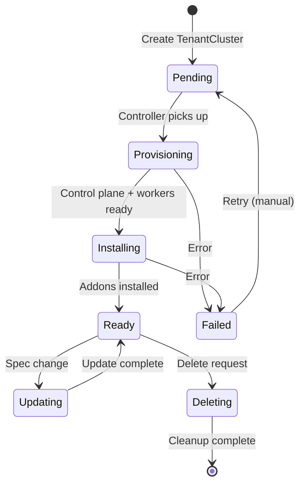
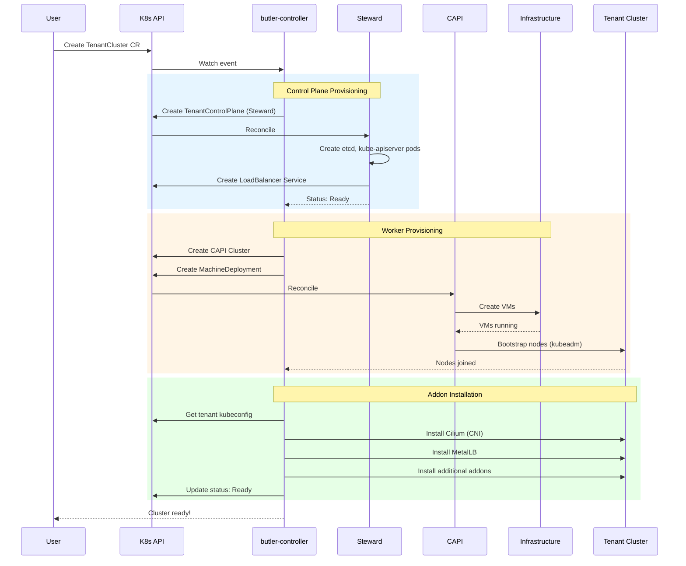
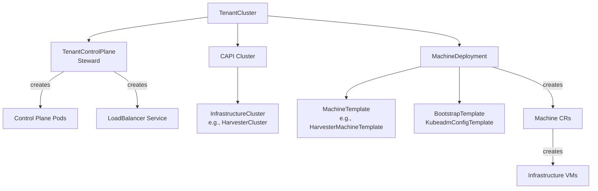

# Tenant Cluster Lifecycle

This document describes how Butler provisions and manages tenant clusters.

## Overview

Tenant clusters are Kubernetes clusters provisioned by Butler for running workloads. Butler uses [Cluster API (CAPI)](https://cluster-api.sigs.k8s.io/) for infrastructure management and [Steward](https://github.com/butlerdotdev/steward) for hosted control planes.

## TenantCluster Resource

```yaml
apiVersion: butler.butlerlabs.dev/v1alpha1
kind: TenantCluster
metadata:
  name: my-cluster
  namespace: team-a
spec:
  kubernetesVersion: "v1.30.0"

  controlPlane:
    replicas: 1  # Hosted via Steward

  workers:
    replicas: 3
    machineTemplate:
      cpu: 4
      memory: 8Gi
      diskSize: 100Gi

  providerConfigRef:
    name: harvester-prod

  networking:
    podCIDR: 10.244.0.0/16
    serviceCIDR: 10.96.0.0/12

  addons:
    cni:
      provider: cilium
    loadBalancer:
      provider: metallb
      addressPool: 10.40.1.0-10.40.1.50
    storage:
      provider: longhorn
```

## Lifecycle Phases



| Phase | Description |
|-------|-------------|
| `Pending` | CR created, awaiting reconciliation |
| `Provisioning` | Creating CAPI resources, Steward control plane, and worker VMs |
| `Installing` | Installing CNI, storage, and other addons |
| `Ready` | Cluster operational |
| `Updating` | Processing spec changes |
| `Deleting` | Cleaning up resources |
| `Failed` | Error state (check conditions) |

## Provisioning Flow



## CAPI Resources Created

For each TenantCluster, butler-controller creates:



### Resource Details

**Cluster (CAPI)**
```yaml
apiVersion: cluster.x-k8s.io/v1beta1
kind: Cluster
metadata:
  name: my-cluster
spec:
  controlPlaneRef:
    apiVersion: controlplane.cluster.x-k8s.io/v1alpha1
    kind: StewardControlPlane
    name: my-cluster
  infrastructureRef:
    apiVersion: infrastructure.cluster.x-k8s.io/v1alpha1
    kind: HarvesterCluster
    name: my-cluster
```

**StewardControlPlane**
```yaml
apiVersion: controlplane.cluster.x-k8s.io/v1alpha1
kind: StewardControlPlane
metadata:
  name: my-cluster
spec:
  replicas: 1
  version: v1.30.0
  dataStoreName: default
```

**MachineDeployment**
```yaml
apiVersion: cluster.x-k8s.io/v1beta1
kind: MachineDeployment
metadata:
  name: my-cluster-workers
spec:
  clusterName: my-cluster
  replicas: 3
  template:
    spec:
      clusterName: my-cluster
      version: v1.30.0
      bootstrap:
        configRef:
          apiVersion: bootstrap.cluster.x-k8s.io/v1beta1
          kind: KubeadmConfigTemplate
          name: my-cluster-workers
      infrastructureRef:
        apiVersion: infrastructure.cluster.x-k8s.io/v1alpha1
        kind: HarvesterMachineTemplate
        name: my-cluster-workers
```

## Worker Node Bootstrap

Worker nodes use kubeadm to join the cluster. The bootstrap process:

1. **VM Created**: Provider creates VM with cloud image
2. **Cloud-init**: Configures network, SSH, base packages
3. **Container Runtime**: Installs containerd
4. **Kubernetes**: Installs kubelet, kubeadm, kubectl
5. **Join**: Runs `kubeadm join` to join cluster

### Node OS Support

| OS | Status | Use Case |
|----|--------|----------|
| Rocky Linux 9 | Supported | Default for Harvester |
| Talos Linux | Experimental | Immutable nodes |

## Addon Installation

After workers join, platform addons are installed:

### Installation Order

| Order | Addon | Required | Purpose |
|-------|-------|----------|---------|
| 1 | Cilium | Yes | CNI networking |
| 2 | MetalLB | Yes* | LoadBalancer services |
| 3 | cert-manager | No | TLS certificates |
| 4 | Longhorn | No | Distributed storage |
| 5 | Traefik | No | Ingress controller |

*MetalLB required for on-premises deployments

### Addon Configuration

Addons can be configured via TenantCluster spec:

```yaml
spec:
  addons:
    cni:
      provider: cilium
      version: "1.17.0"  # Optional, defaults to platform default
    loadBalancer:
      provider: metallb
      addressPool: 10.40.1.0-10.40.1.50
    monitoring:
      provider: prometheus
```

## Scaling

### Scale Workers

```bash
# Via CLI
butlerctl cluster scale my-cluster --workers 5

# Via kubectl
kubectl patch tenantcluster my-cluster -n team-a \
  --type merge -p '{"spec":{"workers":{"replicas":5}}}'
```

The controller updates the MachineDeployment, and CAPI handles adding/removing nodes.

### Scale Down Behavior

When scaling down:
1. CAPI selects nodes to remove (based on machine health, age)
2. Nodes are cordoned and drained
3. VMs are deleted
4. Pods are rescheduled to remaining nodes

## Kubernetes Version Upgrades

```yaml
spec:
  kubernetesVersion: "v1.31.0"  # Change from v1.30.0
```

Upgrade process:
1. Control plane updated first (Steward handles this)
2. Worker nodes updated via rolling update
3. One node at a time to minimize disruption

## Deletion

```bash
butlerctl cluster destroy my-cluster
```

Deletion process:
1. Finalizer blocks immediate deletion
2. Delete addons (Helm releases)
3. Delete CAPI resources
4. Delete Steward TenantControlPlane
5. Wait for VM cleanup
6. Remove finalizer
7. TenantCluster deleted

## Kubeconfig Access

```bash
# Get kubeconfig
butlerctl cluster kubeconfig my-cluster > my-cluster.yaml

# Use directly
butlerctl cluster kubeconfig my-cluster | kubectl --kubeconfig /dev/stdin get nodes
```

The kubeconfig is stored as a Secret in the management cluster and references the LoadBalancer endpoint for the hosted control plane.

## Status and Conditions

```yaml
status:
  phase: Ready
  controlPlaneEndpoint: "10.40.0.201:6443"
  workerNodesReady: 3
  workerNodesDesired: 3
  observedState:
    kubernetesVersion: "v1.30.0"
  conditions:
    - type: ControlPlaneReady
      status: "True"
    - type: WorkersReady
      status: "True"
    - type: AddonsReady
      status: "True"
```

## See Also

- [Bootstrap Flow](bootstrap-flow.md) - Management cluster creation
- [Addon System](addon-system.md) - Addon catalog and management
- [Getting Started](../getting-started/) - Create your first cluster
