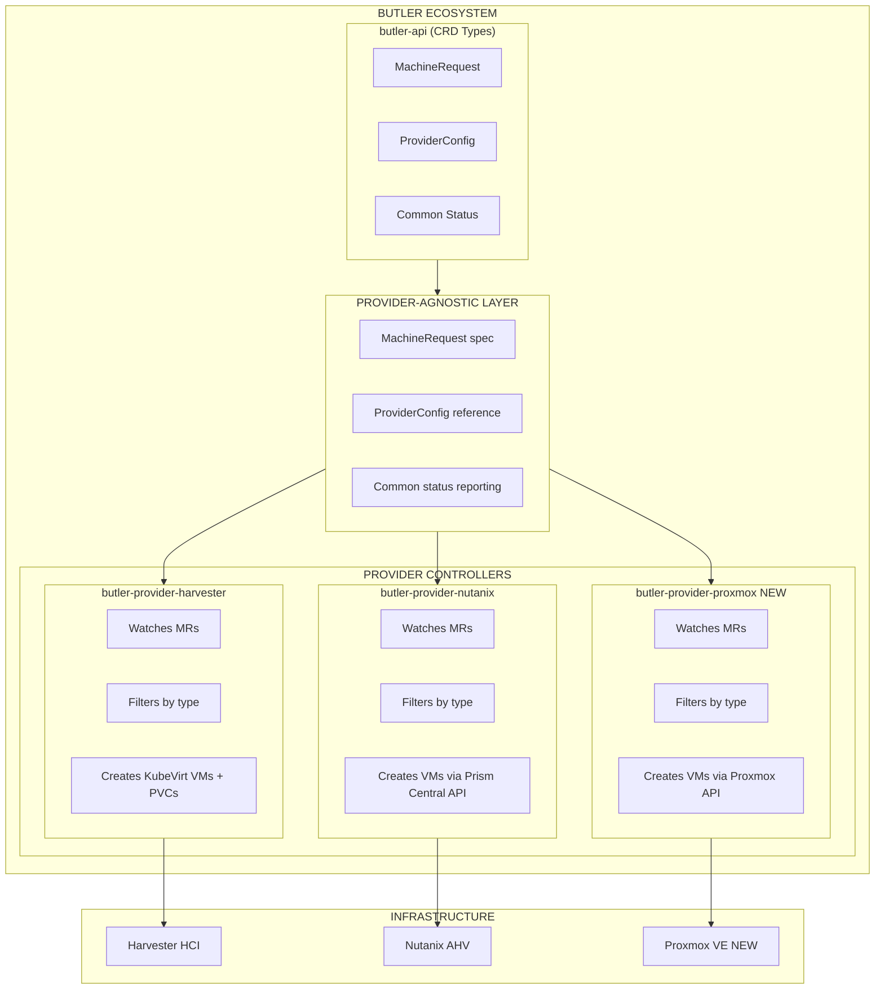
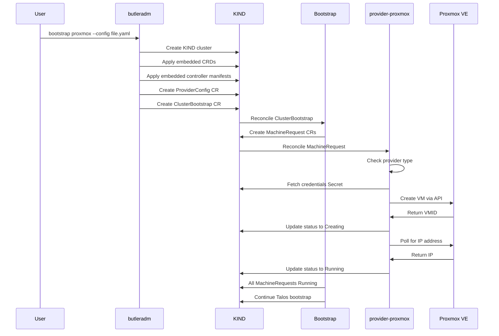
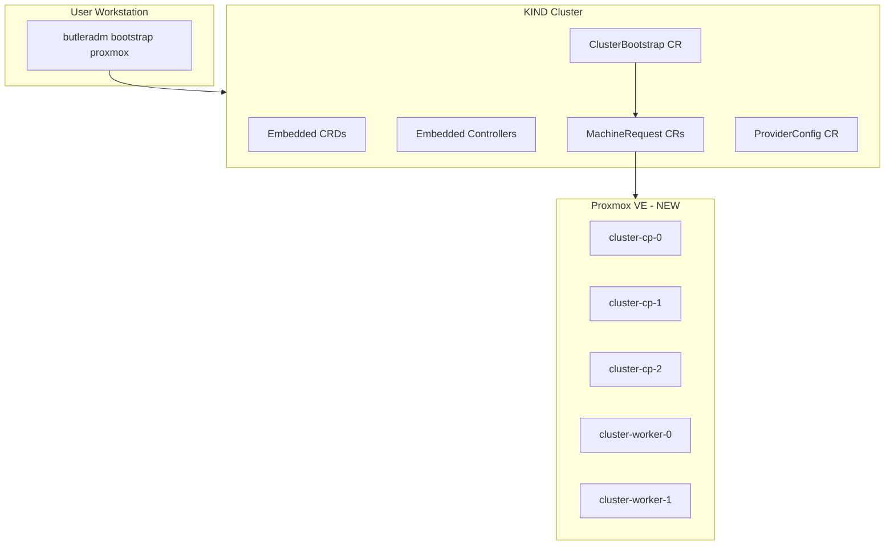
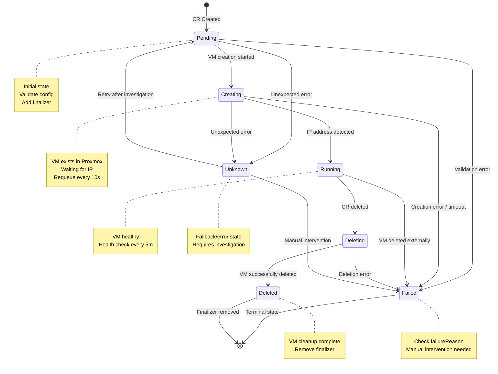
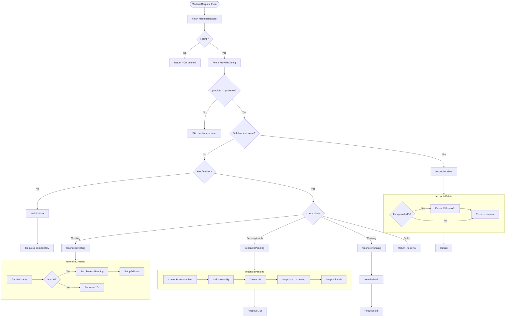

## Adding a New Provider (e.g., Proxmox)

This guide defines the exact architectural patterns, repositories, and processes required to add a new bootstrap provider to Butler. Follow these instructions precisely to ensure your contribution is consistent with existing patterns, safe for existing users, reviewable, and production-quality.

---

## Provider Implementation Status

| Provider | API Types | Helm Chart | Controller | CLI Support | Status |
|----------|-----------|------------|------------|-------------|--------|
| Harvester | Yes | Yes | Yes | Yes | Production |
| Nutanix | Yes | Yes | Yes | Yes | Production |
| Proxmox | Yes | Yes | Planned | Planned | In Development |

> **Note:** This guide uses Proxmox as an example for illustration. The Proxmox provider is currently in development - only API types and Helm chart scaffolding exist. For a complete working reference, see butler-provider-harvester or butler-provider-nutanix.

---

## 1. Provider Architecture Overview

### 1.1 What Is a Bootstrap Provider?

A **bootstrap provider** in Butler is a controller that provisions virtual machines on a specific infrastructure platform (Harvester, Nutanix, Proxmox, AWS, etc.). Providers watch `MachineRequest` custom resources and create the corresponding VMs on their target infrastructure.

**Key characteristics:**
- Each provider lives in its own repository
- Providers are **explicitly selected** via `ProviderConfig` reference
- Providers are **isolated** from one another
- Providers only process `MachineRequest` resources that reference their provider type
- Providers report status back to the `MachineRequest` CR

### 1.2 Provider Boundaries



### 1.3 Provider Discovery and Invocation Flow

The bootstrap process uses embedded manifests (Go embed.FS) to deploy CRDs and controllers to the temporary KIND cluster. This avoids network dependencies and works in air-gapped environments.





**Key point**: The CLI embeds CRD and controller manifests directly in the binary using Go's `embed.FS`. During bootstrap, these are applied to KIND via the Kubernetes API. Helm charts are NOT used during the KIND bootstrap phase.

### 1.4 Provider Registration

Providers are **not** registered via a plugin system. Instead:
1. Provider type is declared in `butler-api` via the `ProviderType` enum
2. Provider-specific config is added to `ProviderConfigSpec` as an optional field
3. Provider controller checks if the `ProviderConfig.spec.provider` matches its type
4. If matched, the provider processes the `MachineRequest`; otherwise, it skips

---

## 2. Required Repositories and Components

### 2.1 Repository Overview

| Repository | Purpose | Changes Required |
|------------|---------|------------------|
| `butler-api` | Shared CRD types | Add Proxmox config struct, extend provider enum |
| `butler-provider-proxmox` (NEW) | Provider controller | Create entire repository |
| `butler-charts` | Helm charts (for management cluster) | Add butler-provider-proxmox chart |
| `butler-cli` | CLI orchestration | Add bootstrap command AND embedded manifests |

**Note on embedded manifests vs Helm charts:**
- The CLI currently uses embedded YAML manifests for deploying to the temporary KIND cluster during bootstrap
- Helm charts are used for installing components on the final management cluster
- Both must be created for a complete provider implementation
- Future refactor: The embedded manifests will likely be replaced by Helm SDK calls to eliminate duplication. For now, both are required.

### 2.2 butler-api (Shared Types Repository)

**Location:** `github.com/butlerdotdev/butler-api`

**Purpose:** Contains all CRD type definitions consumed by multiple components.

**What to modify:**

```go
// api/v1alpha1/providerconfig_types.go

// 1. Add Proxmox to the ProviderType enum (already exists, confirm)
const (
    ProviderTypeHarvester ProviderType = "harvester"
    ProviderTypeNutanix   ProviderType = "nutanix"
    ProviderTypeProxmox   ProviderType = "proxmox"  // ← Confirm exists
)

// 2. Add ProxmoxProviderConfig struct if needed
type ProxmoxProviderConfig struct {
    // Endpoint is the Proxmox API URL.
    // +kubebuilder:validation:Required
    // +kubebuilder:validation:Pattern=`^https?://`
    Endpoint string `json:"endpoint"`

    // Insecure allows insecure TLS connections.
    // +kubebuilder:default=false
    // +optional
    Insecure bool `json:"insecure,omitempty"`

    // Nodes is the list of Proxmox nodes available for VM placement.
    // +kubebuilder:validation:Required
    // +kubebuilder:validation:MinItems=1
    Nodes []string `json:"nodes"`

    // Storage is the storage location for VM disks.
    // +kubebuilder:validation:Required
    Storage string `json:"storage"`

    // TemplateID is the VM template ID to clone.
    // +optional
    TemplateID int32 `json:"templateID,omitempty"`

    // VMIDRange defines the range of VM IDs to use.
    // +optional
    VMIDRange *VMIDRange `json:"vmidRange,omitempty"`
}

// 3. Add Proxmox field to ProviderConfigSpec (already exists, confirm)
type ProviderConfigSpec struct {
    Provider       ProviderType `json:"provider"`
    CredentialsRef SecretReference `json:"credentialsRef"`
    
    Harvester *HarvesterProviderConfig `json:"harvester,omitempty"`
    Nutanix   *NutanixProviderConfig   `json:"nutanix,omitempty"`
    Proxmox   *ProxmoxProviderConfig   `json:"proxmox,omitempty"`  // ← Confirm exists
}
```

**What NOT to modify:**
- `MachineRequest` spec/status (provider-agnostic)
- `ClusterBootstrap` CRD (orchestration layer)
- Existing provider configs (Harvester, Nutanix)
- Any common types

**After changes:**
```bash
cd butler-api
make generate   # Regenerate deepcopy functions
make manifests  # Regenerate CRD YAML
```

### 2.3 butler-provider-proxmox (NEW Repository)

**Purpose:** Kubernetes controller that watches `MachineRequest` CRs and provisions VMs on Proxmox VE.

**Create using kubebuilder scaffolding:**

```bash
mkdir butler-provider-proxmox
cd butler-provider-proxmox

# Initialize module
go mod init github.com/butlerdotdev/butler-provider-proxmox

# Initialize kubebuilder project (controller-only, no CRDs)
kubebuilder init --domain butlerlabs.dev --repo github.com/butlerdotdev/butler-provider-proxmox

# Create controller (no API, we use butler-api types)
kubebuilder create api --group butler --version v1alpha1 --kind MachineRequest --controller=true --resource=false
```

**Repository structure:**

```
butler-provider-proxmox/
├── .github/
│   └── workflows/
│       ├── ci.yml           # Build, test, lint
│       └── release.yml      # Build and push container image
├── cmd/
│   └── main.go              # Entry point, registers butler-api scheme
├── internal/
│   ├── controller/
│   │   ├── machinerequest_controller.go      # Main reconciler
│   │   ├── machinerequest_controller_test.go # Unit tests
│   │   └── suite_test.go                     # Test suite setup
│   └── proxmox/
│       ├── client.go        # Proxmox API client
│       ├── client_test.go   # Client unit tests
│       └── types.go         # Proxmox-specific types/constants
├── config/
│   ├── rbac/                # RBAC manifests (generated)
│   └── manager/             # Manager manifests (generated)
├── Dockerfile               # Multi-stage build
├── Makefile                 # Build targets (with CGO_ENABLED=0)
├── go.mod
├── go.sum
└── README.md
```

**Key files:**

**go.mod:**
```go
module github.com/butlerdotdev/butler-provider-proxmox

go 1.23

require (
    github.com/butlerdotdev/butler-api v0.1.0
    k8s.io/apimachinery v0.32.0
    k8s.io/client-go v0.32.0
    sigs.k8s.io/controller-runtime v0.20.0
)

// For local development (remove before release)
// replace github.com/butlerdotdev/butler-api => ../butler-api
```

**Makefile (critical settings):**
```makefile
# Disable CGO for cross-platform builds
CGO_ENABLED ?= 0

# Image settings
IMG ?= ghcr.io/butlerdotdev/butler-provider-proxmox:latest

.PHONY: build
build:
    CGO_ENABLED=$(CGO_ENABLED) go build -o bin/manager cmd/main.go

.PHONY: docker-build
docker-build:
    docker build -t $(IMG) .

.PHONY: docker-push
docker-push:
    docker push $(IMG)

.PHONY: test
test:
    go test ./... -coverprofile cover.out
```

### 2.4 butler-charts (Helm Charts Repository)

**Location:** `github.com/butlerdotdev/butler-charts`

**Create chart:** `charts/butler-provider-proxmox/`

**Required files:**

```
charts/butler-provider-proxmox/
├── Chart.yaml
├── values.yaml
├── README.md
├── templates/
│   ├── NOTES.txt
│   ├── _helpers.tpl
│   ├── deployment.yaml
│   ├── service.yaml
│   ├── serviceaccount.yaml
│   └── rbac.yaml
```

**Chart.yaml:**
```yaml
apiVersion: v2
name: butler-provider-proxmox
description: Butler Provider for Proxmox VE - provisions VMs from MachineRequest CRs
type: application
version: 0.1.0
appVersion: "0.1.0"
home: https://butlerlabs.dev
sources:
  - https://github.com/butlerdotdev/butler-provider-proxmox
maintainers:
  - name: Butler Labs
    email: support@butlerlabs.dev
keywords:
  - butler
  - kubernetes
  - proxmox
  - infrastructure
```

**values.yaml:**
```yaml
replicaCount: 1

image:
  repository: ghcr.io/butlerdotdev/butler-provider-proxmox
  pullPolicy: IfNotPresent
  tag: ""

serviceAccount:
  create: true
  annotations: {}
  name: ""

resources:
  limits:
    cpu: 500m
    memory: 256Mi
  requests:
    cpu: 100m
    memory: 128Mi

controller:
  logLevel: info
  metricsBindAddress: ":8083"
  healthProbeBindAddress: ":8082"

# Required for accessing Proxmox API via VPN/Tailscale
network:
  hostNetwork: true
  dnsPolicy: ClusterFirstWithHostNet

rbac:
  create: true
```

### 2.5 butler-cli (CLI Repository)

**Location:** `github.com/butlerdotdev/butler-cli`

**Important:** The CLI currently uses embedded manifests, not Helm charts, for deploying to KIND during bootstrap. You must add your provider's controller manifest to the embedded files. This is a known duplication with the Helm charts and will be refactored to use the Helm SDK in the future.

**Add embedded controller manifest:**

```
internal/adm/bootstrap/manifests/
├── embed.go                    # Go embed directives
├── crds/
│   └── *.yaml                  # CRD manifests (synced from butler-api)
└── controllers/
    ├── butler-bootstrap.yaml
    ├── butler-provider-harvester.yaml
    ├── butler-provider-nutanix.yaml
    └── butler-provider-proxmox.yaml   # <- Add this
```

**embed.go:**
```go
package manifests

import "embed"

//go:embed crds/*.yaml
var CRDs embed.FS

//go:embed controllers/*.yaml
var Controllers embed.FS
```

**controllers/butler-provider-proxmox.yaml:**
```yaml
apiVersion: apps/v1
kind: Deployment
metadata:
  name: butler-provider-proxmox
  namespace: butler-system
spec:
  replicas: 1
  selector:
    matchLabels:
      app: butler-provider-proxmox
  template:
    metadata:
      labels:
        app: butler-provider-proxmox
    spec:
      serviceAccountName: butler-provider-proxmox
      hostNetwork: true
      dnsPolicy: ClusterFirstWithHostNet
      containers:
      - name: manager
        image: ghcr.io/butlerdotdev/butler-provider-proxmox:latest
        args:
        - --leader-elect=false
        env:
        - name: GODEBUG
          value: http2client=0
        volumeMounts:
        - name: ca-certs
          mountPath: /etc/ssl/certs
          readOnly: true
      volumes:
      - name: ca-certs
        hostPath:
          path: /etc/ssl/certs
          type: Directory
---
apiVersion: v1
kind: ServiceAccount
metadata:
  name: butler-provider-proxmox
  namespace: butler-system
---
apiVersion: rbac.authorization.k8s.io/v1
kind: ClusterRole
metadata:
  name: butler-provider-proxmox
rules:
- apiGroups: ["butler.butlerlabs.dev"]
  resources: ["machinerequests", "machinerequests/status"]
  verbs: ["get", "list", "watch", "update", "patch"]
- apiGroups: ["butler.butlerlabs.dev"]
  resources: ["providerconfigs"]
  verbs: ["get", "list", "watch"]
- apiGroups: [""]
  resources: ["secrets"]
  verbs: ["get", "list", "watch"]
---
apiVersion: rbac.authorization.k8s.io/v1
kind: ClusterRoleBinding
metadata:
  name: butler-provider-proxmox
roleRef:
  apiGroup: rbac.authorization.k8s.io
  kind: ClusterRole
  name: butler-provider-proxmox
subjects:
- kind: ServiceAccount
  name: butler-provider-proxmox
  namespace: butler-system
```

**Add bootstrap command:**

```go
// internal/cli/adm/bootstrap/proxmox/command.go

package proxmox

import (
    "github.com/spf13/cobra"
)

func NewCommand() *cobra.Command {
    cmd := &cobra.Command{
        Use:   "proxmox",
        Short: "Bootstrap a Butler management cluster on Proxmox VE",
        Long: `Bootstrap creates a new Butler management cluster on Proxmox VE.

This command will:
1. Create a local KIND cluster for orchestration
2. Deploy Butler CRDs and controllers
3. Create VMs on your Proxmox cluster
4. Install Talos Linux and bootstrap Kubernetes
5. Install Butler platform components
6. Clean up the KIND cluster`,
        RunE: runBootstrap,
    }
    
    cmd.Flags().StringP("config", "c", "", "Path to bootstrap configuration file (required)")
    cmd.MarkFlagRequired("config")
    
    return cmd
}
```

**Add to root bootstrap command:**
```go
// internal/cli/adm/bootstrap/command.go

import (
    "github.com/butlerdotdev/butler-cli/internal/cli/adm/bootstrap/proxmox"
)

func NewCommand() *cobra.Command {
    cmd := &cobra.Command{
        Use:   "bootstrap",
        Short: "Bootstrap a Butler management cluster",
    }
    
    cmd.AddCommand(harvester.NewCommand())
    cmd.AddCommand(nutanix.NewCommand())
    cmd.AddCommand(proxmox.NewCommand())  // ← Add this
    
    return cmd
}
```

---

## 3. Provider Interface and Contract

### 3.1 The MachineRequest Contract

The `MachineRequest` CRD is the **interface contract** between butler-bootstrap and provider controllers. It is defined in `butler-api` and is **provider-agnostic**.

**Spec (Input to provider):**
```yaml
apiVersion: butler.butlerlabs.dev/v1alpha1
kind: MachineRequest
metadata:
  name: cluster-cp-0
  namespace: butler-system
spec:
  # Reference to ProviderConfig (required)
  providerRef:
    name: proxmox-config
    namespace: butler-system
  
  # VM specification (required)
  machineName: cluster-cp-0     # Unique VM name
  role: control-plane           # control-plane | worker
  cpu: 4                        # CPU cores (1-128)
  memoryMB: 8192                # Memory in MB (min 1024)
  diskGB: 50                    # Root disk in GB (min 10)
  
  # Optional fields
  extraDisks: []                # Additional disks [{sizeGB: 200}]
  image: ""                     # Override provider default image
  userData: |                   # Cloud-init or Talos machine config
    <machine config here>
  networkData: ""               # Network configuration
  labels: {}                    # Labels applied to VM
```

**Status (Output from provider):**
```yaml
status:
  phase: Running                # Pending | Creating | Running | Failed | Deleting
  providerID: "proxmox://node1/qemu/100"  # Provider-specific VM identifier
  ipAddress: "10.40.1.50"       # Primary IP address
  ipAddresses:                  # All IP addresses
    - "10.40.1.50"
  macAddress: "BC:24:11:AA:BB:CC"
  failureReason: ""             # Machine-readable error code
  failureMessage: ""            # Human-readable error message
  conditions:                   # Kubernetes conditions
    - type: Ready
      status: "True"
      reason: VMRunning
      message: "VM is running with IP"
  lastUpdated: "2026-01-18T10:30:00Z"
  observedGeneration: 1
```

**MachineRequest Phase State Machine:**



**Phase Constants:**

The following phase constants are defined in `butler-api/api/v1alpha1/machinerequest_types.go`:

```go
const (
    MachinePhasePending  MachinePhase = "Pending"   // Initial state, awaiting processing
    MachinePhaseCreating MachinePhase = "Creating"  // VM creation in progress
    MachinePhaseRunning  MachinePhase = "Running"   // VM running with IP assigned
    MachinePhaseDeleting MachinePhase = "Deleting"  // VM deletion in progress
    MachinePhaseDeleted  MachinePhase = "Deleted"   // VM successfully deleted
    MachinePhaseFailed   MachinePhase = "Failed"    // Terminal error state
    MachinePhaseUnknown  MachinePhase = "Unknown"   // Fallback/error state for unexpected conditions
)
```

### 3.2 Provider Controller Interface (Implicit)

While there's no explicit Go interface, every provider controller must implement this behavior:

**Reconciliation Flow:**



```go
// Conceptual interface - not actually defined in code
type ProviderController interface {
    // Reconcile processes a MachineRequest
    // Returns: (result, error)
    // - result.Requeue: true to requeue for retry
    // - result.RequeueAfter: duration to wait before requeue
    Reconcile(ctx context.Context, req ctrl.Request) (ctrl.Result, error)
}

// Provider must implement these behaviors:
//
// 1. FILTER: Skip MachineRequests not targeting this provider
//    - Fetch ProviderConfig referenced by MachineRequest
//    - Check providerConfig.spec.provider == "proxmox"
//    - If not match, return immediately (don't process)
//
// 2. VALIDATE: Validate configuration before creating resources
//    - Check all required fields are present
//    - Validate credential secret exists and has required keys
//    - Validate provider-specific config (nodes exist, storage available)
//
// 3. CREATE: Provision VM on infrastructure
//    - Set phase to "Creating"
//    - Create VM using provider API
//    - Set providerID in status
//
// 4. WAIT: Poll for IP address
//    - Requeue until VM reports IP
//    - Update ipAddress/ipAddresses in status
//    - Set phase to "Running" when IP available
//
// 5. CLEANUP: Delete VM when MachineRequest is deleted
//    - Add finalizer on create
//    - Delete VM via provider API on delete
//    - Remove finalizer after VM deleted
//
// 6. ERROR: Handle failures gracefully
//    - Set phase to "Failed"
//    - Set failureReason (machine-readable)
//    - Set failureMessage (human-readable)
//    - Add Failed condition
```

### 3.3 Required Controller Methods

```go
// internal/controller/machinerequest_controller.go

package controller

import (
    "context"
    "fmt"
    "time"

    butlerv1alpha1 "github.com/butlerdotdev/butler-api/api/v1alpha1"
    "github.com/butlerdotdev/butler-provider-proxmox/internal/proxmox"

    corev1 "k8s.io/api/core/v1"
    apierrors "k8s.io/apimachinery/pkg/api/errors"
    metav1 "k8s.io/apimachinery/pkg/apis/meta/v1"
    "k8s.io/apimachinery/pkg/runtime"
    "k8s.io/client-go/tools/record"
    ctrl "sigs.k8s.io/controller-runtime"
    "sigs.k8s.io/controller-runtime/pkg/client"
    "sigs.k8s.io/controller-runtime/pkg/controller/controllerutil"
    "sigs.k8s.io/controller-runtime/pkg/log"
)

const (
    machineRequestFinalizer = "butler.butlerlabs.dev/proxmox-finalizer"
    requeueShort            = 10 * time.Second
    requeueLong             = 30 * time.Second
)

type MachineRequestReconciler struct {
    client.Client
    Scheme   *runtime.Scheme
    Recorder record.EventRecorder
}

func (r *MachineRequestReconciler) Reconcile(ctx context.Context, req ctrl.Request) (ctrl.Result, error) {
    logger := log.FromContext(ctx)

    // 1. Fetch MachineRequest
    mr := &butlerv1alpha1.MachineRequest{}
    if err := r.Get(ctx, req.NamespacedName, mr); err != nil {
        return ctrl.Result{}, client.IgnoreNotFound(err)
    }

    // 2. Fetch ProviderConfig
    providerConfig, err := r.getProviderConfig(ctx, mr)
    if err != nil {
        return ctrl.Result{}, err
    }

    // 3. CRITICAL: Skip if not our provider type
    if providerConfig.Spec.Provider != butlerv1alpha1.ProviderTypeProxmox {
        logger.V(1).Info("Skipping MachineRequest: not a Proxmox provider",
            "provider", providerConfig.Spec.Provider)
        return ctrl.Result{}, nil
    }

    // 4. Handle deletion
    if !mr.DeletionTimestamp.IsZero() {
        return r.reconcileDelete(ctx, mr, providerConfig)
    }

    // 5. Add finalizer if not present
    if !controllerutil.ContainsFinalizer(mr, machineRequestFinalizer) {
        controllerutil.AddFinalizer(mr, machineRequestFinalizer)
        if err := r.Update(ctx, mr); err != nil {
            return ctrl.Result{}, err
        }
        return ctrl.Result{Requeue: true}, nil
    }

    // 6. Route based on phase
    switch mr.Status.Phase {
    case "", butlerv1alpha1.MachinePhasePending:
        return r.reconcilePending(ctx, mr, providerConfig)
    case butlerv1alpha1.MachinePhaseCreating:
        return r.reconcileCreating(ctx, mr, providerConfig)
    case butlerv1alpha1.MachinePhaseRunning:
        return r.reconcileRunning(ctx, mr, providerConfig)
    case butlerv1alpha1.MachinePhaseFailed:
        return ctrl.Result{}, nil // Don't retry failed
    default:
        logger.Info("Unknown phase", "phase", mr.Status.Phase)
        return ctrl.Result{}, nil
    }
}

func (r *MachineRequestReconciler) reconcilePending(ctx context.Context, mr *butlerv1alpha1.MachineRequest, pc *butlerv1alpha1.ProviderConfig) (ctrl.Result, error) {
    logger := log.FromContext(ctx)
    logger.Info("Reconciling Pending phase")

    // Create Proxmox client
    client, err := r.createProxmoxClient(ctx, pc)
    if err != nil {
        r.setFailure(ctx, mr, "ClientCreationFailed", err.Error())
        return ctrl.Result{}, nil
    }

    // Create VM (with idempotency check)
    vmID, err := client.CreateVM(ctx, proxmox.VMSpec{
        Name:     mr.Spec.MachineName,
        CPU:      int(mr.Spec.CPU),
        MemoryMB: int(mr.Spec.MemoryMB),
        DiskGB:   int(mr.Spec.DiskGB),
        UserData: mr.Spec.UserData,
    })
    if err != nil {
        // Handle idempotency - VM may already exist from a previous attempt
        if apierrors.IsAlreadyExists(err) {
            logger.Info("VM already exists, transitioning to Creating phase")
            r.Recorder.Event(mr, corev1.EventTypeNormal, "VMExists", "VM already exists, checking status")
            // Continue to update phase - the existing VM will be picked up in reconcileCreating
        } else {
            r.Recorder.Event(mr, corev1.EventTypeWarning, "VMCreationFailed", err.Error())
            r.setFailure(ctx, mr, "VMCreationFailed", err.Error())
            return ctrl.Result{}, nil
        }
    } else {
        r.Recorder.Event(mr, corev1.EventTypeNormal, "VMCreated", fmt.Sprintf("VM creation initiated: %s", vmID))
    }

    // Update status
    mr.Status.Phase = butlerv1alpha1.MachinePhaseCreating
    mr.Status.ProviderID = vmID
    mr.Status.LastUpdated = metav1.Now()
    if err := r.Status().Update(ctx, mr); err != nil {
        return ctrl.Result{}, err
    }

    return ctrl.Result{RequeueAfter: requeueShort}, nil
}

func (r *MachineRequestReconciler) reconcileCreating(ctx context.Context, mr *butlerv1alpha1.MachineRequest, pc *butlerv1alpha1.ProviderConfig) (ctrl.Result, error) {
    logger := log.FromContext(ctx)
    logger.Info("Reconciling Creating phase - waiting for IP")

    client, err := r.createProxmoxClient(ctx, pc)
    if err != nil {
        return ctrl.Result{}, err
    }

    // Poll for IP
    vmStatus, err := client.GetVMStatus(ctx, mr.Status.ProviderID)
    if err != nil {
        logger.Error(err, "Failed to get VM status")
        return ctrl.Result{RequeueAfter: requeueShort}, nil
    }

    if vmStatus.IPAddress == "" {
        logger.Info("VM not ready yet, no IP address")
        return ctrl.Result{RequeueAfter: requeueShort}, nil
    }

    // Update status with IP
    mr.Status.Phase = butlerv1alpha1.MachinePhaseRunning
    mr.Status.IPAddress = vmStatus.IPAddress
    mr.Status.IPAddresses = vmStatus.IPAddresses
    mr.Status.MACAddress = vmStatus.MACAddress
    mr.Status.LastUpdated = metav1.Now()

    if err := r.Status().Update(ctx, mr); err != nil {
        return ctrl.Result{}, err
    }

    r.Recorder.Event(mr, corev1.EventTypeNormal, "VMRunning", fmt.Sprintf("VM running with IP %s", vmStatus.IPAddress))
    logger.Info("VM running", "ip", vmStatus.IPAddress)
    return ctrl.Result{}, nil
}

func (r *MachineRequestReconciler) reconcileRunning(ctx context.Context, mr *butlerv1alpha1.MachineRequest, pc *butlerv1alpha1.ProviderConfig) (ctrl.Result, error) {
    // Optionally: periodic health check
    return ctrl.Result{RequeueAfter: 5 * time.Minute}, nil
}

func (r *MachineRequestReconciler) reconcileDelete(ctx context.Context, mr *butlerv1alpha1.MachineRequest, pc *butlerv1alpha1.ProviderConfig) (ctrl.Result, error) {
    logger := log.FromContext(ctx)
    logger.Info("Reconciling deletion")

    if !controllerutil.ContainsFinalizer(mr, machineRequestFinalizer) {
        return ctrl.Result{}, nil
    }

    // Delete VM if it exists
    if mr.Status.ProviderID != "" {
        client, err := r.createProxmoxClient(ctx, pc)
        if err != nil {
            logger.Error(err, "Failed to create client for deletion")
            return ctrl.Result{RequeueAfter: requeueShort}, nil
        }

        if err := client.DeleteVM(ctx, mr.Status.ProviderID); err != nil {
            logger.Error(err, "Failed to delete VM")
            return ctrl.Result{RequeueAfter: requeueShort}, nil
        }
    }

    // Remove finalizer
    controllerutil.RemoveFinalizer(mr, machineRequestFinalizer)
    if err := r.Update(ctx, mr); err != nil {
        return ctrl.Result{}, err
    }

    r.Recorder.Event(mr, corev1.EventTypeNormal, "VMDeleted", "VM deleted successfully")
    logger.Info("VM deleted successfully")
    return ctrl.Result{}, nil
}

func (r *MachineRequestReconciler) setFailure(ctx context.Context, mr *butlerv1alpha1.MachineRequest, reason, message string) {
    r.Recorder.Event(mr, corev1.EventTypeWarning, reason, message)
    mr.Status.Phase = butlerv1alpha1.MachinePhaseFailed
    mr.Status.FailureReason = reason
    mr.Status.FailureMessage = message
    mr.Status.LastUpdated = metav1.Now()
    r.Status().Update(ctx, mr)
}

func (r *MachineRequestReconciler) SetupWithManager(mgr ctrl.Manager) error {
    return ctrl.NewControllerManagedBy(mgr).
        For(&butlerv1alpha1.MachineRequest{}).
        Complete(r)
}
```

### 3.4 Idempotency and Retry Expectations

**Idempotency requirements:**
- Creating a VM that already exists should not fail (check first)
- Deleting a VM that doesn't exist should not fail (no-op)
- Status updates should be safe to repeat
- Phase transitions should be deterministic

**Retry expectations:**
- Transient errors: requeue with backoff (`RequeueAfter: 10s`)
- Permanent errors: set Failed phase, don't requeue
- Waiting for state: requeue with short interval (`RequeueAfter: 10s`)
- Healthy running: requeue with long interval for health check (`RequeueAfter: 5m`)

---

## 4. Configuration & CRD Patterns

### 4.1 Provider-Specific Configuration Model

Provider configuration follows a discriminated union pattern:

```yaml
apiVersion: butler.butlerlabs.dev/v1alpha1
kind: ProviderConfig
metadata:
  name: proxmox-homelab
  namespace: butler-system
spec:
  # Discriminator - determines which provider-specific config to use
  provider: proxmox
  
  # Credential reference - required for all providers
  credentialsRef:
    name: proxmox-credentials
    namespace: butler-system
  
  # Provider-specific configuration
  # ONLY the matching provider block is used
  proxmox:
    endpoint: "https://pve.example.com:8006"
    insecure: false
    nodes:
      - "pve1"
      - "pve2"
      - "pve3"
    storage: "local-lvm"
    templateID: 9000
    vmidRange:
      start: 200
      end: 299
```

### 4.2 Credentials Secret Format

**Proxmox credentials secret:**
```yaml
apiVersion: v1
kind: Secret
metadata:
  name: proxmox-credentials
  namespace: butler-system
type: Opaque
data:
  # Option 1: Username/Password
  username: cm9vdEBwYW0=          # root@pam
  password: c2VjcmV0cGFzc3dvcmQ=  # secretpassword
  
  # Option 2: API Token (preferred)
  # token: cm9vdEBwYW0hdG9rZW4=   # root@pam!token
  # tokenSecret: dG9rZW5zZWNyZXQ= # tokensecret
```

### 4.3 Schema Extension Rules

When adding provider configuration:

1. **Add to existing union** - Don't create new CRD
2. **All new fields optional** - Provider block is optional at CRD level
3. **Provider block required fields** - Within the provider block, mark required fields
4. **Validation markers** - Use kubebuilder markers for validation
5. **Defaults in code** - Don't rely on CRD defaults for complex logic

**Example validation markers:**
```go
type ProxmoxProviderConfig struct {
    // +kubebuilder:validation:Required
    // +kubebuilder:validation:Pattern=`^https?://`
    Endpoint string `json:"endpoint"`

    // +kubebuilder:default=false
    // +optional
    Insecure bool `json:"insecure,omitempty"`

    // +kubebuilder:validation:Required
    // +kubebuilder:validation:MinItems=1
    Nodes []string `json:"nodes"`
}
```

### 4.4 Bootstrap Configuration File

**configs/examples/bootstrap-proxmox.yaml:**
```yaml
# Butler Management Cluster Bootstrap Configuration
# Provider: Proxmox VE

provider: proxmox

cluster:
  name: butler-mgmt
  controlPlane:
    replicas: 3
    cpu: 4
    memoryMB: 8192
    diskGB: 50
  workers:
    replicas: 2
    cpu: 8
    memoryMB: 16384
    diskGB: 100
    extraDisks:
      - sizeGB: 200  # For Longhorn storage

network:
  podCIDR: 10.244.0.0/16
  serviceCIDR: 10.96.0.0/12
  vip: 10.40.0.201

talos:
  version: v1.12.1
  schematic: dc7b152cb3ea99b821fcb7340ce7168313ce393d663740b791c36f6e95fc8586

addons:
  cni:
    type: cilium
  storage:
    type: longhorn
  loadBalancer:
    type: metallb
    addressPool: 10.40.0.220-10.40.0.230
  gitOps:
    type: flux

providerConfig:
  proxmox:
    endpoint: https://pve.example.com:8006
    insecure: false
    nodes:
      - pve1
      - pve2
      - pve3
    storage: local-lvm
    templateID: 9000
    # Credentials loaded from file or environment
    credentialsFile: ~/.butler/proxmox-credentials.yaml
```

---

## 5. Testing

Testing requirements are intentionally minimal for initial contributions. The goal is to get a working provider merged quickly. More comprehensive testing can be added in follow-up PRs.

### 5.1 Minimum Required Tests

For initial PR, you need basic tests that verify:

1. The provider skips MachineRequests that do not match its type
2. The provider processes MachineRequests that match its type
3. Basic error handling works

**Example minimal test using Ginkgo/Gomega:**

Butler uses Ginkgo and Gomega for controller tests, which is the standard testing framework for controller-runtime projects.

```go
// internal/controller/machinerequest_controller_test.go

package controller

import (
    "context"

    . "github.com/onsi/ginkgo/v2"
    . "github.com/onsi/gomega"

    butlerv1alpha1 "github.com/butlerdotdev/butler-api/api/v1alpha1"
    metav1 "k8s.io/apimachinery/pkg/apis/meta/v1"
    "k8s.io/apimachinery/pkg/types"
    "k8s.io/client-go/tools/record"
    ctrl "sigs.k8s.io/controller-runtime"
    "sigs.k8s.io/controller-runtime/pkg/client/fake"
)

var _ = Describe("MachineRequestReconciler", func() {
    Context("when reconciling a MachineRequest", func() {
        It("should skip non-matching provider types", func() {
            // Setup test objects
            mr := &butlerv1alpha1.MachineRequest{
                ObjectMeta: metav1.ObjectMeta{
                    Name:      "test-vm",
                    Namespace: "butler-system",
                },
                Spec: butlerv1alpha1.MachineRequestSpec{
                    ProviderRef: butlerv1alpha1.ProviderReference{
                        Name:      "harvester-config",
                        Namespace: "butler-system",
                    },
                },
            }

            pc := &butlerv1alpha1.ProviderConfig{
                ObjectMeta: metav1.ObjectMeta{
                    Name:      "harvester-config",
                    Namespace: "butler-system",
                },
                Spec: butlerv1alpha1.ProviderConfigSpec{
                    Provider: butlerv1alpha1.ProviderTypeHarvester,
                },
            }

            // Create fake client with test objects
            fakeClient := fake.NewClientBuilder().
                WithScheme(scheme).
                WithObjects(mr, pc).
                Build()

            // Create reconciler with fake event recorder
            r := &MachineRequestReconciler{
                Client:   fakeClient,
                Scheme:   scheme,
                Recorder: record.NewFakeRecorder(10),
            }

            // Reconcile
            result, err := r.Reconcile(context.Background(), ctrl.Request{
                NamespacedName: types.NamespacedName{
                    Name:      "test-vm",
                    Namespace: "butler-system",
                },
            })

            // Assertions
            Expect(err).NotTo(HaveOccurred())
            Expect(result.Requeue).To(BeFalse())
            Expect(result.RequeueAfter).To(BeZero())
        })

        It("should process matching provider types", func() {
            mr := &butlerv1alpha1.MachineRequest{
                ObjectMeta: metav1.ObjectMeta{
                    Name:      "test-vm",
                    Namespace: "butler-system",
                },
                Spec: butlerv1alpha1.MachineRequestSpec{
                    ProviderRef: butlerv1alpha1.ProviderReference{
                        Name:      "proxmox-config",
                        Namespace: "butler-system",
                    },
                    MachineName: "test-vm",
                    CPU:         4,
                    MemoryMB:    8192,
                    DiskGB:      50,
                },
            }

            pc := &butlerv1alpha1.ProviderConfig{
                ObjectMeta: metav1.ObjectMeta{
                    Name:      "proxmox-config",
                    Namespace: "butler-system",
                },
                Spec: butlerv1alpha1.ProviderConfigSpec{
                    Provider: butlerv1alpha1.ProviderTypeProxmox,
                },
            }

            fakeClient := fake.NewClientBuilder().
                WithScheme(scheme).
                WithObjects(mr, pc).
                Build()

            r := &MachineRequestReconciler{
                Client:   fakeClient,
                Scheme:   scheme,
                Recorder: record.NewFakeRecorder(10),
            }

            result, err := r.Reconcile(context.Background(), ctrl.Request{
                NamespacedName: types.NamespacedName{
                    Name:      "test-vm",
                    Namespace: "butler-system",
                },
            })

            // Should requeue to add finalizer
            Expect(err).NotTo(HaveOccurred())
            Expect(result.Requeue).To(BeTrue())
        })
    })
})
```

**Test suite setup (suite_test.go):**

```go
// internal/controller/suite_test.go

package controller

import (
    "testing"

    . "github.com/onsi/ginkgo/v2"
    . "github.com/onsi/gomega"

    butlerv1alpha1 "github.com/butlerdotdev/butler-api/api/v1alpha1"
    "k8s.io/apimachinery/pkg/runtime"
    clientgoscheme "k8s.io/client-go/kubernetes/scheme"
)

var scheme *runtime.Scheme

func TestControllers(t *testing.T) {
    RegisterFailHandler(Fail)
    RunSpecs(t, "Controller Suite")
}

var _ = BeforeSuite(func() {
    scheme = runtime.NewScheme()
    Expect(clientgoscheme.AddToScheme(scheme)).To(Succeed())
    Expect(butlerv1alpha1.AddToScheme(scheme)).To(Succeed())
})
```

### 5.2 Manual Testing

Before submitting a PR, manually verify:

1. Build the controller image: `make docker-build`
2. Deploy to a test cluster
3. Create a ProviderConfig and MachineRequest
4. Verify VM is created on the target infrastructure
5. Verify status is updated correctly
6. Delete the MachineRequest and verify VM is cleaned up

### 5.3 Future Testing (Follow-up PRs)

More comprehensive testing can be added later:

- Integration tests with envtest
- Contract tests for MachineRequest interface
- E2E tests with real infrastructure
- Negative tests for error conditions
- Performance and chaos testing

---

## 6. Documentation Requirements

### 6.1 Required Documentation

| Document | Location | Required for Initial PR |
|----------|----------|------------------------|
| Provider README | `butler-provider-proxmox/README.md` | Yes |
| Configuration Reference | `butler-provider-proxmox/docs/configuration.md` | Yes |
| Chart README | `butler-charts/charts/butler-provider-proxmox/README.md` | Yes |
| Bootstrap Example | `butler-cli/configs/examples/bootstrap-proxmox.yaml` | Yes |
| Troubleshooting Guide | `butler-provider-proxmox/docs/troubleshooting.md` | Follow-up PR |

### 6.2 Provider README Template

```markdown
# Butler Provider for Proxmox VE

Butler Provider Proxmox is a Kubernetes controller that provisions virtual machines
on Proxmox VE clusters for Butler management cluster bootstrap.

## Overview

This provider watches `MachineRequest` custom resources and creates corresponding
virtual machines on Proxmox VE using the Proxmox API.

## Prerequisites

- Proxmox VE 7.0 or later
- API access to Proxmox (user with VM creation permissions)
- VM template prepared with cloud-init or Talos Linux
- Network connectivity from bootstrap cluster to Proxmox API

## Installation

### Using Helm

```bash
helm install butler-provider-proxmox oci://ghcr.io/butlerdotdev/charts/butler-provider-proxmox \
  --namespace butler-system \
  --create-namespace
```

### Using kubectl

```bash
kubectl apply -f https://github.com/butlerdotdev/butler-provider-proxmox/releases/latest/download/install.yaml
```

## Configuration

### ProviderConfig

```yaml
apiVersion: butler.butlerlabs.dev/v1alpha1
kind: ProviderConfig
metadata:
  name: proxmox-homelab
  namespace: butler-system
spec:
  provider: proxmox
  credentialsRef:
    name: proxmox-credentials
  proxmox:
    endpoint: "https://pve.example.com:8006"
    insecure: false
    nodes:
      - "pve1"
      - "pve2"
    storage: "local-lvm"
    templateID: 9000
```

### Credentials Secret

```yaml
apiVersion: v1
kind: Secret
metadata:
  name: proxmox-credentials
  namespace: butler-system
type: Opaque
stringData:
  username: root@pam
  password: your-password
```

## Configuration Reference

| Field | Type | Required | Default | Description |
|-------|------|----------|---------|-------------|
| `endpoint` | string | Yes | - | Proxmox API URL |
| `insecure` | bool | No | false | Skip TLS verification |
| `nodes` | []string | Yes | - | Available Proxmox nodes |
| `storage` | string | Yes | - | Storage location for disks |
| `templateID` | int32 | No | - | VM template to clone |
| `vmidRange.start` | int32 | No | 100 | Start of VMID range |
| `vmidRange.end` | int32 | No | 999 | End of VMID range |

## Limitations

- Requires qemu-guest-agent in VM template for IP detection
- Does not support Proxmox clusters with Ceph (use local storage)
- Maximum 100 concurrent VM operations per node

## Troubleshooting

See troubleshooting guide in this repository.

## Contributing

See CONTRIBUTING.md in this repository.

## License

Apache License 2.0
```

### 6.3 Supported Provider Criteria

Before a provider is listed as "supported" it must have:

1. Working provider controller that provisions VMs
2. Complete documentation (README, config reference, examples)
3. Helm chart published to GHCR
4. Container image published to GHCR
5. CI/CD pipeline (build, release)
6. At least one successful bootstrap of a Butler management cluster
7. Code review approval from a Butler maintainer

Additional criteria for "production ready" status (follow-up PRs):

- Passing unit tests (>80% coverage)
- Integration tests with envtest
- E2E test suite
- Metrics and alerting
- Troubleshooting documentation

---

## 7. Contribution Checklist

### Initial PR Checklist

```markdown
## Provider Implementation Checklist

### API Types (butler-api)
- [ ] ProviderType enum includes new provider
- [ ] Provider-specific config struct added to providerconfig_types.go
- [ ] Spec struct has provider field (optional)
- [ ] Validation markers added
- [ ] `make generate` passes
- [ ] `make manifests` generates updated CRDs
- [ ] No changes to existing provider configs

### Provider Controller (butler-provider-proxmox)
- [ ] Repository created with kubebuilder scaffold
- [ ] go.mod references butler-api
- [ ] MachineRequestReconciler implemented
- [ ] Provider type filter implemented (CRITICAL)
- [ ] Phase state machine implemented
- [ ] Finalizer handling implemented
- [ ] Provider API client implemented
- [ ] CGO_ENABLED=0 in Makefile
- [ ] Dockerfile builds successfully
- [ ] README.md complete

### Testing
- [ ] Basic unit test for provider type filtering
- [ ] Manual testing with real infrastructure
- [ ] `go test ./...` passes

### Helm Chart (butler-charts)
- [ ] Chart created in charts/butler-provider-{name}/
- [ ] values.yaml documented
- [ ] README.md complete
- [ ] `helm lint` passes

### CLI (butler-cli)
- [ ] Bootstrap command added
- [ ] Embedded controller manifest added to manifests/controllers/
- [ ] Example config file added
- [ ] Orchestrator updated to deploy new provider

### CI/CD
- [ ] GitHub Actions workflow for build/test
- [ ] GitHub Actions workflow for release

### Documentation
- [ ] Provider README complete
- [ ] Configuration reference complete
- [ ] Example configs provided
```

### Follow-up PR Checklist

```markdown
## Hardening Checklist

### Testing
- [ ] Unit tests for controller logic (>80% coverage)
- [ ] Unit tests for provider client
- [ ] Integration tests with envtest
- [ ] Contract tests for MachineRequest interface
- [ ] Negative tests for error conditions
- [ ] E2E tests with real infrastructure
- [ ] Performance testing
- [ ] Chaos testing (node failure, network partition)

### Documentation
- [ ] Troubleshooting guide complete
- [ ] FAQ added
- [ ] Video walkthrough recorded (optional)

### Production Readiness
- [ ] Metrics exposed
- [ ] Alerts defined
- [ ] Runbook written
- [ ] Upgrade path documented
```

---

## 8. Review & Acceptance Criteria

### 8.1 What Maintainers Will Look For

**Architectural Alignment:**
- [ ] Follows ADR-001 (Provider Controller Pattern)
- [ ] Follows ADR-002 (CRDs as API)
- [ ] Uses kubebuilder scaffolding
- [ ] Phase-based reconciliation

**Isolation of Provider Logic:**
- [ ] Provider only processes its own MachineRequests
- [ ] No changes to other providers
- [ ] No provider-specific assumptions in core
- [ ] Clean separation between controller and client

**Backward Compatibility:**
- [ ] No breaking changes to butler-api
- [ ] No breaking changes to existing CRDs
- [ ] Existing providers unaffected
- [ ] Additive changes only

**Test Coverage:**
- [ ] Controller logic >80% coverage
- [ ] Client logic >70% coverage
- [ ] All error paths tested
- [ ] Contract tests pass

**Documentation:**
- [ ] README is complete and accurate
- [ ] Configuration reference is exhaustive
- [ ] Examples work out of the box

**Code Quality:**
- [ ] Follows Go best practices
- [ ] Error messages are actionable
- [ ] Logging is appropriate (not excessive)
- [ ] No sensitive data in logs

### 8.2 Review Process

1. **Open Draft PR** - Get early feedback on approach
2. **Self-Review** - Complete checklist above
3. **Request Review** - Assign Butler maintainer
4. **Address Feedback** - Iterate on comments
5. **Approval** - At least 1 maintainer approval
6. **Merge** - Squash and merge to main

### 8.3 Post-Merge

1. Tag release (`v0.1.0`)
2. GitHub Actions builds and pushes images
3. GitHub Actions publishes Helm chart
4. Update Butler documentation site
5. Announce in Discord/Slack

---

## Appendix A: Existing Provider Reference

### butler-provider-harvester

**Key patterns to follow:**
- Phase-based reconciliation
- Direct PVC creation (not DataVolume)
- qemu-guest-agent for IP detection
- runStrategy: RerunOnFailure

**Files to reference:**
- `internal/controller/machinerequest_controller.go`
- `internal/harvester/client.go`

### butler-provider-nutanix

**Key patterns to follow:**
- REST API client (v3/v4)
- Task-based VM creation
- Prism Central API

**Files to reference:**
- `internal/controller/machinerequest_controller.go`
- `internal/nutanix/client.go`

---

## Appendix B: Proxmox API Reference

**Authentication:**
```
POST /api2/json/access/ticket
Body: username=root@pam&password=xxx

Response:
{
  "data": {
    "ticket": "PVE:root@pam:...",
    "CSRFPreventionToken": "..."
  }
}
```

**Create VM:**
```
POST /api2/json/nodes/{node}/qemu
Headers:
  Cookie: PVEAuthCookie={ticket}
  CSRFPreventionToken: {token}
Body:
  vmid=100
  name=test-vm
  cores=4
  memory=8192
  ...
```

**Get VM Status:**
```
GET /api2/json/nodes/{node}/qemu/{vmid}/agent/network-get-interfaces
```

**Delete VM:**
```
DELETE /api2/json/nodes/{node}/qemu/{vmid}
```

---

## Appendix C: Quick Reference Commands

```bash
# Clone butler-api
git clone https://github.com/butlerdotdev/butler-api
cd butler-api
make generate manifests

# Create provider repo
mkdir butler-provider-proxmox
cd butler-provider-proxmox
go mod init github.com/butlerdotdev/butler-provider-proxmox
kubebuilder init --domain butlerlabs.dev

# Build and test
make build
make test
make docker-build IMG=ghcr.io/butlerdotdev/butler-provider-proxmox:dev

# Local development (with replace directive)
# In go.mod:
# replace github.com/butlerdotdev/butler-api => ../butler-api

# Run locally against KIND cluster
make run

# Deploy to cluster
make deploy IMG=ghcr.io/butlerdotdev/butler-provider-proxmox:dev
```

---

## Appendix D: Provider Implementation Checklist

Use this checklist when implementing a new provider to ensure all components are complete.

### Repository Setup

- [ ] Create `butler-provider-{name}` repository
- [ ] Initialize Go module with `go mod init github.com/butlerdotdev/butler-provider-{name}`
- [ ] Add butler-api dependency with `go get github.com/butlerdotdev/butler-api`
- [ ] Initialize kubebuilder project structure
- [ ] Set up GitHub Actions for CI/CD

### CRD Types (butler-api)

- [ ] Add `{Name}ProviderConfig` struct to `providerconfig_types.go`
- [ ] Add provider type constant to `ProviderType` enum
- [ ] Add optional provider field to `ProviderConfigSpec`
- [ ] Add kubebuilder validation markers
- [ ] Run `make generate && make manifests`
- [ ] Sync CRDs to butler-charts with `hack/sync-crds.sh`

### Controller Implementation

- [ ] Create `machinerequest_controller.go` with Reconcile loop
- [ ] Implement provider type filter (CRITICAL - skip non-matching providers)
- [ ] Implement phase-based state machine (Pending -> Creating -> Running)
- [ ] Add finalizer for cleanup on deletion
- [ ] Add EventRecorder for user-visible events
- [ ] Implement idempotency checks (IsAlreadyExists handling)
- [ ] Add proper error handling with failureReason/failureMessage
- [ ] Set up controller with manager in `SetupWithManager()`

### Provider Client

- [ ] Create `internal/{provider}/client.go`
- [ ] Implement `CreateVM(ctx, spec) (vmID, error)`
- [ ] Implement `GetVMStatus(ctx, vmID) (status, error)`
- [ ] Implement `DeleteVM(ctx, vmID) error`
- [ ] Handle authentication (credentials from Secret)
- [ ] Add retry logic for transient failures
- [ ] Add unit tests for client

### Helm Chart (butler-charts)

- [ ] Create chart directory `charts/butler-provider-{name}/`
- [ ] Create `Chart.yaml` with metadata
- [ ] Create `values.yaml` with configurable options
- [ ] Create deployment template with proper resource limits
- [ ] Create RBAC configuration (ServiceAccount, ClusterRole, ClusterRoleBinding)
- [ ] Add README.md with configuration reference
- [ ] Run `helm lint` to validate

### CLI Integration (butler-cli)

- [ ] Add embedded manifest to `internal/adm/bootstrap/manifests/controllers/`
- [ ] Create bootstrap command in `internal/adm/bootstrap/{provider}/command.go`
- [ ] Register command in parent bootstrap command
- [ ] Add example configuration file to `configs/examples/`
- [ ] Update orchestrator to deploy new provider

### Testing

- [ ] Create `suite_test.go` with Ginkgo/Gomega setup
- [ ] Add unit tests for provider type filtering
- [ ] Add unit tests for phase transitions
- [ ] Add unit tests for error handling
- [ ] Manual testing with real infrastructure
- [ ] Verify `make test` passes

### Documentation

- [ ] Provider README.md with overview and quick start
- [ ] Configuration reference with all fields documented
- [ ] Example ProviderConfig and credentials Secret
- [ ] Troubleshooting guide (follow-up PR acceptable)

### Release

- [ ] Tag release version (v0.1.0)
- [ ] GitHub Actions builds and pushes container image to GHCR
- [ ] Helm chart published to GHCR
- [ ] Update Butler documentation site
- [ ] Announce in community channels
