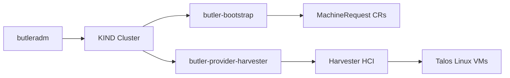

# Harvester Provider Guide

> **Status: Stable.** E2E validated for single-node and HA topologies.

Bootstrap a Butler management cluster on [Harvester HCI](https://harvesterhci.io/).

## Table of Contents

- [Overview](#overview)
- [Prerequisites](#prerequisites)
- [Harvester Setup](#harvester-setup)
- [Bootstrap Configuration](#bootstrap-configuration)
- [Run Bootstrap](#run-bootstrap)
- [Validation](#validation)
- [Cleanup](#cleanup)
- [Tenant Clusters on Harvester](#tenant-clusters-on-harvester)
- [Troubleshooting](#troubleshooting)

---

## Overview

Butler uses a thin provider controller (`butler-provider-harvester`) during bootstrap to provision VMs on Harvester via its Kubernetes API (Harvester runs KubeVirt under the hood). After the management cluster is running, the CAPI KubeVirt provider (CAPK) manages tenant cluster worker VM lifecycle.



### Key Components

| Component | Purpose |
|-----------|---------|
| butler-provider-harvester | Provisions Harvester VMs from MachineRequest CRs during bootstrap |
| CAPI KubeVirt Provider (CAPK) | Manages tenant cluster worker VMs after the management cluster is running |
| kube-vip | Floating VIP for control plane HA |
| MetalLB | LoadBalancer service implementation for on-prem |

---

## Prerequisites

### Harvester Cluster

- Harvester version 1.3.0 or later
- Admin access to the Harvester dashboard or API
- Network connectivity from the bootstrap machine (your laptop/workstation) to the Harvester API

### VM Image

Upload a Talos Linux raw image to Harvester. The image must include the `iscsi-tools` and `qemu-guest-agent` extensions for Longhorn storage and IP reporting.

Download from the Talos Image Factory:

```
https://factory.talos.dev/image/dc7b152cb3ea99b821fcb7340ce7168313ce393d663740b791c36f6e95fc8586/v1.12.1/metal-amd64.raw.xz
```

- **Schematic ID:** `dc7b152cb3ea99b821fcb7340ce7168313ce393d663740b791c36f6e95fc8586`
- **Extensions included:** iscsi-tools, qemu-guest-agent

Upload via Harvester Dashboard (Images > Create) or the Harvester API. Note the `namespace/name` after upload (e.g., `default/image-5rs6d`).

### VM Network

A VLAN-backed network configured in Harvester. The network must:
- Provide DHCP or have static IP assignment
- Allow outbound internet access (Talos pulls images, Helm fetches charts)
- Support L2 ARP for kube-vip and MetalLB

Note the `namespace/name` format (e.g., `default/vlan40-workloads`).

### Harvester Kubeconfig

Download from Harvester Dashboard > Support > Download Kubeconfig. Save to `~/.butler/harvester-kubeconfig`.

Update the `server` URL in the kubeconfig to the external Harvester API address if needed.

### IP Planning

Reserve the following IPs on your VLAN. These must not overlap with DHCP ranges, existing VIPs, or other clusters:

| Purpose | Example | Notes |
|---------|---------|-------|
| Control plane VIP | 10.40.0.230 | Single IP, used by kube-vip for API HA |
| MetalLB pool | 10.40.0.240-10.40.0.250 | Range for LoadBalancer services (Traefik, tenant endpoints) |

---

## Harvester Setup

### 1. Create VM Network

In Harvester Dashboard > Networks > Create:

| Field | Value |
|-------|-------|
| Name | vlan40-workloads |
| Namespace | default |
| VLAN ID | 40 |
| Cluster Network | mgmt |

**Result:** `default/vlan40-workloads` network name.

### 2. Upload Talos Image

In Harvester Dashboard > Images > Create:

| Field | Value |
|-------|-------|
| Name | talos-v1-12-1 |
| Namespace | default |
| Source | URL or File upload |
| URL | `https://factory.talos.dev/image/dc7b152.../v1.12.1/metal-amd64.raw.xz` |

**Result:** `default/talos-v1-12-1` (or whatever the resulting `namespace/name` is).

### 3. Export Kubeconfig

```bash
# Save to standard Butler location
cp /path/to/harvester-kubeconfig ~/.butler/harvester-kubeconfig

# Verify access
kubectl --kubeconfig ~/.butler/harvester-kubeconfig get nodes
```

---

## Bootstrap Configuration

Create a config file at `~/.butler/bootstrap-harvester.yaml`:

### Single-Node

This config was used for E2E validation. Replace VIP, loadBalancerPool, networkName, and imageName with values from your Harvester environment.

```yaml
provider: harvester

cluster:
  name: butler-hvstr-test
  topology: single-node
  controlPlane:
    replicas: 1
    cpu: 4
    memoryMB: 8192
    diskGB: 50
    extraDisks:
      - sizeGB: 50

network:
  podCIDR: 10.244.0.0/16
  serviceCIDR: 10.96.0.0/12
  vip: 10.40.0.230
  loadBalancerPool:
    start: 10.40.0.240
    end: 10.40.0.250

talos:
  version: v1.12.1
  schematic: dc7b152cb3ea99b821fcb7340ce7168313ce393d663740b791c36f6e95fc8586

addons:
  cni:
    type: cilium
  storage:
    type: longhorn
  loadBalancer:
    type: metallb
  console:
    enabled: true
    ingress:
      enabled: true
      className: traefik

providerConfig:
  harvester:
    kubeconfigPath: ~/.butler/harvester-kubeconfig
    namespace: default
    networkName: default/vlan40-workloads
    imageName: default/image-5rs6d
```

### HA

```yaml
provider: harvester

cluster:
  name: butler-hvstr-ha
  topology: ha
  controlPlane:
    replicas: 3
    cpu: 4
    memoryMB: 8192
    diskGB: 50
  workers:
    replicas: 2
    cpu: 4
    memoryMB: 8192
    diskGB: 50
    extraDisks:
      - sizeGB: 50

network:
  podCIDR: 10.244.0.0/16
  serviceCIDR: 10.96.0.0/12
  vip: 10.40.0.231
  loadBalancerPool:
    start: 10.40.0.240
    end: 10.40.0.250

talos:
  version: v1.12.1
  schematic: dc7b152cb3ea99b821fcb7340ce7168313ce393d663740b791c36f6e95fc8586

addons:
  cni:
    type: cilium
  storage:
    type: longhorn
  loadBalancer:
    type: metallb
  console:
    enabled: true
    ingress:
      enabled: true
      className: traefik

providerConfig:
  harvester:
    kubeconfigPath: ~/.butler/harvester-kubeconfig
    namespace: default
    networkName: default/vlan40-workloads
    imageName: default/image-5rs6d
```

---

## Run Bootstrap

```bash
butleradm bootstrap harvester --config ~/.butler/bootstrap-harvester.yaml
```

For development:

```bash
butleradm bootstrap harvester \
  --config ~/.butler/bootstrap-harvester.yaml \
  --local --no-tui --skip-cleanup
```

---

## Validation

```bash
export KUBECONFIG=~/.butler/butler-hvstr-test-kubeconfig

# All nodes Ready
kubectl get nodes

# Cilium running
kubectl get pods -n kube-system -l app.kubernetes.io/name=cilium

# Longhorn running
kubectl get pods -n longhorn-system

# cert-manager running
kubectl get pods -n cert-manager

# Steward running
kubectl get pods -n steward-system

# Butler CRDs installed
kubectl get crd | grep butler

# kube-vip responding on VIP
ping 10.40.0.230

# MetalLB pool active, Traefik has a LoadBalancer IP
kubectl get svc -n traefik-system

# Console accessible
kubectl get svc butler-console-frontend -n butler-system
```

### Console Credentials

```bash
kubectl get secret butler-console-admin -n butler-system \
  -o jsonpath='{.data.admin-password}' | base64 -d && echo
# Username: admin
```

### What You Have Now

A Butler management cluster running on Harvester with:
- Talos Linux nodes with Cilium CNI
- kube-vip providing a floating VIP for the Kubernetes API
- MetalLB and Traefik handling LoadBalancer and Ingress services
- Longhorn distributed storage
- Steward for hosted tenant control planes
- Butler controller, CRDs, and web console

To create your first tenant cluster, go to [Create Your First Tenant Cluster](../getting-started/#create-your-first-tenant-cluster).

---

## Cleanup

```bash
# Delete KIND bootstrap cluster (if --skip-cleanup was used)
kind delete cluster --name butler-bootstrap

# Delete Harvester VMs via the Harvester Dashboard:
# Virtual Machines > select butler-hvstr-test-cp-* and butler-hvstr-test-w-* > Actions > Delete
```

---

## Tenant Clusters on Harvester

After bootstrap, configure Harvester as a provider for tenant clusters:

### Create ProviderConfig

```yaml
apiVersion: butler.butlerlabs.dev/v1alpha1
kind: ProviderConfig
metadata:
  name: harvester-prod
  namespace: butler-system
spec:
  provider: harvester
  credentialsRef:
    name: harvester-kubeconfig
    namespace: butler-system
  network:
    mode: ipam
  harvester:
    namespace: default
    networkName: default/workloads
    imageName: default/talos-v1-12-1
    storageClassName: harvester-longhorn
```

### Create Credentials Secret

```bash
kubectl create secret generic harvester-kubeconfig \
  --from-file=kubeconfig=~/.butler/harvester-kubeconfig \
  -n butler-system
```

---

## Troubleshooting

### VMs Not Provisioning

**Symptom**: MachineRequest stuck in `Pending` or `Creating`.

**Check:**
```bash
# From KIND context (if --skip-cleanup was used)
kubectl --context kind-butler-bootstrap logs -n butler-system deploy/butler-provider-harvester
kubectl --context kind-butler-bootstrap get machinerequest -n butler-system
```

**Common causes:**
- Harvester kubeconfig server URL is wrong (internal vs external address)
- Image name doesn't match (wrong `namespace/name` format)
- Network name doesn't match
- Insufficient resources on Harvester cluster

### VIP Not Responding

**Symptom**: Cannot reach the Kubernetes API on the VIP address after bootstrap.

**Check:**
- Verify the VIP is not already in use (`arping -D <VIP>`)
- Confirm kube-vip is running: `kubectl get pods -n kube-system -l app.kubernetes.io/name=kube-vip`
- Verify the VIP is on the same VLAN/subnet as the VM network
- Check that the network supports gratuitous ARP (some virtual switches filter it)

### MetalLB Pool Conflict

**Symptom**: Traefik service stuck on `<pending>`, no external IP assigned.

**Check:**
- Verify the pool range doesn't overlap with the VIP
- Verify the pool IPs are not already in use by another cluster
- Check MetalLB speaker pods: `kubectl get pods -n metallb-system`
- Confirm the pool range is on the same L2 segment as the nodes

### Image Format Wrong

**Symptom**: VMs start but Talos never boots.

The Harvester image must be the `metal-amd64.raw.xz` format from the Talos Image Factory, not the ISO or `nocloud` variant. Verify the schematic ID includes the `qemu-guest-agent` extension (required for Harvester to report VM IPs).

### Kubeconfig Issues

```bash
# Verify Harvester API access
kubectl --kubeconfig ~/.butler/harvester-kubeconfig get nodes
```

Common issues:
- Server URL points to internal cluster IP (use the external address)
- Certificate verification fails (try `insecure-skip-tls-verify: true` for testing)
- Firewall blocking port 6443 between your machine and Harvester

---

## See Also

- [Getting Started](../getting-started/) - Quick start guide
- [Bootstrap Flow](../architecture/bootstrap-flow.md) - End-to-end bootstrap sequence
- [Bootstrap Config Reference](../reference/bootstrap-config.md) - Every config field documented
- [Nutanix Provider](nutanix.md) - Alternative on-prem provider
