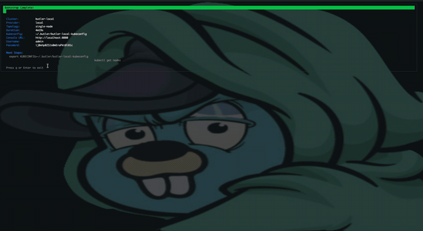

# Try Butler on Your Laptop

Run the full Butler platform on your laptop with nothing but Docker. No hypervisor, no cloud account, no hosted services. In a few minutes you get a real management cluster, the web console, and a tenant Kubernetes cluster with a node you can `kubectl` into.

This is the fastest way to see what Butler does. The only thing that differs from a production install is the layer beneath the abstraction: tenant nodes run as local containers via the [Cluster API Docker provider](https://cluster-api.sigs.k8s.io/) instead of VMs on Harvester, Nutanix, or a cloud. Everything above that line -- the control plane, hosted tenant control planes, console, teams, RBAC, and addons -- is the same software you run in production.

## TL;DR

```bash
brew install butlerdotdev/tap/butler
butleradm bootstrap local
# then open http://localhost:8080 and sign in with the credentials it prints
```

A few minutes later you have a Butler management cluster, the web console, and you are ready to create your first tenant Kubernetes cluster -- all on your laptop, with only Docker installed.



## Prerequisites

| Requirement | Description |
|-------------|-------------|
| Docker | Docker Desktop or Rancher Desktop, with at least 4 CPUs and 6 GB of memory allocated |
| kubectl | Kubernetes CLI (1.28+) |
| Butler CLI | `butleradm` and `butlerctl` (install below) |

Allocate the resources in Docker Desktop (Settings -> Resources) or Rancher Desktop (Preferences -> Virtual Machine) before you start. Butler runs a management control plane plus a hosted tenant control plane on a single node, and the tenant apiserver needs the headroom.

## 1. Install the CLI

### Homebrew (macOS / Linux)

```bash
brew install butlerdotdev/tap/butler
```

### Direct Download (macOS / Linux)

```bash
OS=$(uname -s | tr '[:upper:]' '[:lower:]')
ARCH=$(uname -m)
[[ "$ARCH" == "x86_64" ]] && ARCH="amd64"
[[ "$ARCH" == "aarch64" ]] && ARCH="arm64"

curl -sLO "https://github.com/butlerdotdev/butler-cli/releases/latest/download/butler_${OS}_${ARCH}.tar.gz"
tar xzf butler_${OS}_${ARCH}.tar.gz
sudo mv butleradm butlerctl /usr/local/bin/
```

## 2. Bootstrap the Local Platform

```bash
butleradm bootstrap local
```

This stands up a local KIND cluster and installs the entire Butler platform onto it: Steward (hosted control planes), Cluster API with the Docker provider, cert-manager, Cilium, MetalLB, the Butler controller, and the web console. The first run takes a few minutes while images pull.

When it finishes, the CLI prints everything you need to sign in. No searching for secrets:

```
Butler Console:
  URL:      http://localhost:8080
  Username: admin
  Password: <generated>
```

Re-running `butleradm bootstrap local` deletes the previous local cluster and starts clean, so you can iterate freely.

## 3. Open the Console

Open `http://localhost:8080` in your browser and sign in with the printed credentials. The `admin` user has full platform access out of the box -- the same access used to administer a production management cluster.

## 4. Create a Tenant Cluster

Create a Team and a TenantCluster exactly as described in [Create Your First Tenant Cluster](./first-tenant-cluster.md), from either the console or the CLI. Two things are specific to the local environment:

- Set `providerConfigRef.name` to `butler-local-provider` (the credential-less provider config the local bootstrap creates for you).
- A single worker is plenty. The node comes up as a local container.

From the CLI:

```bash
butlerctl cluster create toy --namespace <team-namespace> --workers 1 --k8s-version v1.31.0
```

Watch it reach `Ready`:

```bash
export KUBECONFIG=~/.butler/butler-local-kubeconfig
kubectl get tenantcluster toy -n <team-namespace> -w
```

The tenant transitions `Pending` -> `Provisioning` -> `Installing` -> `Ready`, typically in a couple of minutes.

## 5. See a Real Node

The management cluster is reachable from your host out of the box:

```bash
export KUBECONFIG=~/.butler/butler-local-kubeconfig
kubectl get nodes
```

Then pull the tenant's kubeconfig and talk to its control plane:

```bash
butlerctl cluster kubeconfig toy -n <team-namespace> > toy.yaml
kubectl --kubeconfig toy.yaml get nodes
```

```
NAME                      STATUS   ROLES    AGE   VERSION
toy-workers-xxxxx-xxxxx   Ready    <none>   75s   v1.31.0
```

A real Ready node, running on your laptop, in a tenant Kubernetes cluster managed by Butler.

## What Is Real and What Is Simulated

| Layer | Local | Production |
|-------|-------|-----------|
| Platform control plane (controllers, CRDs, auth, RBAC) | Real | Real |
| Web console and API server | Real | Real |
| Tenant control planes (apiserver, etcd, scheduler) | Real pods (Steward) | Real pods (Steward) |
| Teams, multi-tenancy, addons | Real | Real |
| Tenant worker nodes | Containers (CAPI Docker provider) | VMs (Harvester / Nutanix / cloud) |
| Node OS | `kindest/node` image | Talos Linux / kubeadm images |
| Storage | KIND local-path | Longhorn |
| Networking | Docker bridge + MetalLB | Provider network + IPAM |
| HA and scale | Single node | Multi-node, HA control plane |

Everything above the worker-node line behaves exactly as it does in production. To validate a specific infrastructure provider, an HA topology, Talos, or scale, bootstrap onto that infrastructure using the [provider guides](./README.md).

## Tear Down

The next `butleradm bootstrap local` cleans up automatically, but to remove the local platform entirely:

```bash
kind delete cluster --name butler-bootstrap
```

If you do not have the `kind` CLI installed, remove the containers directly:

```bash
docker rm -f $(docker ps -aq --filter "label=io.x-k8s.kind.cluster=butler-bootstrap")
```

Tenant worker containers are named after their tenant clusters (for example `toy-workers-*`) and can be removed the same way.

## Next Steps

- **[Create Your First Tenant Cluster](./first-tenant-cluster.md)** -- The full Team and TenantCluster walkthrough.
- **[Butler Console](./console.md)** -- Manage clusters, addons, and terminals from the web UI.
- **[Concepts](../concepts/)** -- Hosted control planes, multi-tenancy, and the addon system.
- **[Provider Guides](./README.md)** -- Move from your laptop to real infrastructure.
