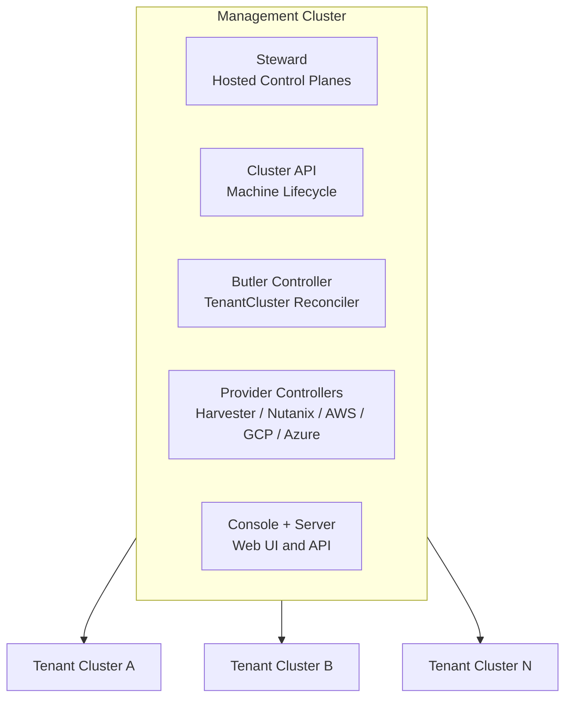

# Butler

Butler provisions and manages Kubernetes clusters across on-prem and cloud infrastructure from a single management cluster. Platform teams define clusters as CRDs. Butler handles the rest: hosted control planes, worker VMs, networking, addons, and kubeconfig delivery.

## What You Get

- **Self-service clusters** -- Create a TenantCluster CR and get a working Kubernetes cluster with CNI, load balancing, and storage.
- **No control plane nodes** -- Steward runs tenant API servers as pods in the management cluster. No dedicated VMs for control planes.
- **Five infrastructure providers** -- Harvester, Nutanix, AWS, GCP, Azure. Proxmox is planned.
- **Team isolation** -- Namespace-based multi-tenancy with RBAC roles, resource quotas, and SSO integration.
- **Day-2 operations** -- Web console, CLI tools, addon management, image syncing, and GitOps support.

## Architecture

## Start Here

- **[Getting Started](./getting-started/)** -- Bootstrap a management cluster on your infrastructure and create your first tenant cluster.
- **[Concepts](./concepts/)** -- Understand management clusters, tenant clusters, hosted control planes, providers, and multi-tenancy.
- **[Reference](./reference/)** -- CRD specifications, CLI commands, and bootstrap configuration.

## Project Status

Butler is in beta (v0.9.x). The API uses `v1alpha1` and may change before v1.0. See the [Roadmap](./roadmap/) for planned work.
