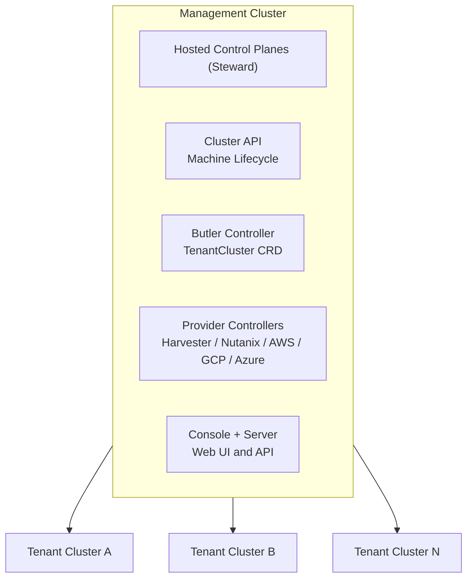

# Butler

Kubernetes-native multi-cluster management platform.

[](../LICENSE)

## Overview

Butler provisions and manages Kubernetes clusters across heterogeneous infrastructure. It combines Cluster API for machine lifecycle, Steward for hosted control planes, and a declarative CRD-based API.

### Features

- Tenant cluster provisioning in under 5 minutes
- Hosted control planes via Steward (no dedicated control plane nodes)
- Multi-provider: Harvester, Nutanix, Proxmox, AWS, GCP, Azure
- Platform addons: Cilium, MetalLB, cert-manager, Longhorn
- Web console with terminal access and addon management
- CLI tools: `butleradm` (bootstrap), `butlerctl` (operations)

## Architecture



## Repositories

| Repository | Description |
|------------|-------------|
| [butler-api](https://github.com/butlerdotdev/butler-api) | CRD definitions and shared types |
| [butler-controller](https://github.com/butlerdotdev/butler-controller) | TenantCluster and TenantAddon controllers |
| [butler-cli](https://github.com/butlerdotdev/butler-cli) | `butleradm` and `butlerctl` binaries |
| [butler-console](https://github.com/butlerdotdev/butler-console) | Web UI (React) |
| [butler-server](https://github.com/butlerdotdev/butler-server) | API server (Go) |
| [butler-charts](https://github.com/butlerdotdev/butler-charts) | Helm charts for all components |
| [butler-provider-harvester](https://github.com/butlerdotdev/butler-provider-harvester) | Harvester infrastructure provider |
| [butler-provider-nutanix](https://github.com/butlerdotdev/butler-provider-nutanix) | Nutanix infrastructure provider |

## Quick Start

### Prerequisites

- Kubernetes cluster (or infrastructure to bootstrap one)
- `kubectl` configured
- `helm` v3.x

### Bootstrap a Management Cluster

```bash
# Download butleradm
curl -sL https://github.com/butlerdotdev/butler-cli/releases/latest/download/butleradm-linux-amd64 -o butleradm
chmod +x butleradm

# Bootstrap (Harvester example)
./butleradm bootstrap harvester --config bootstrap.yaml
```

See [butler-cli](https://github.com/butlerdotdev/butler-cli) for configuration options.

### Install on Existing Cluster

```bash
# Install CRDs
helm install butler-crds oci://ghcr.io/butlerdotdev/charts/butler-crds -n butler-system --create-namespace

# Install controller
helm install butler-controller oci://ghcr.io/butlerdotdev/charts/butler-controller -n butler-system

# Install console (optional)
helm install butler-console oci://ghcr.io/butlerdotdev/charts/butler-console -n butler-system
```

### Create a Tenant Cluster

```yaml
apiVersion: butler.butlerlabs.dev/v1alpha1
kind: TenantCluster
metadata:
  name: my-cluster
  namespace: butler-tenants
spec:
  kubernetesVersion: v1.30.2
  providerConfigRef:
    name: harvester-prod
  workers:
    replicas: 3
  networking:
    loadBalancerPool:
      start: 10.40.1.100
      end: 10.40.1.150
```

```bash
kubectl apply -f tenant-cluster.yaml
```

## Documentation

- [Getting Started](./getting-started/)
- [Provider Guides](./providers/)
- [Architecture](./architecture/)

## Project Status

Butler is under active development. Current status:

| Component | Status |
|-----------|--------|
| Bootstrap (butleradm) | Stable |
| TenantCluster Controller | Stable |
| Harvester Provider | Stable |
| Nutanix Provider | Stable |
| AWS Provider | Beta |
| GCP Provider | Beta |
| Azure Provider | Beta |
| Proxmox Provider | Planned |
| Console | Beta |
| butlerctl CLI | Beta |

## Contributing

See [CONTRIBUTING.md](../CONTRIBUTING.md) for guidelines.

## License

Apache License 2.0. See [LICENSE](../LICENSE) for details.

## Acknowledgments

Butler builds on these excellent projects:

- [Cluster API](https://cluster-api.sigs.k8s.io/)
- [Steward](https://github.com/butlerdotdev/steward)
- [Talos Linux](https://www.talos.dev/)
- [Cilium](https://cilium.io/)
- [FluxCD](https://fluxcd.io/)
