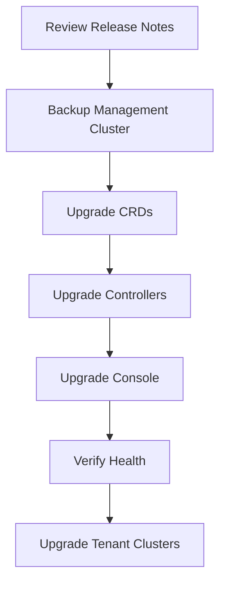

# Operations Guide

This section covers day-2 operations for Butler platform administrators.

## Table of Contents

- [Upgrading Butler](#upgrading-butler)
- [Backup and Restore](#backup-and-restore)
- [Monitoring](#monitoring)
- [Troubleshooting](#troubleshooting)
- [Scaling](#scaling)

---

## Upgrading Butler

### Pre-Upgrade Checklist

- [ ] Review release notes for breaking changes
- [ ] Check [compatibility matrix](../../releases/compatibility-matrix.md)
- [ ] Backup management cluster state
- [ ] Notify users of maintenance window
- [ ] Test upgrade in non-production first

### Upgrade Process



#### 1. Upgrade CRDs

```bash
helm upgrade butler-crds oci://ghcr.io/butlerdotdev/charts/butler-crds \
  -n butler-system \
  --version <new-version>
```

#### 2. Upgrade Controllers

```bash
# Butler Controller
helm upgrade butler-controller oci://ghcr.io/butlerdotdev/charts/butler-controller \
  -n butler-system \
  --version <new-version>

# Butler Bootstrap (if upgrading)
helm upgrade butler-bootstrap oci://ghcr.io/butlerdotdev/charts/butler-bootstrap \
  -n butler-system \
  --version <new-version>
```

#### 3. Upgrade Console

```bash
helm upgrade butler-console oci://ghcr.io/butlerdotdev/charts/butler-console \
  -n butler-system \
  --version <new-version>
```

#### 4. Verify Health

```bash
# Check pods
kubectl get pods -n butler-system

# Check controller logs
kubectl logs -n butler-system deploy/butler-controller --tail=100

# Check cluster health
butlerctl cluster list
```

### Rollback

If issues occur:

```bash
helm rollback butler-controller -n butler-system
helm rollback butler-crds -n butler-system
```

---

## Backup and Restore

### What to Backup

| Component | Method | Frequency |
|-----------|--------|-----------|
| etcd | Velero or etcd snapshot | Daily |
| Secrets | Sealed Secrets backup | On change |
| CRDs/CRs | GitOps repository | Continuous |
| Kubeconfigs | Secure storage | On creation |

### Using Velero

```bash
# Install Velero
velero install --provider aws --bucket butler-backups ...

# Create backup schedule
velero schedule create butler-daily \
  --schedule="0 2 * * *" \
  --include-namespaces butler-system \
  --include-cluster-resources=true
```

### Manual etcd Backup (Talos)

```bash
# Create snapshot
talosctl -n <control-plane-ip> etcd snapshot db.snapshot

# Copy to safe location
scp db.snapshot backup-server:/backups/butler/
```

### Restore Process

1. Restore etcd from snapshot
2. Apply CRDs
3. Apply CR state from GitOps
4. Verify tenant cluster connectivity

---

## Monitoring

### Built-in Metrics

Butler controllers expose Prometheus metrics on `:8080/metrics`:

| Metric | Description |
|--------|-------------|
| `butler_tenantcluster_count` | Total tenant clusters |
| `butler_tenantcluster_phase` | Clusters by phase |
| `butler_reconcile_duration_seconds` | Reconciliation time |
| `butler_addon_install_duration_seconds` | Addon install time |

### Recommended Stack

```yaml
apiVersion: butler.butlerlabs.dev/v1alpha1
kind: ManagementAddon
metadata:
  name: victoria-metrics
spec:
  addon: victoria-metrics
---
apiVersion: butler.butlerlabs.dev/v1alpha1
kind: ManagementAddon
metadata:
  name: grafana
spec:
  addon: grafana
```

### Alerting Rules

Example alerts:

```yaml
groups:
  - name: butler
    rules:
      - alert: TenantClusterFailed
        expr: butler_tenantcluster_phase{phase="Failed"} > 0
        for: 5m
        labels:
          severity: critical
        annotations:
          summary: "Tenant cluster in Failed state"
          
      - alert: HighReconcileLatency
        expr: histogram_quantile(0.99, butler_reconcile_duration_seconds_bucket) > 60
        for: 10m
        labels:
          severity: warning
        annotations:
          summary: "Slow reconciliation detected"
```

---

## Troubleshooting

### Common Issues

#### Cluster Stuck in Provisioning

```bash
# Check TenantCluster status
kubectl describe tenantcluster <name> -n <namespace>

# Check CAPI resources
kubectl get cluster,machinedeployment,machine -A

# Check provider controller
kubectl logs -n butler-system deploy/butler-provider-harvester
```

#### Addon Installation Failed

```bash
# Check TenantAddon status
kubectl describe tenantaddon <name> -n <namespace>

# Check Helm release in tenant cluster
kubectl --kubeconfig <tenant-kubeconfig> get helmrelease -A
```

#### Console Not Loading

```bash
# Check Console pods
kubectl get pods -n butler-system -l app=butler-console

# Check Server logs
kubectl logs -n butler-system deploy/butler-server

# Check ingress
kubectl get ingress -n butler-system
```

### Debug Mode

Enable debug logging:

```bash
# Edit controller deployment
kubectl edit deploy butler-controller -n butler-system

# Add environment variable
env:
  - name: LOG_LEVEL
    value: debug
```

### Support Bundle

Collect diagnostics:

```bash
butleradm support-bundle --output butler-support.tar.gz
```

This collects:
- Pod logs from butler-system
- CRD state
- Event logs
- Node status

---

## Scaling

### Management Cluster

#### Scaling Workers

```bash
# Add worker nodes
talosctl --nodes <new-node-ip> apply-config --file worker.yaml

# Verify node joined
kubectl get nodes
```

#### Scaling etcd (Steward)

For many tenant clusters, consider dedicated Steward DataStore:

```yaml
apiVersion: steward.butlerlabs.dev/v1alpha1
kind: DataStore
metadata:
  name: dedicated-etcd
spec:
  driver: etcd
  endpoints:
    - etcd-0.etcd:2379
    - etcd-1.etcd:2379
    - etcd-2.etcd:2379
```

### Tenant Cluster Scaling

```bash
# Scale workers
butlerctl cluster scale my-cluster --workers 5

# Or via kubectl
kubectl patch tenantcluster my-cluster -n team-a \
  --type merge -p '{"spec":{"workers":{"replicas":5}}}'
```

### Resource Limits

Configure per-team quotas:

```yaml
apiVersion: butler.butlerlabs.dev/v1alpha1
kind: Team
metadata:
  name: backend-team
spec:
  quotas:
    maxClusters: 10
    maxWorkersPerCluster: 20
    maxTotalWorkers: 100
```

---

## See Also

- [Architecture](../architecture/) - System design
- [Getting Started](../getting-started/) - Initial setup
- [Compatibility Matrix](../../releases/compatibility-matrix.md) - Version compatibility
