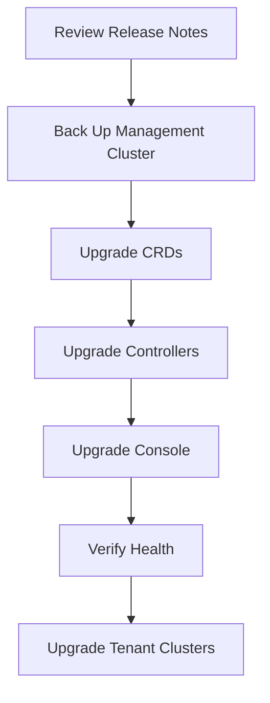

# Upgrade Butler

## Pre-Upgrade Checklist

- [ ] Review release notes for breaking changes
- [ ] Check the [compatibility matrix](../../releases/compatibility-matrix.md) for version requirements
- [ ] Back up management cluster state (see [Backup and Restore](./backup-restore.md))
- [ ] Notify users of the maintenance window
- [ ] Test the upgrade in a non-production environment first

## Upgrade Process



### 1. Upgrade CRDs

```bash
helm upgrade butler-crds oci://ghcr.io/butlerdotdev/charts/butler-crds \
  -n butler-system \
  --version <new-version>
```

### 2. Upgrade Controllers

```bash
helm upgrade butler-controller oci://ghcr.io/butlerdotdev/charts/butler-controller \
  -n butler-system \
  --version <new-version>
```

### 3. Upgrade Console

```bash
helm upgrade butler-console oci://ghcr.io/butlerdotdev/charts/butler-console \
  -n butler-system \
  --version <new-version>
```

### 4. Verify Health

```bash
kubectl get pods -n butler-system
kubectl logs -n butler-system deploy/butler-controller --tail=100
butlerctl cluster list
```

## Rollback

If issues occur after upgrade:

```bash
helm rollback butler-controller -n butler-system
helm rollback butler-crds -n butler-system
```

## See Also

- [Compatibility Matrix](../../releases/compatibility-matrix.md) -- Version requirements
- [Backup and Restore](./backup-restore.md) -- Pre-upgrade backup
