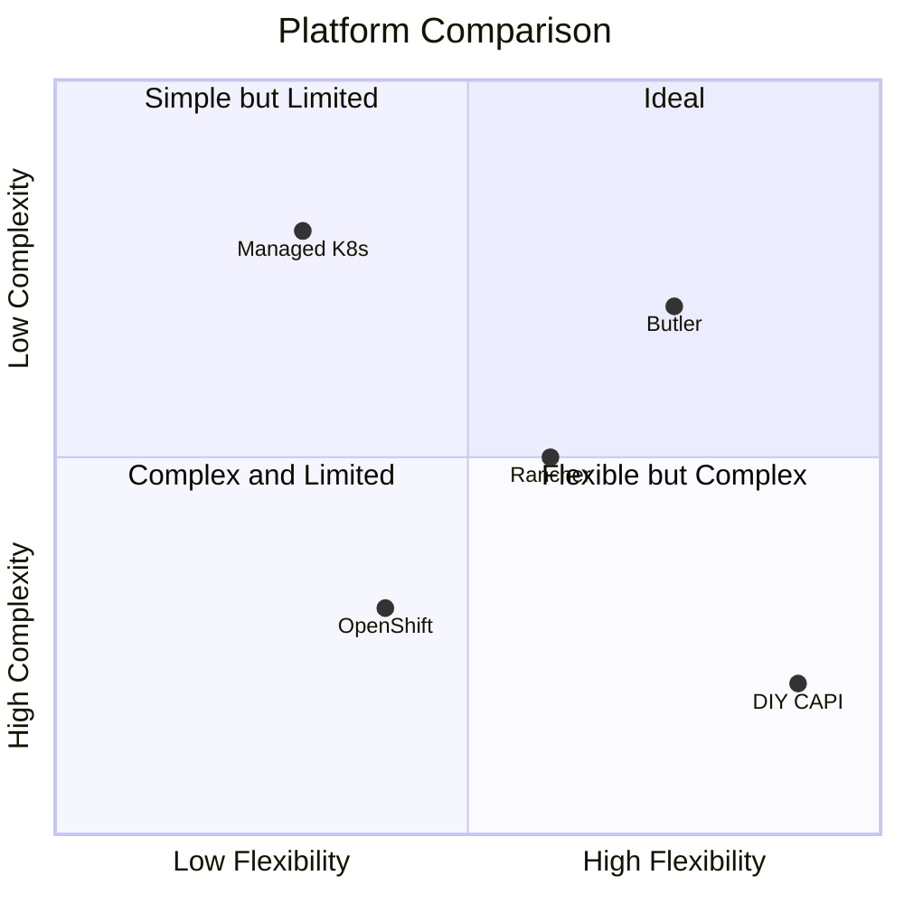
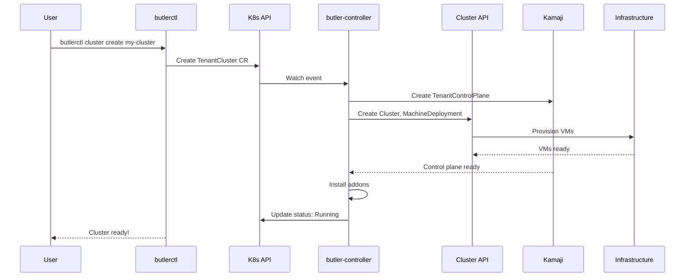

# Butler Overview

Butler is a Kubernetes-native multi-cluster management platform that enables organizations to provision and manage tenant clusters across any infrastructure.

## Table of Contents

- [What is Butler?](#what-is-butler)
- [Why Butler?](#why-butler)
- [Key Concepts](#key-concepts)
- [How Butler Works](#how-butler-works)
- [Next Steps](#next-steps)

---

## What is Butler?

Butler is an open-source platform that provides:

- **Kubernetes-as-a-Service**: Self-service tenant cluster provisioning
- **Multi-Cluster Management**: Centralized control over multiple Kubernetes clusters
- **Multi-Provider Support**: Deploy on Harvester, Nutanix, Proxmox, or cloud providers
- **GitOps Integration**: Native support for Flux and ArgoCD workflows

Built by [Butler Labs](https://butlerlabs.dev), Butler takes a Kubernetes-native approach using Custom Resource Definitions (CRDs) and operators rather than custom APIs and databases.

## Why Butler?

### The Problem

Organizations adopting Kubernetes face several challenges:

1. **Cluster Sprawl**: Managing dozens or hundreds of clusters is complex
2. **Control Plane Sprawl**: Each cluster dedicating valuable resources to control plane specific nodes
3. **Consistency**: Ensuring all clusters meet security and compliance requirements
4. **Self-Service**: Enabling developers to create clusters without bottlenecks
5. **Multi-Environment**: Supporting both on-premises and cloud deployments

### Butler's Approach

Butler addresses these challenges through:

| Challenge | Butler Solution |
|-----------|-----------------|
| Cluster Sprawl | Centralized management cluster with unified view |
| Consistency | Addon system ensures every cluster has required components |
| Self-Service | CLI, Console, and GitOps workflows for cluster creation |
| Multi-Environment | Provider abstraction supports any infrastructure |

### Butler vs. Alternatives

---

## Key Concepts

### Management Cluster

The central Kubernetes cluster that runs Butler controllers and orchestrates tenant clusters. Contains:

- Butler controllers (bootstrap, controller)
- Kamaji (hosted control planes)
- Cluster API (infrastructure provisioning)
- Console and supporting services

### Tenant Cluster

A Kubernetes cluster provisioned and managed by Butler for running workloads. Tenant clusters can be:

- **Hosted Control Plane**: Control plane runs as pods in the management cluster (Kamaji)
- **Standalone**: Dedicated control plane VMs (traditional)

### Hosted Control Planes

Butler uses [Kamaji](https://kamaji.clastix.io/) to run tenant control planes as pods rather than dedicated VMs. Benefits:

- Lower resource consumption (no 3 control plane VMs per cluster)
- Faster provisioning (seconds vs. minutes)
- Simplified operations (etcd managed centrally)

### Providers

Infrastructure adapters that provision VMs for cluster nodes:

| Provider | Infrastructure | Status |
|----------|---------------|--------|
| Harvester | Harvester HCI (KubeVirt) | Stable |
| Nutanix | Nutanix AHV | Stable |
| Proxmox | Proxmox VE | Planned |
| AWS/Azure/GCP | Public Cloud | Roadmap |

### Addons

Pre-packaged applications installed on clusters:

- **Platform Addons**: Required components (CNI, storage, load balancer)
- **Optional Addons**: Monitoring, ingress, certificates, etc.

### Teams

Multi-tenancy isolation boundaries. Teams have:

- Dedicated namespaces
- RBAC roles (admin, operator, viewer)
- Cluster quotas and defaults

---

## How Butler Works

### Workflow Steps

1. **Request**: User creates a `TenantCluster` CR via CLI, Console, or GitOps
2. **Reconcile**: butler-controller picks up the CR and starts reconciliation
3. **Control Plane**: Kamaji creates hosted control plane pods
4. **Infrastructure**: Cluster API provisions worker VMs via the appropriate provider
5. **Bootstrap**: Workers join the cluster using kubeadm
6. **Addons**: Controller installs CNI, storage, and other addons
7. **Ready**: Cluster is marked as `Running` and kubeconfig is available

---

## Next Steps

- [Architecture](../architecture/) - Deep dive into Butler's design
- [Getting Started](../getting-started/) - Install Butler and create your first cluster
- [Concepts](concepts.md) - Detailed glossary of Butler terminology
