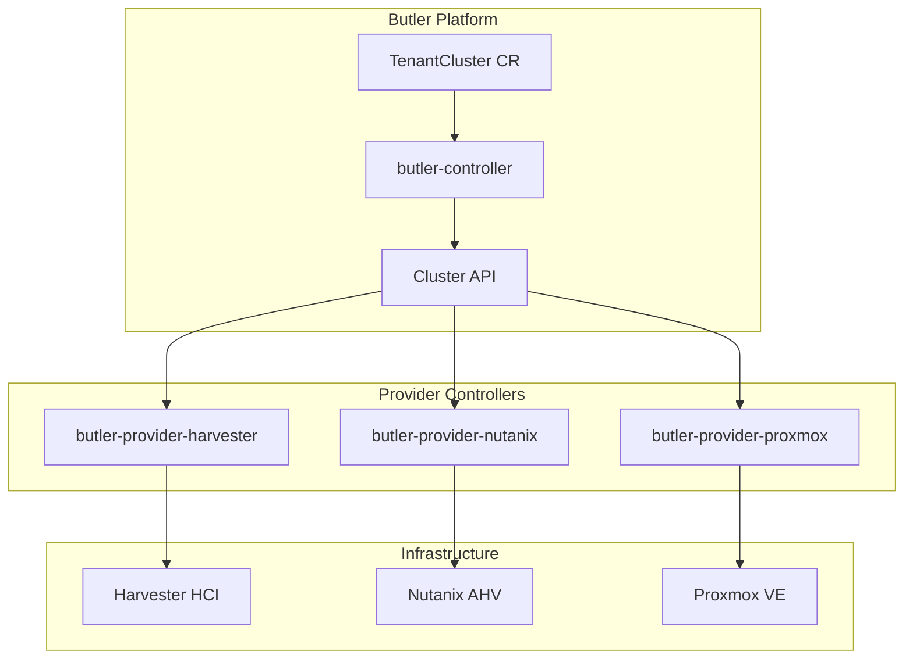

# Infrastructure Providers

Butler supports multiple infrastructure providers for provisioning cluster nodes.

## Supported Providers

| Provider | Platform | Status | Documentation |
|----------|----------|--------|---------------|
| Harvester | Harvester HCI | Stable | [harvester.md](harvester.md) |
| Nutanix | Nutanix AHV | Stable | [nutanix.md](nutanix.md) |
| Proxmox | Proxmox VE | Planned | Coming soon |
| AWS | Amazon Web Services | Roadmap | - |
| Azure | Microsoft Azure | Roadmap | - |
| GCP | Google Cloud Platform | Roadmap | - |

## Provider Architecture



## Provider Selection

When creating a TenantCluster, specify the provider via `providerConfigRef`:

```yaml
apiVersion: butler.butlerlabs.dev/v1alpha1
kind: TenantCluster
metadata:
  name: my-cluster
spec:
  providerConfigRef:
    name: harvester-prod  # References a ProviderConfig
```

## ProviderConfig

Each provider requires a `ProviderConfig` resource with credentials and settings:

```yaml
apiVersion: butler.butlerlabs.dev/v1alpha1
kind: ProviderConfig
metadata:
  name: harvester-prod
spec:
  type: harvester
  harvester:
    credentialsRef:
      name: harvester-kubeconfig
      namespace: butler-system
    namespace: default
    networkName: default/workloads
    imageName: default/talos-1.9
```

## Adding a New Provider

See the [Contributing Guide](../contributing/) for information on adding new providers.

Requirements for new providers:
1. Implement the provider controller interface
2. Create ProviderConfig schema
3. Integration with Cluster API
4. Documentation
5. CI/CD pipeline
