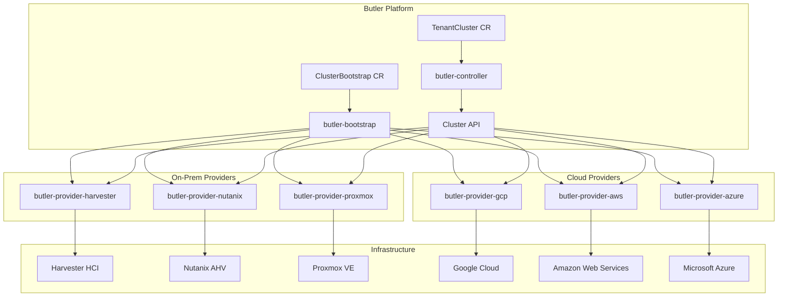

# Infrastructure Providers

Butler supports multiple infrastructure providers for provisioning management and tenant cluster nodes.

## Supported Providers

### On-Prem

| Provider | Platform | Status | Documentation |
|----------|----------|--------|---------------|
| Harvester | Harvester HCI | Stable | [harvester.md](harvester.md) |
| Nutanix | Nutanix AHV | Stable | [nutanix.md](nutanix.md) |
| Proxmox | Proxmox VE | Planned | Coming soon |

### Cloud

| Provider | Platform | Status | Documentation |
|----------|----------|--------|---------------|
| GCP | Google Cloud Platform | Stable | [gcp.md](gcp.md) |
| AWS | Amazon Web Services | Stable | [aws.md](aws.md) |
| Azure | Microsoft Azure | Stable | [azure.md](azure.md) |

## Provider Architecture

Butler uses a two-layer provider model:

- **Bootstrap layer**: Thin provider controllers (`butler-provider-*`) handle MachineRequest CRDs during management cluster bootstrap. Each controller calls the provider SDK to launch VMs, polls for IPs, and reports back. The same pattern applies across all six providers.
- **Steady-state layer**: Official CAPI infrastructure providers (CAPK, CAPA, CAPZ, CAPG) manage tenant cluster worker VM lifecycle after the management cluster is running.


```mermaid
flowchart TB
    subgraph Butler["Butler Platform"]
        Controller["butler-controller"]
        Bootstrap["butler-bootstrap"]
        TC[TenantCluster CR]
        CB[ClusterBootstrap CR]
        CAPI[Cluster API]
    end

    subgraph OnPrem["On-Prem Providers"]
        PH["butler-provider-harvester"]
        PN["butler-provider-nutanix"]
        PP["butler-provider-proxmox"]
    end

    subgraph Cloud["Cloud Providers"]
        PG["butler-provider-gcp"]
        PA["butler-provider-aws"]
        PZ["butler-provider-azure"]
    end

    subgraph Infrastructure["Infrastructure"]
        Harvester["Harvester HCI"]
        Nutanix["Nutanix AHV"]
        Proxmox["Proxmox VE"]
        GCP["Google Cloud"]
        AWS["Amazon Web Services"]
        Azure["Microsoft Azure"]
    end

    CB --> Bootstrap
    TC --> Controller
    Controller --> CAPI
    Bootstrap --> PH & PN & PP & PG & PA & PZ

    CAPI --> PH & PN & PP & PG & PA & PZ

    PH --> Harvester
    PN --> Nutanix
    PP --> Proxmox
    PG --> GCP
    PA --> AWS
    PZ --> Azure
```

## On-Prem vs Cloud Differences

| Aspect | On-Prem | Cloud |
|--------|---------|-------|
| Control plane HA | kube-vip (floating VIP) | Cloud L4 load balancer (via [LoadBalancerRequest](../reference/crds/loadbalancerrequest.md)) |
| MetalLB | Installed for LoadBalancer services | Not needed (cloud LBs) |
| Network mode | `ipam` (Butler manages IP allocation) | `cloud` (cloud networking, no IPAM) |
| VM images | Uploaded to infrastructure (Harvester image, Nutanix disk image) | Imported as cloud image (GCE image, AMI, managed image) |

## Provider Selection

When creating a TenantCluster, specify the provider via `providerConfigRef`:

```yaml
apiVersion: butler.butlerlabs.dev/v1alpha1
kind: TenantCluster
metadata:
  name: my-cluster
spec:
  providerConfigRef:
    name: harvester-prod  # References a ProviderConfig
```

## ProviderConfig

Each provider requires a `ProviderConfig` resource with credentials and settings:

```yaml
apiVersion: butler.butlerlabs.dev/v1alpha1
kind: ProviderConfig
metadata:
  name: harvester-prod
spec:
  provider: harvester
  credentialsRef:
    name: harvester-kubeconfig
    namespace: butler-system
  network:
    mode: ipam
  harvester:
    endpoint: "https://harvester.example.com"
    namespace: default
    networkName: default/workloads
    imageName: default/talos-v1-12-1
```

## Adding a New Provider

See the [Contributing Guide](../contributing/) for information on adding new providers.

Requirements for new providers:
1. Implement the provider controller interface (watch MachineRequest, create VMs, report IPs)
2. Add provider-specific config types to `butler-api/api/v1alpha1/providerconfig_types.go`
3. Integration with Cluster API (InfrastructureMachineTemplate generation in `butler-controller/internal/capi/builder.go`)
4. Documentation (provider guide following the existing pattern)
5. CI/CD pipeline (GitHub Actions for build, test, release)
