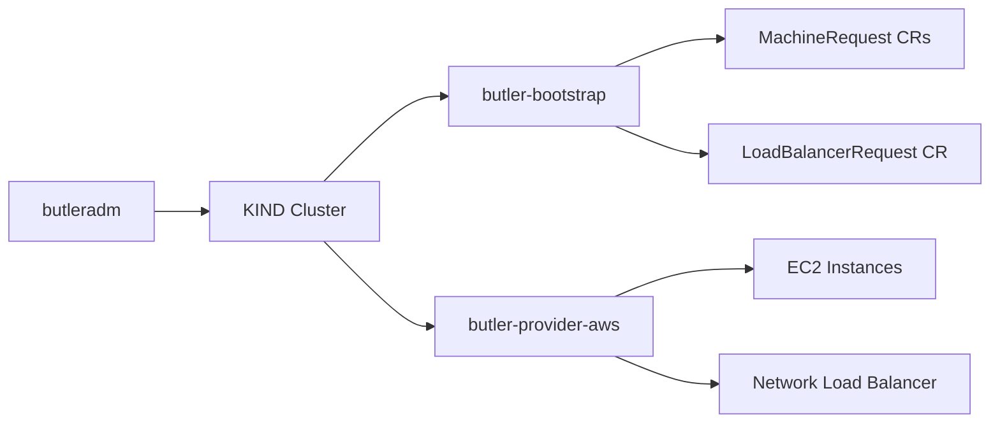

# AWS Provider Guide

> **Status: Stable.** E2E validated for single-node and HA topologies.

Bootstrap a Butler management cluster on Amazon Web Services.

## Table of Contents

- [Overview](#overview)
- [Prerequisites](#prerequisites)
- [AWS Setup](#aws-setup)
- [Bootstrap Configuration](#bootstrap-configuration)
- [Run Bootstrap](#run-bootstrap)
- [Validation](#validation)
- [Cleanup](#cleanup)
- [Troubleshooting](#troubleshooting)

---

## Overview

Butler uses a thin provider controller (`butler-provider-aws`) to provision EC2 instances running Talos Linux. For HA topologies, the provider also creates a Network Load Balancer (NLB) to front the control plane.

After bootstrap, the AWS Cloud Controller Manager (CCM) runs on the management cluster in service-controller-only mode, handling `type: LoadBalancer` services (including the Butler Console).



---

## Prerequisites

### AWS Account

An AWS account with access to the target region. EC2 and Elastic Load Balancing APIs must be enabled.

### IAM Permissions

An IAM user (or role) with the following permissions:

**EC2:**
- `ec2:RunInstances`
- `ec2:DescribeInstances`
- `ec2:TerminateInstances`
- `ec2:CreateTags`
- `ec2:DescribeSecurityGroups`
- `ec2:DescribeSubnets`
- `ec2:DescribeVpcs`
- `ec2:DescribeImages`

**Elastic Load Balancing v2 (for HA):**
- `elasticloadbalancing:CreateLoadBalancer`
- `elasticloadbalancing:DeleteLoadBalancer`
- `elasticloadbalancing:DescribeLoadBalancers`
- `elasticloadbalancing:CreateTargetGroup`
- `elasticloadbalancing:DeleteTargetGroup`
- `elasticloadbalancing:RegisterTargets`
- `elasticloadbalancing:DeregisterTargets`
- `elasticloadbalancing:CreateListener`
- `elasticloadbalancing:DescribeTargetHealth`

Or use managed policies: `AmazonEC2FullAccess` + `ElasticLoadBalancingFullAccess`.

### Networking

- A VPC with an internet gateway
- A public subnet (instances need reachability from the KIND bootstrap cluster)
- A security group (see [Security Group Rules](#security-group-rules) below)

### Talos AMI

Butler ships with pre-built Talos AMIs for common regions. If your region is not listed below, you need to import a custom AMI.

**Built-in AMIs (Talos v1.12.2, schematic `613e1592b2da41ae5e265e8789429f22e121aab91cb4deb6bc3c0b6262961245`):**

| Region | AMI ID |
|--------|--------|
| us-east-1 | `ami-0cd30b7027afffd4e` |
| us-east-2 | `ami-0f0e7059a7735d0a0` |
| us-west-1 | `ami-0abe7bca2fb75fced` |
| us-west-2 | `ami-0d03dfcef2e1eee26` |
| eu-west-1 | `ami-0c0a06de3c0c30646` |
| eu-central-1 | `ami-06e7ff093b83a3cb0` |
| ap-southeast-1 | `ami-088879e1d3a9b3c3e` |
| ap-northeast-1 | `ami-0aed11a4c14c1f6b5` |

These AMIs include the `iscsi-tools` and `util-linux-tools` Talos extensions. The provider auto-selects the correct AMI based on your configured region. To use a custom AMI, set the `ami` field in the config.

---

## AWS Setup

### 1. Create IAM User

```bash
aws iam create-user --user-name butler-bootstrap

aws iam attach-user-policy --user-name butler-bootstrap \
  --policy-arn arn:aws:iam::aws:policy/AmazonEC2FullAccess
aws iam attach-user-policy --user-name butler-bootstrap \
  --policy-arn arn:aws:iam::aws:policy/ElasticLoadBalancingFullAccess

aws iam create-access-key --user-name butler-bootstrap
```

Save the `AccessKeyId` and `SecretAccessKey` from the output.

### 2. Create Security Group

```bash
SG_ID=$(aws ec2 create-security-group \
  --group-name butler-bootstrap \
  --description "Butler bootstrap cluster" \
  --vpc-id vpc-XXXXX \
  --query 'GroupId' --output text)

# Kubernetes API (external access + NLB health checks)
aws ec2 authorize-security-group-ingress --group-id $SG_ID \
  --protocol tcp --port 6443 --cidr 0.0.0.0/0

# Talos API (node-to-node)
aws ec2 authorize-security-group-ingress --group-id $SG_ID \
  --protocol tcp --port 50000-50001 --source-group $SG_ID

# etcd (node-to-node)
aws ec2 authorize-security-group-ingress --group-id $SG_ID \
  --protocol tcp --port 2379-2380 --source-group $SG_ID

# kubelet API (node-to-node)
aws ec2 authorize-security-group-ingress --group-id $SG_ID \
  --protocol tcp --port 10250 --source-group $SG_ID

# Cilium health checks (node-to-node)
aws ec2 authorize-security-group-ingress --group-id $SG_ID \
  --protocol tcp --port 4240 --source-group $SG_ID

# Cilium VXLAN overlay (node-to-node)
aws ec2 authorize-security-group-ingress --group-id $SG_ID \
  --protocol udp --port 8472 --source-group $SG_ID
```

### Security Group Rules

| Direction | Protocol/Port | Source | Purpose |
|-----------|--------------|--------|---------|
| Inbound | TCP 6443 | 0.0.0.0/0 | Kubernetes API (external + NLB health checks) |
| Inbound | TCP 50000-50001 | Self | Talos API (apid + trustd) |
| Inbound | TCP 2379-2380 | Self | etcd client and peer |
| Inbound | TCP 10250 | Self | kubelet API |
| Inbound | TCP 4240 | Self | Cilium health checks |
| Inbound | UDP 8472 | Self | Cilium VXLAN overlay |

---

## Bootstrap Configuration

Create a config file at `~/.butler/bootstrap-aws.yaml`:

### Single-Node

This config was used for E2E validation. Replace credentials, VPC, subnet, and security group with your values.

```yaml
provider: aws

cluster:
  name: butler-aws-test
  topology: single-node
  controlPlane:
    replicas: 1
    cpu: 4
    memoryMB: 16384
    diskGB: 100

network:
  podCIDR: "10.244.0.0/16"
  serviceCIDR: "10.96.0.0/12"

talos:
  version: v1.12.2

addons:
  cni:
    type: cilium
  storage:
    type: longhorn

providerConfig:
  aws:
    accessKeyID: "YOUR_ACCESS_KEY_ID"
    secretAccessKey: "YOUR_SECRET_ACCESS_KEY"
    region: "us-east-1"
    vpcID: "vpc-016fee01a86ae92f9"
    subnetID: "subnet-08f5cc7e6f53c7c03"
    securityGroupID: "sg-0f5d6bb6a232d8af0"
```

### HA

```yaml
provider: aws

cluster:
  name: butler-aws-ha
  topology: ha
  controlPlane:
    replicas: 3
    cpu: 4
    memoryMB: 16384
    diskGB: 100
  workers:
    replicas: 2
    cpu: 4
    memoryMB: 16384
    diskGB: 50

network:
  podCIDR: "10.244.0.0/16"
  serviceCIDR: "10.96.0.0/12"

talos:
  version: v1.12.2

addons:
  cni:
    type: cilium
  storage:
    type: longhorn

providerConfig:
  aws:
    accessKeyID: "YOUR_ACCESS_KEY_ID"
    secretAccessKey: "YOUR_SECRET_ACCESS_KEY"
    region: "us-east-1"
    vpcID: "vpc-016fee01a86ae92f9"
    subnetID: "subnet-08f5cc7e6f53c7c03"
    securityGroupID: "sg-0f5d6bb6a232d8af0"
```

### Cloud vs On-Prem

- No `vip` field -- cloud providers use a load balancer, not kube-vip
- No `loadBalancerPool` field -- cloud providers do not use MetalLB
- kube-vip, MetalLB, and Traefik are skipped during addon installation
- The AWS CCM handles `type: LoadBalancer` services
- The Butler Console is exposed as `type: LoadBalancer` with an NLB annotation

---

## Run Bootstrap

```bash
butleradm bootstrap aws --config ~/.butler/bootstrap-aws.yaml
```

---

## Validation

```bash
export KUBECONFIG=~/.butler/butler-aws-test-kubeconfig

# All nodes Ready with providerID set
kubectl get nodes -o wide
kubectl get nodes -o jsonpath='{.items[*].spec.providerID}'
# Expected format: aws:///<zone>/<instance-id>

# AWS CCM running
kubectl get pods -n kube-system | grep cloud

# Cilium running
kubectl get pods -n kube-system -l app.kubernetes.io/name=cilium

# Longhorn running
kubectl get pods -n longhorn-system

# Butler Console exposed via NLB
kubectl get svc butler-console-frontend -n butler-system

# Console accessible (use the EXTERNAL-IP from above)
curl http://<NLB-hostname>
```

### What You Have Now

A Butler management cluster running on AWS with:
- Talos Linux EC2 instances with Cilium CNI
- AWS NLB fronting the Kubernetes API (HA topology)
- AWS CCM handling LoadBalancer services
- Longhorn distributed storage
- Steward for hosted tenant control planes
- Butler controller, CRDs, and web console exposed via NLB

To create your first tenant cluster, go to [Create Your First Tenant Cluster](../getting-started/#create-your-first-tenant-cluster).

---

## Cleanup

```bash
# Delete KIND bootstrap cluster
kind delete cluster --name butler-bootstrap

# Terminate EC2 instances
aws ec2 describe-instances \
  --filters "Name=tag:butler_butlerlabs_dev_managed-by,Values=butler" \
  --query 'Reservations[].Instances[].InstanceId' --output text \
  | xargs -I{} aws ec2 terminate-instances --instance-ids {}

# Delete orphaned NLBs
aws elbv2 describe-load-balancers \
  --query 'LoadBalancers[?contains(LoadBalancerName, `CLUSTER_NAME`)].LoadBalancerArn' \
  --output text \
  | xargs -I{} aws elbv2 delete-load-balancer --load-balancer-arn {}
```

---

## Troubleshooting

### Security Group Rules Missing

**Symptom**: Talos bootstrap times out. Nodes cannot communicate.

```bash
aws ec2 describe-security-groups --group-ids sg-XXXXX \
  --query "SecurityGroups[0].IpPermissions"
```

Verify all six rules are present (6443, 50000-50001, 2379-2380, 10250, 4240, 8472).

### IAM Permissions Insufficient

**Symptom**: Provider controller logs show `UnauthorizedOperation`.

```bash
aws iam simulate-principal-policy \
  --policy-source-arn arn:aws:iam::ACCOUNT:user/butler-bootstrap \
  --action-names ec2:RunInstances elasticloadbalancing:CreateLoadBalancer
```

### NLB Target Health Failures

**Symptom**: LoadBalancerRequest stuck in `Creating`. Target group shows unhealthy targets.

```bash
aws elbv2 describe-target-health \
  --target-group-arn arn:aws:elasticloadbalancing:REGION:ACCOUNT:targetgroup/CLUSTER_NAME/XXXXX
```

Common causes:
- Security group does not allow TCP 6443 from the VPC CIDR
- kube-apiserver not yet listening (bootstrap still in progress)
- Instances not registered in the correct target group

### Subnet Not Public

**Symptom**: Instances created but not reachable from the bootstrap machine.

During bootstrap, the KIND cluster must reach each VM's Talos API on port 50000. Instances need a public IP (either auto-assigned or Elastic IP) and a route to the internet via an Internet Gateway.

### Instance Tags

EC2 instances are tagged with `kubernetes.io/cluster/<clusterName>: owned`. The AWS CCM uses this tag for instance discovery. If you see CCM errors about not finding instances, verify the tags are present:

```bash
aws ec2 describe-instances \
  --instance-ids <id> \
  --query 'Reservations[].Instances[].Tags'
```

---

## See Also

- [Bootstrap Flow](../architecture/bootstrap-flow.md) - End-to-end bootstrap sequence
- [Bootstrap Config Reference](../reference/bootstrap-config.md) - Every config field documented
- [GCP Provider](gcp.md) - Alternative cloud provider
- [Azure Provider](azure.md) - Alternative cloud provider
