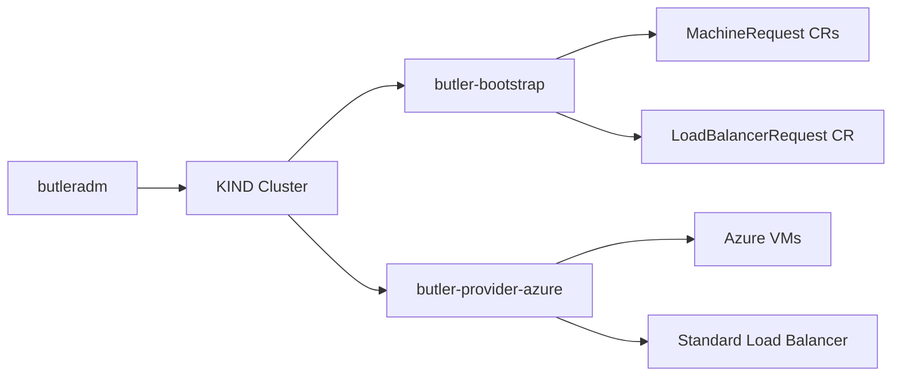

# Azure Provider Guide

> **Status: Beta.** Azure bootstrap has been E2E validated for single-node. HA validation is blocked by public IP quota limits on restricted subscriptions.

This guide covers bootstrapping a Butler management cluster on Microsoft Azure.

## Table of Contents

- [Overview](#overview)
- [Prerequisites](#prerequisites)
- [Azure Setup](#azure-setup)
- [Bootstrap Configuration](#bootstrap-configuration)
- [Run Bootstrap](#run-bootstrap)
- [Validation](#validation)
- [Cleanup](#cleanup)
- [Azure-Specific Details](#azure-specific-details)
- [Troubleshooting](#troubleshooting)

---

## Overview

Butler uses a thin provider controller (`butler-provider-azure`) to provision VMs on Azure Compute. For HA topologies, the provider creates a Standard Load Balancer with a public IP, health probe, and load balancing rule on port 6443.

After bootstrap, the Azure Cloud Controller Manager (CCM) runs on the management cluster as an embedded Deployment (not Helm). It handles `type: LoadBalancer` services by creating Azure load balancers.



---

## Prerequisites

### Azure Subscription

- An Azure subscription with sufficient quota
- Microsoft.Compute and Microsoft.Network resource providers registered

### Service Principal

A service principal with `Contributor` role on the resource group:

```bash
az ad sp create-for-rbac \
  --name butler-bootstrap \
  --role Contributor \
  --scopes /subscriptions/SUBSCRIPTION_ID/resourceGroups/RESOURCE_GROUP
```

Save the `appId` (clientID), `password` (clientSecret), and `tenant` (tenantID) from the output.

### Networking

Pre-provision the following resources:

| Resource | Notes |
|----------|-------|
| Resource group | Must exist before bootstrap |
| VNet + subnet | Must exist in the resource group |
| Network Security Group (NSG) | Must exist. CCM manages NSG rules for LB services. |

### Talos Image

A Talos Linux image must be available as a managed image or in a Shared Image Gallery.

**Step 1: Download from the Talos Image Factory**

```bash
wget https://factory.talos.dev/image/SCHEMATIC_ID/v1.12.5/azure-amd64.vhd.xz
xz -d azure-amd64.vhd.xz
```

**Step 2: Upload to Azure**

Upload as a managed image or add to a Shared Image Gallery. Note the full ARM resource ID for the `imageURN` config field. Examples:

- Managed image: `/subscriptions/.../resourceGroups/.../providers/Microsoft.Compute/images/talos-v1-12-5`
- Gallery image: `/subscriptions/.../resourceGroups/.../providers/Microsoft.Compute/galleries/.../images/.../versions/1.12.5`

### Public IP Quota

Standard Public IPs have a quota that varies by subscription type. Restricted and free-tier subscriptions often default to 3 Standard PIPs per region.

| Topology | VMs | LBs | Total Public IPs |
|----------|-----|-----|-----------------|
| Single-node | 1 | 1 (console) | 2 |
| HA (3CP + 2W) | 5 | 1 (console) | 6 |

If your quota is below 6, HA bootstrap will fail with `PublicIPCountLimitReached`. Request a quota increase through the Azure portal under Subscription > Usage + quotas.

---

## Azure Setup

### 1. Create Service Principal

```bash
az ad sp create-for-rbac \
  --name butler-bootstrap \
  --role Contributor \
  --scopes /subscriptions/SUB_ID/resourceGroups/butler-rg
```

### 2. Create Resource Group and VNet

```bash
az group create --name butler-rg --location eastus

az network vnet create \
  --resource-group butler-rg \
  --name butler-vnet \
  --address-prefix 10.0.0.0/16 \
  --subnet-name default \
  --subnet-prefix 10.0.0.0/24
```

### 3. Create Network Security Group

```bash
az network nsg create \
  --resource-group butler-rg \
  --name butler-nsg

# Kubernetes API (external + LB health probes)
az network nsg rule create \
  --resource-group butler-rg --nsg-name butler-nsg \
  --name allow-apiserver --priority 100 \
  --access Allow --protocol Tcp \
  --destination-port-ranges 6443 \
  --source-address-prefixes '*'

# Talos API (inter-node)
az network nsg rule create \
  --resource-group butler-rg --nsg-name butler-nsg \
  --name allow-talos --priority 200 \
  --access Allow --protocol Tcp \
  --destination-port-ranges 50000-50001 \
  --source-address-prefixes 10.0.0.0/24

# etcd (inter-node)
az network nsg rule create \
  --resource-group butler-rg --nsg-name butler-nsg \
  --name allow-etcd --priority 300 \
  --access Allow --protocol Tcp \
  --destination-port-ranges 2379-2380 \
  --source-address-prefixes 10.0.0.0/24

# kubelet API (inter-node)
az network nsg rule create \
  --resource-group butler-rg --nsg-name butler-nsg \
  --name allow-kubelet --priority 400 \
  --access Allow --protocol Tcp \
  --destination-port-ranges 10250 \
  --source-address-prefixes 10.0.0.0/24

# Cilium health checks (inter-node)
az network nsg rule create \
  --resource-group butler-rg --nsg-name butler-nsg \
  --name allow-cilium-health --priority 500 \
  --access Allow --protocol Tcp \
  --destination-port-ranges 4240 \
  --source-address-prefixes 10.0.0.0/24

# Cilium VXLAN overlay (inter-node)
az network nsg rule create \
  --resource-group butler-rg --nsg-name butler-nsg \
  --name allow-cilium-vxlan --priority 600 \
  --access Allow --protocol Udp \
  --destination-port-ranges 8472 \
  --source-address-prefixes 10.0.0.0/24

# Associate NSG with subnet
az network vnet subnet update \
  --resource-group butler-rg \
  --vnet-name butler-vnet \
  --name default \
  --network-security-group butler-nsg
```

### NSG Rules

| Priority | Protocol/Port | Source | Purpose |
|----------|--------------|--------|---------|
| 100 | TCP 6443 | * | Kubernetes API (external + LB health probes from 168.63.129.16) |
| 200 | TCP 50000-50001 | Subnet CIDR | Talos API (apid + trustd) |
| 300 | TCP 2379-2380 | Subnet CIDR | etcd client and peer |
| 400 | TCP 10250 | Subnet CIDR | kubelet API |
| 500 | TCP 4240 | Subnet CIDR | Cilium health checks |
| 600 | UDP 8472 | Subnet CIDR | Cilium VXLAN overlay |

---

## Bootstrap Configuration

Create a config file at `~/.butler/bootstrap-azure.yaml`:

### Single-Node

```yaml
provider: azure

cluster:
  name: butler-mgmt
  topology: single-node
  controlPlane:
    replicas: 1
    cpu: 4
    memoryMB: 16384           # 16 GB
    diskGB: 100

network:
  podCIDR: "10.244.0.0/16"
  serviceCIDR: "10.96.0.0/12"
  # No vip or loadBalancerPool for cloud providers

talos:
  version: v1.12.5

addons:
  cni:
    type: cilium
  storage:
    type: longhorn

providerConfig:
  azure:
    clientID: "00000000-0000-0000-0000-000000000000"        # Service principal app ID
    clientSecret: "your-client-secret"                        # Service principal password
    tenantID: "00000000-0000-0000-0000-000000000000"         # Azure AD tenant ID
    subscriptionID: "00000000-0000-0000-0000-000000000000"   # Azure subscription ID
    resourceGroup: "butler-rg"                                # Pre-existing resource group
    location: "eastus"                                        # Azure region
    vnetName: "butler-vnet"                                   # Pre-existing VNet name
    subnetName: "default"                                     # Subnet within the VNet
    securityGroupName: "butler-nsg"                           # Pre-existing NSG name (required)
    vmSize: "Standard_D4s_v3"                                 # VM size
    imageURN: "/subscriptions/.../providers/Microsoft.Compute/galleries/.../images/.../versions/1.12.5"
```

### HA

```yaml
provider: azure

cluster:
  name: butler-mgmt
  topology: ha
  controlPlane:
    replicas: 3
    cpu: 4
    memoryMB: 16384
    diskGB: 100
  workers:
    replicas: 2
    cpu: 4
    memoryMB: 16384
    diskGB: 100

network:
  podCIDR: "10.244.0.0/16"
  serviceCIDR: "10.96.0.0/12"

talos:
  version: v1.12.5

addons:
  cni:
    type: cilium
  storage:
    type: longhorn

providerConfig:
  azure:
    clientID: "00000000-0000-0000-0000-000000000000"
    clientSecret: "your-client-secret"
    tenantID: "00000000-0000-0000-0000-000000000000"
    subscriptionID: "00000000-0000-0000-0000-000000000000"
    resourceGroup: "butler-rg"
    location: "eastus"
    vnetName: "butler-vnet"
    subnetName: "default"
    securityGroupName: "butler-nsg"
    vmSize: "Standard_D4s_v3"
    imageURN: "/subscriptions/.../providers/Microsoft.Compute/galleries/.../images/.../versions/1.12.5"
```

**Required fields:**
- `securityGroupName` is required. The Azure CCM fails with `securityGroupName is not configured` without it.
- `imageURN` is the full ARM resource ID for the Talos image (managed image or gallery image version).
- `vmSize` selects the Azure VM SKU. Not all SKUs support all security types.

---

## Run Bootstrap

```bash
butleradm bootstrap azure --config ~/.butler/bootstrap-azure.yaml
```

---

## Validation

```bash
export KUBECONFIG=~/.butler/butler-mgmt-kubeconfig

# All nodes Ready with providerID set
kubectl get nodes -o wide
kubectl get nodes -o jsonpath='{.items[*].spec.providerID}'
# Expected format: azure:///subscriptions/<sub>/resourceGroups/<rg>/providers/Microsoft.Compute/virtualMachines/<vm>

# Azure CCM Deployment running (embedded manifest)
kubectl get deploy -n kube-system | grep cloud

# Cilium healthy
kubectl get pods -n kube-system -l app.kubernetes.io/name=cilium

# Longhorn healthy
kubectl get pods -n longhorn-system

# Butler Console exposed via Azure LB
kubectl get svc butler-console-frontend -n butler-system
# Should show type: LoadBalancer with an external IP

# Console accessible
curl http://<LB-IP>
```

---

## Cleanup

```bash
# Delete KIND bootstrap cluster
kind delete cluster --name butler-bootstrap

# Delete VMs
az vm list -g butler-rg \
  --query "[?tags.\"butler_butlerlabs_dev_managed-by\"=='butler'].name" -o tsv \
  | xargs -I{} az vm delete -g butler-rg -n {} --yes --force-deletion yes

# Wait ~180s for NICs to release, then delete NICs
az network nic list -g butler-rg \
  --query "[?contains(name, 'butler-mgmt')].name" -o tsv \
  | xargs -I{} az network nic delete -g butler-rg -n {}

# Delete public IPs
az network public-ip list -g butler-rg \
  --query "[?tags.\"butler-managed-by\"=='butler'].name" -o tsv \
  | xargs -I{} az network public-ip delete -g butler-rg -n {}

# Delete load balancers
az network lb list -g butler-rg \
  --query "[?tags.\"butler-managed-by\"=='butler'].name" -o tsv \
  | xargs -I{} az network lb delete -g butler-rg -n {}

# Delete orphaned disks
az disk list -g butler-rg \
  --query "[?contains(name, 'butler-mgmt')].name" -o tsv \
  | xargs -I{} az disk delete -g butler-rg -n {} --yes

# Delete availability set
az vm availability-set delete -g butler-rg -n butler-mgmt-avset
```

---

## Azure-Specific Details

### AvailabilitySet

The provider controller auto-creates an AvailabilitySet named `<clusterName>-avset` with Aligned SKU (Fault Domains: 2, Update Domains: 5). This is required because the Azure CCM with `vmType=standard` uses AvailabilitySet membership to determine which VMs belong to the cluster for LB backend pool management.

### CCM Backend Pool Bug

Azure CCM v1.31 with `vmType=standard` does not auto-populate LB backend pools. The initial backend sync runs before any LoadBalancer services exist, and no subsequent sync is triggered after the console service is created.

Butler works around this in bootstrap step 12.5 by directly calling the Azure REST API to:
1. Get the LB backend pool resource ID
2. For each cluster node: read the NIC, add the backend pool reference to `ipConfigurations[0].properties.loadBalancerBackendAddressPools`, and write it back

This is handled automatically during bootstrap.

### Tag Key Sanitization

Azure tag keys cannot contain forward slashes (`/`). Butler labels like `butler.butlerlabs.dev/team` are sanitized by replacing `/` with `_`. Load balancer and public IP resources use simplified tag keys like `butler-managed-by` instead.

### SSH Key Placeholder

Azure requires an SSH public key for Linux VM creation, even though Talos ignores SSH. The provider generates a placeholder RSA-4096 key at runtime.

---

## Troubleshooting

### NSG Rules Blocking Traffic

**Symptom**: Talos bootstrap times out. Nodes cannot communicate.

```bash
az network nsg rule list \
  --resource-group butler-rg \
  --nsg-name butler-nsg \
  --output table
```

Verify all six rules exist, including Cilium ports (4240, 8472).

### Public IP Quota Exceeded

**Symptom**: `PublicIPCountLimitReached` error in provider logs.

```bash
az vm list-usage --location eastus --output table | grep "Public IP"
```

Standard Public IPs default to 3 per region on restricted subscriptions. Single-node needs 2 (1 VM + 1 console LB). HA needs 6 (5 VMs + 1 LB). Self-service quota increase (`az quota create`) may fail. Request an increase through the Azure portal support ticket flow.

### CCM LB Backend Pool Empty

**Symptom**: Console LB exists but has no healthy backends. The service external IP is assigned but `curl` times out.

Check CCM logs:
```bash
kubectl logs -n kube-system deploy/cloud-controller-manager
```

If you see `managed=, ok=false, isNodeManagedByCloudProvider=true` without subsequent backend sync, the CCM backend pool bug has occurred. Butler's step 12.5 handles this automatically, but if it fails, check the bootstrap controller logs for Azure REST API errors.

### Service Principal Expired

**Symptom**: `AADSTS7000215: Invalid client secret`.

```bash
az ad sp credential reset --id APP_ID
```

Update the secret in your bootstrap config.

### securityGroupName Missing

**Symptom**: CCM logs show `securityGroupName is not configured`.

The `securityGroupName` field is required in the Azure provider config. Without it, the CCM cannot create NSG rules for LoadBalancer services. Add it to your config:

```yaml
providerConfig:
  azure:
    securityGroupName: "butler-nsg"
```

---

## See Also

- [Bootstrap Flow](../architecture/bootstrap-flow.md) - End-to-end bootstrap sequence
- [Bootstrap Config Reference](../reference/bootstrap-config.md) - Every config field documented
- [AWS Provider](aws.md) - Alternative cloud provider
- [GCP Provider](gcp.md) - Alternative cloud provider
