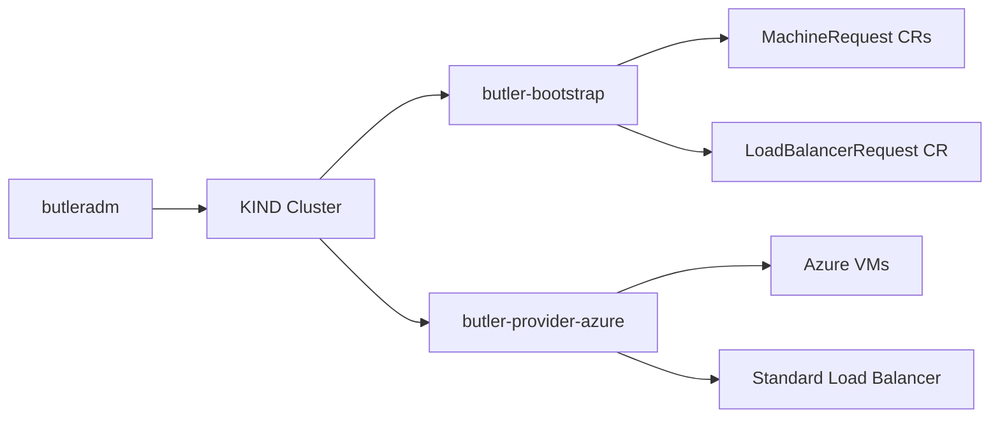
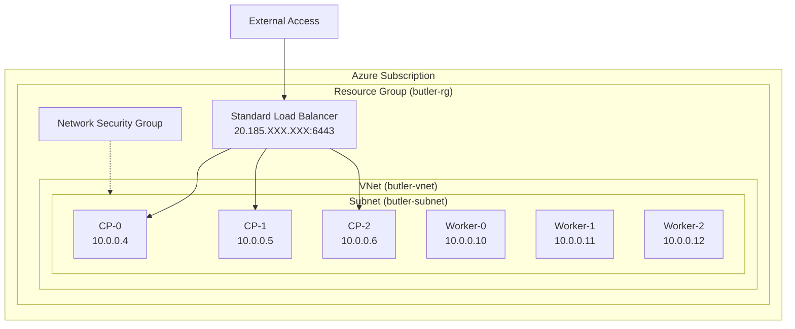

# Azure Provider Guide

This guide covers setting up Butler with Microsoft Azure as the infrastructure provider for management cluster bootstrap.

## Table of Contents

- [Overview](#overview)
- [Prerequisites](#prerequisites)
- [Azure Setup](#azure-setup)
- [Butler Configuration](#butler-configuration)
- [Network Architecture](#network-architecture)
- [Load Balancer Resources](#load-balancer-resources)
- [Resource Recommendations](#resource-recommendations)
- [Troubleshooting](#troubleshooting)

---

## Overview

Butler uses a thin provider controller (`butler-provider-azure`) to provision VMs on Azure Compute. The controller creates VM instances with Talos Linux images and reports their IPs back to the bootstrap controller.

For control plane HA, the bootstrap controller creates a LoadBalancerRequest, and the Azure provider provisions a Standard Load Balancer with a public IP, health probe, and load balancing rule on port 6443.



### Key Components

| Component | Purpose |
|-----------|---------|
| butler-provider-azure | Provisions Azure VMs and Standard Load Balancer resources |
| CAPI Azure Provider (CAPZ) | Manages tenant cluster worker VMs after bootstrap |

---

## Prerequisites

### Azure Subscription

- An Azure subscription with sufficient quota
- Microsoft.Compute and Microsoft.Network resource providers registered

### Service Principal

A service principal with `Contributor` role on the resource group (or subscription).

### Networking

- A resource group in the target region
- A VNet with at least one subnet
- A Network Security Group (NSG) allowing required ports (see [Network Architecture](#network-architecture))

### Talos Image

A Talos Linux image must be available as a managed image or in a Shared Image Gallery in the target subscription. Use the Talos Image Factory or import from official releases.

---

## Azure Setup

### 1. Create Service Principal

```bash
# Create service principal with Contributor role scoped to a resource group
az ad sp create-for-rbac \
  --name butler-bootstrap \
  --role Contributor \
  --scopes /subscriptions/SUBSCRIPTION_ID/resourceGroups/butler-rg
```

Save the output (`appId`, `password`, `tenant`).

### 2. Create Resource Group and VNet

```bash
# Create resource group
az group create --name butler-rg --location eastus

# Create VNet and subnet
az network vnet create \
  --resource-group butler-rg \
  --name butler-vnet \
  --address-prefix 10.0.0.0/16 \
  --subnet-name butler-subnet \
  --subnet-prefix 10.0.0.0/24
```

### 3. Create Network Security Group

```bash
# Create NSG
az network nsg create \
  --resource-group butler-rg \
  --name butler-nsg

# Allow kube-apiserver (external + LB health probes)
az network nsg rule create \
  --resource-group butler-rg \
  --nsg-name butler-nsg \
  --name allow-apiserver \
  --priority 100 \
  --access Allow \
  --protocol Tcp \
  --destination-port-ranges 6443 \
  --source-address-prefixes '*'

# Allow inter-node Talos API
az network nsg rule create \
  --resource-group butler-rg \
  --nsg-name butler-nsg \
  --name allow-talos \
  --priority 200 \
  --access Allow \
  --protocol Tcp \
  --destination-port-ranges 50000-50001 \
  --source-address-prefixes 10.0.0.0/24

# Allow etcd peer and client
az network nsg rule create \
  --resource-group butler-rg \
  --nsg-name butler-nsg \
  --name allow-etcd \
  --priority 300 \
  --access Allow \
  --protocol Tcp \
  --destination-port-ranges 2379-2380 \
  --source-address-prefixes 10.0.0.0/24

# Allow kubelet API
az network nsg rule create \
  --resource-group butler-rg \
  --nsg-name butler-nsg \
  --name allow-kubelet \
  --priority 400 \
  --access Allow \
  --protocol Tcp \
  --destination-port-ranges 10250 \
  --source-address-prefixes 10.0.0.0/24

# Associate NSG with subnet
az network vnet subnet update \
  --resource-group butler-rg \
  --vnet-name butler-vnet \
  --name butler-subnet \
  --network-security-group butler-nsg
```

### 4. Upload Talos Image (if needed)

```bash
# Download Talos Azure image
wget https://factory.talos.dev/image/SCHEMATIC_ID/vX.Y.Z/azure-amd64.vhd.xz

# Create managed image
az image create \
  --resource-group butler-rg \
  --name talos-vX-Y-Z \
  --os-type Linux \
  --source PATH_TO_VHD
```

---

## Butler Configuration

### ProviderConfig

```yaml
apiVersion: v1
kind: Secret
metadata:
  name: azure-credentials
  namespace: butler-system
type: Opaque
stringData:
  client-id: "APP_ID"
  client-secret: "PASSWORD"
  tenant-id: "TENANT_ID"
  subscription-id: "SUBSCRIPTION_ID"
---
apiVersion: butler.butlerlabs.dev/v1alpha1
kind: ProviderConfig
metadata:
  name: azure-prod
  namespace: butler-system
spec:
  provider: azure
  credentialsRef:
    name: azure-credentials
    namespace: butler-system
  network:
    mode: cloud
  azure:
    subscriptionID: "SUBSCRIPTION_ID"
    resourceGroup: butler-rg
    location: eastus
    vnetName: butler-vnet
    subnetName: butler-subnet
```

### Bootstrap Config

```yaml
apiVersion: butler.butlerlabs.dev/v1alpha1
kind: ClusterBootstrap
metadata:
  name: butler-mgmt
  namespace: butler-system
spec:
  provider: azure
  providerRef:
    name: azure-prod
    namespace: butler-system

  cluster:
    name: butler-mgmt
    topology: ha
    controlPlane:
      replicas: 3
      cpu: 4
      memoryMB: 16384
      diskGB: 100
    workers:
      replicas: 3
      cpu: 8
      memoryMB: 32768
      diskGB: 200

  network:
    podCIDR: 10.244.0.0/16
    serviceCIDR: 10.96.0.0/12

  talos:
    version: v1.9.2
    schematic: ce4c980550dd2ab1b17bbf2b08801c7eb59418eafe8f279833297925d67c7515

  addons:
    cni:
      type: cilium
    storage:
      type: longhorn
    controlPlaneProvider:
      type: steward
    capi:
      enabled: true
      infrastructureProviders:
        - name: azure

  controlPlaneExposure:
    mode: LoadBalancer
```

### Run Bootstrap

```bash
butleradm bootstrap azure --config bootstrap.yaml
```

---

## Network Architecture



### NSG Rules

| Priority | Direction | Protocol/Port | Source | Purpose |
|----------|-----------|--------------|--------|---------|
| 100 | Inbound | TCP 6443 | * | Kubernetes API (external + LB probes) |
| 200 | Inbound | TCP 50000-50001 | 10.0.0.0/24 | Talos API (apid + trustd) |
| 300 | Inbound | TCP 2379-2380 | 10.0.0.0/24 | etcd client and peer |
| 400 | Inbound | TCP 10250 | 10.0.0.0/24 | kubelet API |

Azure Standard Load Balancer health probes originate from the IP `168.63.129.16`. The wildcard source on the TCP 6443 rule covers both external access and health probe traffic.

---

## Load Balancer Resources

When the bootstrap controller creates a LoadBalancerRequest with `provider: azure`, the Azure provider controller creates:

| Azure Resource | Purpose |
|----------------|---------|
| Public IP address | Stable external IP for the control plane endpoint |
| Standard Load Balancer | Regional L4 load balancer |
| Health probe (TCP 6443) | Checks kube-apiserver availability on each CP node |
| Load balancing rule (TCP 6443) | Routes traffic to the backend pool |
| Backend address pool | Groups the control plane VM NICs |

The Standard Load Balancer uses TCP passthrough (no TLS termination). Backend VMs are added directly by their NIC (using IP addresses from `LoadBalancerTarget.ip`).

The public IP is reported as the LoadBalancerRequest endpoint and used as the control plane address.

---

## Resource Recommendations

| Profile | CP Nodes | CP VM Size | Worker Nodes | Worker VM Size | Estimated Monthly Cost |
|---------|----------|-----------|-------------|---------------|----------------------|
| Development | 1 (single-node) | Standard_D4s_v5 (4 vCPU, 16 GB) | 0 | -- | ~$150 |
| Staging | 3 | Standard_D4s_v5 (4 vCPU, 16 GB) | 2 | Standard_D8s_v5 (8 vCPU, 32 GB) | ~$1,000 |
| Production | 3 | Standard_D4s_v5 (4 vCPU, 16 GB) | 3+ | Standard_D8s_v5 (8 vCPU, 32 GB) | ~$1,400+ |

Standard Load Balancer pricing: fixed hourly charge plus per-rule charge. For a management cluster with a single rule, expect approximately $25/month.

---

## Troubleshooting

### NSG Rules Blocking Traffic

**Symptom**: Talos bootstrap times out. Nodes cannot communicate.

**Verify**:
```bash
az network nsg rule list \
  --resource-group butler-rg \
  --nsg-name butler-nsg \
  --output table
```

### Quota Limits

**Symptom**: MachineRequest stuck in `Creating` with quota error.

**Common quotas to check:**
- `Total Regional vCPUs` (default varies by subscription type)
- `Standard Dv5 Family vCPUs` (or whichever family is used)
- `Public IP Addresses - Standard` (default: 10 per region)

**Check**:
```bash
az vm list-usage --location eastus --output table
```

**Fix**: Request quota increase in the Azure Portal under Subscription > Usage + quotas.

### LB Health Probe Failures

**Symptom**: LoadBalancerRequest stuck in `Creating` phase.

**Verify**:
```bash
az network lb probe show \
  --resource-group butler-rg \
  --lb-name butler-mgmt-lb \
  --name butler-mgmt-probe
```

**Common causes:**
- NSG blocks TCP 6443 from the health probe source IP (`168.63.129.16`)
- kube-apiserver not yet listening (bootstrap still in progress)
- Backend pool has no associated NICs

### Service Principal Expired

**Symptom**: Provider controller logs show `AADSTS7000215: Invalid client secret`.

**Fix**: Create a new client secret and update the credentials Secret:
```bash
az ad sp credential reset --id APP_ID
```

---

## See Also

- [Bootstrap Flow](../architecture/bootstrap-flow.md) -- end-to-end bootstrap sequence
- [ClusterBootstrap CRD](../reference/crds/clusterbootstrap.md) -- full spec reference
- [LoadBalancerRequest CRD](../reference/crds/loadbalancerrequest.md) -- cloud LB provisioning
- [ProviderConfig CRD](../reference/crds/providerconfig.md) -- provider credentials
