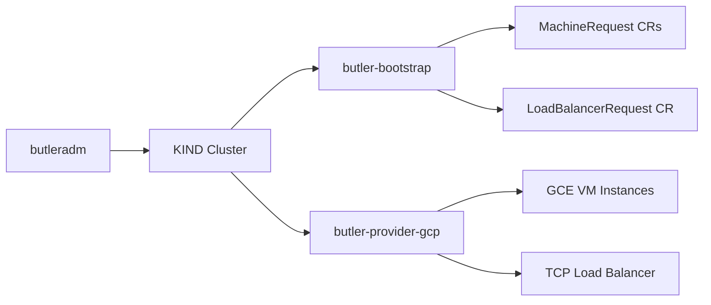
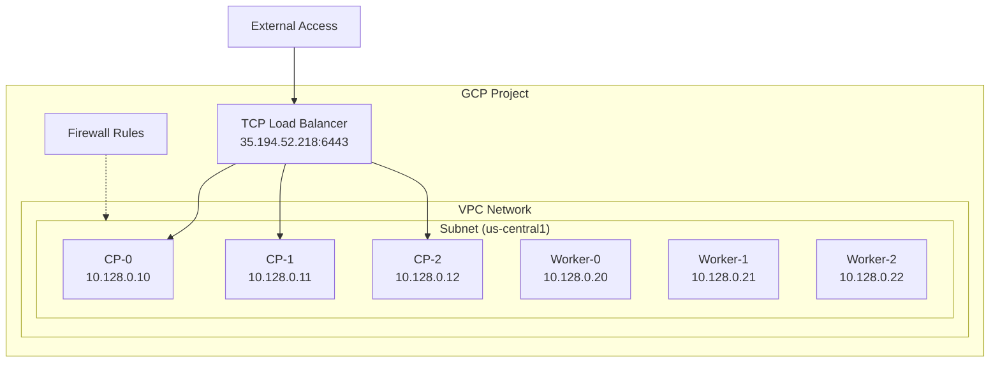

# GCP Provider Guide

This guide covers setting up Butler with Google Cloud Platform as the infrastructure provider for management cluster bootstrap.

## Table of Contents

- [Overview](#overview)
- [Prerequisites](#prerequisites)
- [GCP Setup](#gcp-setup)
- [Butler Configuration](#butler-configuration)
- [Network Architecture](#network-architecture)
- [Load Balancer Resources](#load-balancer-resources)
- [Resource Recommendations](#resource-recommendations)
- [Troubleshooting](#troubleshooting)

---

## Overview

Butler uses a thin provider controller (`butler-provider-gcp`) to provision VMs on Google Compute Engine. The controller creates VM instances with Talos Linux boot images and reports their IPs back to the bootstrap controller.

For control plane HA, the bootstrap controller creates a LoadBalancerRequest, and the GCP provider provisions a regional TCP passthrough load balancer using a forwarding rule, target pool, and health check.



### Key Components

| Component | Purpose |
|-----------|---------|
| butler-provider-gcp | Provisions GCE VMs and GCP load balancer resources |
| CAPI GCP Provider (CAPG) | Manages tenant cluster worker VMs after bootstrap |

---

## Prerequisites

### GCP Project

- A GCP project with billing enabled
- Compute Engine API enabled (`compute.googleapis.com`)

### Service Account

A service account with the `roles/compute.admin` role (or equivalent custom role covering instances, disks, networks, forwarding rules, target pools, health checks, and static addresses).

### Networking

- A VPC with at least one subnet in the target region
- Firewall rules (see [Network Architecture](#network-architecture) below)
- Sufficient quota for static regional IPs, CPUs, and disks in the target region

### Talos Image

A Talos Linux image must be available in the project. Use the Talos Image Factory to produce a GCP-compatible image, or import one from the Talos GitHub releases.

---

## GCP Setup

### 1. Create Service Account

```bash
# Create service account
gcloud iam service-accounts create butler-bootstrap \
  --display-name="Butler Bootstrap"

# Grant compute admin role
gcloud projects add-iam-policy-binding PROJECT_ID \
  --member="serviceAccount:butler-bootstrap@PROJECT_ID.iam.gserviceaccount.com" \
  --role="roles/compute.admin"

# Create and download key
gcloud iam service-accounts keys create gcp-credentials.json \
  --iam-account=butler-bootstrap@PROJECT_ID.iam.gserviceaccount.com
```

### 2. Create Firewall Rules

```bash
# Allow inter-node communication (Talos API, etcd, kubelet)
gcloud compute firewall-rules create butler-internal \
  --network=default \
  --allow=tcp:6443,tcp:50000,tcp:50001,tcp:2379-2380,tcp:10250 \
  --source-tags=butler-node \
  --target-tags=butler-node

# Allow health checks from GCP health check ranges
gcloud compute firewall-rules create butler-health-check \
  --network=default \
  --allow=tcp:6443 \
  --source-ranges=130.211.0.0/22,35.191.0.0/16 \
  --target-tags=butler-node

# Allow external access to kube-apiserver via LB
gcloud compute firewall-rules create butler-apiserver \
  --network=default \
  --allow=tcp:6443 \
  --source-ranges=0.0.0.0/0 \
  --target-tags=butler-node
```

### 3. Upload Talos Image (if needed)

```bash
# Download Talos GCP image
wget https://factory.talos.dev/image/SCHEMATIC_ID/vX.Y.Z/gcp-amd64.raw.tar.gz

# Create GCE image
gcloud compute images create talos-vX-Y-Z \
  --source-uri=gs://BUCKET/talos-vX-Y-Z.raw.tar.gz
```

---

## Butler Configuration

### ProviderConfig

Create a Kubernetes Secret with the service account key, then reference it from a ProviderConfig:

```yaml
apiVersion: v1
kind: Secret
metadata:
  name: gcp-credentials
  namespace: butler-system
type: Opaque
stringData:
  credentials.json: |
    {
      "type": "service_account",
      "project_id": "my-project",
      ...
    }
---
apiVersion: butler.butlerlabs.dev/v1alpha1
kind: ProviderConfig
metadata:
  name: gcp-prod
  namespace: butler-system
spec:
  provider: gcp
  credentialsRef:
    name: gcp-credentials
    namespace: butler-system
    key: credentials.json
  network:
    mode: cloud
  gcp:
    projectID: my-project
    region: us-central1
    network: default
    subnetwork: default
```

### Bootstrap Config

```yaml
apiVersion: butler.butlerlabs.dev/v1alpha1
kind: ClusterBootstrap
metadata:
  name: butler-mgmt
  namespace: butler-system
spec:
  provider: gcp
  providerRef:
    name: gcp-prod
    namespace: butler-system

  cluster:
    name: butler-mgmt
    topology: ha
    controlPlane:
      replicas: 3
      cpu: 4
      memoryMB: 16384
      diskGB: 100
    workers:
      replicas: 3
      cpu: 8
      memoryMB: 32768
      diskGB: 200

  network:
    podCIDR: 10.244.0.0/16
    serviceCIDR: 10.96.0.0/12
    # VIP is set automatically from LoadBalancerRequest endpoint

  talos:
    version: v1.9.2
    schematic: ce4c980550dd2ab1b17bbf2b08801c7eb59418eafe8f279833297925d67c7515

  addons:
    cni:
      type: cilium
      hubbleEnabled: true
    storage:
      type: longhorn
    controlPlaneProvider:
      type: steward
    capi:
      enabled: true
      infrastructureProviders:
        - name: gcp

  controlPlaneExposure:
    mode: LoadBalancer
```

### Run Bootstrap

```bash
butleradm bootstrap gcp --config bootstrap.yaml
```

---

## Network Architecture



### Firewall Rules

| Rule | Protocol/Port | Source | Target | Purpose |
|------|--------------|--------|--------|---------|
| butler-internal | TCP 6443, 50000-50001, 2379-2380, 10250 | butler-node tag | butler-node tag | Inter-node communication |
| butler-health-check | TCP 6443 | 130.211.0.0/22, 35.191.0.0/16 | butler-node tag | GCP health check probes |
| butler-apiserver | TCP 6443 | 0.0.0.0/0 | butler-node tag | External kube-apiserver access |

Ports explained:
- **6443**: Kubernetes API server
- **50000**: Talos API (apid)
- **50001**: Talos trustd
- **2379-2380**: etcd client and peer
- **10250**: kubelet API

---

## Load Balancer Resources

When the bootstrap controller creates a LoadBalancerRequest with `provider: gcp`, the GCP provider controller creates:

| GCP Resource | Purpose |
|--------------|---------|
| Regional static IP address | Stable external IP for the control plane endpoint |
| Legacy HTTP health check | Checks TCP 6443 on each control plane node |
| Target pool | Groups the control plane VM instances |
| Regional forwarding rule | Routes TCP 6443 traffic from the static IP to the target pool |

These are regional resources created in the same region as the VMs. The forwarding rule uses TCP passthrough (no TLS termination). The kube-apiserver handles TLS.

The static IP is reported back as `LoadBalancerRequest.status.endpoint` and used as the control plane address in Talos machine configs.

---

## Resource Recommendations

| Profile | CP Nodes | CP Sizing | Worker Nodes | Worker Sizing | Estimated Monthly Cost |
|---------|----------|-----------|-------------|---------------|----------------------|
| Development | 1 (single-node) | n2-standard-4 (4 vCPU, 16 GB) | 0 | -- | ~$150 |
| Staging | 3 | n2-standard-4 (4 vCPU, 16 GB) | 2 | n2-standard-8 (8 vCPU, 32 GB) | ~$900 |
| Production | 3 | n2-standard-4 (4 vCPU, 16 GB) | 3+ | n2-standard-8 (8 vCPU, 32 GB) | ~$1,200+ |

Storage: Longhorn uses attached persistent disks. Add `extraDisks` with adequate `sizeGB` for persistent volume capacity.

---

## Troubleshooting

### Quota Exceeded

**Symptom**: MachineRequest stuck in `Creating` phase with quota error in provider logs.

**Common quotas to check:**
- `CPUS_ALL_REGIONS` (default: 12 per region)
- `IN_USE_ADDRESSES` (static IPs, default: 8 per region)
- `DISKS_TOTAL_GB` (default: 2,048 GB per region)

**Fix**: Request quota increase in the GCP Console under IAM & Admin > Quotas.

### Firewall Rules Missing

**Symptom**: Talos bootstrap times out. Nodes cannot reach each other on port 6443.

**Verify**:
```bash
gcloud compute firewall-rules list --filter="network=default" --format="table(name, direction, allowed, sourceRanges)"
```

### LB Health Check Failures

**Symptom**: LoadBalancerRequest stays in `Creating` phase. Health check shows 0 healthy instances.

**Verify**:
```bash
gcloud compute health-checks describe butler-mgmt-hc --region=us-central1
gcloud compute target-pools get-health butler-mgmt-tp --region=us-central1
```

**Common causes:**
- Firewall rule for health check source ranges (130.211.0.0/22, 35.191.0.0/16) is missing
- kube-apiserver not yet listening (bootstrap still in progress)
- Health check port does not match the apiserver port

### API Not Enabled

**Symptom**: Provider controller logs show `googleapi: Error 403: Compute Engine API has not been used`.

**Fix**:
```bash
gcloud services enable compute.googleapis.com --project=PROJECT_ID
```

### Insufficient IAM Permissions

**Symptom**: Provider controller logs show permission denied errors for compute operations.

**Verify**:
```bash
gcloud projects get-iam-policy PROJECT_ID \
  --filter="bindings.members:butler-bootstrap@PROJECT_ID.iam.gserviceaccount.com" \
  --format="table(bindings.role)"
```

The service account needs `roles/compute.admin` or a custom role with permissions for instances, disks, networks, addresses, forwarding rules, target pools, and health checks.

---

## See Also

- [Bootstrap Flow](../architecture/bootstrap-flow.md) -- end-to-end bootstrap sequence
- [ClusterBootstrap CRD](../reference/crds/clusterbootstrap.md) -- full spec reference
- [LoadBalancerRequest CRD](../reference/crds/loadbalancerrequest.md) -- cloud LB provisioning
- [ProviderConfig CRD](../reference/crds/providerconfig.md) -- provider credentials
