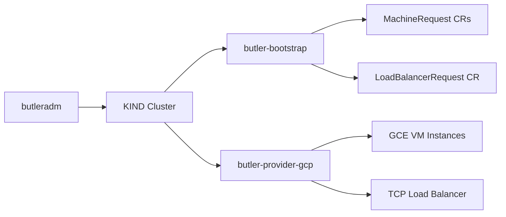

# GCP Provider Guide

> **Status: Stable.** E2E validated for single-node and HA topologies.

Bootstrap a Butler management cluster on Google Cloud Platform.

## Table of Contents

- [Overview](#overview)
- [Prerequisites](#prerequisites)
- [GCP Setup](#gcp-setup)
- [Bootstrap Configuration](#bootstrap-configuration)
- [Run Bootstrap](#run-bootstrap)
- [Validation](#validation)
- [Cleanup](#cleanup)
- [Troubleshooting](#troubleshooting)

---

## Overview

Butler uses a thin provider controller (`butler-provider-gcp`) to provision VM instances on Google Compute Engine. For HA topologies, the provider creates a regional TCP passthrough load balancer (forwarding rule + target pool + health check) to front the control plane.

After bootstrap, the GCP Cloud Controller Manager (CCM) runs on the management cluster as an embedded DaemonSet (no Helm chart available for GCP CCM). It handles `type: LoadBalancer` services by creating forwarding rules and target pools.



---

## Prerequisites

### GCP Project

- A GCP project with billing enabled
- Compute Engine API enabled (`compute.googleapis.com`)

### Service Account

A service account with two roles:

| Role | Purpose |
|------|---------|
| `roles/compute.admin` | Manage instances, disks, networks, forwarding rules, target pools, health checks, addresses, firewall rules |
| `roles/iam.serviceAccountUser` | Attach service account to VM instances (required for GCE metadata API) |

Download the service account key JSON file.

### Networking

- A VPC with at least one subnet in the target region
- Firewall rules (see [Firewall Rules](#firewall-rules) below)
- Sufficient quota for CPUs, disks, and static IPs in the target region

### Talos GCE Image

GCP does not have pre-built Talos AMIs. You must build and upload a GCE image.

**Step 1: Download from the Talos Image Factory**

```bash
# Schematic: c9078f9419961640c712a8bf2bb9174933dfcf1da383fd8ea2b7dc21493f8bac
# (iscsi-tools, Talos v1.12.5, amd64)
wget https://factory.talos.dev/image/c9078f9419961640c712a8bf2bb9174933dfcf1da383fd8ea2b7dc21493f8bac/v1.12.5/gcp-amd64.raw.tar.gz
```

**Step 2: Upload to GCS and register as a GCE image**

```bash
gsutil cp gcp-amd64.raw.tar.gz gs://YOUR_BUCKET/talos-v1-12-5.raw.tar.gz

gcloud compute images create talos-v1-12-5-iscsi \
  --source-uri gs://YOUR_BUCKET/talos-v1-12-5.raw.tar.gz \
  --project YOUR_PROJECT_ID
```

Note the image name (`talos-v1-12-5-iscsi`) and the project ID where you created it.

---

## GCP Setup

### 1. Create Service Account

```bash
gcloud iam service-accounts create butler-bootstrap \
  --display-name="Butler Bootstrap"

gcloud projects add-iam-policy-binding PROJECT_ID \
  --member="serviceAccount:butler-bootstrap@PROJECT_ID.iam.gserviceaccount.com" \
  --role="roles/compute.admin"

gcloud projects add-iam-policy-binding PROJECT_ID \
  --member="serviceAccount:butler-bootstrap@PROJECT_ID.iam.gserviceaccount.com" \
  --role="roles/iam.serviceAccountUser"

gcloud iam service-accounts keys create ~/.butler/gcp-sa-key.json \
  --iam-account=butler-bootstrap@PROJECT_ID.iam.gserviceaccount.com
```

### 2. Create Firewall Rules

```bash
# Inter-node communication (all K8s and Talos ports)
gcloud compute firewall-rules create butler-internal \
  --network=default \
  --allow=tcp:6443,tcp:50000-50001,tcp:2379-2380,tcp:10250,tcp:4240,udp:8472 \
  --source-tags=butler-node \
  --target-tags=butler-node

# GCP health check probes (required for load balancers)
gcloud compute firewall-rules create butler-health-check \
  --network=default \
  --allow=tcp:6443 \
  --source-ranges=130.211.0.0/22,35.191.0.0/16 \
  --target-tags=butler-node

# External access to kube-apiserver
gcloud compute firewall-rules create butler-apiserver \
  --network=default \
  --allow=tcp:6443 \
  --source-ranges=0.0.0.0/0 \
  --target-tags=butler-node
```

### Firewall Rules

| Rule | Protocol/Port | Source | Target | Purpose |
|------|--------------|--------|--------|---------|
| butler-internal | TCP 6443, 50000-50001, 2379-2380, 10250, 4240; UDP 8472 | butler-node tag | butler-node tag | All inter-node traffic |
| butler-health-check | TCP 6443 | 130.211.0.0/22, 35.191.0.0/16 | butler-node tag | GCP health check probes |
| butler-apiserver | TCP 6443 | 0.0.0.0/0 | butler-node tag | External kube-apiserver access |

Port details:
- **6443**: Kubernetes API server
- **50000-50001**: Talos API (apid + trustd)
- **2379-2380**: etcd client and peer
- **10250**: kubelet API
- **4240**: Cilium health checks
- **8472**: Cilium VXLAN overlay (UDP)

### Network Tags

GCE instances are tagged with the cluster name (e.g., `butler-mgmt`). The GCP CCM uses these network tags to manage firewall rules for LoadBalancer services. Without network tags, the CCM logs: `no node tags supplied...Abort creating firewall rule`.

The provider controller applies these tags automatically.

---

## Bootstrap Configuration

Create a config file at `~/.butler/bootstrap-gcp.yaml`:

### Single-Node

This config was used for E2E validation. Replace `projectID`, `imageProject`, and `serviceAccountKeyPath` with your values.

```yaml
provider: gcp

cluster:
  name: butler-gcp-test
  topology: single-node
  controlPlane:
    replicas: 1
    cpu: 4
    memoryMB: 8192
    diskGB: 50

network:
  podCIDR: 10.244.0.0/16
  serviceCIDR: 10.96.0.0/12

talos:
  version: v1.12.5

addons:
  cni:
    type: cilium
  storage:
    type: longhorn

providerConfig:
  gcp:
    serviceAccountKeyPath: ~/.butler/gcp-sa-key.json
    projectID: your-gcp-project-id
    region: us-central1
    zone: us-central1-a
    network: default
    subnetwork: default
    imageProject: your-gcp-project-id
    image: talos-v1-12-5-iscsi
```

### HA

```yaml
provider: gcp

cluster:
  name: butler-gcp-ha
  topology: ha
  controlPlane:
    replicas: 3
    cpu: 4
    memoryMB: 8192
    diskGB: 50
  workers:
    replicas: 2
    cpu: 4
    memoryMB: 8192
    diskGB: 50

network:
  podCIDR: 10.244.0.0/16
  serviceCIDR: 10.96.0.0/12

talos:
  version: v1.12.5

addons:
  cni:
    type: cilium
  storage:
    type: longhorn

providerConfig:
  gcp:
    serviceAccountKeyPath: ~/.butler/gcp-sa-key.json
    projectID: your-gcp-project-id
    region: us-central1
    zone: us-central1-a
    network: default
    subnetwork: default
    imageProject: your-gcp-project-id
    image: talos-v1-12-5-iscsi
```

---

## Run Bootstrap

```bash
butleradm bootstrap gcp --config ~/.butler/bootstrap-gcp.yaml
```

---

## Validation

```bash
export KUBECONFIG=~/.butler/butler-gcp-test-kubeconfig

# All nodes Ready with providerID set
kubectl get nodes -o wide
kubectl get nodes -o jsonpath='{.items[*].spec.providerID}'
# Expected format: gce://<project>/<zone>/<instance-name>

# GCP CCM DaemonSet running (embedded manifest)
kubectl get ds -n kube-system | grep cloud

# Cilium running
kubectl get pods -n kube-system -l app.kubernetes.io/name=cilium

# Longhorn running
kubectl get pods -n longhorn-system

# Butler Console exposed via GCP load balancer
kubectl get svc butler-console-frontend -n butler-system

# Console accessible (use the EXTERNAL-IP from above)
curl http://<LB-IP>
```

### What You Have Now

A Butler management cluster running on GCP with:
- Talos Linux GCE instances with Cilium CNI
- GCP TCP load balancer fronting the Kubernetes API (HA topology)
- GCP CCM handling LoadBalancer services
- Longhorn distributed storage
- Steward for hosted tenant control planes
- Butler controller, CRDs, and web console exposed via GCP LB

To create your first tenant cluster, go to [Create Your First Tenant Cluster](../getting-started/#create-your-first-tenant-cluster).

---

## Cleanup

```bash
# Delete KIND bootstrap cluster
kind delete cluster --name butler-bootstrap

# Delete GCE instances
gcloud compute instances list \
  --filter="labels.butler_butlerlabs_dev_managed-by=butler" \
  --format="value(name,zone)" \
  | while read name zone; do
    gcloud compute instances delete "$name" --zone="$zone" --quiet
  done

# Delete forwarding rules
gcloud compute forwarding-rules list \
  --filter="name~butler-mgmt" \
  --format="value(name,region)" \
  | while read name region; do
    gcloud compute forwarding-rules delete "$name" --region="$region" --quiet
  done

# Delete target pools
gcloud compute target-pools list \
  --filter="name~butler-mgmt" \
  --format="value(name,region)" \
  | while read name region; do
    gcloud compute target-pools delete "$name" --region="$region" --quiet
  done

# Delete CCM-managed firewall rules
gcloud compute firewall-rules list \
  --filter="name~butler-mgmt" \
  --format="value(name)" \
  | while read name; do
    gcloud compute firewall-rules delete "$name" --quiet
  done
```

---

## Troubleshooting

### Quota Exceeded

**Symptom**: MachineRequest stuck in `Creating` with quota error in provider logs.

Common quotas to check:
- `CPUS_ALL_REGIONS` (default: 12 per region)
- `IN_USE_ADDRESSES` (static IPs, default: 8 per region)
- `DISKS_TOTAL_GB` (default: 2048 GB per region)

Request increases in GCP Console under IAM & Admin > Quotas.

### Firewall Rules Missing

**Symptom**: Talos bootstrap times out. Nodes cannot reach each other.

```bash
gcloud compute firewall-rules list \
  --filter="network=default" \
  --format="table(name, direction, allowed, sourceRanges)"
```

Verify all three rules exist and include Cilium ports (TCP 4240, UDP 8472).

### LB Health Check Failures

**Symptom**: LoadBalancerRequest stays in `Creating`.

```bash
gcloud compute target-pools get-health butler-mgmt-tp --region=us-central1
```

Common causes:
- Health check firewall rule missing (source ranges 130.211.0.0/22 and 35.191.0.0/16)
- kube-apiserver not yet listening (bootstrap still in progress)

### API Not Enabled

**Symptom**: `googleapi: Error 403: Compute Engine API has not been used`.

```bash
gcloud services enable compute.googleapis.com --project=PROJECT_ID
```

### GCP CCM: nodeipam Controller Crash

**Symptom**: CCM logs show `error running controllers: the AllocateNodeCIDRs is not enabled`.

This is handled automatically by Butler. The embedded CCM DaemonSet uses `--controllers=*,-nodeipam --allocate-node-cidrs=false` because Cilium manages pod IPAM, not the cloud provider.

### GCP CCM: Network Tags Missing

**Symptom**: CCM logs show `no node tags supplied...Abort creating firewall rule`.

The GCP CCM requires network tags on instances to manage firewall rules for LoadBalancer services. Butler's provider controller applies the cluster name as a network tag. The CCM's `cloud-config` includes `node-tags = <clusterName>`.

If tags are missing, check that the provider controller applied tags during VM creation.

### Service Account Missing iam.serviceAccountUser

**Symptom**: Provider controller fails to create instances with permission error about service account attachment.

The service account needs `roles/iam.serviceAccountUser` in addition to `roles/compute.admin`. This role allows attaching a service account to GCE instances, which is required for the GCE metadata API.

---

## See Also

- [Bootstrap Flow](../architecture/bootstrap-flow.md) - End-to-end bootstrap sequence
- [Bootstrap Config Reference](../reference/bootstrap-config.md) - Every config field documented
- [AWS Provider](aws.md) - Alternative cloud provider
- [Azure Provider](azure.md) - Alternative cloud provider
