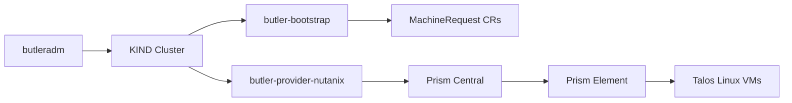

# Nutanix Provider Guide

> **Status: Stable.** E2E validated for single-node and HA topologies.

Bootstrap a Butler management cluster on [Nutanix AHV](https://www.nutanix.com/products/ahv).

## Table of Contents

- [Overview](#overview)
- [Prerequisites](#prerequisites)
- [Nutanix Setup](#nutanix-setup)
- [Bootstrap Configuration](#bootstrap-configuration)
- [Run Bootstrap](#run-bootstrap)
- [Validation](#validation)
- [Cleanup](#cleanup)
- [Tenant Clusters on Nutanix](#tenant-clusters-on-nutanix)
- [Troubleshooting](#troubleshooting)

---

## Overview

Butler uses a thin provider controller (`butler-provider-nutanix`) during bootstrap to provision VMs on Nutanix AHV via the Prism Central API. After the management cluster is running, the CAPI Nutanix Provider (CAPX) manages tenant cluster worker VM lifecycle.



### Key Components

| Component | Purpose |
|-----------|---------|
| butler-provider-nutanix | Provisions Nutanix VMs from MachineRequest CRs during bootstrap |
| CAPI Nutanix Provider (CAPX) | Manages tenant cluster worker VMs after bootstrap |
| kube-vip | Floating VIP for control plane HA |
| MetalLB | LoadBalancer service implementation for on-prem |

---

## Prerequisites

### Nutanix Environment

- Nutanix AOS 5.20+ or 6.x
- Prism Central 2023.x or later
- Admin credentials for Prism Central
- Network connectivity from the bootstrap machine to Prism Central on port 9440

### Required Resource IDs

Before writing the config, collect these UUIDs from Prism Central:

| Resource | Where to Find | Config Field |
|----------|---------------|-------------|
| Cluster UUID | Compute & Storage > Clusters > select cluster > URL contains UUID | `clusterUUID` |
| Subnet UUID | Network & Security > Subnets > select subnet > URL contains UUID | `subnetUUID` |
| Image UUID | Compute & Storage > Images > select image > URL contains UUID | `imageUUID` |
| Storage Container UUID (optional) | Storage > Storage Containers | `storageContainerUUID` |

### VM Image

Upload a Talos Linux qcow2 image to Prism Central. The image must include the `iscsi-tools` extension for Longhorn storage.

Download from the Talos Image Factory:

```
https://factory.talos.dev/image/dc7b152cb3ea99b821fcb7340ce7168313ce393d663740b791c36f6e95fc8586/v1.12.1/nutanix-amd64.qcow2
```

Upload via Prism Central > Compute & Storage > Images > Add Image.

### Network

The subnet must provide connectivity for:
- Outbound internet (Talos image pulls, Helm chart downloads)
- L2 ARP (kube-vip and MetalLB require it)
- DHCP or static IP assignment

### IP Planning

| Purpose | Example | Notes |
|---------|---------|-------|
| Control plane VIP | 10.127.14.29 | Single IP, used by kube-vip for API HA |
| MetalLB pool | 10.127.14.30-10.127.14.50 | Range for LoadBalancer services |

These must not overlap with DHCP ranges or other cluster allocations.

---

## Nutanix Setup

### 1. Upload Talos Image

In Prism Central > Compute & Storage > Images > Add Image:

| Field | Value |
|-------|-------|
| Name | talos-v1-12-1 |
| Image Type | DISK |
| Source | URL or file upload |
| URL | `https://factory.talos.dev/.../v1.12.1/nutanix-amd64.qcow2` |

Note the image UUID from the URL after creation.

### 2. Identify Subnet

In Prism Central > Network & Security > Subnets.

Note the subnet name and UUID for your workload network.

### 3. Identify Cluster

In Prism Central > Compute & Storage > Clusters.

Note the cluster UUID where VMs will be created.

### 4. Create Service Account (Recommended)

For production, create a dedicated Prism Central user with appropriate roles:

1. Prism Central > Administration > Users > Create Local User
2. Assign Cluster Admin role for the target clusters

---

## Bootstrap Configuration

Create a config file at `~/.butler/bootstrap-nutanix.yaml`:

### Single-Node (Development)

```yaml
provider: nutanix

cluster:
  name: butler-mgmt
  topology: single-node
  controlPlane:
    replicas: 1
    cpu: 4                    # vCPUs per node
    memoryMB: 8192            # Memory in MB (8 GB)
    diskGB: 50                # Boot disk size in GB
    extraDisks:
      - sizeGB: 100           # Additional disk for Longhorn storage

network:
  podCIDR: 10.244.0.0/16
  serviceCIDR: 10.96.0.0/12
  vip: 10.127.14.29           # Control plane VIP
  loadBalancerPool:            # MetalLB IP range
    start: 10.127.14.30
    end: 10.127.14.50

talos:
  version: v1.12.1
  schematic: dc7b152cb3ea99b821fcb7340ce7168313ce393d663740b791c36f6e95fc8586

addons:
  cni:
    type: cilium
  storage:
    type: longhorn
  loadBalancer:
    type: metallb
  console:
    enabled: true
    ingress:
      enabled: true
      className: traefik

providerConfig:
  nutanix:
    endpoint: https://prism-central.example.com   # Prism Central URL
    port: 9440                                      # API port (default: 9440)
    insecure: false                                 # Set true for self-signed certs
    username: butler-admin                          # Prism Central username
    password: your-password                         # Prism Central password
    clusterUUID: "xxxxxxxx-xxxx-xxxx-xxxx-xxxxxxxxxxxx"  # Target Nutanix cluster
    subnetUUID: "xxxxxxxx-xxxx-xxxx-xxxx-xxxxxxxxxxxx"   # VM network subnet
    imageUUID: "xxxxxxxx-xxxx-xxxx-xxxx-xxxxxxxxxxxx"    # Talos image UUID
    # storageContainerUUID: "..."                   # Optional: storage container for disks
    # hostAliases:                                  # Optional: /etc/hosts entries for KIND
    #   - "10.0.0.1 prism-central.internal"         # Useful for corporate DNS/Zscaler
```

### HA (Production)

```yaml
provider: nutanix

cluster:
  name: butler-mgmt
  topology: ha
  controlPlane:
    replicas: 3
    cpu: 4
    memoryMB: 8192
    diskGB: 50
  workers:
    replicas: 2
    cpu: 8
    memoryMB: 8192
    diskGB: 100
    extraDisks:
      - sizeGB: 200

network:
  podCIDR: 10.244.0.0/16
  serviceCIDR: 10.96.0.0/12
  vip: 10.127.14.29
  loadBalancerPool:
    start: 10.127.14.30
    end: 10.127.14.50

talos:
  version: v1.12.1
  schematic: dc7b152cb3ea99b821fcb7340ce7168313ce393d663740b791c36f6e95fc8586

addons:
  cni:
    type: cilium
  storage:
    type: longhorn
  loadBalancer:
    type: metallb
  console:
    enabled: true
    ingress:
      enabled: true
      className: traefik

providerConfig:
  nutanix:
    endpoint: https://prism-central.example.com
    port: 9440
    insecure: false
    username: butler-admin
    password: your-password
    clusterUUID: "xxxxxxxx-xxxx-xxxx-xxxx-xxxxxxxxxxxx"
    subnetUUID: "xxxxxxxx-xxxx-xxxx-xxxx-xxxxxxxxxxxx"
    imageUUID: "xxxxxxxx-xxxx-xxxx-xxxx-xxxxxxxxxxxx"
```

---

## Run Bootstrap

```bash
butleradm bootstrap nutanix --config ~/.butler/bootstrap-nutanix.yaml
```

For development:

```bash
butleradm bootstrap nutanix \
  --config ~/.butler/bootstrap-nutanix.yaml \
  --local --no-tui --skip-cleanup
```

---

## Validation

```bash
export KUBECONFIG=~/.butler/butler-mgmt-kubeconfig

kubectl get nodes
kubectl get pods -n kube-system -l app.kubernetes.io/name=cilium
kubectl get pods -n longhorn-system
kubectl get pods -n cert-manager
kubectl get pods -n steward-system
kubectl get crd | grep butler
ping 10.127.14.29
kubectl get svc -n traefik-system
```

### What You Have Now

A Butler management cluster running on Nutanix with:
- Talos Linux VMs with Cilium CNI
- kube-vip providing a floating VIP for the Kubernetes API
- MetalLB and Traefik handling LoadBalancer and Ingress services
- Longhorn distributed storage
- Steward for hosted tenant control planes
- Butler controller, CRDs, and web console

To create your first tenant cluster, go to [Create Your First Tenant Cluster](../getting-started/#create-your-first-tenant-cluster).

---

## Cleanup

```bash
kind delete cluster --name butler-bootstrap

# Delete VMs via Prism Central UI:
# Compute & Storage > VMs > select butler-mgmt-* VMs > Actions > Delete
```

---

## Tenant Clusters on Nutanix

After bootstrap, configure Nutanix as a provider for tenant clusters:

### Create Credentials Secret

```bash
kubectl create secret generic nutanix-credentials \
  --from-literal=NUTANIX_USER=admin \
  --from-literal=NUTANIX_PASSWORD='your-password' \
  --from-literal=NUTANIX_ENDPOINT='prism-central.example.com' \
  --from-literal=NUTANIX_PORT='9440' \
  --from-literal=NUTANIX_INSECURE='false' \
  -n butler-system
```

### Create ProviderConfig

```yaml
apiVersion: butler.butlerlabs.dev/v1alpha1
kind: ProviderConfig
metadata:
  name: nutanix-prod
  namespace: butler-system
spec:
  provider: nutanix
  credentialsRef:
    name: nutanix-credentials
    namespace: butler-system
  network:
    mode: ipam
  nutanix:
    prismCentral:
      address: prism-central.example.com
      port: 9440
      insecure: false
    cluster:
      name: cluster-01
    subnet:
      name: workload-subnet
    image:
      name: talos-v1-12-1
```

---

## Troubleshooting

### Authentication Failures

**Symptom**: Provider controller logs show 401 or authentication errors.

```bash
# Test Prism Central API directly
curl -k -u admin:password \
  https://prism-central.example.com:9440/api/nutanix/v3/clusters/list \
  -H "Content-Type: application/json" \
  -d '{"length": 10}'
```

### Certificate Issues

**Symptom**: TLS handshake errors in provider controller logs.

For self-signed certificates, set `insecure: true` in the config. For production, add the CA certificate to the trust chain.

### DNS Resolution / Zscaler

**Symptom**: KIND container cannot resolve Prism Central hostname.

The KIND bootstrap cluster runs inside a Docker container and may not have access to corporate DNS servers or Zscaler-proxied endpoints. Use the `hostAliases` field to inject `/etc/hosts` entries into the KIND node:

```yaml
providerConfig:
  nutanix:
    hostAliases:
      - "10.0.0.1 prism-central.internal.corp.com"
```

### VMs Not Creating

**Check:**
```bash
kubectl --context kind-butler-bootstrap logs -n butler-system deploy/butler-provider-nutanix
kubectl --context kind-butler-bootstrap get machinerequest -n butler-system
```

**Common causes:**
- Wrong cluster UUID, subnet UUID, or image UUID
- Image type is ISO instead of DISK (must be qcow2 or raw)
- Insufficient resources on the Nutanix cluster
- Subnet does not have IP addresses available

### CAPX Version Compatibility

| Butler Version | CAPX Version | Nutanix AOS |
|----------------|--------------|-------------|
| 0.1.x+ | 1.4.x | 5.20+, 6.x |

---

## See Also

- [Getting Started](../getting-started/) - Quick start guide
- [Bootstrap Flow](../architecture/bootstrap-flow.md) - End-to-end bootstrap sequence
- [Bootstrap Config Reference](../reference/bootstrap-config.md) - Every config field documented
- [Harvester Provider](harvester.md) - Alternative on-prem provider
- [CAPX Documentation](https://opendocs.nutanix.com/capx/latest/)
