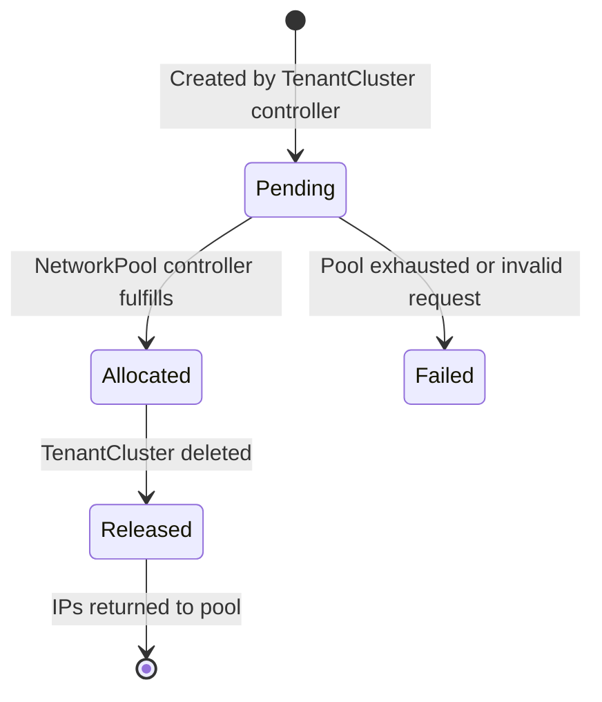

An IPAllocation represents an individual IP address allocation from a NetworkPool for a tenant cluster.

## API Version

`butler.butlerlabs.dev/v1alpha1`

## Scope

Namespaced

## Short Name

`ipa`

## Description

IPAllocation is the request and record of IP addresses assigned to a specific TenantCluster from a NetworkPool. Each TenantCluster typically has two IPAllocations: one for worker node IPs (`nodes` type) and one for load balancer IPs (`loadbalancer` type).

IPAllocations are created by the TenantCluster controller when a cluster is provisioned. The NetworkPool controller watches for pending IPAllocations and fulfills them by assigning contiguous IP blocks from the referenced pool. IPAllocations are released when the owning TenantCluster is deleted.

## Types

### IPAllocationType

| Value | Description |
|-------|-------------|
| `nodes` | Worker node IPs. Each worker VM receives one IP from this allocation. |
| `loadbalancer` | Load balancer IPs. Used by MetalLB or similar for Kubernetes Services of type LoadBalancer. |

### IPAllocationPhase

| Phase | Description |
|-------|-------------|
| `Pending` | Allocation created, waiting for the NetworkPool controller to assign IPs. |
| `Allocated` | IPs have been assigned. The status contains the allocated addresses. |
| `Released` | IPs have been released back to the pool. Terminal state during deletion. |
| `Failed` | Allocation could not be fulfilled (e.g., pool exhausted, invalid request). Check conditions for details. |

## Specification

### Full Example

```yaml
apiVersion: butler.butlerlabs.dev/v1alpha1
kind: IPAllocation
metadata:
  name: my-cluster-nodes
  namespace: butler-system
  labels:
    butler.butlerlabs.dev/team: backend-team
    butler.butlerlabs.dev/tenant: my-cluster
    butler.butlerlabs.dev/network-pool: vlan40-pool
    butler.butlerlabs.dev/allocation-type: nodes
spec:
  poolRef:
    name: vlan40-pool
  tenantClusterRef:
    name: my-cluster
    namespace: team-backend
  type: nodes
  count: 5
```

### Spec Fields

| Field | Type | Required | Description |
|-------|------|----------|-------------|
| `poolRef` | LocalObjectReference | Yes | Reference to the NetworkPool to allocate from. Must be in the same namespace. |
| `tenantClusterRef` | NamespacedObjectReference | Yes | Reference to the TenantCluster this allocation is for. |
| `type` | IPAllocationType | Yes | Purpose of the allocation: `nodes` or `loadbalancer`. |
| `count` | *int32 | No | Number of IPs to allocate. Minimum: 1. If not specified, defaults from the NetworkPool's `tenantAllocation.defaults` are used (`nodesPerTenant` for nodes, `lbPoolPerTenant` for loadbalancer). Ignored when `pinnedRange` is set. |
| `pinnedRange` | PinnedIPRange | No | Requests a specific IP range instead of automatic allocation. Used for migrating existing clusters to IPAM or reserving well-known addresses. |

### poolRef

| Field | Type | Required | Description |
|-------|------|----------|-------------|
| `name` | string | Yes | Name of the NetworkPool in the same namespace. |

### tenantClusterRef

| Field | Type | Required | Description |
|-------|------|----------|-------------|
| `name` | string | Yes | Name of the TenantCluster. |
| `namespace` | string | Yes | Namespace of the TenantCluster. |

### pinnedRange

| Field | Type | Required | Description |
|-------|------|----------|-------------|
| `startAddress` | string | Yes | First IP of the pinned range. Must match the pattern `^(\d{1,3}\.){3}\d{1,3}$`. |
| `endAddress` | string | Yes | Last IP of the pinned range. Must match the pattern `^(\d{1,3}\.){3}\d{1,3}$`. |

## Status

The status subresource is populated by the NetworkPool controller when the allocation is fulfilled.

```yaml
status:
  phase: Allocated
  conditions:
    - type: Ready
      status: "True"
      reason: Allocated
      message: "5 IPs allocated from vlan40-pool"
      lastTransitionTime: "2026-02-15T10:00:30Z"
  cidr: "10.40.0.64/29"
  startAddress: "10.40.0.64"
  endAddress: "10.40.0.68"
  addresses:
    - "10.40.0.64"
    - "10.40.0.65"
    - "10.40.0.66"
    - "10.40.0.67"
    - "10.40.0.68"
  allocatedCount: 5
  observedGeneration: 1
  allocatedAt: "2026-02-15T10:00:30Z"
  allocatedBy: "networkpool-controller"
```

### Status Fields

| Field | Type | Description |
|-------|------|-------------|
| `phase` | IPAllocationPhase | Current lifecycle phase: `Pending`, `Allocated`, `Released`, or `Failed`. |
| `conditions` | []Condition | Standard Kubernetes conditions (listType=map, key=type). |
| `cidr` | string | Allocated range in CIDR notation. Only populated when the range is power-of-2 aligned (e.g., 8 IPs starting at a /29 boundary). |
| `startAddress` | string | First IP in the allocated range. |
| `endAddress` | string | Last IP in the allocated range. |
| `addresses` | []string | All individual IP addresses in the allocated range. |
| `allocatedCount` | int32 | Number of IPs allocated. |
| `observedGeneration` | int64 | Last observed `.metadata.generation`. |
| `allocatedAt` | *Time | Timestamp when IPs were assigned by the allocator. |
| `allocatedBy` | string | Identifier of the controller that fulfilled the allocation (e.g., "networkpool-controller"). |
| `releasedAt` | *Time | Timestamp when IPs were released back to the pool. Set during deletion. |

### Conditions

| Condition | Description |
|-----------|-------------|
| `Ready` | Allocation is fulfilled and IPs are available for use. |

### Print Columns

```
NAME                POOL          CLUSTER       TYPE           PHASE       START         END           AGE
my-cluster-nodes    vlan40-pool   my-cluster    nodes          Allocated   10.40.0.64    10.40.0.68    7d
my-cluster-lb       vlan40-pool   my-cluster    loadbalancer   Allocated   10.40.0.80    10.40.0.87    7d
```

## Phase Lifecycle

An IPAllocation progresses through the following phases:



1. **Pending** -- The TenantCluster controller creates the IPAllocation. It sits in `Pending` phase until the NetworkPool controller processes it.

2. **Allocated** -- The NetworkPool controller finds a suitable contiguous block, marks the IPs as allocated in the pool's bitmap, and populates the status with the assigned addresses. The TenantCluster controller reads the addresses and uses them for VM provisioning or MetalLB configuration.

3. **Released** -- When the TenantCluster is deleted, its IPAllocations are cleaned up. The IPAllocation controller sets the phase to `Released` and the NetworkPool controller reclaims the IPs. The finalizer is removed and the resource is deleted.

4. **Failed** -- The allocation could not be fulfilled. Common reasons include: the pool does not have enough contiguous free space, the pinned range overlaps an existing allocation, or the referenced pool does not exist. Check the conditions for details.

## Controller Responsibilities

IPAllocation involves two controllers with distinct responsibilities:

**IPAllocation controller** (thin lifecycle manager):
- Adds the `butler.butlerlabs.dev/ipallocation` finalizer on creation
- Sets initial phase to `Pending` if not set
- On deletion, transitions phase to `Released` and waits for the NetworkPool controller to reclaim IPs before removing the finalizer

**NetworkPool controller** (actual allocator):
- Watches IPAllocations that reference its pool
- Fulfills `Pending` allocations by running the best-fit bitmap algorithm
- Populates status fields: `startAddress`, `endAddress`, `addresses`, `cidr`, `allocatedCount`, `allocatedAt`, `allocatedBy`
- Updates pool status counters (`allocatedIPs`, `availableIPs`, `allocationCount`, `fragmentationPercent`, `largestFreeBlock`)
- Reclaims IPs from `Released` allocations

This separation ensures that the NetworkPool controller is the single source of truth for IP assignments, avoiding race conditions across multiple pools.

## Labels

Butler applies the following labels to IPAllocation resources:

| Label | Value | Description |
|-------|-------|-------------|
| `butler.butlerlabs.dev/network-pool` | Pool name | Identifies the source NetworkPool. |
| `butler.butlerlabs.dev/team` | Team name | Team that owns the TenantCluster. |
| `butler.butlerlabs.dev/tenant` | Cluster name | TenantCluster this allocation belongs to. |
| `butler.butlerlabs.dev/allocation-type` | `nodes` or `loadbalancer` | The type of IP allocation. |

## Finalizers

| Finalizer | Description |
|-----------|-------------|
| `butler.butlerlabs.dev/ipallocation` | Ensures IPs are released back to the NetworkPool before the resource is deleted. The IPAllocation controller removes the finalizer only after the NetworkPool controller has reclaimed the IPs. |

## Examples

### Load Balancer Allocation

Allocate 8 IPs for MetalLB address pools on a tenant cluster.

```yaml
apiVersion: butler.butlerlabs.dev/v1alpha1
kind: IPAllocation
metadata:
  name: my-cluster-lb
  namespace: butler-system
  labels:
    butler.butlerlabs.dev/team: backend-team
    butler.butlerlabs.dev/tenant: my-cluster
    butler.butlerlabs.dev/network-pool: vlan40-pool
    butler.butlerlabs.dev/allocation-type: loadbalancer
spec:
  poolRef:
    name: vlan40-pool
  tenantClusterRef:
    name: my-cluster
    namespace: team-backend
  type: loadbalancer
  count: 8
```

### Node Allocation

Allocate IPs for worker node VMs. If `count` is omitted, the pool's `tenantAllocation.defaults.nodesPerTenant` is used.

```yaml
apiVersion: butler.butlerlabs.dev/v1alpha1
kind: IPAllocation
metadata:
  name: my-cluster-nodes
  namespace: butler-system
  labels:
    butler.butlerlabs.dev/team: backend-team
    butler.butlerlabs.dev/tenant: my-cluster
    butler.butlerlabs.dev/network-pool: vlan40-pool
    butler.butlerlabs.dev/allocation-type: nodes
spec:
  poolRef:
    name: vlan40-pool
  tenantClusterRef:
    name: my-cluster
    namespace: team-backend
  type: nodes
```

### Pinned Range Allocation

Reserve a specific IP range for an existing cluster being migrated to Butler IPAM. The allocator validates that the range is within the pool and not already allocated.

```yaml
apiVersion: butler.butlerlabs.dev/v1alpha1
kind: IPAllocation
metadata:
  name: legacy-cluster-nodes
  namespace: butler-system
  labels:
    butler.butlerlabs.dev/team: platform-team
    butler.butlerlabs.dev/tenant: legacy-cluster
    butler.butlerlabs.dev/network-pool: vlan40-pool
    butler.butlerlabs.dev/allocation-type: nodes
spec:
  poolRef:
    name: vlan40-pool
  tenantClusterRef:
    name: legacy-cluster
    namespace: team-platform
  type: nodes
  pinnedRange:
    startAddress: "10.40.0.100"
    endAddress: "10.40.0.109"
```

## See Also

- [NetworkPool](./networkpool.md) - The IP address pool that IPAllocations draw from
- [TenantCluster](./tenantcluster.md) - Creates IPAllocations during cluster provisioning
- [IPAM Internals](../../architecture/ipam.md) -- How Butler manages on-premises networking
