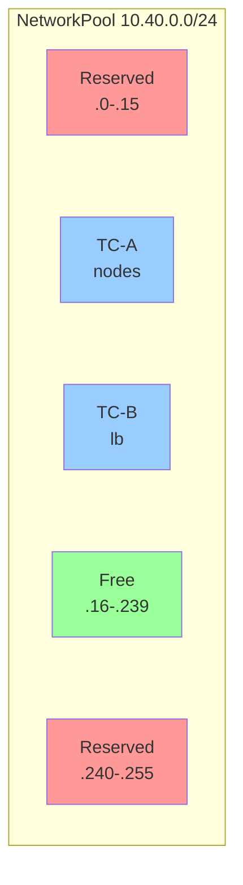

A NetworkPool defines a platform-level IP address pool for on-premises IPAM.

## API Version

`butler.butlerlabs.dev/v1alpha1`

## Scope

Namespaced

## Short Name

`np`

## Description

NetworkPool is the foundation of Butler's on-premises IP address management (IPAM) system. Each NetworkPool defines a network CIDR and manages IP allocation to tenant clusters within that range. When a TenantCluster is created, the TenantCluster controller creates IPAllocation resources that reference a NetworkPool. The NetworkPool controller is the sole allocator -- it fulfills pending IPAllocations using a best-fit bitmap algorithm that minimizes fragmentation.

NetworkPool supports:

1. Reserving ranges for infrastructure (gateways, DNS servers, management nodes)
2. Constraining the allocatable sub-range for tenant workloads
3. Configuring default allocation sizes per tenant (node IPs and load balancer IPs)

## Specification

### Full Example

```yaml
apiVersion: butler.butlerlabs.dev/v1alpha1
kind: NetworkPool
metadata:
  name: vlan40-pool
  namespace: butler-system
spec:
  cidr: "10.40.0.0/24"
  reserved:
    - cidr: "10.40.0.0/28"
      description: "Gateway, DNS, and management cluster nodes"
    - cidr: "10.40.0.240/28"
      description: "Out-of-band management interfaces"
  tenantAllocation:
    start: "10.40.0.16"
    end: "10.40.0.239"
    defaults:
      nodesPerTenant: 5
      lbPoolPerTenant: 8
```

### Spec Fields

| Field | Type | Required | Description |
|-------|------|----------|-------------|
| `cidr` | string | Yes | Network range in CIDR notation (e.g., "10.40.0.0/24"). Must match the pattern `^(\d{1,3}\.){3}\d{1,3}/\d{1,2}$`. |
| `reserved` | []ReservedRange | No | Ranges within the CIDR excluded from allocation. |
| `tenantAllocation` | TenantAllocationConfig | No | Configures the allocatable sub-range and default sizes. If not specified, the entire CIDR (minus reserved ranges) is allocatable. |

### reserved[]

| Field | Type | Required | Description |
|-------|------|----------|-------------|
| `cidr` | string | Yes | Reserved range in CIDR notation. Must match the pattern `^(\d{1,3}\.){3}\d{1,3}/\d{1,2}$`. Must fall within the pool's CIDR. |
| `description` | string | No | Human-readable explanation of why this range is reserved. |

### tenantAllocation

| Field | Type | Required | Description |
|-------|------|----------|-------------|
| `start` | string | Yes | First allocatable IP address for tenants. |
| `end` | string | Yes | Last allocatable IP address for tenants. |
| `defaults` | TenantAllocationDefaults | No | Default allocation sizes per tenant. |

### tenantAllocation.defaults

| Field | Type | Required | Default | Description |
|-------|------|----------|---------|-------------|
| `nodesPerTenant` | int32 | No | 5 | Default number of node IPs allocated per tenant cluster. Minimum: 1. |
| `lbPoolPerTenant` | int32 | No | 8 | Default number of load balancer IPs allocated per tenant cluster. Minimum: 1. |

## Status

The status subresource tracks pool utilization and health.

```yaml
status:
  conditions:
    - type: Ready
      status: "True"
      reason: PoolAvailable
      message: "Pool is available for allocations"
      lastTransitionTime: "2026-02-15T10:00:00Z"
  totalIPs: 224
  allocatedIPs: 65
  availableIPs: 159
  allocationCount: 5
  fragmentationPercent: 12
  largestFreeBlock: 128
  observedGeneration: 1
```

### Status Fields

| Field | Type | Description |
|-------|------|-------------|
| `conditions` | []Condition | Standard Kubernetes conditions (listType=map, key=type). |
| `totalIPs` | int32 | Total number of usable IPs in the pool (CIDR size minus reserved ranges). |
| `allocatedIPs` | int32 | Number of IPs currently allocated to tenants. |
| `availableIPs` | int32 | Number of IPs available for new allocations. |
| `allocationCount` | int32 | Total number of IPAllocation resources referencing this pool. |
| `fragmentationPercent` | *int32 | Percentage (0-100) indicating how fragmented the free space is. Nil if no allocations exist. |
| `largestFreeBlock` | int32 | Size of the largest contiguous block of free IPs. Useful for determining if a requested allocation can be satisfied. |
| `observedGeneration` | int64 | Last observed `.metadata.generation`. Indicates whether the controller has processed the latest spec changes. |

### Conditions

| Condition | Description |
|-----------|-------------|
| `Ready` | Pool is valid and available for allocations. |
| `Degraded` | Pool has issues (e.g., high fragmentation, near capacity). |

### Print Columns

```
NAME          CIDR            AVAILABLE   ALLOCATED   TOTAL   AGE
vlan40-pool   10.40.0.0/24    159         65          224     7d
```

## How It Works

NetworkPool is the authoritative source of IP address space for on-premises deployments. The allocation flow works as follows:

1. **Pool defines the IP space.** An administrator creates a NetworkPool with a CIDR, optional reserved ranges, and optional tenant allocation configuration.

2. **IPAllocations consume from the pool.** When a TenantCluster is created, the TenantCluster controller creates IPAllocation resources (one for node IPs, one for load balancer IPs) that reference the NetworkPool.

3. **NetworkPool controller is the sole allocator.** The NetworkPool controller watches for IPAllocations in `Pending` phase that reference its pool. It selects the best-fit contiguous block using a bitmap-based algorithm, marks the IPs as allocated in its internal state, and updates the IPAllocation status with the assigned addresses.

4. **Best-fit bitmap algorithm.** The controller maintains a bitmap of the entire CIDR range. Reserved ranges are permanently marked. When fulfilling an allocation, the controller finds the smallest free block that satisfies the request, minimizing fragmentation. This approach provides O(n) allocation with deterministic behavior.

5. **Release on deletion.** When a TenantCluster is deleted, its IPAllocations transition to `Released` phase. The NetworkPool controller reclaims the IPs and updates pool utilization counters.



The diagram shows a NetworkPool with reserved ranges at the start and end, two tenant allocations in the middle, and free space available for future allocations.

## Webhook Validation

NetworkPool uses admission webhooks to enforce the following rules:

**On create:**
- CIDR must be valid (parseable, correct network address)
- Reserved CIDRs must fall entirely within the pool's CIDR
- If `tenantAllocation` is set, `start` and `end` must fall within the CIDR and `start` must precede `end`
- Reserved ranges must not overlap each other

**On update:**
- CIDR cannot be shrunk (the new CIDR must be a superset of or equal to the old CIDR)
- Reserved ranges cannot be expanded into space that has active allocations
- `tenantAllocation.start` and `tenantAllocation.end` changes must not exclude currently allocated IPs

**On delete:**
- Deletion is blocked if any IPAllocations in `Allocated` phase reference this pool
- The finalizer `butler.butlerlabs.dev/networkpool` enforces this

## Labels

Butler applies the following label to resources associated with a NetworkPool:

| Label | Value | Description |
|-------|-------|-------------|
| `butler.butlerlabs.dev/network-pool` | Pool name | Identifies the NetworkPool. Applied to IPAllocations that reference this pool. |

## Finalizers

| Finalizer | Description |
|-----------|-------------|
| `butler.butlerlabs.dev/networkpool` | Prevents deletion while active IPAllocations exist. The controller removes the finalizer only after all allocations are released. |

## Examples

### Minimal Pool

A simple pool with no reserved ranges and no tenant allocation configuration. The entire CIDR is allocatable.

```yaml
apiVersion: butler.butlerlabs.dev/v1alpha1
kind: NetworkPool
metadata:
  name: simple-pool
  namespace: butler-system
spec:
  cidr: "10.50.0.0/24"
```

### Pool with Reserved Ranges

Reserve specific ranges for infrastructure components while leaving the rest available for tenant allocation.

```yaml
apiVersion: butler.butlerlabs.dev/v1alpha1
kind: NetworkPool
metadata:
  name: infra-pool
  namespace: butler-system
spec:
  cidr: "10.40.0.0/23"
  reserved:
    - cidr: "10.40.0.0/28"
      description: "Management cluster control plane and gateway"
    - cidr: "10.40.0.16/28"
      description: "Management cluster worker nodes"
    - cidr: "10.40.1.240/28"
      description: "IPMI and out-of-band management"
```

### Pool with Tenant Allocation Configuration

Constrain the allocatable range and set default allocation sizes for tenant clusters.

```yaml
apiVersion: butler.butlerlabs.dev/v1alpha1
kind: NetworkPool
metadata:
  name: tenant-pool
  namespace: butler-system
spec:
  cidr: "10.40.0.0/22"
  reserved:
    - cidr: "10.40.0.0/26"
      description: "Management infrastructure"
  tenantAllocation:
    start: "10.40.0.64"
    end: "10.40.3.254"
    defaults:
      nodesPerTenant: 10
      lbPoolPerTenant: 16
```

## See Also

- [IPAllocation](./ipallocation.md) - Individual IP allocations from a NetworkPool
- [ProviderConfig](./providerconfig.md) - Provider configuration that references NetworkPools via `spec.network.poolRefs`
- [Networking Architecture](../../architecture/networking.md) - How Butler manages on-premises networking
