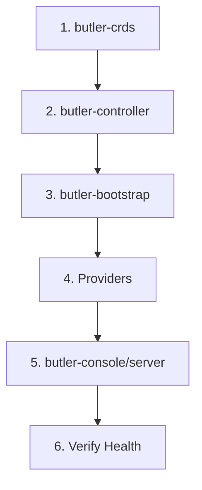

# Butler Upgrade Guide

This guide covers upgrading Butler components between versions.

## Table of Contents

- [Pre-Upgrade Checklist](#pre-upgrade-checklist)
- [Upgrade Order](#upgrade-order)
- [Upgrade Procedures](#upgrade-procedures)
- [Version-Specific Notes](#version-specific-notes)
- [Rollback Procedures](#rollback-procedures)

---

## Pre-Upgrade Checklist

Before upgrading Butler:

- [ ] Review the [release notes](notes/) for your target version
- [ ] Check the [compatibility matrix](compatibility-matrix.md)
- [ ] Backup management cluster etcd
- [ ] Backup ButlerConfig and critical CRs
- [ ] Notify users of maintenance window
- [ ] Test upgrade in non-production environment first
- [ ] Ensure no clusters are mid-provisioning

## Upgrade Order

Always upgrade components in this order:



| Order | Component | Reason |
|-------|-----------|--------|
| 1 | butler-crds | CRD changes must be applied first |
| 2 | butler-controller | Core reconciliation logic |
| 3 | butler-bootstrap | Bootstrap controller (if upgrading) |
| 4 | butler-provider-* | Provider controllers |
| 5 | butler-console/server | User-facing components (can tolerate API changes) |

## Upgrade Procedures

### Using Helm

```bash
# 1. Upgrade CRDs
helm upgrade butler-crds oci://ghcr.io/butlerdotdev/charts/butler-crds \
  -n butler-system \
  --version <new-version>

# 2. Upgrade Controller
helm upgrade butler-controller oci://ghcr.io/butlerdotdev/charts/butler-controller \
  -n butler-system \
  --version <new-version>

# 3. Upgrade Bootstrap (if needed)
helm upgrade butler-bootstrap oci://ghcr.io/butlerdotdev/charts/butler-bootstrap \
  -n butler-system \
  --version <new-version>

# 4. Upgrade Providers
helm upgrade butler-provider-harvester oci://ghcr.io/butlerdotdev/charts/butler-provider-harvester \
  -n butler-system \
  --version <new-version>

# 5. Upgrade Console
helm upgrade butler-console oci://ghcr.io/butlerdotdev/charts/butler-console \
  -n butler-system \
  --version <new-version>
```

### Using GitOps (Flux)

Update HelmRelease versions in your GitOps repository:

```yaml
apiVersion: helm.toolkit.fluxcd.io/v2
kind: HelmRelease
metadata:
  name: butler-controller
  namespace: butler-system
spec:
  chart:
    spec:
      chart: butler-controller
      version: "<new-version>"  # Update this
      sourceRef:
        kind: HelmRepository
        name: butler-charts
```

### Upgrading CLI

```bash
# Homebrew
brew upgrade butler

# Direct download
curl -sL https://github.com/butlerdotdev/butler-cli/releases/latest/download/butler_$(uname -s)_$(uname -m).tar.gz | tar xz
sudo mv butleradm butlerctl /usr/local/bin/
```

## Version-Specific Notes

### 0.1.x -> 0.2.x

*No breaking changes documented yet.*

---

## Rollback Procedures

If an upgrade fails:

### Helm Rollback

```bash
# List revisions
helm history butler-controller -n butler-system

# Rollback to previous
helm rollback butler-controller <revision> -n butler-system
```

### CRD Rollback

CRD rollbacks require care:

1. Check if new fields were added
2. Apply previous CRD version
3. Data in new fields may be lost

```bash
# Get previous CRD version
kubectl get crd tenantclusters.butler.butlerlabs.dev -o yaml > backup-crd.yaml

# Apply previous version
kubectl apply -f previous-crd.yaml
```

### Full Rollback

For complete rollback:

1. Rollback all Helm releases in reverse order
2. Rollback CRDs
3. Restore etcd backup if data corruption occurred

## Post-Upgrade Verification

After upgrading, verify:

```bash
# Check pods are running
kubectl get pods -n butler-system

# Check controller logs
kubectl logs -n butler-system deploy/butler-controller --tail=50

# Verify tenant clusters are healthy
butlerctl cluster list

# Check no clusters stuck in bad state
kubectl get tenantcluster -A
```

## Getting Help

If you encounter issues during upgrade:

1. Check controller logs for errors
2. Review [troubleshooting guide](../docs/operations/#troubleshooting)
3. Open an issue with upgrade details
